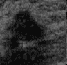
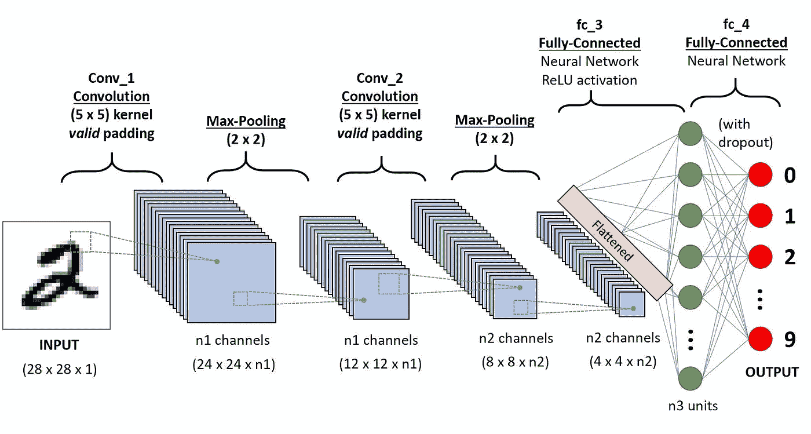

# 使用卷积神经网络(CNN 深度学习)对乳腺癌肿瘤类型进行分类

> 原文：<https://towardsdatascience.com/how-to-fight-breast-cancer-with-deep-learning-ab28e42e4250?source=collection_archive---------15----------------------->


在美国，八分之一的女性(约 12%)预计会在其一生中患浸润性乳腺癌，这显然是对人类的医疗保健相关挑战。早期检测肿瘤的存在和类型是避免大多数威胁生命的情况发生的关键。

高风险女性和那些表现出乳腺癌发展症状的女性可以获得乳房区域的超声波图像。有经验的肿瘤学家应该能够查看这些图像的样本，并确定是否存在肿瘤以及肿瘤的类型。

基于其特征和细胞水平行为，肿瘤被分为两种类型:良性和恶性。


Illustration explaining difference between benign and malignant tumours [Image source](https://www.verywellhealth.com/what-does-malignant-and-benign-mean-514240)

被检测出患有恶性肿瘤的人，建议进行治疗以治愈那些癌细胞。

随着机器学习技术的出现，特别是在可以从标记有每个图像代表的类型的图像中学习的深度神经网络的方向上，现在可以基于其超声图像以高精度自动识别一种类型的肿瘤。

## 错误识别肿瘤类型的后果

如果医生将肿瘤错误地分类为良性而不是恶性，而实际上肿瘤是恶性的，并且选择不建议患者接受治疗，那么随着时间的推移，细胞转移到更大形式或扩散到身体其他部位的风险很大。这可能会导致威胁患者生命的情况。在统计学术语中，这将被认为是医生犯了“1 型”错误，即患者患有恶性肿瘤，但她没有被确定为患有该肿瘤。

考虑到这种可能性，如果医生保守地建议每一个患有肿瘤的患者进行癌症治愈治疗，不管他们是良性还是恶性肿瘤，那么一些患者就有遭受不必要的精神创伤和与治疗相关的其他费用的风险。在良性肿瘤的情况下，即使患者不选择接受治疗，也可以正常生活，而不会出现任何威胁生命的症状。医生的这种错误被认为是统计学意义上的“2 型”错误:患者没有恶性肿瘤，但被确定为患有恶性肿瘤。

我们还必须明白，在这种情况下，医生犯第二类错误比犯第一类错误更容易接受。在这种情况下，犯 1 型错误会给患者带来威胁生命的并发症，而 2 型错误会给患者带来不必要的费用和情感负担。


同样重要的是将所有患有恶性肿瘤的患者识别为患有恶性肿瘤。假设患有恶性肿瘤的患者为真阳性病例，敏感性是患有恶性肿瘤的人中通过测试被正确识别为患有恶性肿瘤的比例。

如果我们选择关注良性肿瘤患者免于不必要的治疗费用，我们必须评估诊断测试的特异性。特异性是没有恶性肿瘤的人被确定为没有恶性肿瘤的比例。

理想的肿瘤类型诊断测试将具有 1 的特异性和敏感性分数。

卷积神经网络非常适合于图像识别等应用，使用卷积神经网络可以根据肿瘤的超声图像确定肿瘤的类型。

为了探索和展示如何使用这种技术，我使用本页的[提供的数据集进行了一个小实验。数据集包含 250 个肿瘤的超声灰度图像，其中 100 个为良性，150 个为恶性。](https://data.mendeley.com/datasets/wmy84gzngw/1)

这是一些在数据集中发现的良性肿瘤的样本图像。



Ultrasonic images of Benign Tumours in breast

下面是一些在数据集中发现的恶性肿瘤样本。


Sample ultrasonic images of malignant tumours in breast

尽管与训练通常具有大量要调整的权重的神经网络所需的数据量相比，该数据集非常小，但是通过向神经网络提供分配用于训练目的的图像的随机失真，可以训练高度准确的深度学习神经网络模型，该模型可以将肿瘤类型分类为良性或恶性，具有相似的数据集质量。

> 训练图像数据可以通过轻微旋转、翻转、完全变换、拉伸来扩充，然后馈送到网络用于学习。这种技术有助于**神经网络能够很好地进行归纳**，以便在测试过程中正确地对看不见的图像进行分类。

Python 中用于构建神经网络的 [Keras](https://keras.io/) 库有一个非常有用的类，名为 [ImageDataGenerator](https://keras.io/preprocessing/image/) ，它有助于在将图像训练或测试到模型之前将这种转换应用到图像。

我将原始图像数据集分成三组:训练、验证和测试，比例为 7:2:1。只有训练和验证数据集是用 ImageDataGenerator 扩充的。

# 卷积神经网络的体系结构

CNN 的核心是一个多层感知器，由三种主要的层组成。



This how output of convolution operation from specific kernel is calculated

## 卷积层

在这些层中，检测边缘、形状和对象等过滤器的过滤器被应用于前一层，该前一层可以是原始输入图像层或深层 CNN 中的其他特征地图。在这一层，我们必须指定网络的重要超参数:用于过滤前一层的核的数量和大小。


This is how kernel moves with stride value = 2 and extra padding added around the border to apply convolutional to points located at the boundary of layer.

卷积层的另外两个参数是步幅和填充。在计算该层的下一个输出之前，**步距**控制内核的移动量。**填充**控制是否在输入层的边界上添加额外的虚拟输入点，以便应用滤波器后的结果输出与前一层相比保持相同的大小或从边界收缩。


## 汇集层

它降低了维度并消除了来自前一层的噪声激活。对于给定位置，可以通过计算从前一层连接到内核的输入的最大值或平均值来完成汇集操作。Max pooling 在应用程序中更受欢迎，因为它消除了干扰，而不会影响层的激活值。


## 展平层

它将 2D 或更高维度的前一层转换成一维向量，这更适合作为全连接层的输入。


Fully connected hidden layers

## 全连接层

这用于学习非线性决策边界，以便在以简单前馈方式紧密连接到前一层的层的帮助下执行分类任务。


Comparison of Standard Neural network and the one with dropout applied


Effect of dropout layer on the nodes in preceding layer during training and test

## 脱落层

在这里，我们还可以在完全连接的层之间包括脱落层。它在训练阶段随机避开来自前一层的某一部分节点的输出，并在预测阶段按比例抑制相同部分的激活。如果没有丢弃层，隐藏层中只有一小部分节点通过更新连接它们的边的权重从训练中学习，而其他节点通过在训练阶段不更新它们的边权重而“保持空闲”。在训练阶段，Dropout 通过随机避开来自前一层的特定部分节点的所有连接来强制所有边进行学习。为了在预测阶段保持类似的效果，来自先前层的所有激活都以与丢失分数相同的比例衰减。这种特殊的技术使得神经网络在最近几年变得更深更广，而不用担心一些节点和边处于空闲状态。总的来说，这种技术通过帮助 generalise 在测试阶段以更高的精度更好地分类更多看不见的案例来防止网络的过度拟合。

隐藏层通过[重新激活层](https://machinelearningmastery.com/rectified-linear-activation-function-for-deep-learning-neural-networks/)以仅允许正激活通过下一层。[念此为理。](https://www.cs.toronto.edu/~hinton/absps/reluICML.pdf)

输出节点是一个 [sigmoid 激活函数](https://en.wikipedia.org/wiki/Sigmoid_function)，对于从负到正的输入范围，它从 0 到 1 平滑变化。

我在 Keras 中创建了一个神经网络模型，用 Python 中的以下代码解决了这个问题。

```
def generate_model():
    model = Sequential()
    model.add(Conv2D(64, (3, 3), input_shape=input_shape, padding='same'))
    model.add(Activation('relu'))
    model.add(MaxPooling2D(pool_size=(2, 2))) model.add(Conv2D(64, (3,3)))
    model.add(Activation('relu'))
    model.add(MaxPooling2D(pool_size=(2, 2))) model.add(Conv2D(64, (3,3)))
    model.add(Activation('relu'))
    model.add(MaxPooling2D(pool_size=(2, 2))) model.add(Flatten())
    model.add(Dense(64))
    model.add(Activation('relu'))
    model.add(Dropout(0.5)) model.add(Dense(64))
    model.add(Activation('relu'))
    model.add(Dropout(0.5)) model.add(Dense(1))
    model.add(Activation('sigmoid'))    

    model.compile(loss='binary_crossentropy',
              optimizer=keras.optimizers.Adam(),
              metrics=['accuracy', sensitivity, specificity, fmed, f1])
    return model# Training Modelnum_train_samples = 10000
num_validation_samples = 1000
batch_size = 32
model = generate_model()
history_val_fmed = model.fit_generator(
    train_generator,
    steps_per_epoch= num_train_samples // batch_size,
    validation_data=validation_generator,
    validation_steps= num_validation_samples // batch_size,
    epochs=1000, 
    verbose=1,
        callbacks=[
          EarlyStopping(monitor='val_fmed', mode="max", verbose=1, patience=50),
          ModelCheckpoint(data_dir + '/nn_best_model_cv_val_fmed.h5', monitor='val_fmed', mode="max", verbose=1, save_best_only=True)
        ],
    class_weight=class_weights)
```

## 决定模型的复杂性

各种参数，如卷积层中的滤波器数量、滤波器大小和全连接层中的节点数量，决定了模型的复杂性和学习能力。在创建具有这些参数的一些值的模型并通过一些时期训练该模型之后，如果我们注意到训练误差和验证误差/损失都没有开始减小，那么这可能意味着该模型具有高偏差，因为它太简单，并且不能在问题的复杂程度上学习以准确地对训练集中的模型进行分类。在这种情况下，我们可以尝试增加模型的复杂性，例如通过在卷积层中使用更多数量和大小的滤波器，以及在全连接层中使用更多节点。

另一方面，如果我们注意到模型在训练集上做得非常好，即训练数据值的误差/损失随着模型通过更多数量的时期学习而保持下降，但是验证数据的误差/损失显著滞后或者根本没有下降，即在相同数量的时期之后保持相对显著地高于误差/损失训练数据集，则这意味着模型过度拟合训练数据集。它有很高的方差。通过减少卷积层中滤波器的数量和/或大小以及减少全连接层中节点的数量来降低模型的复杂性，有助于使验证集上的误差/损失值与训练集上的误差/损失值一样快。

## 用类权重处理数据不平衡

由于良性肿瘤与恶性肿瘤的样本数量比为 2:3，因此在拟合模型时，我使用了 Keras 的类别权重特征，通过为每个类别的训练样本分配不同的权重，将两个类别同等对待。

## 批量的重要性

将输入的训练数据分批送入神经网络。根据经验，建议将输入的批量大小保持在 32–512 之间。在神经网络训练中，在一个时期完成后更新权重。批量越大，训练越快，但是在训练和测试集上获得的总体准确度越低。你可以[在这里阅读更多。](https://stats.stackexchange.com/a/236393/251883)

## 尽早停止训练并将最佳模型保存为检查点

在训练神经网络时，在称为时期的循环中训练神经网络是一种实践，其中相同或扩充的训练数据用于重复训练神经网络。这提高了神经网络在训练和验证数据集上的性能，直到一定数量的时期。在此之后，训练数据的准确性不断提高，而验证数据开始下降。这在神经网络中称为过拟合。为了防止这种情况发生，我们可以在每个时期完成后，在验证数据集上测量对我们重要的评估指标。我们可以保存最后的最好成绩，并耐心等待一定次数，以便在训练后得到提高。此外，由具有新的最佳性能测量的模型学习的权重可以被保存为模型的检查点。每次有改进，`patience`就被认为是复位到满。如果经过`patience`指定的次数后网络性能没有改善，我们可以停止用更多的次数训练模型。小`patience`可以在未成熟阶段停止训练模型。建议对就地保存模型检查点具有更高的耐心，以保存在搜索更好的模型中迄今为止看到的最佳性能模型的参数。通过这样做，我们可以得到参数最接近最优的模型，同时避免我们的模型过度拟合。

在处理扩充的训练样本时，我们还需要决定每个历元中用于训练的样本数量。较高的数字导致每个时期更多的训练，但是它可以降低管理性能改进和防止过度拟合之间的折衷的粒度。换句话说，对于单个时期中的大量样本，即使单个或几个额外时期也可能导致高度过度拟合的神经网络。

正如我前面提到的，我们模型的敏感性和特异性都是衡量其性能的重要指标。我们希望最大化这两者。因此，我选择使用自定义评估指标，该指标将在每个时期后进行评估，并基于其改进，决定是否提前停止训练神经网络。我把它叫做 **F_med** 。


注意，它类似于在信息检索任务中用于测量其质量的 F1 分数**、**的构造。但是请注意，精确度和特异性在概念上是不同的，而敏感度和召回率在概念上是相同的。


我选择保持每个时期的样本大小为 10，000。在每个时期之后，在样本量为 1000 的验证数据集上测试神经网络的性能，用于评估指标，如灵敏度、特异性、验证损失、验证准确性、F_med 和 f 1。我选择用 50 的耐心尝试最多 1000 个纪元。在我的例子中，在模型开始显示出过度拟合的迹象之前，花了大约 300 个历元，并且使用 Keras 的 EarlyStopping 回调在该点停止训练。训练集上的 F_med 为 0.9617，验证集上的 F _ med 为 0.9733。

# 通过历元训练模型时，模型性能会发生什么变化？

## 使用 Adam Optimizer

这是模型性能图与时期的关系。


评估在 Adam optimiser 上对看不见的测试数据训练的最佳执行模型，在 25 个图像的测试数据集(即原始数据集的 10%)上证明了 0.8666 的灵敏度和 0.9 的特异性。

## **采用 SGD 优化器和内斯特罗夫动量**


评估在 SGD +内斯特罗夫动量优化器上对未知测试数据训练的最佳执行模型，在 25 个图像的测试数据集(即原始数据集的 10%)上证明了 0.9333 的灵敏度和 1.0 的特异性。

这里有[项目笔记本](https://nbviewer.jupyter.org/github/patelatharva/Classify_Breast_Cancer_Type_From_Image/blob/master/tumor_type_detection.ipynb)和 [Github 代码库](https://github.com/patelatharva/Classify_Breast_Cancer_Type_From_Image)。

## 更多探索的方向

在这个实验中，我使用了一个小的乳腺癌肿瘤超声图像数据集来快速概述使用卷积神经网络处理癌症肿瘤类型检测问题的技术。

还有一些公开可用的数据集，包含组织病理学图像格式的乳腺细胞图像。数据集更大，图像也有多个颜色通道。感兴趣的读者也可以利用这些数据集来训练神经网络，该网络可以根据图像标签的可用性将图像分类为乳腺癌的各种亚型。

 [## 乳房组织病理学图像

### 下载数千个项目的开放数据集+在一个平台上共享项目。探索热门话题，如政府…

www.kaggle.com](https://www.kaggle.com/paultimothymooney/breast-histopathology-images) [](https://www.kaggle.com/ambarish/breakhis) [## BreakHis

### 下载数千个项目的开放数据集+在一个平台上共享项目。探索热门话题，如政府…

www.kaggle.com](https://www.kaggle.com/ambarish/breakhis) 

这里有一些研究论文集中在 BreakHis 数据集，用于将肿瘤分类为乳腺癌肿瘤的 8 种常见亚型之一。

[https://www . science direct . com/science/article/pii/s 0925231219313128](https://www.sciencedirect.com/science/article/pii/S0925231219313128)

[](https://www.ncbi.nlm.nih.gov/pmc/articles/PMC6390493/) [## 基于深度学习的乳腺癌组织病理学图像分析

### 乳腺癌是世界上发病率最高的癌症，并且已经成为主要的癌症

www.ncbi.nlm.nih.gov](https://www.ncbi.nlm.nih.gov/pmc/articles/PMC6390493/) 

我希望你发现这篇文章很有见地，可以帮助你开始探索和应用卷积神经网络来基于图像对乳腺癌类型进行分类的方向。就像你一样，我非常兴奋地看到临床世界采用人工智能和机器学习的现代进步来解决人类面临的挑战。