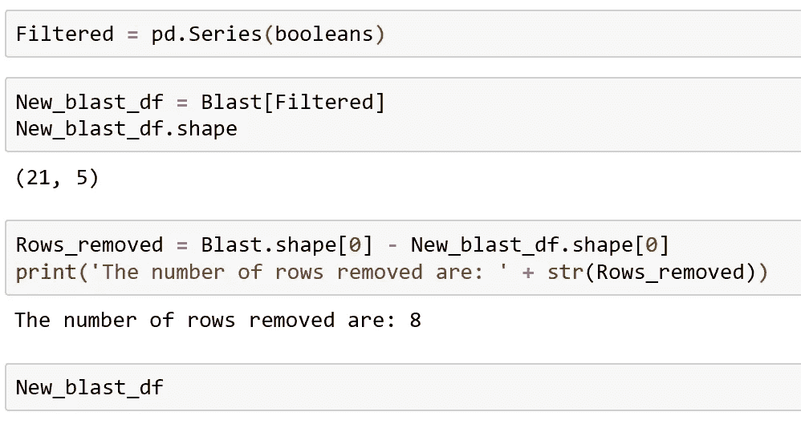

# 如何通过列值过滤熊猫数据帧的行

> 原文：<https://towardsdatascience.com/how-to-filter-rows-of-a-pandas-dataframe-by-column-value-51996ea621f8?source=collection_archive---------1----------------------->

## **过滤行的两种简单方法**

Image Courtesy of Peter Oslanec via [Unsplash](https://unsplash.com/photos/J-n4Y0ZtGjc)

通常需要根据列值过滤表格数据。我们可能会看到一个表格，并希望执行自定义过滤操作。幸运的是，我们可以利用熊猫来做这个手术。Pandas 是一个用于数据分析的开源 Python 库。它使 Python 能够处理类似电子表格的数据，实现快速文件加载和操作等功能。为了实现这些特性，Pandas 向 Python 引入了两种数据类型:Series 和 DataFrame。

本教程将重点介绍通过列值过滤数据帧的两种简单方法。

以下示例是 BLAST 搜索的结果。在生物信息学中，BLAST(基本局部比对搜索工具)是一种用于比较一级生物序列信息的算法，例如蛋白质的氨基酸序列或 DNA 和/或 RNA 序列的核苷酸。这个表有一个用数字表示的查询序列的 ID 和与之匹配的物种，以及其他元数据。

这个例子完全是任意的，下面的技术可以应用于大量的其他情况。

首先，我们导入 pandas 库，并给它起别名 pd

然后我使用熊猫 ***read_csv()*** 函数读取我的数据帧。我用文件扩展名保存了我的数据帧。csv(逗号分隔值文件)。接下来，我执行一些基本操作来熟悉数据帧。下面显示的是我常用的三种操作。其中包括:使用 head 方法打印前 5 行，使用 DataFrame 对象的 column 属性访问列名。最后，我查看 DataFrame 对象的 shape 属性。

这三个打印函数的输出如下所示(为了增强表示，我建议对 Jupyter 笔记本运行相同的代码，这将把 pandas DataFrame 对象显示为一个更加浏览器友好的 HTML 表)。shape 属性返回一个元组，该元组在逗号的左侧给出行数，在右侧给出列数。该数据帧有 29 行和 5 列。但是请注意，*只显示前 5 行。*

假设我们想要过滤该数据帧，以便排除***Species _ name _ blast _ hit***列中的任何“细菌”条目。

我们将如何着手做这件事？

我将介绍两种选择性过滤表格数据的方法。

首先，我创建了一个布尔值的 Python 列表。然后，我编写了一个 for 循环，该循环迭代熊猫系列(系列是数据帧中的一列)。熊猫系列，***Species _ name _ blast _ hit***是一个可迭代的对象，就像一个列表。然后，我在条件语句中使用一个基本的正则表达式，如果“细菌”不在序列值中，则附加 True，如果“细菌”存在，则附加 False。当我打印布尔列表的前 5 个条目时，所有的结果都为真。

这完全在意料之中，我们从前面的表格中可以看到， ***中的前 5 个条目 Species_name_blast_hit*** 名称中没有细菌。

这里，我创建了一个布尔列表，其长度与 DataFrame，29 相同。接下来，我将布尔列表转换成 Pandas 系列，并给它分配变量名 Filtered。

您可以通过向 ***pd 传递一个列表来创建一个熊猫系列。*系列()**功能。

接下来，我对我的原始 Pandas 数据帧使用布尔子集/索引，使用方括号符号 Blast，并为新数据帧分配变量名 ***New_blast_df*** 。在这里，我写了原始的 DataFrame，Blast，后面是方括号，里面是经过过滤的熊猫系列。该系列指示选择哪些行，因为它由真值和假值组成，这些值与 Blast 数据集中的行相对应。

从 Jupyter 笔记本输出中可以清楚地看到，所有的“细菌”条目都被忽略了！

我们可以通过检查从原始数据帧中删除的行数，从 shape 属性返回的 New_blast_df 的第一个索引中减去 shape 属性返回的元组的第一个索引。现在，我们可以看到删除了 8 行。

幸运的是，还有一种更简单的方法可以通过列值来划分数据帧的子集。对于这个例子，让我们假设我们只想要包含那些包含物种名‘Phoxinus’的行。

这种方式使用了 ***包含*** 的方法。 ***包含*** 方法返回一个布尔数组，如果每个字符串都包含该模式。要使用它，您需要输入 DataFrame 的名称，然后使用点标记法选择感兴趣的适当列名，接下来是。str 和最后的 ***包含*** ()。contains 方法还可以找到部分名称条目，因此非常灵活。

默认情况下. str.contains 区分大小写。要忽略大小写，只需将关键字参数 case 设置为 False，. str.contains(case=False)。这进一步增加了灵活性，但必须谨慎使用。

# **结论**

本教程演示了两种基于列值过滤表格数据的方法。虽然这里给出的例子利用了单个条件，但是可以容易地应用多个条件来进一步微调滤波输出。