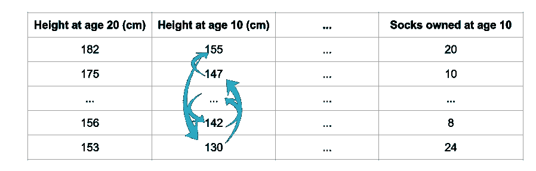
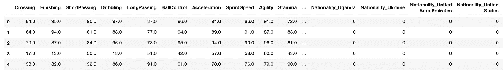
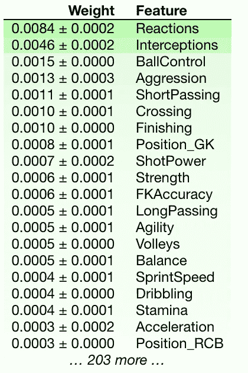

# 如何找到黑盒模型的特征重要性？

> 原文：<https://towardsdatascience.com/how-to-find-feature-importances-for-blackbox-models-c418b694659d?source=collection_archive---------17----------------------->


Source: [DavidRockDesign](https://pixabay.com/users/DavidRockDesign-2595351/?utm_source=link-attribution&utm_medium=referral&utm_campaign=image&utm_content=1430105), Randomness-the lifeblood of many algorithms

## DS 算法

## 置换重要性作为一种特征选择方法

数据科学是对算法的研究。

我每天都在努力学习许多算法，所以我想列出一些最常见和最常用的算法，这些算法将在这个新的 [DS 算法系列](https://towardsdatascience.com/tagged/ds-algorithms)中使用。

有多少次，当你创建了很多功能，然后你需要想办法减少功能的数量？

上次我写了一篇名为“[每个数据科学家都应该知道的 5 种特征选择算法](/the-5-feature-selection-algorithms-every-data-scientist-need-to-know-3a6b566efd2)”的文章，其中我谈到了使用相关性或基于树的方法，并在特征选择过程中添加一些结构。

最近，有人向我介绍了另一种新颖的特征选择方式，叫做 ***排列重要性*** ，我非常喜欢这种方式。

因此，这篇文章解释了排列重要性是如何工作的，以及我们如何用 ELI5 来编码它。

# 什么是排列重要性？

简单地说，我们可以根据我们的评估指标(F1、准确性 AUC 等)来确定某个特征的重要性。)在我们从数据集中移除特定要素时会发生变化。

这可能非常简单—我们从数据集中移除一个要素，训练分类器，然后查看评估指标如何变化。我们对所有功能都这样做。

因此，我们至少拟合我们的模型 n 次，其中 n 是模型中特征的数量。这是如此多的工作和计算。 ***我们能做得更好吗？***



[Source](https://www.kaggle.com/dansbecker/permutation-importance): We permute a feature and predict using the updated dataset. Intuitively, if our accuracy or any evaluation metric doesn’t take a hit, we can say that the feature is not important. If our accuracy does take a hit, we consider this feature important.

是的，我们可以。为了计算排列重要性，我们对单个要素的值进行混洗/排列，并使用生成的数据集进行预测。

然后，这些预测用于计算我们的评估指标。直观地说，如果我们的准确性或任何评估指标没有受到影响，我们可以说这个特性不重要。如果我们的准确性受到影响，我们认为这个特性很重要。

# 数据

我们将尝试使用数据集来更好地理解它。

我将使用一个足球运动员数据集，并尝试使用它找出最重要的特征。


如果你不懂足球术语，也不用担心。我会尽量把它保持在最低限度。

你可以在这个 [Kaggle 内核](https://www.kaggle.com/mlwhiz/permutation-feature-selection-using-football-data)中看到完整的代码。

## 一些简单的数据预处理

我们已经做了一些基本的预处理，如删除空值和一个热编码。我们还使用以下公式将问题转化为分类问题:

```
y = traindf['Overall']>=80
```

在这里，我们用高总体来代表一个伟大的球员。我们的数据集(X)如下所示，有 223 列。



train Data X

# 履行

## 1.对于 sklearn 型号

ELI5 库让我们很容易对`sklearn`模型使用排列重要性。首先，我们训练我们的模型。

```
from sklearn.ensemble import RandomForestClassifier
my_model = RandomForestClassifier(n_estimators=100,
                                  random_state=0).fit(X, y)
```

然后我们使用来自`eli5.sklearn`模块的函数`PermutationImportance`。

```
from eli5.sklearn import PermutationImportance
import eli5
perm = PermutationImportance(my_model,n_iter=2).fit(X, y)
eli5.show_weights(perm, feature_names = X.columns.tolist())
```

结果看起来像:



这里我们注意到反应、拦截和控球是衡量一名球员水平的最重要的特征。

## 2.对于黑盒模型或非 sklearn 模型


我们还可以使用 eli5 来计算非 scikit-learn 模型的特征重要性。这里我们训练一个 LightGBM 模型。

```
import numpy as npfrom lightgbm import LGBMClassifierlgbc=LGBMClassifier(n_estimators=500, learning_rate=0.05, num_leaves=32, colsample_bytree=0.2,
            reg_alpha=3, reg_lambda=1, min_split_gain=0.01, min_child_weight=40)lgbc.fit(X,y)
```

我们需要为分数函数创建一个包装器来计算我们的评估指标。

```
from sklearn.metrics import accuracy_score#define a score function. In this case I use accuracy
def score(X, y):
    y_pred = lgbc.predict(X)
    return accuracy_score(y, y_pred)
```

我们现在可以使用来自`eli5.permutation_importance`的`get_score_importances`函数来获得最终的特征重要性。

```
from eli5.permutation_importance import get_score_importances# This function takes only numpy arrays as inputs
base_score, score_decreases = get_score_importances(score, np.array(X), y)feature_importances = np.mean(score_decreases, axis=0)
```

我们可以使用以下工具来查看前 5 大功能:

```
feature_importance_dict = {}
for i, feature_name in enumerate(X.columns):
    feature_importance_dict[feature_name]=feature_importances[i]print(dict(sorted(feature_importance_dict.items(), key=lambda x: x[1], reverse=True)[:5]))---------------------------------------------------------------
{'Reactions': 0.019626631422435127,
 'Interceptions': 0.004075114268406832,
 'BallControl': 0.0025001376727793235,
 'ShortPassing': 0.0012996310369513431,
 'Strength': 0.0009251610771518149}
```

# 结论

[特征工程](/the-hitchhikers-guide-to-feature-extraction-b4c157e96631)和特征选择是任何机器学习管道的关键部分。

我们力求模型的准确性，如果不一次又一次地重温这些作品，就不可能达到良好的准确性。

在这篇文章中，我试图解释排列作为一种特征选择方法的重要性。它帮助我们找到任何黑盒模型的特征重要性，不像我之前的[文章](/the-5-feature-selection-algorithms-every-data-scientist-need-to-know-3a6b566efd2)中关于特征选择的技术。

如果你想了解更多关于特征工程/选择的知识，我想在 Kazanova 的[高级机器学习专业化](https://www.coursera.org/specializations/aml?siteID=lVarvwc5BD0-AqkGMb7JzoCMW0Np1uLfCA&utm_content=2&utm_medium=partners&utm_source=linkshare&utm_campaign=lVarvwc5BD0)课程中喊出[如何赢得数据科学竞赛:向顶级 Kagglers](https://www.coursera.org/specializations/aml?siteID=lVarvwc5BD0-AqkGMb7JzoCMW0Np1uLfCA&utm_content=2&utm_medium=partners&utm_source=linkshare&utm_campaign=lVarvwc5BD0) 学习。本课程讲述了许多使用有用的特征工程/选择技术来改进模型的直观方法。绝对推荐。

谢谢你的阅读。将来我也会写更多初学者友好的帖子。在[](https://medium.com/@rahul_agarwal?source=post_page---------------------------)**关注我或者订阅我的 [**博客**](http://eepurl.com/dbQnuX?source=post_page---------------------------) 了解他们。一如既往，我欢迎反馈和建设性的批评，可以通过 Twitter [@mlwhiz](https://twitter.com/MLWhiz?source=post_page---------------------------) 联系。**