# 如何使用 MATLAB 找到线性(支持向量机)和二次分类器

> 原文：<https://towardsdatascience.com/how-to-find-linear-svms-and-quadratic-classifiers-using-matlab-97ea7550655a?source=collection_archive---------28----------------------->

## 使用 YALMIP 寻找用于数据分类的分离超平面和二次超曲面的快速指南(带图片)

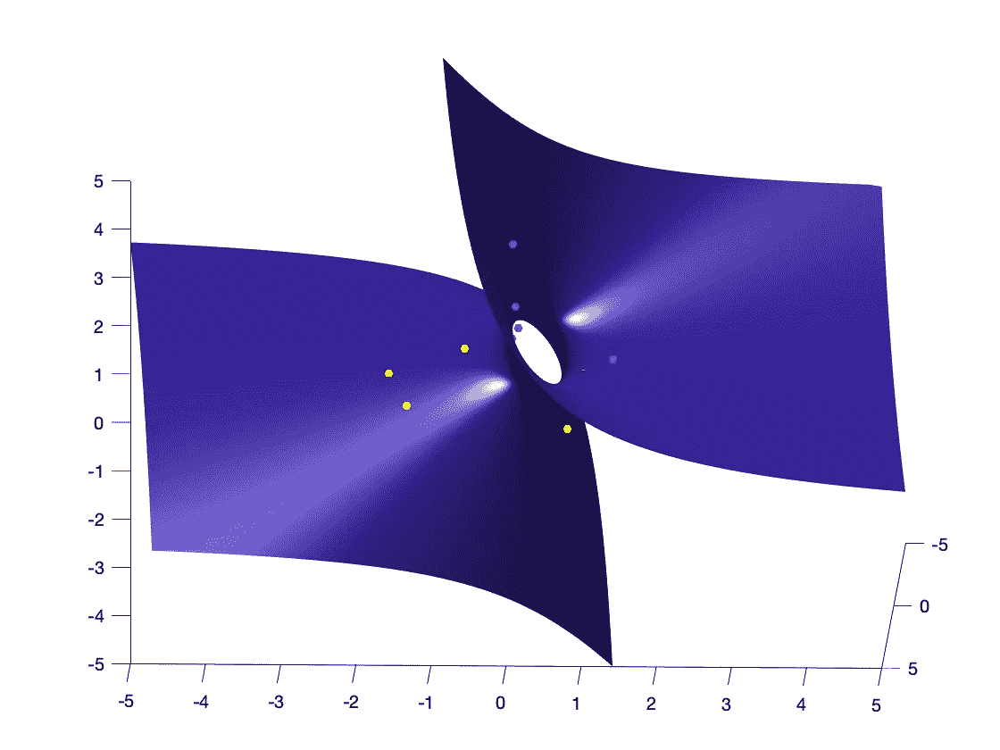

A pretty smart looking elliptic hyperboloid

想知道线性分类器是否可以推广到其他形状，而不仅仅是一个看起来无聊的平面(或超平面)？

是的。欢迎来到二次分类器的世界，其中两个或更多类别的数据点由二次曲面分隔开！

现在，在我们进入所有这些之前，让我们看看什么是线性分类器，以及我们如何用 MATLAB 和 Johan Lö fberg 开发的优化包 [YALMIP](https://yalmip.github.io) 对它们建模。然后，在本文的后半部分，我将讨论二次分类器以及如何对它们建模。

**这篇文章的某些部分可能看起来有点过于数学化，但我会尽可能保持简单，以便在编程部分花更多的时间。*

# 我们都从数据开始

我们从一些随机数据点开始，每个数据点在欧几里得空间中有 3 个维度。这些点来自 2 个不同的类(X & Y)，我们每个类有 5 个点。

```
% Define some key problem parameters
nDimension = 3;
nVariable = 5;% Generate some random numbers
X = randn(nDimension, nVariable);
Y = randn(nDimension, nVariable);
```

**你总是可以将问题一般化到更高的维度、更多的类和更多的数据点，但在本文中我们将保持这些值较小，以保持事情简单和易于可视化。*

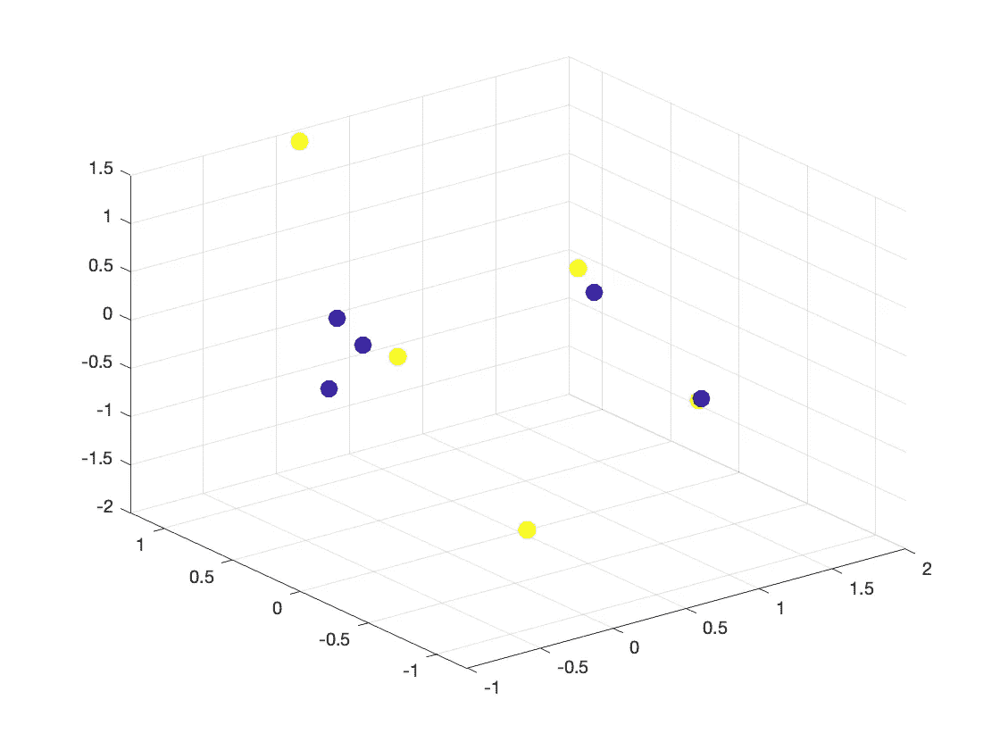

Random data points that we have just generated in 3D-space

然后，想法是找到一个分类器，使用来自给定数据点的信息，将整个空间(在这种情况下是 3D 欧几里得空间)分成两个，其中位于一侧的所有点属于类别 X，而位于另一侧的点属于第二类别 y。

但是我们如何选择一个边界来分隔整个空间呢？快速直观的方法是使用平面。

# 分离超平面

超平面指的是一个子空间，它的维数比它所在的空间的维数小一。换句话说，一个超平面在一个 *n* 维空间中将有 *n-1* 维。

例如，在 2D 空间中，超平面将是 1D 线，而在 3D 空间中，超平面将仅仅是 2D 平面。


Visualisations of what a hyperplane is (Image: DeepAI)

回到我们的问题，我们想要构建一个超平面来将整个空间一分为二。特别地，我们希望超平面(仅由向量 *a* 和标量 *b* 定义)满足以下等式:

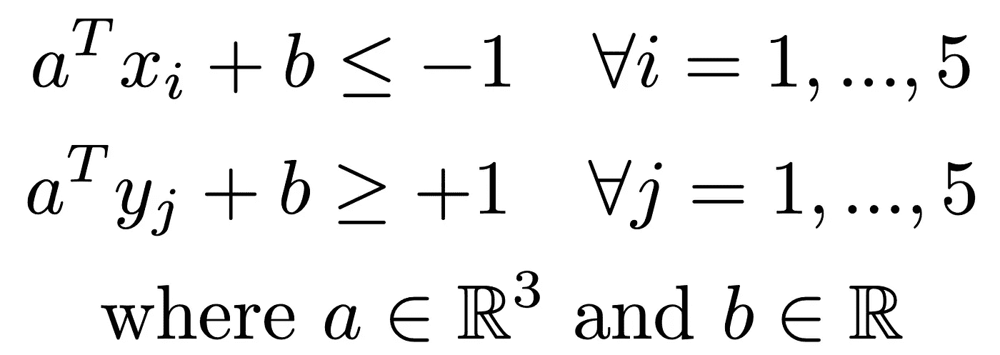

Equations that define a separating hyperplane

其中 *a* 和 *b* ，分别是一个矢量和一个标量。

如您所见，这假设数据点的坐标之间存在某种线性关系。

然而，正如我们的本能现在可能已经告诉我们的那样，并不总是可能找到一个超平面，它会以这样一种方式完美地分隔整个空间，即只有属于 X 的点位于一侧，而属于 Y 的点位于另一侧。

尽管如此，即使这是真的情况，我们仍然希望找到最好的超平面，在某种程度上将空间一分为二，即使这意味着有一些点在错误的一边结束。

为此，我们需要在方程中引入一些误差变量(每个数据点一个)，以便在定义超平面时留有余地:

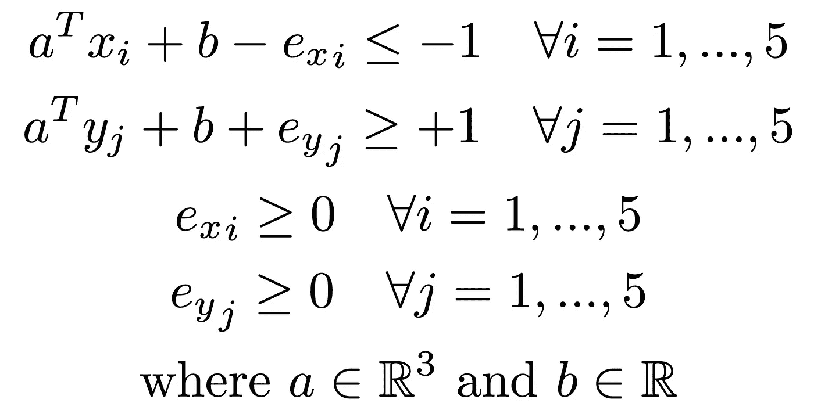

Equations for a less than perfect hyperplane

类似于 *a* 和 *b* ，这些误差变量由我们决定，用最优化的说法就是我们所说的决策变量。

现在我们的问题以这种方式定义，*最佳*超平面可以说是最好地减少这些误差总和的超平面。因此，我们问题的目标可以简洁地改写为:

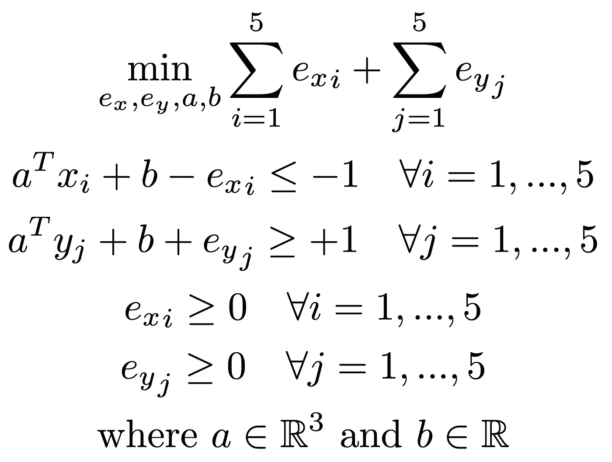

A linear programme that when solved, provides a separating hyperplane

正如你们中的一些人现在已经注意到的，我们上面定义的问题被称为线性规划，因为它的目标函数(最小化函数)和约束条件(所有其他方程/不等式)都是线性的。

## 用 MATLAB 实现线性规划

回到我们离开 MATLAB 的地方，我们想使用 YALMIP 来求解我们已经定义的线性规划，以便获得一个分离超平面。

我们从定义线性规划中的决策变量开始。这需要为它们中的每一个创建一个 *sdpvar* 对象，然后 YALMIP 会将其识别为决策变量:

```
% Hyperplane variables
a = sdpvar(nDimension, 1, 'full');
b = sdpvar(1);% Error variables for points in X and in Y
xError = sdpvar(1, nVariable);
yError = sdpvar(1, nVariable);
```

接下来，我们继续定义问题中的约束:

```
% Error variables should be above 0
constraints = [xError >= 0, yError >=0];% Hyperplane constraints
constraints = [constraints, a'*X+b <= -(1-xError), a'*Y+b >= 1-yError];
```

最后，我们需要指定我们的目标函数:

```
% Minimise error values for all points in X and in Y
objective = sum(xError) + sum(yError);
```

定义了我们的问题，剩下的就是解决问题了！我们通过调用 *optimize()* 函数来实现这一点。

```
% Solve the linear programme
diagnosis = optimize(constraints, objective);disp(diagnosis.info); % Success/failure report
```

检索决策变量的值和最优目标值是容易的；它们的最佳值存储在创建它们时所在的对象中。

然而，我们需要将它们从*SDP 变量*转换为实际值，以访问它们的最佳值:

```
a = value(a);
disp('a =');
disp(a);b = value(b);
disp('b =');
disp(b);objective = value(objective);
disp('Optimal objective =');
disp(objective);
```

如果确实可以为您生成的随机数据点找到一个完美的超平面，您应该会得到这样的结果，其中最佳目标值正好是 0:

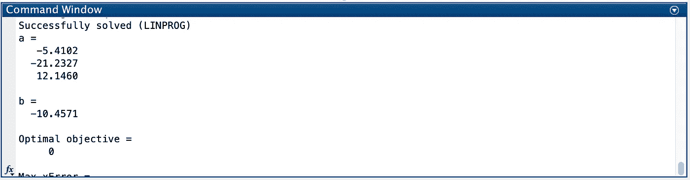

否则，高于 0 的目标值将指示所找到的超平面没有将 3D 空间完美地分成仅包含来自每一侧的 X 或 Y 的数据点的两个半空间。

## 绘制超平面

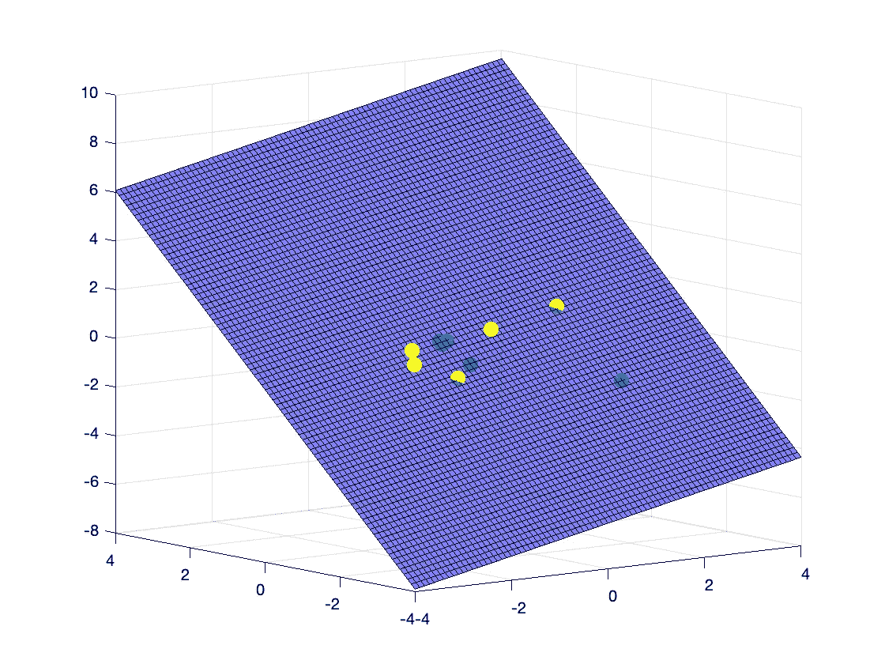

Where’s the fun in solving the problem if we don’t get to see anything?

因为我使用的例子非常简单——只有来自两个不同类的 10 个数据点的三维例子，所以很容易(也是可行的)将我们从求解线性规划中获得的结果绘制到图上。

让我们首先从绘制超平面开始。

回想一下超平面需要满足的两个方程？那么，为了画出*实际的*分离超平面，我们只需要画出超平面的一般方程:

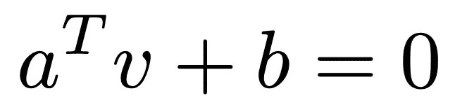

General equation of a hyperplane

为此，我们将生成一些虚拟的*x*-坐标和*y*-坐标值，然后通过求解上面的等式来计算它们各自的*z*-坐标值。在 MATLAB 中，这看起来像这样:

```
% Generate x and y dummy data points
[xValuesDummy,yValuesDummy] = meshgrid(-4:0.1:4);% Solve for z
zValuesDummy = -1/a(3)*(a(1)*xValuesDummy + a(2)*yValuesDummy + b);% Plot the hyperplane
surf(xValuesDummy, yValuesDummy, zValuesDummy, 'FaceAlpha', 0.5, 'FaceColor', 'blue')% Holds the figure before displaying
hold on;
```

接下来，我们需要沿着每个轴检索每个数据点的坐标值，并将它们存储在相应的数组中。我们还想选择不同的颜色来绘制这两个类的数据点。

```
% Retrieve values of each data point along each axis
xValues = [X(1,:) Y(1,:)];
yValues = [X(2,:) Y(2,:)];
zValues = [X(3,:) Y(3,:)];% Create different colours for points from different classes
Colour = repmat([1,10],nVariable,1);
colour = Colour(:);% Plot the data points
scatter3(xValues.', yValues.', zValues.', 100, colour,'filled');
```

完成后，您应该能够制作出如下漂亮的 3D 图:

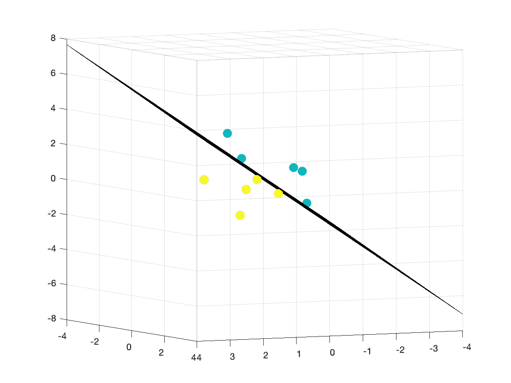

A perfect separating hyperplane

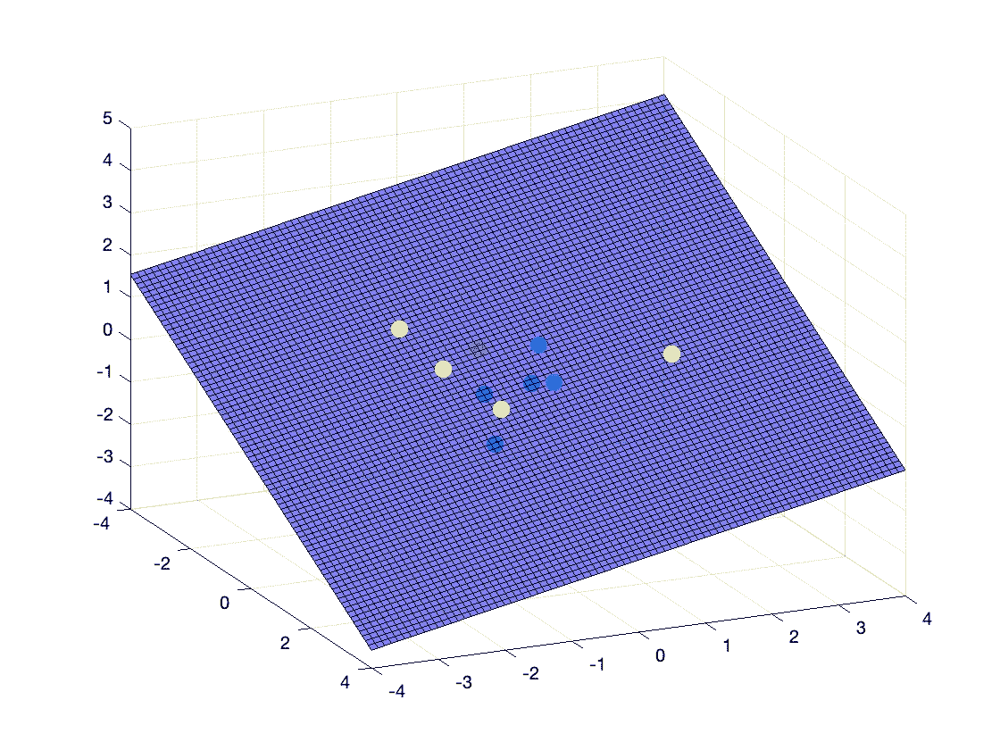

A hyperplane that fails to separate the data points into 2 separate half-spaces

现在，如果您不想使用超平面将空间分成两半，尤其是当您的数据似乎不是线性分布时，该怎么办？

嗯，我们可以尝试找到我们的数据点之间的非线性关系，其中一种方法是考虑将它们分开的二次函数！

# 分离二次曲面

什么是二次曲面？简单地说，它们是 2D 圆锥曲线(椭圆、双曲线和抛物线)的一般化形式。

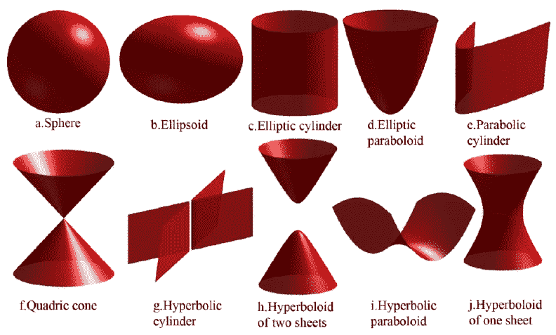

I hope you find these more cool-looking than hyperplanes (Image: Saeid Pashazadeh **&** Mohsen Sharifi)

正如您可能已经想到的，这些形状在某些情况下可能更适合某些数据，所以让我们来试试吧！

类似于我们如何提出定义分离超平面的方程，我们需要寻找满足这些二次方程的对称矩阵 *A* ，向量 *b* 和标量 *c* :

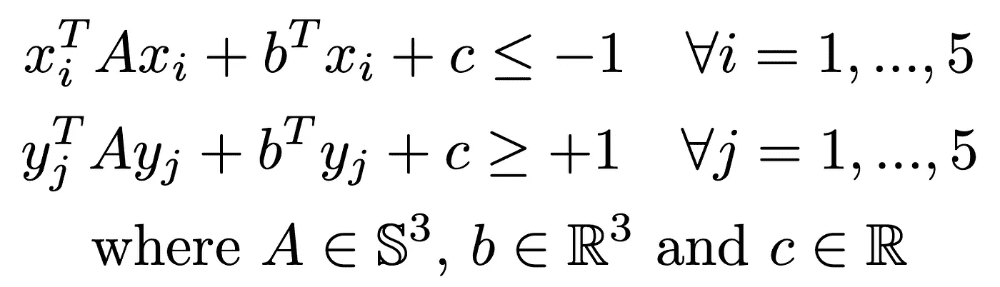

Equations that define a separating quadric surface

同样，我们需要包含误差变量，以使我们的模型能够拟合无法通过二次曲面分离的数据集:

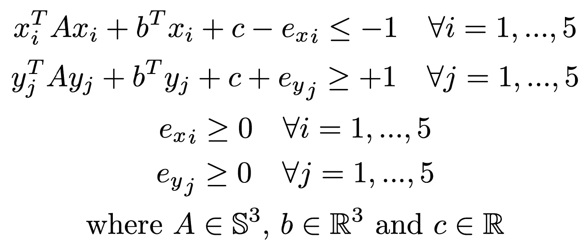

Equations for a not-so-perfect separating quadric surface

有了这些方程，我们现在可以定义我们的新问题，就像在超平面的情况下一样:

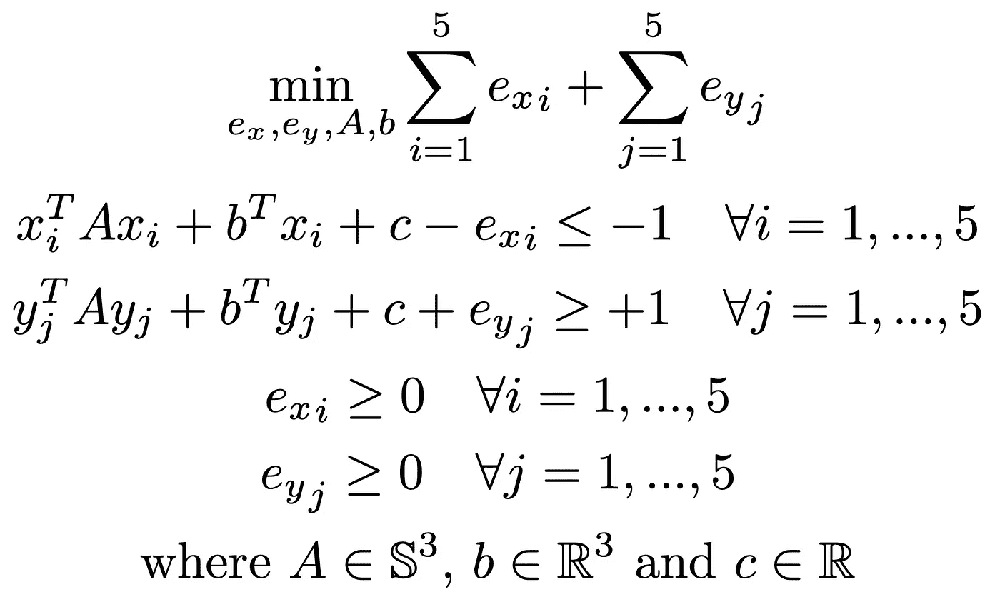

Problem to solve to find a quadric surface

## 用 MATLAB 求解

现在，我们的决策变量不再像我们在超平面问题中使用的那些变量，让我们看看我们应该如何定义它们，以便可以使用 YALMIP 解决它们:

```
% Quadric surface variables
A = sdpvar(nDimension, nDimension, 'symmetric');
b = sdpvar(nDimension, 1);
c = sdpvar(1);% Error variables for points in X and in Y
xError = sdpvar(1, nVariable);
yError = sdpvar(1, nVariable);
```

接下来，我们必须定义问题中的约束:

```
% Error variables should be above 0
constraints = [xError >= 0, yError >=0];% Quadric surface constraints
constraints = [constraints, diag(X'*A*X)'+b'*X+c<= -(1-xError), diag(Y'*A*Y)'+b'*Y+c >= 1-yError]; % We are only concerned with the diagonal entries of the nVariable x nVariable matrix
```

最后，我们指定问题的目标函数:

```
% Minimise average error values for all points in X and in Y
objective = sum(xError) + sum(yError);
```

现在，是时候使用我们在超平面问题中使用的同一个函数 *optimize()* 来解决问题了:

```
diagnosis = optimize(constraints, objective);disp(diagnosis.info); % Success/failure report
```

在成功完成算法后，我们检索最优决策变量和最优目标值。

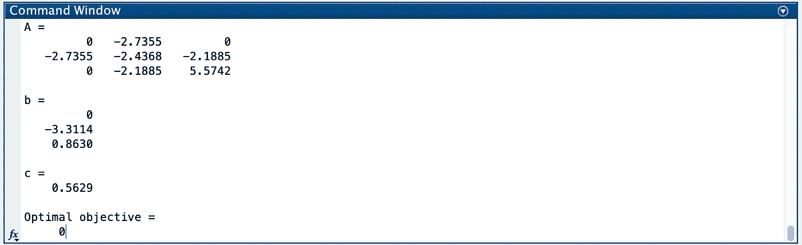

A perfect separating quadric surface is found!

## 绘制二次曲面

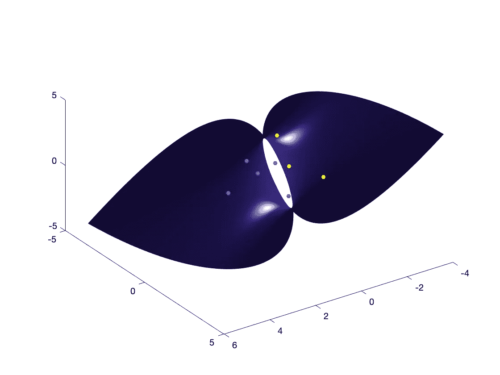

A hyperboloid that separates the two data classes

与我们在上一节中绘制超平面的方式不同，我们需要采用一种稍微不同的方法来绘制二次曲面。

我们首先在整个绘图区域生成虚拟的 x、y 和 z 值，当使用函数 *isosurface()* 时，这些值将用于求解一般的二次曲面方程。 *lhs* 表示将用作函数第 4 个参数的等式左侧，而 0 表示用作第 5 个参数的等式右侧。

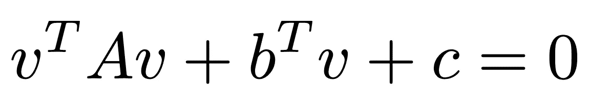

General equation of a quadric surface

```
% Generate x, y and z dummy data points
[xValuesDummy,yValuesDummy,zValuesDummy]= meshgrid(-5:0.05:5); q1 = A(1,1)*xValuesDummy+A(2,1)*yValuesDummy+A(3,1)*zValuesDummy;
q2 = A(1,2)*xValuesDummy+A(2,2)*yValuesDummy+A(3,2)*zValuesDummy;
q3 = A(1,3)*xValuesDummy+A(2,3)*yValuesDummy+A(3,3)*zValuesDummy;lhs = q1.*xValuesDummy+q2.*yValuesDummy+q3.*zValuesDummy+b(1)*xValuesDummy+b(2)*yValuesDummy+b(3)*zValuesDummy + c; isosurface(xValuesDummy,yValuesDummy,zValuesDummy,lhs,0);hold on;
```

最后但同样重要的是，我们将绘制两个类中发现的单个数据点:

```
% Plot data points
xValues = [X(1,:) Y(1,:)];
yValues = [X(2,:) Y(2,:)];
zValues = [X(3,:) Y(3,:)];Colour = repmat([1,10],nVariable,1);
colour = Colour(:);scatter3(xValues', yValues', zValues', 25, colour,'filled');
```

瞧，你完成了！这将允许您生成各种二次曲面，将您的数据点分隔在醒目的图中，如下所示:

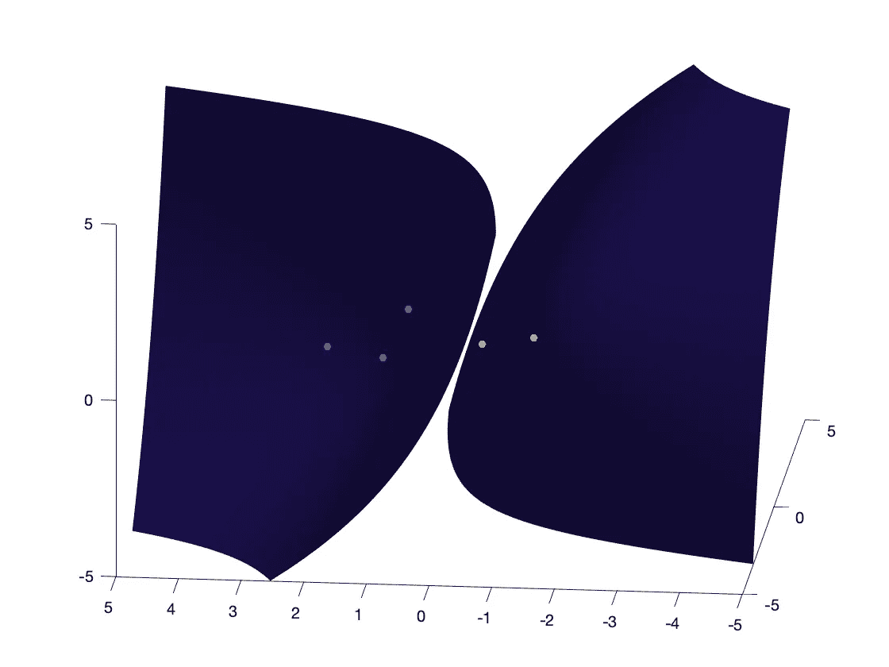

2-sheet hyperboloid

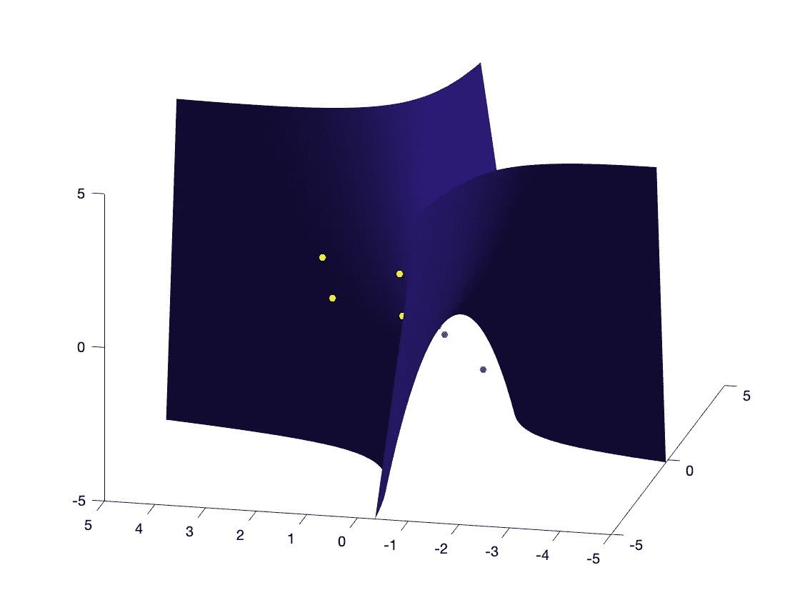

Hyperbolic paraboloid (or saddle)

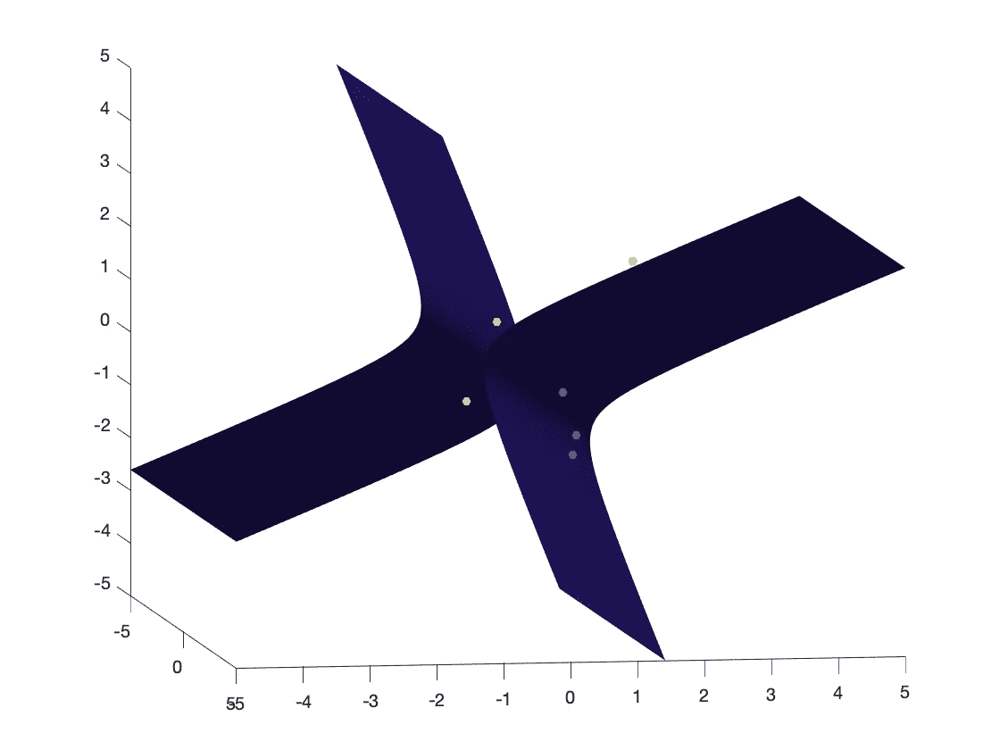

Hyperbolic cylinder

当然，如果生成的任何二次曲面未能完美分离所有数据点，也不必过于惊慌。就像在超平面的情况下，不可能总是找到适合每个可能的数据集的完美解决方案。

# 结论

我刚刚向您展示了如何使用 MATLAB 和 YALMIP 不仅可以找到而且可以绘制分离超平面和二次曲面以进行数据分类。

然而，重要的是要记住，我给出的例子非常简单，当然可以推广到更高维度和更大数量。尽管这些问题仍然很容易解决，但是如果数据大于三维，就很难用同样的方式显示所有的数据。

我希望你已经对各种功能和情节玩得很开心了，非常感谢你阅读我的文章，如果你设法一直做到这里的话！