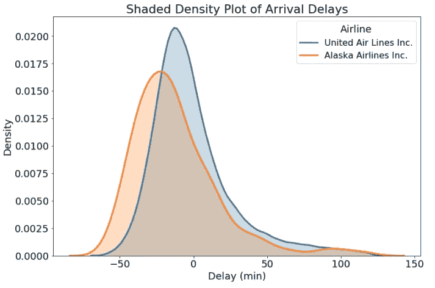
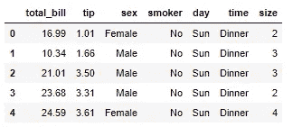
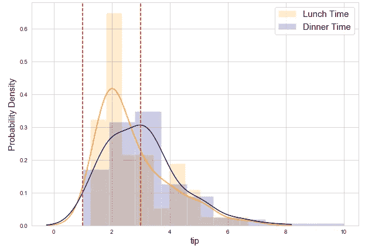
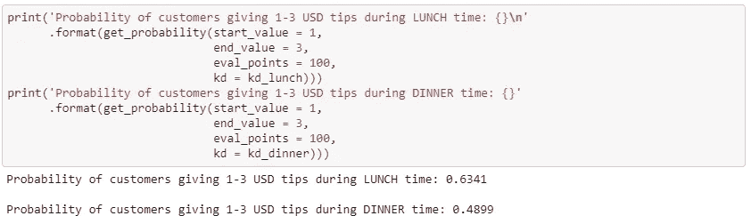

# 如何从概率密度图中找到概率

> 原文：<https://towardsdatascience.com/how-to-find-probability-from-probability-density-plots-7c392b218bab?source=collection_archive---------5----------------------->

## 通过知道一个范围内的实际概率来理解数据的分布

在进一步发展之前，让我们面对它。

如果您已经在数据科学领域工作了一段时间，那么您可能已经制作了概率密度图(如下所示)来了解数据的总体分布。

[(Source)](/histograms-and-density-plots-in-python-f6bda88f5ac0)

嗯…首先，什么是密度图？Will Koehrsen 给出了一个伟大而清晰的解释:

> [密度图](http://serialmentor.com/dataviz/histograms-density-plots.html)是根据数据估计的直方图的平滑、连续版本。
> 
> 最常见的估计形式被称为[核密度估计](https://en.wikipedia.org/wiki/Kernel_density_estimation) (KDE)。
> 
> 在这种方法中，在每个单独的数据点绘制一条连续的曲线(内核),然后将所有这些曲线加在一起，进行一次平滑的密度估计。
> 
> 最常用的内核是一个**高斯**(它在每个数据点产生一个高斯钟形曲线)

**概率密度图**简单地表示概率密度函数(Y 轴)对变量数据点(X 轴)的密度图。

通常，概率密度图用于**了解连续变量的数据分布**，我们希望**知道获得连续变量可以假设的数值范围**的可能性(或概率)。

但问题是。

通过显示概率密度图，我们只能直观地了解数据*的分布，而不知道某一范围值的确切概率。*

*换句话说，仅仅看图很难量化曲线下的概率。*

*然而，得到曲线下的确切概率是极其重要的*(我会在下一节告诉你为什么)，尤其是当你向商业利益相关者陈述的时候。**

**在本文中，我将向您展示我用来计算概率的完整代码，并一步一步地向您解释您如何也能这样做。**

**在本文结束时，我希望您能够通过计算一系列值中的实际概率来更好地理解数据的分布，并随后能够用您的见解说服利益相关者。**

**你可以从我的 GitHub 获取数据集和 jupyter 笔记本。**

**我们开始吧！**

# **为什么概率密度图说服力不够？**

**从视觉上回顾上面的密度图，你可能会得出一个结论，阿拉斯加航空公司的航班往往比联合航空公司更早。**

**想象一下，现在你的老板问了这个问题，并质疑你的说法，**“阿拉斯加航空公司的航班比联合航空公司的航班早多少，发生这种情况的几率有多高？你有什么数字证据证明你的结论是正确的吗？”****

**你惊呆了。因为结论来自于你对数据整体分布的观察。**

**更糟糕的是，现在你没有任何数字证据——确切的概率——来支持你的说法。**

**你没有做好充分的准备，如果你不能证明自己的观点，你作为数据科学家的可信度就会立刻下降。**

**这就是从概率密度图计算概率的重要性所在。**

**不幸的是，如果你使用 Seaborn 来制作使用`distplot`的密度图，很难计算概率。**

**在花了一些时间弄清楚如何计算概率之后，我决定使用来自`sklearn`的`KernelDensity`。**

**这个方法非常有效，我很高兴能和你分享这个！👇🏻**

# **下面是如何从概率密度图中找到概率**

**我们将使用小费数据，它由一些可能影响餐馆中顾客给小费数量的因素组成。你可以在这里得到数据[。](https://github.com/admond1994/calculate-probability-from-probability-density-plots/blob/master/tips.csv)**

****

**Tips data loaded in a dataframe**

**因为我们的目标是从密度图中找到概率，所以为了简单起见，我们将集中回答一个问题— **顾客在午餐/晚餐时间会给更多小费吗？****

**由于数据已经足够清晰，因此我们可以开始绘制密度图并直接计算各自的概率值。**

**对于以下步骤，请参考[笔记本](https://github.com/admond1994/calculate-probability-from-probability-density-plots/blob/master/cal_probability.ipynb)了解所用功能的完整代码实现。**

## **1.绘制概率密度图**

**Function to make probability density plots without using Seaborn**

**由于 Seaborn 没有提供任何从 KDE 计算概率的功能，因此代码遵循这 3 个步骤(如下)来绘制概率密度图，并输出 KDE 对象来计算概率。**

*   **绘制标准化直方图**
*   **执行核密度估计(KDE)**
*   **绘图概率密度**

****

**Probability density plot of tips amount (USD) given by customers**

**现在我们有了午餐和晚餐时间小费数量的概率密度图来进行比较。**

**仅从顾客给的 1-3 美元的小费来看，我们可以得出这样的结论:与晚餐时间相比，**的顾客更倾向于在午餐时间给 1-3 美元的小费。****

**同样，为了有数字证据(也称为概率值)来加强我们的陈述，让我们计算一下顾客在午餐和晚餐时间给 1-3 美元小费的概率，以作比较。**

## **2.计算概率**

**Function to calculate probability**

**一旦我们使用函数`plot_prob_density`绘制了概率密度图，我们将使用这个函数的输出 KDE 对象作为输入来使用下一个函数`get_probability`计算概率。**

****

**Calculate and output probability**

**现在你知道了！**

**标准化密度曲线下的概率总和总是等于 1。由于概率是曲线下的面积，因此我们可以指定一个值范围(本例中为 1-3 美元小费)来计算该范围内的概率。**

**因此，概率就是概率密度值(Y 轴)和小费数量(X 轴)的乘积。**

**乘法在每个评估点上完成，然后将这些相乘的值相加，以计算最终概率。**

**计算出的概率证明支持了我们最初的说法——与晚餐时间相比，顾客倾向于在午餐时间给 1-3 美元的小费**,概率为 63%比 49%。****

# **最后的想法**

****

**Photo credit: [Campaign Creators](http://www.campaigncreators.com/)**

**感谢您的阅读。**

**我希望这篇文章能让你对概率密度图有更好的理解，最重要的是，向你展示如何**计算概率密度曲线下**值范围内的实际概率。**

**计算概率相当简单，但并不简单。它确实起到了至关重要的作用**让利益相关者更好地理解你的概率密度图，从而根据数字证据**而不是主观和模糊的观察提出可行的见解。**

**一如既往，如果您有任何问题或意见，请随时在下面留下您的反馈，或者您可以随时通过 [LinkedIn](https://www.linkedin.com/in/admond1994/) 联系我。在那之前，下一篇文章再见！😄**

## **关于作者**

**[**Admond Lee**](https://www.linkedin.com/in/admond1994/) 目前是东南亚排名第一的商业银行 API 平台[**【Staq】**](https://www.trystaq.com)**—**的联合创始人/首席技术官。**

**想要获得免费的每周数据科学和创业见解吗？**

**[**加入 Admond 的电子邮件简讯——Hustle Hub**](https://bit.ly/3pGF8jv)，每周他都会在那里分享可行的数据科学职业技巧、错误&以及从创建他的初创公司 Staq 中学到的东西。**

**你可以在 [LinkedIn](https://www.linkedin.com/in/admond1994/) 、 [Medium](https://medium.com/@admond1994) 、 [Twitter](https://twitter.com/admond1994) 、[脸书](https://www.facebook.com/admond1994)上和他联系。**

** [## 阿德蒙德·李

### 让每个人都能接触到数据科学。Admond 正在通过先进的社交分析和机器学习，利用可操作的见解帮助公司和数字营销机构实现营销投资回报。

www.admondlee.com](https://www.admondlee.com/)**