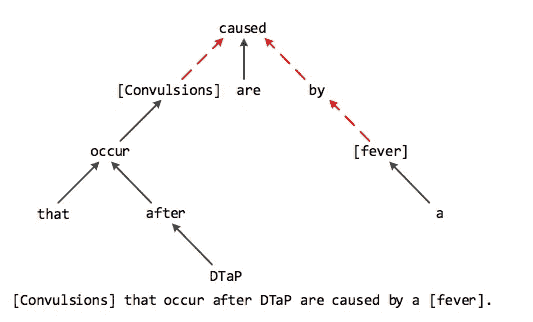
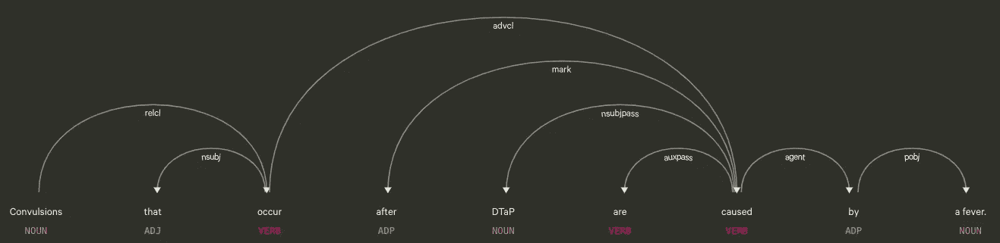

# 如何用 spaCy 和 StanfordNLP 寻找最短依赖路径

> 原文：<https://towardsdatascience.com/how-to-find-shortest-dependency-path-with-spacy-and-stanfordnlp-539d45d28239?source=collection_archive---------7----------------------->

## 最短依赖路径是关系抽取中常用的方法


Photo by [Caleb Jones](https://unsplash.com/@gcalebjones?utm_source=unsplash&utm_medium=referral&utm_content=creditCopyText) on [Unsplash](https://unsplash.com/search/photos/path?utm_source=unsplash&utm_medium=referral&utm_content=creditCopyText)

# TL；速度三角形定位法(dead reckoning)

考虑到文档和依赖解析的准确性，我推荐使用 spaCy 而不是 StanfordNLP。

内容结构如下。

*   什么是最短依赖路径(SDP)？
*   用空间寻找最短依赖路径
*   用 StanfordNLP 查找最短依赖路径

# 什么是最短依赖路径(SDP)？

语义依存句法分析曾被频繁地用于剖析句子和捕获单词**的语义信息，这些语义信息在上下文中靠近**，而在句子距离较远的地方靠近**。**

要提取两个实体之间的关系，最直接的方法是使用 SDP。使用 SDP 的动机是基于这样的观察**实体之间的 SDP 通常包含识别它们关系的必要信息。**[](https://www.ncbi.nlm.nih.gov/pmc/articles/PMC4963603/)

****

**A dependency tree example**

```
Convulsions that occur after DTaP are caused by a fever.
```

**在上图中，方括号中的单词是标记的实体。**红色虚线箭头表示两个实体之间的 SDP**。**

# **用空间寻找最短依赖路径**

**首先，在终端中安装必要的库。为了清晰起见，我添加了版本号。**

```
pip install spacy==2.1.4
python -m spacy download en_core_web_smpip install stanfordnlp==0.2.0
pip install networkx==2.3
```

**首先，我们按照官方教程打印出所有的依赖标签。**

```
import spacy
import networkx as nxnlp = spacy.load("en_core_web_sm")doc = nlp(u'Convulsions that occur after DTaP are caused by a fever.')for token in doc:
    print((token.head.text, token.text, token.dep_))# output: (head, current_token, dep_relation)
('caused', 'Convulsions', 'nsubjpass')
('occur', 'that', 'nsubj')
('Convulsions', 'occur', 'relcl')
('occur', 'after', 'prep')
('caused', 'DTaP', 'nsubjpass')
('caused', 'are', 'auxpass')
('caused', 'caused', 'ROOT')
('caused', 'by', 'agent')
('fever', 'a', 'det')
('by', 'fever', 'pobj')
('caused', '.', 'punct')
```

**我们可以通过[方便的空间可视化工具](https://explosion.ai/demos/displacy?text=Convulsions%20that%20occur%20after%20DTaP%20are%20caused%20by%20a%20fever.&model=en_core_web_sm&cpu=1&cph=1)绘制整个依赖树。**

****

**下面的代码可以给 SDP**

```
import spacy
import networkx as nxnlp = spacy.load("en_core_web_sm")doc = nlp(u'Convulsions that occur after DTaP are caused by a fever.')print('sentence:'.format(doc))# Load spacy's dependency tree into a networkx graph
edges = []
for token in doc:
    for child in token.children:
        edges.append(('{0}'.format(token.lower_),
                      '{0}'.format(child.lower_)))graph = nx.Graph(edges)# Get the length and path
entity1 = 'Convulsions'.lower()
entity2 = 'fever'print(nx.**shortest_path_length**(graph, source=entity1, target=entity2))
print(nx.**shortest_path**(graph, source=entity1, target=entity2))
```

**`edges`如下图所示。**

```
In [6]: edges
Out[6]:
[('convulsions', 'occur'),
 ('occur', 'that'),
 ('occur', 'after'),
 ('caused', 'convulsions'),
 ('caused', 'dtap'),
 ('caused', 'are'),
 ('caused', 'by'),
 ('caused', '.'),
 ('by', 'fever'),
 ('fever', 'a')]
```

**输出如下**

```
3
['convulsions', 'caused', 'by', 'fever']
```

**这意味着从“抽搐”到“发烧”的 SDP 长度为 3。**

**如果你不想使用 networkx 库，而只使用 spaCy，你可以查看我的另一个帖子，[用 spaCy 找到最低公共祖先最短依赖路径](/find-shortest-dependency-path-with-spacy-only)**

# **用 StanfordNLP 查找最短依赖路径**

**首先，我们按照官方教程打印出所有的依赖标签。**

```
import stanfordnlpstanfordnlp.download('en')
nlp = stanfordnlp.Pipeline()doc = nlp('Convulsions that occur after DTaP are caused by a fever.')
doc.sentences[0].print_dependencies()# output: (current_token, head_index, dep_relation)
('Convulsions', '0', 'root')
('that', '3', 'nsubj')
('occur', '1', 'acl:relcl')
('after', '7', 'mark')
('DTaP', '7', 'nsubj:pass')
('are', '7', 'aux:pass')
('caused', '3', 'advcl')
('by', '10', 'case')
('a', '10', 'det')
('fever', '7', 'obl')
```

**为了遵循 networkx 图的`[(token, children), (token, children),...]`格式，我们需要根据[源代码](https://github.com/stanfordnlp/stanfordnlp/blob/8d1383a3c067dc07a50d5087462f53ff81f964ce/stanfordnlp/pipeline/doc.py#L128)修改代码。**

```
import stanfordnlpstanfordnlp.download('en')
nlp = stanfordnlp.Pipeline()doc = nlp('Convulsions that occur after DTaP are caused by a fever.')# Load stanfordnlp's dependency tree into a networkx graph
edges = []
for token in doc.sentences[0].dependencies:
    if token[0].text.lower() != 'root':
        edges.append((token[0].text.lower(), token[2].text))graph = nx.Graph(edges)# Get the length and path
entity1 = 'Convulsions'.lower()
entity2 = 'fever'
print(nx.shortest_path_length(graph, source=entity1, target=entity2))
print(nx.shortest_path(graph, source=entity1, target=entity2))
```

**`edges`如下图所示。**

```
In [19]: edges
Out[19]:
[('occur', 'that'),
 ('convulsions', 'occur'),
 ('caused', 'after'),
 ('caused', 'DTaP'),
 ('caused', 'are'),
 ('occur', 'caused'),
 ('fever', 'by'),
 ('fever', 'a'),
 ('caused', 'fever'),
 ('convulsions', '.')]
```

**输出如下**

```
3
['convulsions', 'occur', 'caused', 'fever']
```

**即使是 StanfordNLP 计算的 SDP 长度也与 spaCy 相同。**但在 SDP 中两个实体之间的词语应该是** `**'caused', 'by'**` **。因此，spaCy 的依赖解析精度优于 StanfordNLP。****

> *****查看我在*** [***中的其他帖子***](https://medium.com/@bramblexu) ***同*** [***一个归类视图***](https://bramblexu.com/posts/eb7bd472/) ***！
> git hub:***[**BrambleXu**](https://github.com/BrambleXu) ***LinkedIn:***[***徐亮******Blog:*****BrambleXu**](https://www.linkedin.com/in/xu-liang-99356891/)**

# ****参考****

**[](https://stackoverflow.com/questions/32835291/how-to-find-the-shortest-dependency-path-between-two-words-in-python) [## 如何在 Python 中找到两个单词之间的最短依赖路径？

### 您的问题可以很容易地想象成一个图形问题，我们必须找到两个节点之间的最短路径。去…

stackoverflow.com](https://stackoverflow.com/questions/32835291/how-to-find-the-shortest-dependency-path-between-two-words-in-python) [](https://www.ncbi.nlm.nih.gov/pmc/articles/PMC4963603/) [## 基于最短依赖路径的蛋白质-蛋白质关系卷积神经网络…

### 生物医学关系在生物过程中起着重要的作用，在生物医学领域得到了广泛的研究。

www.ncbi.nlm.nih.gov](https://www.ncbi.nlm.nih.gov/pmc/articles/PMC4963603/)**