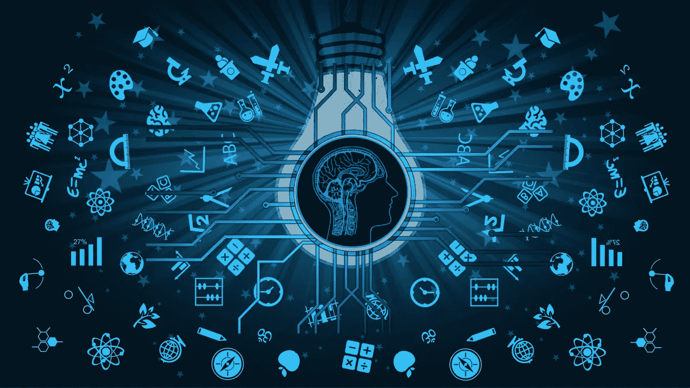
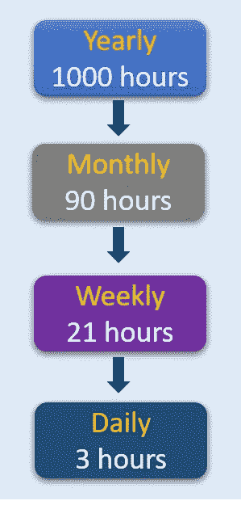
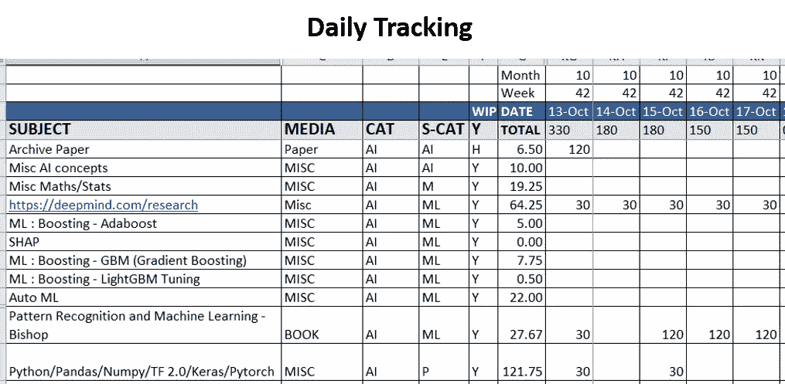
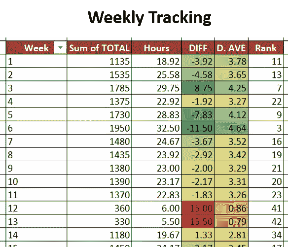
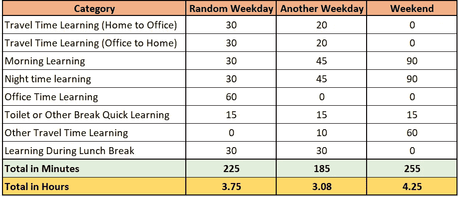

# 距离掌握数据科学又近了 1000 个小时

> 原文：<https://towardsdatascience.com/how-to-find-time-to-learn-data-science-8b73578619f0?source=collection_archive---------26----------------------->

## 一年 1000 小时的学习时间，每年学习更多数据科学的简单有效的方法

数据科学、机器学习或人工智能领域正在随着不断扩展的知识领域、无数的突破和令人难以置信的创新进步而爆炸。无论是专家还是新手，管理时间以跟上变化变得越来越复杂。这篇文章对任何人都有用，比如:

1.  有人想把职业生涯转向数据科学
2.  数据科学专家，但希望保持其专业知识最新的人
3.  一个是特定领域的专家，比如 NLP，他们希望转向视觉或机器人或人工智能领域的其他领域
4.  或者想从初级数据科学家成为高级数据科学家

无论你属于哪一类，你都可以很容易地在一年中找到 1000 个小时来学习更多的东西，以实现上述目标之一。这 1000 个小时不算你在职学习或培训的时间。这 1000 小时完全是你在日常办公时间之外的额外学习活动。

那么它是如何工作的呢？这很简单，遵循以下准则

# 将 1000 小时分成每天、每周和每月的目标

这种分裂并不新鲜；你可能已经从许多自助大师那里听过很多次了。如果你有一个更大的目标，把它分成更小的目标块，这样你就可以有效地衡量，每天或每周跟踪。所以，如果我们用 1000 个小时除以 365(哦，是的，这是一年中的天数)，大约得到 2.74 个小时。但我建议将平均每天的目标设定为 3 小时，并留出 30 天以备不时之需，那时你不会像每隔一天一样感到疯狂(比如度假或与孩子一起运动，或者只是因为深夜派对后的头痛)。休息 335 天，你平均要花 3 个小时(怎么？我们稍后会谈到这一点)。所以，335 乘以 3 等于 1005(哦，对了，还有 5 个小时的奖励)。在每周目标方面，你可以设定每周 21 小时(仍然保持这个目标，因为不是每周都一样)。同样，每月的目标是大约 90 小时。

# 创建一个用于计划和跟踪的跟踪器

跟踪对于检查你做得如何至关重要。你需要记录所有的学习活动，如阅读、观看视频、参加课程等。将这些计划按组或流派、内容来源、媒体、编码小时数等进行划分。适用于你的。一个电子表格将是正确的选择，这样你就可以生成一个数据透视表和总结或视觉效果，如果你需要看到你的努力在哪里。然后你需要每天更新，每周和每月跟踪，检查你的进展如何。每天、每周、每月和每年跟踪的少量样本:

# 买个 ANC 耳机

由于你需要有效地利用每一点时间，我强烈建议你买一个 ANC ( [主动噪音消除](https://www.techradar.com/sg/news/audio/portable-audio/best-noise-cancelling-headphones-1280490))耳机。Bose 和 Sony 有一个非常有效的，虽然有点贵。只要记住 ANC 耳机会是你这段旅程中最好的伴侣；因此，**总是**带在身边。你需要用它来观看培训或会议视频或听有声读物或[数据科学解说文章](https://towardsdatascience.com/narrated/home)在嘈杂的地方，如健身房或在公共汽车、火车等交通工具上。

# 旅行时间是最好的时间

我们大多数人每天都要进行大量的旅行。无论我们是去办公室还是去购物中心，大多数时候我们都是在旅行。一定要在手机上使用耳机来浏览任何视频内容或听有声读物。如果你在开车，不要使用 ANC 耳机，使用车载音乐设备来听有声读物或任何其他不太需要集中注意力的音频内容，记住生命比 1000 小时的学习目标更宝贵。

# 没有手机不要上厕所

是的，分秒必争，包括你在厕所的时间。我们在浴室里花了很多时间。如果你打算快速复习任何内存密集型活动(如浏览 Numpy 或 Tensorflow 2.0 备忘单)，我们可以有效地利用这 5-10 分钟。我们可以使用抽认卡或像 Anki 这样的工具来快速学习。

# 锻炼不仅对身体有益，对大脑也有好处

如果你在健身房跑步或锻炼，你可以使用你的手机和 ANC 耳机来复习。选择一个不需要太注意的题目或科目，这个时候最适合复习。如果你经常游泳，你可以得到一个防水耳机。

# 在周末留出时间

如果你有固定的工作或学校/大学时间，那么在周末留出一些额外的时间。通常情况下，要在工作日达到平均 3 小时的睡眠时间是很有挑战性的，所以周末需要迎头赶上。即使在与家人、朋友和社区度过了美好时光后，你也可以在一些周末和假期坚持 7-8 小时。

# 在跟踪器中也包括准备时间

一项重要的活动是准备学习材料。作为一名数据科学家，我需要搜索并准备好学习材料、书籍和视频/音频课程。媒体可能是一个很好的来源(最好是付费订阅，因为这将打开一个完整的信息世界，这些信息是经过策划、增强的，并且针对你需要的特定点)。使用谷歌或其他搜索引擎来准备学习材料。对于博客甚至媒体文章，你可以转换成 PDF 文档(从 Chrome 浏览器使用打印选项，并保存为 PDF)，你可以再次参考，你也可以做突出显示或另一个跟踪喜欢的日期在文件名中，等等。

# 像运动蔻驰一样追踪你的进度

只要你能跟踪并采取纠正措施，你的表现就会很好。就像体育教练对球员、比赛、策略、统计数据的每一个细节都有敏锐的眼光一样，你也需要虔诚地跟踪进展。千万不要把这个留到周末活动时用。每天，遵循这一点，更新信息，检查你是否达到了每日、每周的目标，或者如果你设定了子学习目标，哪些领域需要更多的学习。

# 使用 YouTube 获取免费内容

无论你在哪个领域或者想学什么，YouTube 都是一个很好的来源。我不能亲自参加所有的会议、训练营和大学课程，但使用 YouTube，我可以轻松做到。有令人难以置信的免费和高质量的信息。使用播放列表或为自己创建一个播放列表。你可以使用 YouTube 的海量下载软件(搜索谷歌，你会发现很多免费软件可以这样做)供以后观看。我把从 YouTube 上下载的大部分学习视频保存在我手机上的一个适当的文件夹结构中，当我在家里和办公室之间旅行时使用。你甚至可以下载 mp3 格式的 YouTube 作为你的纯音频时间。

# 如果可以的话，利用办公时间

你也可以利用办公时间来学习(不要把正式培训或在职学习算作这 1000 个完全额外的学习时间，这是你办公室工作相关培训和学习之外的时间)。许多组织有专门的学习系统，使他们的劳动力管理技能。许多人订阅 Udemy Business 或 Udacity 或其他一些外部或内部课程。如果你有这样的设施，充分利用这一点。除此之外，你可以在伸展手脚的间隙，读一篇 5 分钟的关于某个特定主题的中型文章。大多数时候，1-2 个小时可以来自办公时间本身。利用午休时间，不要只是坐着闲聊(许多人认为这是建立关系网)。

# 社交媒体不是为了有针对性的学习

是的，社交媒体包含了很多信息(其中大部分对你设定的特定目标毫无用处)。这些对放松或娱乐有好处，但大多没有任何价值，因为这些不是集中在学习上。更好地利用这段时间(不要同意我……没关系，我的意思是——至少减少并转移这段时间去学习或快速复习抽认卡)

# 数学落后 1000 小时

在这里，我展示了一些日常样本数据。这里有几个例子来展示一个人如何能达到 3 小时。每个人的情况不同；因此，你需要找出什么适合你。

# 最后一个音符

这篇文章不仅仅是理论或噱头；在过去的几年里，我个人每年持续达到 1000 小时以上。我 40 多岁了，家里有两个正在成长的孩子。如果我能做到，为什么你不能？可能不是同一个配方或配方。你需要根据你的承诺、生活方式和情况来定制。如果你觉得 1000 小时太多，那就从 500 小时开始，并根据你的进度进行调整。再次重申，准备和跟踪是成功的关键，不要忘记小休息(记住每一滴都很重要)，永远不要忘记你的 ANC 耳机。

我现在很想分享爱比克泰德的一句非常著名的励志名言，瑞安·哈乐黛在他的书《障碍就是出路》中让这句话变得更加流行

> “坚持，反抗”。坚持努力。抵制分心、沮丧和混乱。"

因此，只要你练习**、**、【坚持和抵抗】，你就可以达到 1000 小时甚至更长时间，让你追求数据科学的旅程发生重大变化。

## 感谢阅读。你可以在@ [LinkedIn](http://www.linkedin.com/in/baijayantaroy) 联系我。

只需每月 5 美元，就可以无限制地获取最鼓舞人心的内容…点击下面的链接，成为媒体会员，支持我的写作。谢谢大家！
[***https://baijayanta.medium.com/membership***](https://baijayanta.medium.com/membership)