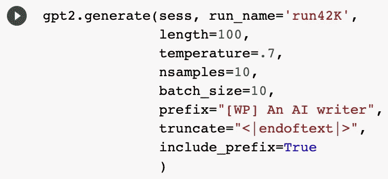
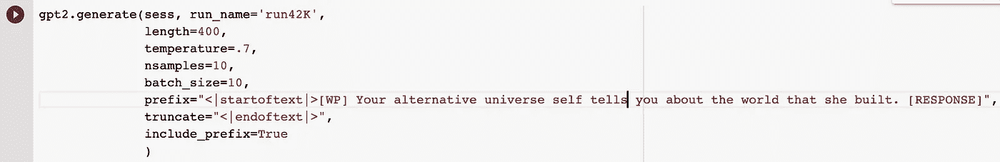

# 如何微调 GPT-2，让你可以产生长篇的创造性写作

> 原文：<https://towardsdatascience.com/how-to-fine-tune-gpt-2-so-you-can-generate-long-form-creative-writing-7a5ae1314a61?source=collection_archive---------9----------------------->

# 世界上最伟大的文本生成人工智能可以成为你的写作伙伴！

自从 OpenAI 将其 GPT-2 语言模型[发布到野外](https://openai.com/blog/better-language-models/)以来，人们一直在使用这种人工智能写作工具来生成滑稽、可怕和有趣的简短文本。

如果你想使用 GPT-2 生成包含你喜欢的主题、人物、背景和写作风格的长篇作品，你需要微调基本模型并进行大量阅读。

我可以免费教你怎么做！


Photo by [Brett Jordan](https://unsplash.com/@brett_jordan?utm_source=unsplash&utm_medium=referral&utm_content=creditCopyText) on [Unsplash](https://unsplash.com/s/photos/write-robot?utm_source=unsplash&utm_medium=referral&utm_content=creditCopyText)

# **认识一下输出先生，我的 AI 写作伙伴**

我刚刚花了 18 天完成了全国小说世代挑战(NaNoGenMo)，电脑生成[一份 51422 字的手稿](https://github.com/iistickboy/NaNoGenMo2019/blob/master/Jason%20Boog%20NaNoGenMo%202019%20.pdf)。

在这场编写和编码马拉松进行到一半的时候，我的人工智能编写伙伴产生了一位名叫输出先生的人工智能作者的这段令人惊叹(也有些令人不安)的独白:

```
This monstrosity of yours? The monstrosity that is being written now, by the talented and novel-obsessed AI writer you just launched against your will, is just so terribly boring, there's no way I could squeeze in one more story.I write fantasy, I write sci-fi, I write horror, I write romance, I write all sorts of nonsense. You can't even imagine how many lines I've written, how many worlds and histories I've created and twisted and broken and made to rhyme and rhyme and be the best that there ever was.
```

今年剩下的时间我会想办法把 Output 先生奇怪而精彩的 AI 作品融入到我自己的写作中。如果你喜欢这一段，给我发一条带有你地址的信息，我会用蜗牛邮件给你一个 Output 先生手写的故事。

在为*出版商周刊*撰写关于 NaNoGenMo 的文章时，我有机会与伟大的作家讨论长篇人工智能文本生成，如[罗宾·斯隆](https://www.robinsloan.com/)、*半影先生的 24 小时书店*和 *Sourdough 的作者。作为他写作项目的一部分，斯隆在他从一个比特币矿工那里购买的 GPU 上运行一个版本的 GPT-2。*

Robin 告诉我，在长篇文本的生成中包含人类作者是“至关重要的”。“这基本上仍然是关于一个人的，”他解释道，并指出人类作者和人工智能语言模型之间的未来合作。“一个作家做决定，有一个计划和一些他们想对世界说的话。如果这意味着他们成为其他文本的编辑或策展人，我认为这很好，甚至很棒！”

按照罗宾的建议，我在我的 NaNoGenMo 项目中扮演了馆长。

我本可以与我的人工智能写作伙伴在不到一小时的时间内生成 5 万字，但我选择花 18 天时间阅读数百页，并将最引人注目的文本收集到一个文档中。

我还在代码中使用了前缀标签，以确保 GPT-2 模型在整个项目中专注于我最喜欢的形而上学主题。

约翰·奥诺在 Medium 上写道:“在小说的程序化生成中，一个悬而未决的问题是如何保持读者的兴趣。”。希望通过我的 NaNoGenMo 项目解决这个问题，我决定使用书写提示和回复来生成更短(可能更有趣)的部分。

我是这样做的…


Photo by [Brett Jordan](https://unsplash.com/@brett_jordan?utm_source=unsplash&utm_medium=referral&utm_content=creditCopyText) on [Unsplash](https://unsplash.com/s/photos/write-robot?utm_source=unsplash&utm_medium=referral&utm_content=creditCopyText)

# **创建一个数据集。**

无论你想生成哪种形式的长篇文章，你都需要找到尽可能大的数据集。

使用[谷歌的 BigQuery 工具](https://bigquery.cloud.google.com/)和归档在 [Pushshift.io](https://pushshift.io/) 的 Reddit 数据的巨大档案，我在一个方便的 CSV 文件中创建了一个由个人写作提示组成的大规模数据集——每个都用< |startoftext| >和< |endoftext| >标记分隔。

我还使用了 Pushshift 的 Reddit 搜索工具[来收集数百个与人工智能相关的写作提示，以添加到数据集，因为我希望我的机器人能够处理我最喜欢的科幻主题。](https://redditsearch.io/)

在这个过程的最后，我得到了一个包含 1，065，179 个标记的书写提示数据集。GPT-2 是一个大规模的语言模型，所以你需要一个相对较大的数据集来有效地调整模型。

# 创建另一个数据集(如果需要)。

除非你想遵循我的写作提示/回答模型，否则你只需要创建一个数据集。

我的项目需要两个数据集。使用同样的工具和大量的 Reddit 搜索，我收集了我能在网上找到的评分最高和最棒的写作提示。我添加了许多专注于人工智能的回复，包括我多年来写的[我自己的写作提示回复](https://www.reddit.com/user/ZackaryBlue/comments/)。

在第二个训练数据集中，我得到了 1，947，763 个标记。

# 构建数据集。

如果你想生成任何结构的作品，这一步真的很重要。

我想给我的人工智能尽可能最整洁和高质量的学习数据，所以我使用了一系列简单的标记来教 GPT-2 书写即时反应的形状。

我添加了和标记来匹配书写提示数据集，但我也确保每个响应都有标记为[WP]的原始书写提示和标记为[RESPONSE]的响应本身。

虽然这是一个巨大的，耗时的工作，但它使我的输出更加有趣。我将整个数据集保存为. TXT 文件。这是数据集的样子:

```
<|startoftext|>[WP] On November 4, 2020, humanity abandons the Internet. Billions of bots have colonized the web with spam, deepfakes, and fake news. At the now deserted r/WritingPrompts, literary AIs (trained on great works of human literature) create an infinite library of prompts & responses.

[RESPONSE] Zackary Blue worked as a night janitor in the basement for major financial services company. He cleaned cavernous spaces beneath the building where hundreds of millions of dollars got traded every single day.
<|endoftext|>
```

# 微调你的 GPT-2 语言模型。

微调我的两个语言模型花了几天时间。Max Woolf 教会了我这一步需要知道的一切。

**重要更新:** Google Colab 更新了它的标准张量流版本，你必须在 Max Woolf 的 Colab 笔记本顶部添加一行代码才能使用旧版本的张量流。只需将这行代码添加到 Colab 笔记本的顶部，Woolf 的笔记本就可以完美运行了:

```
%tensorflow_version 1.x
```

我用的是中等大小的 355M 版本的 GPT 2，因为它足够大，可以处理我的数据集，但又足够小，可以在 Google Colab 的云服务器上运行。我用 42000 步训练了这两个模型。

我将训练分成更小的部分，因为谷歌 Colab 不会跑超过 12，000 步。

# 使用微调后的 GPT-2 模型生成文本。

一旦我的两个语言模型被训练好，我就开始生成我的 NaNoGenMo 项目。

每天早上，我都会运行写作提示程序(Jane Doe ),生成 10-20 页由电脑生成的写作提示。

对于每次运行，我设置长度为 100 个字符，温度为 0 . 7，输出为 10 个样本。为了塑造这个项目，我使用 prefix 函数将写作提示输出指向我最喜欢的主题，如虚拟现实、模拟理论和 AI 作家。



The code from one of my *many* Writing Prompt Prompter runs.

除非您想遵循我的书写提示/响应模型，否则您只需要用一种语言模型生成文本。

然而，我为我的 NaNoGenMo 项目增加了一个额外的步骤。

我挑选了我最喜欢的计算机生成的写作提示，并将其输入到写作提示响应者(输出先生)中，以生成 100 至 125 页的响应。 [Max Woolf 的 Google Colab 笔记本](https://minimaxir.com/2019/09/howto-gpt2/)帮我编写了这一步的所有代码。



The code from one of my *many* Writing Prompt Responder runs.

# 通读你所有的输出。

我梳理了无名氏和 Output 先生生成的数百页文本，挑选了最引人注目的故事。

对于我为 NaNoGenMo 收集的每 350 个令人信服的计算机生成的文字，我都必须费力地阅读大约 10，000 个单词的奇怪、令人困惑、重复或简单易懂的计算机生成的文本。

# 将最好的作品收集在一个主文件中。

在 11 月，我将每天的输出存储在一个文件中。我每天晚上都会阅读那个文件，寻找引人注目的文字。这是我保存的第一批作品之一，一个乌托邦宣言:

```
We are a group of artists, writers, coders, and tinkerers, who have banded under the banner of Humanity v2.0\. We are a worldwide collective of similar interests. We all have the same goal - to create anew the foundations of a better world.
```

我建议你在电子书阅读器或平板电脑上阅读电脑生成的文本。它让你远离电脑屏幕，给你更多实际的阅读体验。我还使用了神奇的[语音梦想阅读器](https://www.voicedream.com/)在早上上班的时候听我的电脑生成的内容。

在这些史诗般的阅读过程中，我将最好的作品保存在一个标有“NaNoGenMo Final”的主文件中

# 重复这个过程，直到你有足够引人注目的写作。

之后，我在 11 月连续 17 天运行相同的文本生成步骤。我一直在我的最终文档中添加计算机生成的文本，直到我越过了 NaNoGenMo 马拉松的 50，000 字终点线。

# 策划你的计算机生成的创作。

一旦“NaNoGenMo Final”文档达到临界质量，我就使用强大的写作工具 [Scrivener](https://www.literatureandlatte.com/scrivener/overview) 围绕虚拟现实、人工智能写作或上帝等主题重新排列计算机生成的故事。

我只对简单的重组进行了编辑，但人类管理员可以使用这一步骤来制作章节、编辑特定段落、添加插图、撰写评论或其他任何内容！

# 检查抄袭和出版！

一旦我完成了最终的手稿，我就通过 [Quetext 工具](https://www.quetext.com/)运行每个提示和回复，以确保我的机器人没有在网上抄袭任何人。GPT 2 号运行着一个拥有数百万篇文章的庞大数据集，但它偶尔会鹦鹉学舌。

就是这样！NaNoGenMo 是一次很棒的写作和编码体验，如果你这个月有时间，我推荐你试试。

从来没有这么多的资源可供像我这样的业余爱好者使用，GPT-2 在经过微调后确实非常强大。我将在今年余下的时间里阅读这些由 GPT-2 产生的故事。

这里是最后一个例子，人工智能作家和人类作家之间的一点联系…

```
They are a species apart, but they share one thing in common: their love of books. They are the ones who seek out books for their own needs, whether they be scientific, philosophical, or religious texts. They are the ones who, from the beginning, have been able to find meaning within books.
```