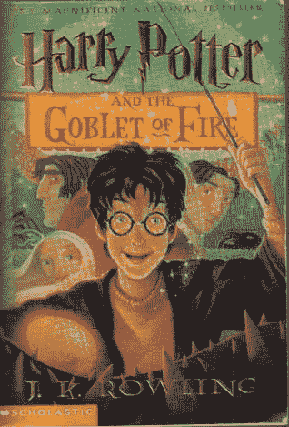
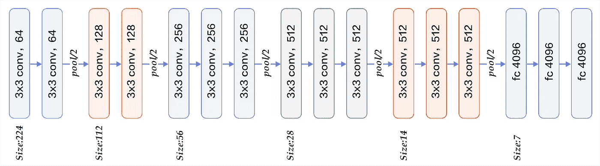
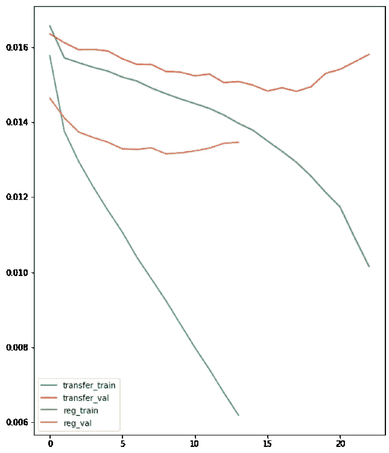
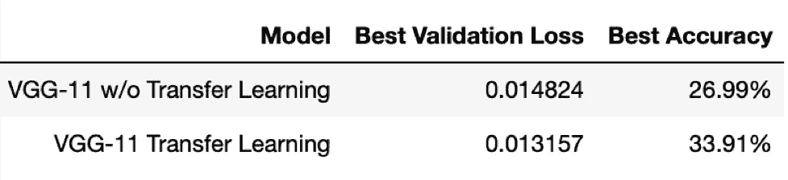
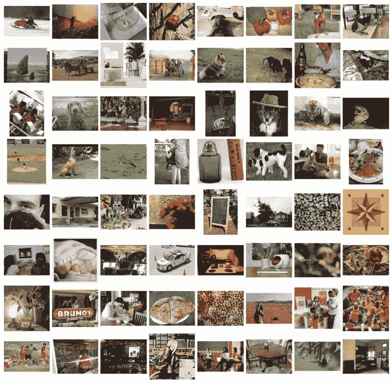
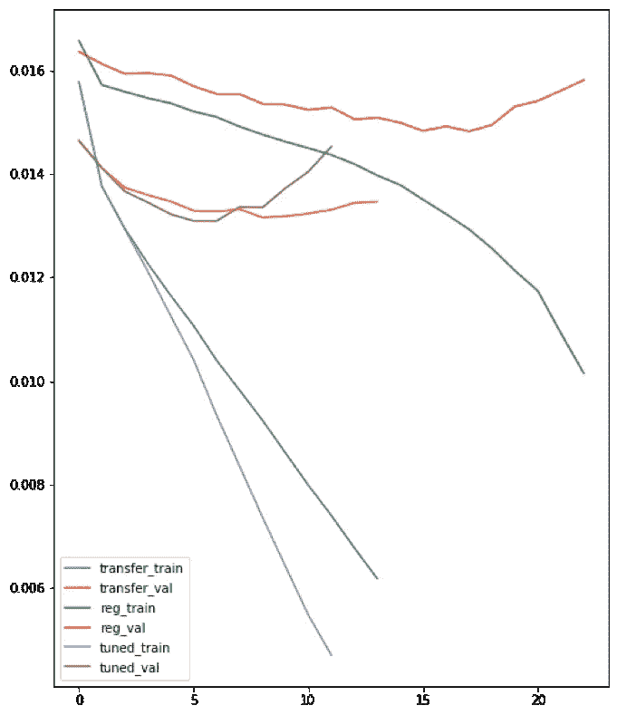
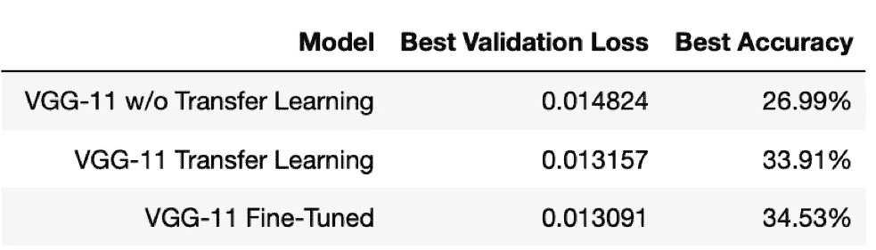

# 如何针对数据微调神经网络:图像分类

> 原文：<https://towardsdatascience.com/how-to-fine-tune-your-neural-network-for-your-data-image-classification-d0f01c92300b?source=collection_archive---------10----------------------->

使用 PyTorch 从迁移学习中获得更多

Photo by [Denisse Leon](https://unsplash.com/@denisseleon?utm_source=medium&utm_medium=referral) on [Unsplash](https://unsplash.com?utm_source=medium&utm_medium=referral)

# 介绍

当你没有很多数据时，建立一个用于图像分类的神经网络并不总是容易的。近年来，这一领域取得了一些重大进展，使得构建有价值的模型变得更加可能，而无需使用数百万张图像进行训练。最值得注意的是，迁移学习名列榜首。

迁移学习是从在 I [mageNet 数据集](http://www.image-net.org/)上训练的大型模型中提取预先训练的权重，并使用这些权重作为不同数据集的起点。通常，这是通过替换最后一个全连接层并训练模型，同时仅更新线性层的权重并让卷积层保持它们的权重来完成的。

这种图像分类方法通常非常有效，因为卷积层(我们可以将其视为学习图像特征的模型的一部分)已经看到了许多不同的图像，并且通常在提取图像特征以传递给线性层方面做得非常好。有一些简单的方法可以让这种普遍有效的方法更好地适用于您的特定数据。

# GoodReads 案例研究

## 数据

为了证明迁移学习的有效性以及如何在迁移学习的基础上进行改进，我使用了一个从 Goodreads 收集的数据集，这个数据集可以在 [Kaggle 上找到。从这些数据中，我试图根据书籍封面的图像来预测一本书的正确类型。为了节省计算时间，我只使用了数据的子样本，并删除了所有少于 5 次观察的类型。最终的数据集有 77 种类型和近 20，000 个观察值，我们将其分为一个训练、验证和测试集(60/20/20)。](https://www.kaggle.com/meetnaren/goodreads-best-books)

[Example of book cover image](https://www.goodreads.com/book/show/6.Harry_Potter_and_the_Goblet_of_Fire)

## 模型

在这个案例研究中，我使用了 VGG 11 网络，如下图所示。

[https://www.quora.com/What-is-the-VGG-neural-network](https://www.quora.com/What-is-the-VGG-neural-network)

我将对网络进行的唯一更改是用一个新的线性层替换最后一个输入为 4096、输出为 1000 的线性层，新的线性层输入为 4096、输出为 77(我们拥有的流派数量)。除此之外，网络的架构将保持不变。

对于模型的每个版本，我们保持相同的超参数，以便进行公平的比较。我使用 0.0003 的学习率，Adamax 优化器，交叉熵损失，以及 10 个时期后没有改善的早期停止。

# 迁移学习

如上所述，迁移学习为图像分类任务提供了巨大的收益。我们要运行的第一个测试是比较迁移学习和在没有任何预训练权重的情况下从头开始训练 VGG-11 架构。在 PyTorch 中，我们通过加载模型的预训练权重，替换最后一层，并从所有卷积层中移除梯度来实现这一点，如下所示。

现在我们可以像普通网络一样训练它。我训练并测试了我们的转移学习网络，以及我们的从头开始的网络。结果完全符合我们的预期。

Losses for transfer model vs. scratch model

Accuracy for transfer model vs. scratch model

从准确度图和损失图来看，很明显，我们的迁移学习模型比我们的从头开始模型表现得好得多。事实上，看起来我们迁移学习模型第一个时期的验证损失比我们从头开始的模型要好。除此之外，值得注意的是，传输模型达到最小验证损失只需要一半的时间。因此，传输模型在一半的时间内执行得更好。这是双赢的局面。

# 微调

很明显，迁移学习是有效的，我们也很好地理解了它为什么有效。该模型从图像中学习了许多特征，并根据这些特征对我们的书籍封面进行了训练。让我们快速看一下 ImageNet 到底是什么样子。

[https://www.researchgate.net/figure/Examples-in-the-ImageNet-dataset_fig7_314646236](https://www.researchgate.net/figure/Examples-in-the-ImageNet-dataset_fig7_314646236)

这些图像中有很多多样性，所以模型学习一般特征如此之好并不令人惊讶。如果我们看看这些数据，它看起来真的不像许多图片看起来像我们的哈利波特书的封面。有理由认为，更好地学习我们的书籍封面的特性可能有助于我们的转移模型进一步改进。

我们可以通过在训练时慢慢解冻卷积层的梯度来微调我们的传输模型，以适应我们独特的数据。首先，我们开始加载我们的模型，并以与我们第一个传输模型完全相同的方式更改最后一层。然后，在每一次训练之后，我们可以用类似这样的代码来更新网络的下一个卷积层的权重。

我们慢慢地更新渐变，从最底层开始，一直到顶层。这保留了我们的模型从预先训练的权重中获得的大量信息，同时有助于根据我们的书籍封面对其进行微调。经过训练和测试后，我们可以将其与我们的其他两个网络进行比较。

Losses for all models

Accuracy for all models

对我们的模型进行微调会使我们的原始模型获得一些适度的收益。同样，我们也看到它减少了达到最小验证损失所需的训练时间。

# 提示和技巧

*   我在所有这些模型中使用了相同的超参数，试图使比较公平。实际上，在进行微调以防止过度拟合时，使用较低的学习速率(通常是递减的学习速率)通常更有效。
*   与大多数深度学习实例一样，大量数据将使微调更加有效。
*   同样的技术也可以用于 NLP 任务的网络。它不限于图像。

# 最后的想法

像这样微调一个模型并不总是能得到更好的结果，但是绝对值得尝试。这是一个很容易的调整，你可以对你的代码进行调整，这有可能为你的模型提供一个几乎没有成本的提升。

如果你想看完整的代码，你可以查看我的 github repo。数据和代码都在那里，应该可以运行。