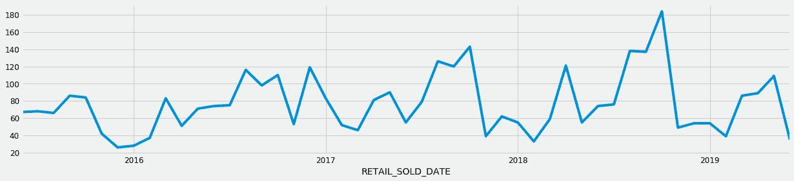
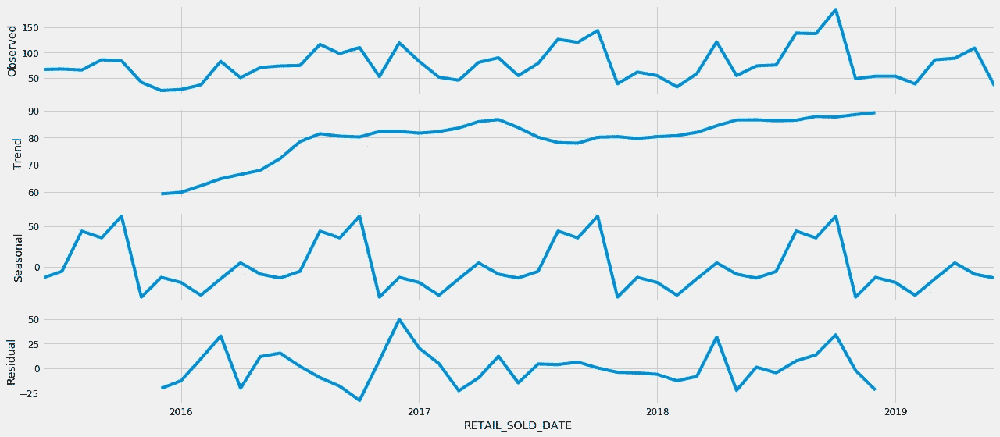
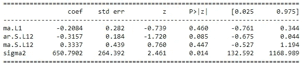
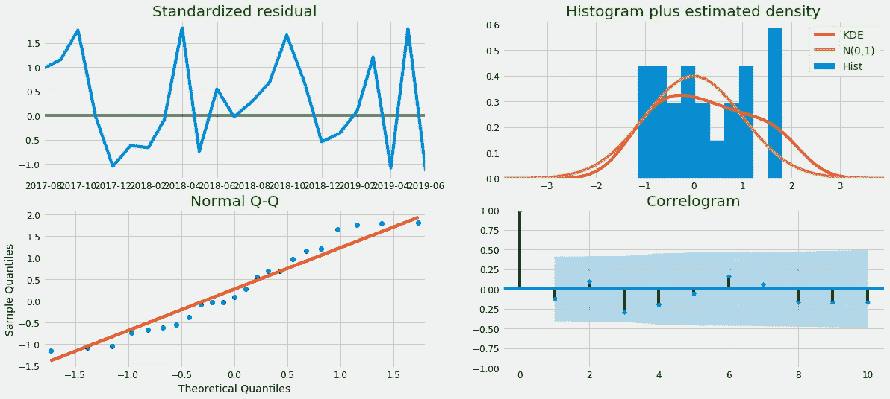
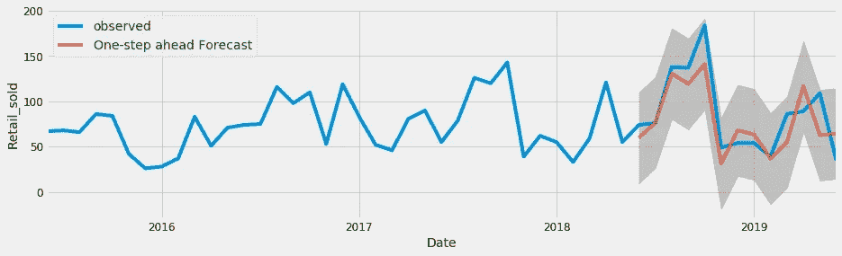
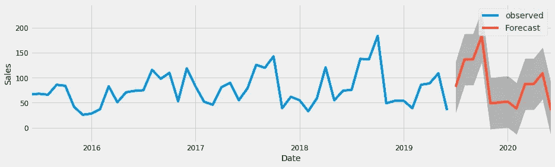
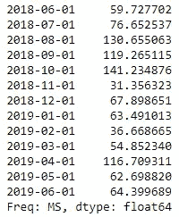
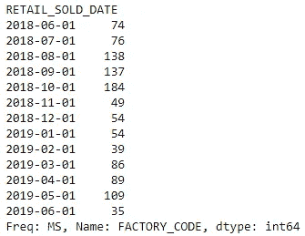
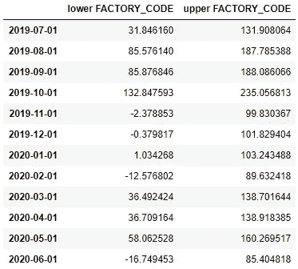
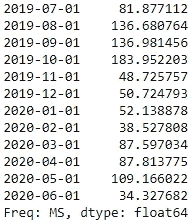

# 如何使用 SARIMA 模型用 Python 预测销售额

> 原文：<https://towardsdatascience.com/how-to-forecast-sales-with-python-using-sarima-model-ba600992fa7d?source=collection_archive---------1----------------------->

## 从统计学和 python 到时间序列预测的分步指南


你想象过预测未来吗？嗯，我们还没有到那一步，但是预测模型(带有一定程度的不确定性)给了我们一个很好的方向，当我们展望未来时，可以更果断地规划我们的业务。在本帖中，我们将展示一种使用 SARIMA 模型预测汽车行业销售时间序列的方法。

# 解释模型

SARIMA 用于非平稳序列，即数据不会围绕相同的均值、方差和协方差波动。这个模型可以识别趋势和季节性，这使得它非常重要。SARIMA 由其他预测模型组成:

**AR:** 自回归模型(可以是简单、多元或非线性回归)

【马:】移动平均线模型。移动平均模型可以使用加权因子，其中观察值由修整因子加权(对于系列中最早的数据),并且最近的观察值具有较高的权重。

AR 和 MA 的组合一起携带 **ARMA** 模型，但该模型仅用于平稳序列(均值、方差随时间恒定)。

如果系列有趋势，就要用 **ARIMA** 型号。
**ARIMA** 用于非平稳系列。在该模型中，微分步骤 I (d)用于消除非平稳性。
用于微分的集成元素“I”允许该方法支持具有趋势的时间序列。但是这个模型仍然不能识别季节性。

最后，我们得到了 **SARIMA** 模型，它具有季节相关性，可以识别时间序列的季节性。现在我们可以去找密码了！

# 数据处理

我们将使用一组汽车销售数据，可以从[这里](https://drive.google.com/drive/folders/1-rqUxJ3I1WyIQ09h5aWwtoJNKxaiMRHU?usp=sharing)下载。

```
import warnings
import itertools
import numpy as np
import matplotlib.pyplot as plt
warnings.filterwarnings("ignore")
plt.style.use('fivethirtyeight')
import pandas as pd
import statsmodels.api as sm
import matplotlib
matplotlib.rcParams['axes.labelsize'] = 14
matplotlib.rcParams['xtick.labelsize'] = 12
matplotlib.rcParams['ytick.labelsize'] = 12
matplotlib.rcParams['text.color'] = 'G'df = pd.read_excel("Retail2.xlsx")
```

这一步只是导入库，比如 numpy、pandas、matplotlib 和 statsmodels，也就是包含 SARIMA 模型和其他统计特性的库。这部分代码用于设置 matplotlib 的图表。

原始数据集和代码有点复杂，但是为了使一切更容易，可供下载的文件只有一个日期和销售列，以避免数据预处理。

```
y = df.set_index(['Date'])
y.head(5)
```

set_index 命令将列 date 设置为索引，head 打印数据集的前 5 行。

```
y.plot(figsize=(19, 4))
plt.show()
```



分析图表，我们可以观察到时间序列有季节性模式。十月是销售的高峰期，至少过去三年是这样。这几年也有上升趋势。

```
from pylab import rcParams
rcParams['figure.figsize'] = 18, 8
decomposition = sm.tsa.seasonal_decompose(y, model='additive')
fig = decomposition.plot()
plt.show()
```



使用 pylab 库中的“sm.tsa.seasonal_decompose”命令，我们可以将时间序列分解为三个不同的部分:趋势、季节性和噪声。

# SARIMA 到时间序列预测

我们用萨里玛吧。型号符号是`SARIMA(p, d, q).(P,D,Q)m`。这三个参数说明了数据中的季节性、趋势和噪声

```
p = d = q = range(0, 2)
pdq = list(itertools.product(p, d, q))
seasonal_pdq = [(x[0], x[1], x[2], 12) for x in list(itertools.product(p, d, q))]
print('Examples of parameter for SARIMA...')
print('SARIMAX: {} x {}'.format(pdq[1], seasonal_pdq[1]))
print('SARIMAX: {} x {}'.format(pdq[1], seasonal_pdq[2]))
print('SARIMAX: {} x {}'.format(pdq[2], seasonal_pdq[3]))
print('SARIMAX: {} x {}'.format(pdq[2], seasonal_pdq[4]))
```

SARIMA…
的参数示例 SARIMAX: (0，0，1) x (0，0，1，12)
SARIMAX: (0，0，1) x (0，1，0，12)
SARIMAX: (0，1，0) x (0，1，1，12)
SARIMAX: (0，1，0) x (1，0，0，12)

```
for param in pdq:
    for param_seasonal in seasonal_pdq:
        try:
            mod = sm.tsa.statespace.SARIMAX(y,order=param,seasonal_order=param_seasonal,enforce_stationarity=False,enforce_invertibility=False)
            results = mod.fit()
            print('ARIMA{}x{}12 - AIC:{}'.format(param,param_seasonal,results.aic))
        except: 
            continue
```

ARIMA(0，0，0)x(0，0，1，12)12—AIC:410.521537786262
ARIMA(0，0，0)x(1，0，0，12)12—AIC:363.03322198787765
ARIMA(0，0，0)x(1，0，1，12)12—AIC:348.1333310565

根据 Peterson，t .(2014)**AIC**(AK aike 信息标准)是对给定数据集的**统计**模型的相对质量的估计。给定一组模型的数据， **AIC** 估计每个模型相对于其他每个模型的质量。`AIC`值越低越好。我们的输出表明，`AIC`值为 223.43 的`SARIMAX(0, 0, 1)x(1, 1, 1, 12)`是最佳组合，因此我们应该认为这是最佳选择。

```
mod = sm.tsa.statespace.SARIMAX(y,
                                order=(0, 0, 1),
                                seasonal_order=(1, 1, 1, 12),
                                enforce_stationarity=False,
                                enforce_invertibility=False)
results = mod.fit()
print(results.summary().tables[1])
```



在“mod = sm.tsa.statespace.SARIMAX”命令中，我们需要设置所选的组合。

```
results.plot_diagnostics(figsize=(18, 8))
plt.show()
```



通过上述诊断，我们可以将重要信息可视化为分布和自相关函数 ACF(相关图)。值向上“0”在时间序列数据上有一些相关性。接近“1”的值表现出最强的相关性。

```
pred = results.get_prediction(start=pd.to_datetime('2018-06-01'), dynamic=False)
pred_ci = pred.conf_int()
ax = y['2015':].plot(label='observed')
pred.predicted_mean.plot(ax=ax, label='One-step ahead Forecast', alpha=.7, figsize=(14, 4))
ax.fill_between(pred_ci.index,
                pred_ci.iloc[:, 0],
                pred_ci.iloc[:, 1], color='k', alpha=.2)
ax.set_xlabel('Date')
ax.set_ylabel('Retail_sold')
plt.legend()
plt.show()
```



该步骤包括将真实值与预测值进行比较。我们的预测与真实值非常吻合。命令“pred = results . get _ prediction(start = PD . to _ datetime(' 2018–06–01 ')”确定您将预测的时间段与真实数据进行比较。

```
y_forecasted = pred.predicted_mean
y_truth = y['2018-06-01':]
mse = ((y_forecasted - y_truth) ** 2).mean()
print('The Mean Squared Error is {}'.format(round(mse, 2)))
print('The Root Mean Squared Error is {}'.format(round(np.sqrt(mse), 2)))
```

均方差为 595.97
均方根误差为 24.41

Obs:在 MSE 和 RMSE 中，值越接近零越好。它们是衡量准确性的标准。

```
pred_uc = results.get_forecast(steps=12)
pred_ci = pred_uc.conf_int()
ax = y.plot(label='observed', figsize=(14, 4))
pred_uc.predicted_mean.plot(ax=ax, label='Forecast')
ax.fill_between(pred_ci.index,
                pred_ci.iloc[:, 0],
                pred_ci.iloc[:, 1], color='k', alpha=.25)
ax.set_xlabel('Date')
ax.set_ylabel('Sales')
plt.legend()
plt.show()
```



在这里，我们预测未来 12 个月的销售额。该参数可以在代码的“pred _ UC = results . get _ forecast(**steps = 12**)”行修改。

```
y_forecasted = pred.predicted_mean
y_forecasted.head(12)
```



这一步显示了我们之前运行的测试的预测值。

```
y_truth.head(12)
```



这一步表明数据集的真值。我们可以比较上面的两个系列来衡量模型的准确性。

```
pred_ci.head(24)
```



在上表中，我们可以看到模型作为预测边界指示的下限值和上限值。

```
forecast = pred_uc.predicted_mean
forecast.head(12)
```



最后，这里我们有未来 12 个月的销售预测！

我们可以注意到销售随着时间的推移而增加。一月和二月是最糟糕的月份，比如最后几年。

这只是一个统计模型的实验。我真的推荐尝试递归神经网络来预测，我的建议是使用更多的数据。但这肯定是另一篇文章的主题。

参考:

[Python 3 中的 ARIMA 时间序列预测指南](https://www.digitalocean.com/community/tutorials/a-guide-to-time-series-forecasting-with-arima-in-python-3)