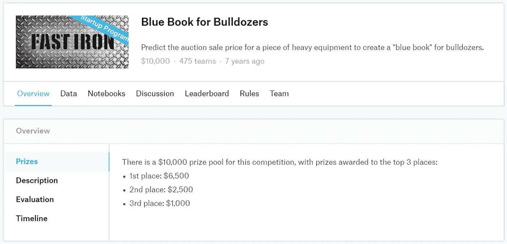
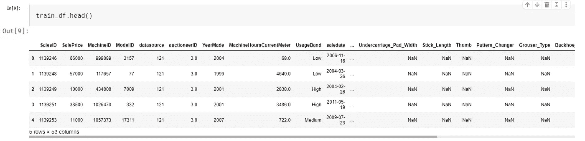
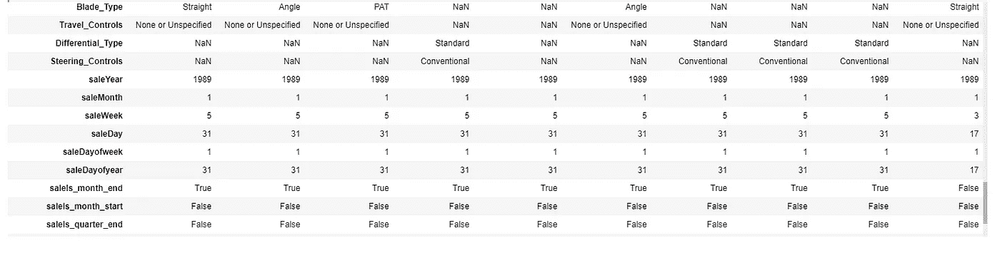
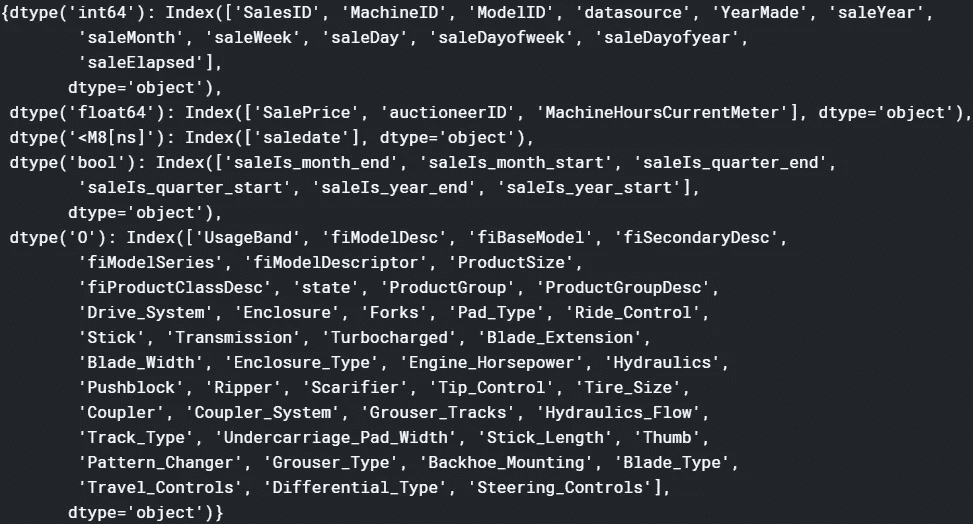
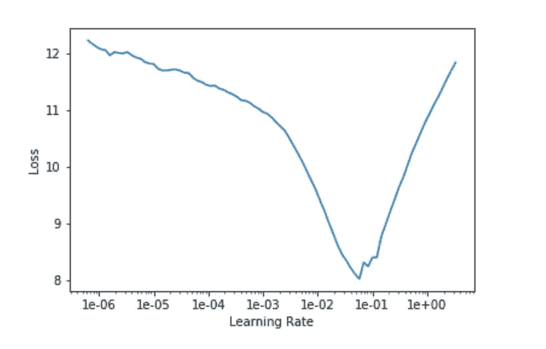
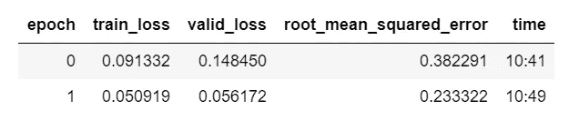
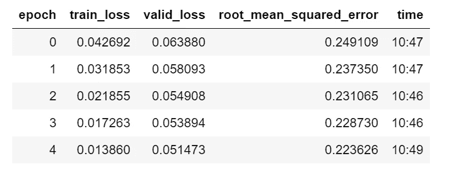
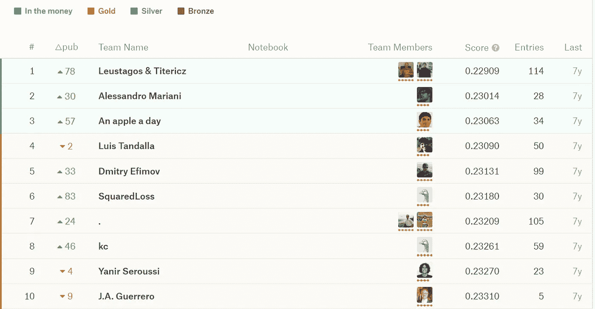
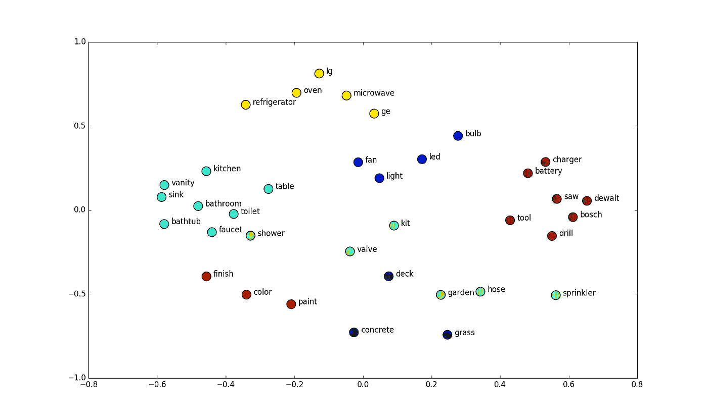

# 如何通过深度学习和嵌入层获得表格数据的最新结果

> 原文：<https://towardsdatascience.com/how-to-gain-state-of-the-art-result-on-tabular-data-with-deep-learning-and-embedding-layers-d1eb6b83c52c?source=collection_archive---------8----------------------->

## 卡格尔蓝皮书推土机竞赛的另一种方法


Embeddings can be use other than word representations

# 动机

T 基于 ree 的模型，如 Random Forest 和 XGBoost，在解决表格(结构化)数据问题中非常流行，并在最近的 Kaggle 竞赛中获得了很多关注。这是有其充分理由的。然而，在本文中，我想介绍一种不同于 fast.ai 的**表格**模块的方法，它利用了:

> **深度学习和嵌入层。**

这有点违背行业共识，即深度学习更多地用于图像、音频或 NLP 等非结构化数据，通常不适合处理表格数据。然而，分类数据的嵌入层的引入改变了这种观点，我们将尝试在[蓝皮书推土机竞赛](https://www.kaggle.com/c/bluebook-for-bulldozers/overview)上使用 [fast.ai](http://fast.ai) 的表格模块，并看看这种方法能走多远。

你可以找到 Kaggle 笔记本📔 [*此处*](https://www.kaggle.com/lymenlee/blue-book-bulldozer-fast-ai-deep-learning) *。*

# 加载数据



首先，让我们导入必要的模块。这里最核心的一个是`**fastai.tabular**`:

```
from fastai import *
from fastai.tabular import *
```

然后我们将数据读入熊猫数据帧。您可以在本文顶部的 Kaggle 笔记本链接中找到具体的代码，但在这里，我将只展示必要的代码片段，以尽可能保持简洁。我们将 CSV 文件读入`train_df`，这将是我们主要工作的数据帧。我们还将在`test_df`中读到测试集。

让我们简单看一下我们正在处理的数据:

```
len(train_df), len(test_df)
(401125, 12457)
```



# 对训练集排序

这是为了创建一个好的验证集。一个好的验证集对于一个成功的模型的重要性怎么强调都不为过。因为我们要预测未来的销售价格数据，所以我们需要建立一个验证集，确保所有数据都在训练集的“未来”收集。因此，我们需要首先对训练集进行排序，然后将“未来”部分拆分为验证集。

```
train_df = train_df.sort_values(by='saledate', ascending=False)
train_df = train_df.reset_index(drop=True)
```

# 数据预处理

比赛的评估方法使用 RMSLE(均方根对数误差)。所以如果我们取预测的对数，我们可以用老 RMSE 作为我们的损失函数。只是这样更容易。

```
train_df.SalePrice = np.log(train_df.SalePrice)
```

对于**特征工程**，由于我们将使用深度学习来解决问题，并且它非常擅长特征提取，所以我们将只在`saledate`进行。这是使用深度学习方法的优势，它需要更少的功能工程和更少的领域知识。我们将使用 fast.ai 的`add_datepart`函数来添加更多与销售日期相关的功能。

```
# The only feature engineering we do is add some meta-data from the sale date column, using 'add_datepart' function in fast.ai
add_datepart(train_df, "saledate", drop=False)
add_datepart(test_df, "saledate", drop=False)
```

`add_datepart`所做的是，它接受`saledate`列，并添加了一堆其他列，如`day of week`、`day of month`，无论是月、季、年的开始还是结束，等等。这些添加的功能将提供对日期的更多洞察，并与用户购买行为相关。例如，在年底，公司通常会开展促销活动，价格通常会降低。

让我们检查是否所有这些与日期相关的特征都被添加到我们的数据框架中:

```
# check and see whether all date related meta data is added.
def display_all(df):
    with pd.option_context("display.max_rows", 1000, "display.max_columns", 1000): 
        display(df)

display_all(train_df.tail(10).T)
```



他们确实被加了进去。很好。现在我们需要做一些数据预处理，因为这个数据帧有相当多的缺失数据，我们还想对列进行分类和规范化。有了 fast.ai 库，这就相当简单了。我们只需在 Python 列表中指定我们想要的预处理方法，就像这样:

```
# Defining pre-processing we want for our fast.ai DataBunch
procs=[FillMissing, Categorify, Normalize]
```

这个变量`procs`稍后将被用于创建用于训练的 fast.ai 数据束。

# 构建模型

L 让我们看看每一列的数据类型，以决定哪些是分类的，哪些是连续的:

```
train_df.dtypes
g = train_df.columns.to_series().groupby(train_df.dtypes).groups
g
```

结果如下:



然后，我们将所有分类列放入一个列表`cat_vars`中，所有连续列放入一个列表`cont_vars`中。这两个变量也将用于构造 fast.ai DataBunch。

```
# prepare categorical and continous data columns for building Tabular DataBunch.
cat_vars = ['SalesID', 'YearMade', 'MachineID', 'ModelID', 'datasource', 'auctioneerID', 'UsageBand', 'fiModelDesc', 'fiBaseModel', 'fiSecondaryDesc', 'fiModelSeries', 'fiModelDescriptor', 'ProductSize', 
            'fiProductClassDesc', 'state', 'ProductGroup', 'ProductGroupDesc', 'Drive_System', 'Enclosure', 'Forks', 'Pad_Type', 'Ride_Control', 'Stick', 'Transmission', 'Turbocharged', 'Blade_Extension', 
            'Blade_Width', 'Enclosure_Type', 'Engine_Horsepower', 'Hydraulics', 'Pushblock', 'Ripper', 'Scarifier', 'Tip_Control', 'Tire_Size', 'Coupler', 'Coupler_System', 'Grouser_Tracks', 'Hydraulics_Flow', 
            'Track_Type', 'Undercarriage_Pad_Width', 'Stick_Length', 'Thumb', 'Pattern_Changer', 'Grouser_Type', 'Backhoe_Mounting', 'Blade_Type', 'Travel_Controls', 'Differential_Type', 'Steering_Controls', 
            'saleYear', 'saleMonth', 'saleWeek', 'saleDay', 'saleDayofweek', 'saleDayofyear', 'saleIs_month_end', 'saleIs_month_start', 'saleIs_quarter_end', 'saleIs_quarter_start', 'saleIs_year_end', 
            'saleIs_year_start'
           ]cont_vars = ['MachineHoursCurrentMeter', 'saleElapsed']
```

我们将创建另一个数据帧`df`来馈入数据集中。我们还将因变量指定为`dep_var`。

```
# rearrange training set before feed into the databunch
dep_var = 'SalePrice'
df = train_df[cat_vars + cont_vars + [dep_var,'saledate']].copy()
```

现在是时候创建我们的验证集了。我们通过从训练集中切掉一块最近的条目来做到这一点。街区应该有多大？嗯，和测试集一样大。让我们看看代码:

```
# Look at the time period of test set, make sure it's more recent
test_df['saledate'].min(), test_df['saledate'].max()# Calculate where we should cut the validation set. We pick the most recent 'n' records in training set where n is the number of entries in test set. 
cut = train_df['saledate'][(train_df['saledate'] == train_df['saledate'][len(test_df)])].index.max()
cut12621# specify the valid_idx variable as the cut out range.
valid_idx = range(cut)
```

我们首先查看测试集的时间段，并确保它比我们所有的训练集更近。然后我们计算需要剪下多少记录。

最后，让我们使用 fast.ai 的 datablock API 构建我们的 DataBunch 进行训练:

```
# Use fast.ai datablock api to put our training data into the DataBunch, getting ready for training
data = (TabularList.from_df(df, path=path, cat_names=cat_vars, cont_names=cont_vars, procs=procs)
                   .split_by_idx(valid_idx)
                   .label_from_df(cols=dep_var, label_cls=FloatList)
                   .databunch())
```

# 构建模型

我们将从刚刚创建的数据集中启动一个 fast.ai `tabular.learner`。我们希望将预测的价格范围限制在历史销售价格范围内，因此我们需要计算`y_range`。请注意，我们将`SalePrice`的最大值乘以 1.2，因此当我们应用 sigmoid 时，上限也将被覆盖。这是从模型中挤出更多性能的一个小技巧。

```
max_y = np.max(train_df['SalePrice'])*1.2
y_range = torch.tensor([0, max_y], device=defaults.device)
y_rangetensor([ 0.0000, 14.2363], device='cuda:0')
```

现在我们可以创建我们的学习者:

```
# Create our tabular learner. The dense layer is 1000 and 500 two layer NN. We used dropout, hai 
learn = tabular_learner(data, layers=[1000,500], ps=[0.001,0.01], emb_drop=0.04, y_range=y_range, metrics=rmse)
```

关于 fast.ai `tabular_learner`最重要的一点是为分类数据使用嵌入层。这是使深度学习在处理表格数据方面具有竞争力的'**秘方**'。由于每个分类变量都有一个嵌入层，我们为分类变量引入了良好的交互，并利用了深度学习的最大优势:自动特征提取。为了更好的正则化，我们还对密集层和嵌入层使用了 Drop Out。学习者的指标是 RMSE，因为我们已经记录了销售价格。我们来看看模型。

```
TabularModel(
  (embeds): ModuleList(
    (0): Embedding(388505, 600)
    (1): Embedding(72, 18)
    (2): Embedding(331868, 600)
    (3): Embedding(5155, 192)
   ...
    (60): Embedding(3, 3)
    (61): Embedding(2, 2)
    (62): Embedding(3, 3)
  )
  (emb_drop): Dropout(p=0.04, inplace=False)
  (bn_cont): BatchNorm1d(2, eps=1e-05, momentum=0.1, affine=True, track_running_stats=True)
  (layers): Sequential(
    (0): Linear(in_features=2102, out_features=1000, bias=True)
    (1): ReLU(inplace=True)
    (2): BatchNorm1d(1000, eps=1e-05, momentum=0.1, affine=True, track_running_stats=True)
    (3): Dropout(p=0.001, inplace=False)
    (4): Linear(in_features=1000, out_features=500, bias=True)
    (5): ReLU(inplace=True)
    (6): BatchNorm1d(500, eps=1e-05, momentum=0.1, affine=True, track_running_stats=True)
    (7): Dropout(p=0.01, inplace=False)
    (8): Linear(in_features=500, out_features=1, bias=True)
  )
)
```

从上面可以看出，我们有分类列的嵌入层，然后是删除层。对于连续列，我们有一个批处理范数层，然后我们将所有这些列(分类嵌入+连续变量)连接在一起，并将其放入两个完全连接的层中，这两个层分别有 1000 和 500 个节点，中间有 Relu、batch norm 和 Dropout。很标准的东西。

现在我们有了模型，让我们使用 fast.ai 的学习率查找器来查找一个好的学习率:

```
learn.lr_find()
learn.recorder.plot()
```



我们将挑选学习率曲线斜率最大的一端的学习率:`le-02`

让我们使用 fast.ai 的单周期训练方法进行一些训练。注意，我们为正则化添加了一些权重衰减(0.2)。

```
learn.fit_one_cycle(2, 1e-2, wd=0.2)
```



我们可以用较小的学习率训练更多的周期:

```
learn.fit_one_cycle(5, 3e-4, wd=0.2)
```



在我们的验证集上，我们已经达到了 0.223**的分数。由于竞赛不接受提交材料，我们只能通过查看排行榜来大致了解该模型的表现:**



排名第一的是 **0.229** 。对比这款车型的 **0.223** 。我们不知道它在测试集上的表现如何，但总的来说，我认为我们得到的结果一点也不差。

# 关于嵌入层的更多内容

W 让一切点击这里的是嵌入层。嵌入只是一个把某物映射到一个向量的花哨说法。就像 NLP 中越来越流行的单词嵌入一样，它意味着使用一个向量(大小是任意的，取决于任务)来表示单词，这些向量是权重，可以通过反向支持来训练。



类似地，对于我们的例子，我们在分类变量上使用了嵌入。每一列都有一个可以训练的嵌入矩阵。每个唯一的列值都有一个映射到它的特定向量。这方面的美妙之处在于:**通过嵌入，我们现在可以开发变量**的“语义”，这种“语义”以权重的形式影响我们的销售价格，可以通过我们的深度神经网络提取和训练。该模型将具有“T2”深度，它需要很好地适应大数据集。

但是不要把我的话当真，还是只看我这个不起眼的小项目的成果吧。在一个更荣耀的例子中，有[这篇论文](https://arxiv.org/abs/1604.06737)，作者是在一个名为 [Rossman](https://www.kaggle.com/c/rossmann-store-sales/overview) (预测未来销售)的 Kaggle 竞赛中获得第三名的人。在排行榜上的顶级团队中，其他人都使用了某种重型功能工程，但通过使用嵌入层，他们以较少的功能工程获得了第三名。

更有趣的是，有了嵌入层，你实际上可以在嵌入矩阵空间中可视化变量投影。以罗斯曼项目为例。他们对德国各州的嵌入矩阵进行了二维投影。

> 如果你在嵌入空间上圈出一些州，在实际地图上圈出相同的州。你会发现它们惊人的相似。嵌入层实际上发现了地理。

觉得这篇文章有用？在 Medium 上关注我([李立伟](https://medium.com/u/72c98619a048?source=post_page-----dbe7106145f5----------------------))或者你可以在 Twitter [@lymenlee](https://twitter.com/lymenlee) 或者我的博客网站[wayofnumbers.com](https://wayofnumbers.com/)上找到我。你也可以看看我下面最受欢迎的文章！

[](/this-is-cs50-a-pleasant-way-to-kick-off-your-data-science-education-d6075a6e761a) [## “这是 CS50”:开始数据科学教育的愉快方式

### 为什么 CS50 特别适合巩固你的软件工程基础

towardsdatascience.com](/this-is-cs50-a-pleasant-way-to-kick-off-your-data-science-education-d6075a6e761a) [](/two-sides-of-the-same-coin-fast-ai-vs-deeplearning-ai-b67e9ec32133) [## 一枚硬币的两面:杰瑞米·霍华德的 fast.ai vs 吴恩达的 deeplearning.ai

### 如何不通过同时参加 fast.ai 和 deeplearning.ai 课程来“过度适应”你的人工智能学习

towardsdatascience.com](/two-sides-of-the-same-coin-fast-ai-vs-deeplearning-ai-b67e9ec32133) [](/what-you-need-to-know-about-netflixs-jupyter-killer-polynote-dbe7106145f5) [## 你需要了解网飞的“朱庇特黑仔”:冰穴📖

### 是时候让 Jupyter 笔记本有个有价值的竞争对手了

towardsdatascience.com](/what-you-need-to-know-about-netflixs-jupyter-killer-polynote-dbe7106145f5)