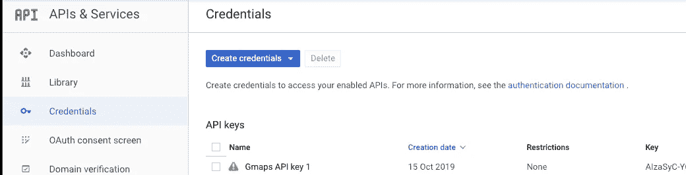
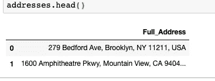
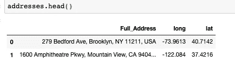
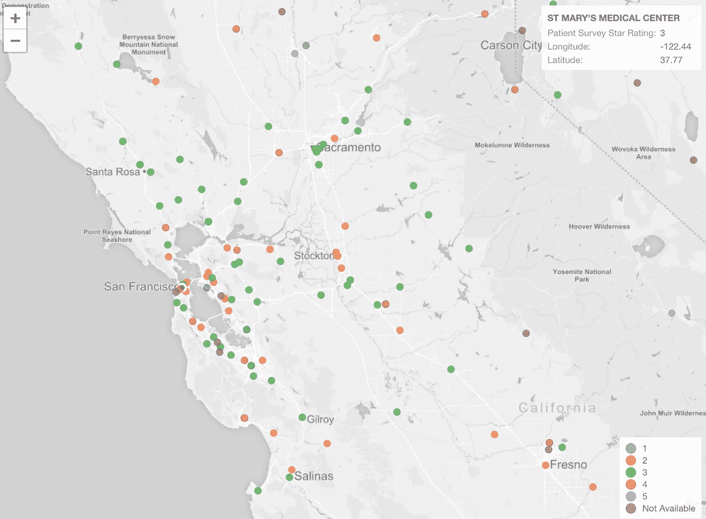

# 如何使用 Pandas 和 Googlemaps API 从地址栏生成经度和纬度坐标

> 原文：<https://towardsdatascience.com/how-to-generate-lat-and-long-coordinates-from-an-address-column-using-pandas-and-googlemaps-api-d66b2720248d?source=collection_archive---------4----------------------->


Photo by [Paula May](https://unsplash.com/@paulamayphotography?utm_source=medium&utm_medium=referral) on [Unsplash](https://unsplash.com?utm_source=medium&utm_medium=referral)

如果您想使用地址数据中的地理坐标绘制地图，Google 提供了一个名为 Geocoding 的 API，允许您将地址转换为地理坐标，反之亦然。

# 什么是地理编码？

**地理编码**是将地址(如“1600 amphetica Parkway，Mountain View，CA”)转换为地理坐标(如纬度 37.423021 和经度-122.083739)的过程，您可以使用地理坐标在地图上放置标记，或定位地图。如果你想深入了解，请点击这里阅读更多[。](https://developers.google.com/maps/documentation/geocoding/intro)

## **谷歌云地理编码 API 定价**:

Google 为这个 API 提供每月 200 美元的免费积分(基于您拥有的帐户类型)，所以请确保您了解自己运行这个 API 可能会产生的成本。

*   [定价详情 1](https://developers.google.com/maps/billing/gmp-billing?_ga=2.240776579.-1811664684.1567421291&_gac=1.220397996.1571643267.EAIaIQobChMIyKSVsuus5QIVEOJ3Ch2hoQDUEAAYASAAEgJY7_D_BwE#geocoding)
*   [定价详情 2](https://cloud.google.com/maps-platform/pricing/sheet/)

# 我们开始吧

我使用 Jupyter notebook 来运行本教程中的脚本。

首先，您需要导入 [GoogleMaps](https://pypi.org/project/googlemaps/) 和 [Pandas](https://pypi.org/project/pandas/) 包。如果您还没有安装，请确保已经使用 [pip](https://pip.pypa.io/en/stable/installing/) 将这些软件包安装到您的环境中。

```
from googlemaps import Client as GoogleMaps
import pandas as pd 
```

# 创建您的 API 密钥

现在，您需要在 Google Cloud Platform 帐户的凭证部分创建一个 API 密匙。这很简单。

*   在你的控制台搜索栏中输入 ***API &服务*** 。
*   点击 ***启用 API 和服务***
*   搜索 ***地理编码 API*** 并确保其已启用
*   现在点击 ***凭证*** > ***创建凭证*** 并创建一个新的 API 密钥

在 Python 中创建新的 GoogleMaps 对象时，您将使用这个 API 键。



现在回到 Jupyter notebook，使用刚刚生成的 API 键创建一个 GoogleMaps 对象。

```
gmaps = GoogleMaps('YOUR_API_KEY')
```

下一步是导入 csv 文件，该文件包含一列您想要转换的完整地址。

```
addresses = pd.read_csv("YOUR_CSV_FILE.csv")
addresses.head()
```



添加两个空列来保存经度和纬度数据。

```
addresses['long'] = ""
addresses['lat'] = ""
```

# 地理编码响应

运行***Google maps . geocode***命令返回一个 JSON 对象，看起来像 [this](https://developers.google.com/maps/documentation/geocoding/intro#GeocodingResponses) 。如果需要，您还可以利用更多的属性。然而，如前所述，我们将只关注经度和纬度地理坐标，它在 JSON 响应中有一个“geometry”和“location”的*键。
*-几何形状>位置>横向
-几何形状>位置> lng**

# 生成经度和纬度坐标

现在是时候遍历数据帧，为每个地址记录插入“lng”和“lat”。

```
for x in range(len(addresses)):
    try:
        time.sleep(1) #to add delay in case of large DFs
        geocode_result = gmaps.geocode(addresses['FullAddress'][x])
        addresses['lat'][x] = geocode_result[0]['geometry']['location'] ['lat']
        addresses['long'][x] = geocode_result[0]['geometry']['location']['lng']
    except IndexError:
        print("Address was wrong...")
    except Exception as e:
        print("Unexpected error occurred.", e )addresses.head()
```



有了生成的坐标，您可以像这样绘制地图视图。



source: [https://blog.exploratory.io/geocoding-us-zip-code-data-with-dplyr-and-zipcode-package-7f539c3702b0](https://blog.exploratory.io/geocoding-us-zip-code-data-with-dplyr-and-zipcode-package-7f539c3702b0)

最后，如果需要，将您的结果导出到 csv。

```
addresses.to_csv('address_coords.csv')
```

就是这样！希望这对你有帮助。如果你有任何问题或建议，请告诉我。

> 你可以[成为中等会员](https://medium.com/@tobisam/membership)享受更多这样的故事。