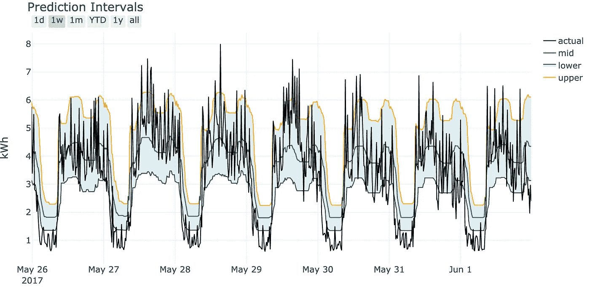

# 如何使用 Scikit-Learn 和 Python 生成预测区间

> 原文：<https://towardsdatascience.com/how-to-generate-prediction-intervals-with-scikit-learn-and-python-ab3899f992ed?source=collection_archive---------0----------------------->


[(Source)](https://www.pexels.com/photo/adventure-clouds-daylight-fog-551876/)

## 使用梯度推进回归器显示机器学习估计中的不确定性

“所有的模型都是错误的，但有些是有用的”——乔治·博克斯。当我们提出机器学习预测时，记住这个明智的建议至关重要。所有的机器学习管道都有局限性:影响目标的特征不在数据中[(潜在变量)](https://en.wikipedia.org/wiki/Latent_variable)，或者模型做出的假设与现实不符。当我们显示一个预测的精确数字时，这些都被忽略了——房子将是 450，300.01 美元——这给人的印象是我们完全相信我们的模型是真实的。

显示模型预测的一种更诚实的方式是估计范围:可能有一个最可能的值，但也有一个真实值可能存在的较大区间。这不是数据科学课程中通常涉及的主题，但我们在预测中展示不确定性，并且不要过度吹嘘机器学习的能力，这一点至关重要。虽然人们渴望确定性，但我认为展示一个包含真实值的宽预测区间比一个远离现实的精确估计要好。

在本文中，我们将介绍一种在 Scikit-Learn 中产生不确定性区间的方法。完整的代码可以在 GitHub 的[上找到，在 nbviewer 上有一个互动版的](https://github.com/WillKoehrsen/Data-Analysis/tree/master/prediction-intervals) [Jupyter 笔记本。](https://nbviewer.jupyter.org/github/WillKoehrsen/Data-Analysis/blob/master/prediction-intervals/prediction_intervals.ipynb)我们将主要关注*的实现*，在最后有一个简短的部分和理解*理论*的资源。生成预测区间是数据科学工具箱中的另一个工具，对于赢得非数据科学家的信任至关重要。


Prediction intervals we’ll make in this walkthough.

## 问题设置

在这次演练中，我们将使用在 [DrivenData](https://drivendata.org) 上举办的机器学习竞赛中的真实建筑能源数据。你可以在这里获得原始数据[，但是我已经在 GitHub](https://www.drivendata.org/competitions/51/electricity-prediction-machine-learning/) 中提供了一个[清理过的版本，它具有以 15 分钟为间隔测量的能量和八个特征。](https://github.com/WillKoehrsen/Data-Analysis/tree/master/prediction-intervals/data)

```
data.head()
```


Cleaned building energy data

目标是从特征中预测能量消耗。(这是我们在 [Cortex Building Intel 每天都要做的实际工作！)](http://get.cortexintel.com)。毫无疑问，我们的数据中存在未捕捉到的影响能源消耗的隐藏特征(潜在变量),因此，我们希望通过预测能源使用的上限和下限*来显示我们估计中的不确定性。*

```
# Use plotly + cufflinks for interactive plotting
import cufflinks as cfdata.resample('12 H').mean().iplot()
```


Building energy data from DrivenData (hosting machine learning competitions for good!)

## 履行

为了在 Scikit-Learn 中生成预测区间，我们将使用[梯度推进回归器](https://scikit-learn.org/stable/modules/generated/sklearn.ensemble.GradientBoostingRegressor.html#sklearn.ensemble.GradientBoostingRegressor)，从文档中的[这个示例](https://scikit-learn.org/stable/auto_examples/ensemble/plot_gradient_boosting_quantile.html)开始工作。基本想法很简单:

1.  对于较低的预测，使用`GradientBoostingRegressor(loss=
    "quantile", alpha=lower_quantile)`和代表下限的`lower_quantile`，比如 0.1 代表第 10 个百分位数
2.  对于上限预测，使用带有代表上限的`upper_quantile`的`GradientBoostingRegressor(loss=
    "quantile", alpha=upper_quantile)`，比如 0.9 代表第 90 百分位
3.  对于中间预测，使用预测中间值的`GradientBoostingRegressor(loss="quantile", alpha=0.5)`，或预测平均值的默认`loss="ls"`(对于[最小二乘法)。文档中的例子使用了后一种方法，我们也将这样做。](https://en.wikipedia.org/wiki/Least_squares)

在高层次上，损失是由模型优化的函数。当我们将损失改变为分位数并选择α(分位数)时，我们能够得到对应于百分位数的预测。如果我们使用较低和较高的分位数，我们可以产生一个估计范围。(我们不会在这里讨论分位数损失的细节——参见下面分位数损失的背景。)

在将数据分成训练集和测试集之后，我们构建模型。我们实际上必须使用 3 个独立的梯度推进回归器，因为每个模型都在优化不同的函数，并且必须单独训练。

```
from sklearn.ensemble import GradientBoostingRegressor# Set lower and upper quantile
LOWER_ALPHA = 0.1
UPPER_ALPHA = 0.9# Each model has to be separate
lower_model = GradientBoostingRegressor(loss="quantile",                   
                                        alpha=LOWER_ALPHA)
# The mid model will use the default loss
mid_model = GradientBoostingRegressor(loss="ls")upper_model = GradientBoostingRegressor(loss="quantile",
                                        alpha=UPPER_ALPHA)
```

训练和预测使用熟悉的 Scikit-Learn 语法:

```
# Fit models
lower_model.fit(X_train, y_train)
mid_model.fit(X_train, y_train)
upper_model.fit(X_train, y_train)# Record actual values on test set
predictions = pd.DataFrame(y_test)# Predict
predictions['lower'] = lower_model.predict(X_test)
predictions['mid'] = mid_model.predict(X_test)
predictions['upper'] = upper_model.predict(X_test)
```

就这样，我们有了预测区间！


Prediction intervals from three Gradient Boosting models



Prediction intervals visualized

用一点点 plotly 的[，我们可以生成一个很好的交互剧情。](https://plot.ly/python/)


Interactive plot produced with plotly

## 计算预测误差

与任何机器学习模型一样，我们希望在测试集(我们有实际答案的地方)上量化我们预测的误差。测量预测区间的误差比点预测稍微复杂一点。我们可以计算实际值在该范围内的时间百分比，但这可以通过使间隔非常宽来容易地优化。因此，我们还需要一个考虑到预测值与实际值有多远的度量，比如绝对误差。

在笔记本中，我提供了一个函数来计算下、中和上预测的绝对误差，然后对“区间”绝对误差的上下误差进行平均。我们可以对每个数据点都这样做，然后绘制误差的箱线图(边界内的百分比在标题中):


有趣的是，对于这个模型，较低预测的中值绝对误差实际上小于中间预测。这个模型没有很高的精度，可能会受益于优化(调整模型超参数)。实际值有一半以上的时间处于下限和上限之间，我们可以通过降低下分位数和提高上分位数来提高这个指标的精度。

可能有更好的指标，但我选择了这些，因为它们计算简单，易于解释。您使用的实际指标应该取决于您试图解决的问题和您的目标。

## 预测区间模型

用 3 个独立的模型进行拟合和预测有些繁琐，因此我们可以编写一个模型，将梯度推进回归量包装到一个类中。它源自 Scikit-Learn 模型，因此我们使用相同的语法进行训练/预测，只是现在它在一个调用中:

```
# Instantiate the class
model = GradientBoostingPredictionIntervals(
    lower_alpha=0.1, upper_alpha=0.9
)# Fit and make predictions
_ = model.fit(X_train, y_train)
predictions = model.predict(X_test, y_test)
```

该模型还带有一些绘图工具:

```
fig = model.plot_intervals(mid=True, start='2017-05-26', 
                           stop='2017-06-01')
iplot(fig)
```


请按照您认为合适的方式使用和调整模型！这只是进行不确定性预测的一种方法，但我认为它很有用，因为它使用了 Scikit-Learn 语法(意味着一条浅的学习曲线)，我们可以根据需要对它进行扩展。一般来说，这是解决数据科学问题的好方法:从简单的解决方案开始，只在需要时增加复杂性！

## 背景:分位数损失和梯度推进回归变量

梯度推进回归器是一个集合模型，由单独的决策树/回归树组成。(模型的原解释见[弗里德曼 1999 年的论文《贪婪函数逼近:一种梯度助推机》](https://statweb.stanford.edu/~jhf/ftp/trebst.pdf)。)与并行训练树的随机森林相反，梯度增强机器顺序训练树，每棵树从当前集合的错误(残差)中学习。树对模型的贡献是通过最小化模型预测和训练集中实际目标的损失函数来确定的。


Each iteration of the gradient boosting machine trains a new decision/regression tree on the residuals [(source)](https://www.google.com/url?sa=i&source=images&cd=&cad=rja&uact=8&ved=2ahUKEwji_obJmIziAhVhT98KHUEDAbYQjhx6BAgBEAM&url=https%3A%2F%2Fmedium.com%2Fmlreview%2Fgradient-boosting-from-scratch-1e317ae4587d&psig=AOvVaw1gY1KBEhTRQtlp8NI7oSOa&ust=1557413755162687)

使用默认损失函数-最小二乘法-梯度推进回归器预测平均值。理解的关键点是最小平方损失*同等地惩罚低误差和高误差*:


Least squares loss versus error

相反，[分位数损失](https://heartbeat.fritz.ai/5-regression-loss-functions-all-machine-learners-should-know-4fb140e9d4b0)基于分位数以及误差是正(实际>预测)还是负(实际<预测)来惩罚误差。这允许梯度推进模型不是针对平均值而是针对百分位数进行优化。分位数损失为:


其中 **α** 是分位数。让我们快速地看一个例子，实际值为 10，分位数为 0.1 和 0.9:

1.  如果 **α** = 0.1，预测值= 15，那么损失=(0.1–1)*(10–15)= 4.5
2.  如果 **α** = 0.1，预测值= 5，那么损失= 0.1 *(10–5)= 0.5
3.  如果 **α** = 0.9，预测= 15，那么损耗=(0.9–1)*(10–15)= 0.5
4.  如果 **α** = 0.9，预测值= 5，那么损失= 0.9 *(10–5)= 4.5

对于分位数< 0.5, if the prediction is greater than the actual value (case 1), the loss is greater than for a prediction an equal distance above the actual value. For a quantile > 0.5，如果预测小于实际值(情况 4)，则损失大于低于实际值相等距离的预测。如果分位数== 0.5，那么高于和低于实际值的预测会产生相等的误差，并且*模型会针对中值进行优化。*

(对于 mid 模型，我们可以使用`loss="quantile", alpha=0.5`表示中值，或者使用`loss="ls"`表示平均值)。

分位数损失最好用损失与误差的关系图来说明:


Quantile loss versus error for different quantiles

分位数< 0.5 drive the predictions below the median and quantiles > 0.5 驱动预测高于中位数。这是一个很好的提醒，机器学习方法的*损失函数决定了你要优化什么！*

根据我们想要的输出，我们可以优化平均值(最小平方)、中值(alpha == 0.5 的分位数损失)或任何百分位数(alpha ==百分位数/ 100 的分位数损失)。这是分位数损失的一个相对简单的解释，但它足以让您开始通过模型演练生成预测间隔。为了更进一步，查看这篇文章或者从维基百科页面[开始](https://en.wikipedia.org/wiki/Quantile_regression)并查看源代码。

# 结论

从机器学习模型预测单个数字会给人一种错觉，即我们对整个建模过程有很高的信心。然而，当我们记住任何模型都只是一个近似值时，我们看到了在进行估计时需要用*来表示不确定性。*一种方法是使用 Scikit-Learn 中的梯度推进回归器生成预测区间。这只是预测范围的一种方法(例如，参见[线性回归的置信区间](https://stats.stackexchange.com/questions/85560/shape-of-confidence-interval-for-predicted-values-in-linear-regression))，但它相对简单，可以根据需要进行调整。在本文中，我们看到了一个完整的实现，并了解了分位数损失函数背后的一些理论。

解决数据科学问题就是在你的工具箱中有许多工具可以根据需要应用。生成预测间隔是一项有用的技术，我鼓励您阅读本演练并将其应用于您的问题。(学习任何技术的最好方法是通过实践！)我们知道机器学习可以做一些非常不可思议的事情，但它并不完美，我们不应该这样描述它。为了获得决策者的信任，我们通常需要给出的不是一个单一的数字作为我们的估计，而是一个预测范围，表明所有模型中固有的不确定性。


我写数据科学，偶尔也写一些其他有趣的话题。你可以在 twitter 上关注我[以获得有用的技术和工具。如果拯救世界同时帮助底线对你有吸引力，那么请联系我们](http://twitter.com/@koehrsen_will) [Cortex。](http://get.cortexintel.com)