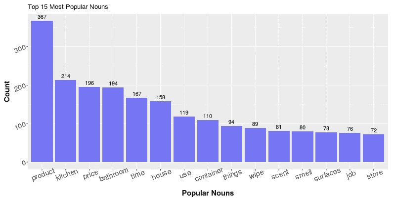

# 如何在没有神经网络的情况下为评论文本生成“摘要”

> 原文：<https://towardsdatascience.com/how-to-generate-summaries-for-review-text-without-neural-networks-568f14dbe835?source=collection_archive---------22----------------------->

## 获取带有相关术语的可解释关键词，以理解消费者评论

作为一名在 Clorox 消费品行业工作的数据科学家，我的“日常挑战”之一是从大量关于特定产品的用户评论中快速而简洁地提取有用的信息。从表面上看，这个任务需要对大量文本进行某种形式的摘要。说到生成文本摘要，我们通常会想到复杂的深度学习相关模型和解决方案——序列到序列模型、编码器-解码器 RNNs、注意力机制等。然而，尽管这些深度学习模型需要花费巨大的努力来训练，但它们的性能对于特定的任务来说并不总是令人满意的。更重要的是，如果我们的目标是从文本内容中提取有见地的信息，有时我们实际上并不需要文本的语言摘要。在这篇博客中，我想介绍一种方法，它可以通过基于频率的计数从评论文本中生成“摘要”。

举个例子，我将使用亚马逊的公共用户评论的子集来评价家用清洁产品之一的 Clorox 湿巾。[此链接](https://www.amazon.com/Clorox-Disinfecting-Wipes-Bleach-Cleaning/product-reviews/B00IA6IBP2/ref=cm_cr_dp_d_show_all_top?ie=UTF8&reviewerType=all_reviews)将带您进入评论页面。下面是我从这些评论中总结出来的“总结”。

它是这样工作的:

## **词性标注**

第一步是用词性来标记评论文本中的每个标记。当我们考虑用户对某个产品的评论以及文本的词性成分时，提供最有洞察力的信息的术语或标记很可能是名词或形容词就不足为奇了。名词有助于解释“是什么”的问题(消费者谈论的产品是什么，主题是什么。它可以是包装、送货、气味等)，而形容词有助于“关于什么”的问题。(包装呢；交付呢；气味呢)。标记后，我们将提取前 15 个最流行的名词和前 15 个最流行的形容词。

**相关术语搜索**

现在我们有了名词和形容词的频率，下一步将是找到它们之间的关系。

具体来说，对于一个流行名词，如何才能知道最靠前的相关形容词？同样对于一个形容词，怎么才能知道最上面的相关名词呢？了解相关术语可能有助于我们加深从文本中获得的信息，但这项任务本身并不像看起来那么简单。

以“价格”这个术语为例。它在上面的图中显示为第三个流行名词，现在我想通过查看我们的消费者使用的最相关的形容词来了解价格。那么我们就有一个问题——如何定义相关？更具体地说，如何构造一个搜索算法来找到并显示最相关的形容词？

让我用下面的评论作为例子来帮助说明我的方法:

在这种情况下，我们将术语“价格”称为**目标术语**，因为我们想要获得关于“价格”的信息。在特定的审查中，我们对目标术语的每次出现重复以下步骤。

1.确定目标术语的位置(以黄色突出显示)

2.查找与目标术语具有相同 POS 标签的最近术语。称它们为“边界条件”(用蓝色突出显示)。在这种情况下，由于“价格”是一个名词，边界项将是最接近的名词。

3.找出边界术语中的所有形容词，并将它们保存到列表中

然后，我们重复上述相同的过程，将“价格”作为所有评论的目标术语。最终，我们会有一个与价格这个术语潜在“相关”的形容词列表。通过这种方式，我能够得到如下的前 15 个相关形容词:

像“好”和“伟大”这样的术语非常流行。这实际上是真的，因为我们可以在亚马逊上找到很多评论，上面写着“价格合理”和“价格优惠”最后，我们对所有提到最多的名词和形容词重复整个相关术语搜索过程，我们最终将得到我在开始时提供的汇总表。

这不是一个复杂的方法，但它非常有效且易于使用。它就像构建单词云一样简单，但也提供了更多的见解和更好的解释。要阅读更多关于这种技术的内容，它是如何实现的，有哪些缺点，这里是我为它写的原始博客的[链接](https://alaughinghorse.github.io/improve_text_viz/)。

[在这里](https://github.com/ALaughingHorse/improve_text_viz/blob/master/code/review_analyzer.py)你可以找到我上面提到的方法的代码。下面是如何使用它:

我希望这个博客对你有所帮助，我希望听到你的反馈

感谢您通读！