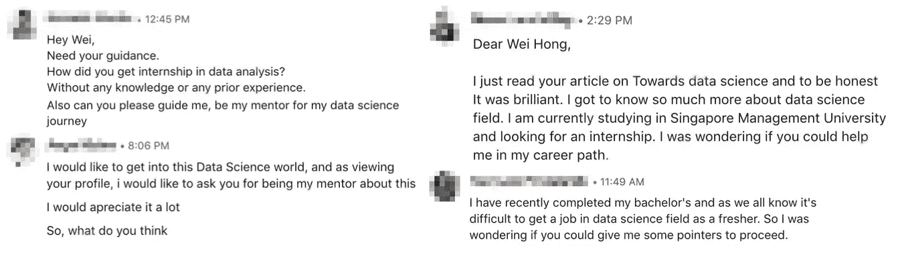

# 如何获得数据科学实习机会——技术专长与个性

> 原文：<https://towardsdatascience.com/how-to-get-a-data-science-internship-technical-expertise-vs-personality-c68d3a117eaa?source=collection_archive---------12----------------------->

## 对于每个数据科学爱好者来说

> 任何领域的专家都曾是初学者——海伦·海丝

之前我还是一个还在读大学的学生的时候，就想去搞一个数据科学的实习。我太想得到它了，所以我申请了这么多公司，但只得到他们的几个回复。

更具体地说，只有不到 10%的公司回复了我的申请。不仅如此，当我看到实习职位的描述时，要求是具有很强的技术技能，优秀的成绩，深入的机器学习知识等。

我迷路了。我既没有很强的技术背景，也没有数据科学实习的经验。我只是在寻找我的第一份数据科学实习。

以下是我从 LinkedIn 收到的一些关于如何获得数据科学实习的问题。

我知道努力工作却没有得到想要的东西是什么感觉。

但如果我告诉你，经验或技术背景对获得数据科学实习可能并不那么重要，你会感兴趣吗？

在本文中，我将分享如何获得第一份数据科学实习。

现在，让我们问自己下面的问题。

> 为什么需要获得数据科学实习？

然后，从招聘经理的角度出发。

> 为什么需要雇佣实习生？

问完这两个问题，你是否找到了你和你的招聘经理都在寻找的共同答案？

第一个问题的答案之一是学习数据科学，了解数据科学家应该具备哪些技能，以便您可以学习。然而，你能拿出什么样的资格、技能等让招聘经理雇佣你呢？

现在，让我们描绘两个场景。

# 第一种情况

想象一下，招聘经理正在寻找实习生，他们可以帮助完成一些数据标注任务，还可以评估各种机器学习模型。也就是说他或她不是在寻找一个有很强技术背景的人。

她可能只是想找一个愿意从事一些与机器学习无关的任务的人。换句话说，招聘经理正在寻找一个拥有她所寻找的个性的人。

例如，给定一个数据标记任务，您可能认为这是一个非常手工的过程。当你的导师在你的数据集上训练模型，发现你标注的大部分标签都是不正确的时候，她会觉得自己浪费了时间去信任你的工作。

但是如果她想找一个很有个性的人一起工作呢？一旦她对交给你的任务感到满意，我相信她会愿意教你你感兴趣的东西。

# 第二种情况

假设招聘经理正在寻找一个人来帮助她解决她面临的一些最困难的问题。换句话说，她想引进一个有很强技术能力和机器学习知识的人。

在这种情况下，她要求的候选人必须有能力阅读研究论文，提出解决问题的好主意，清理代码，使当前的代码更有效等等。

因此，招聘经理会对候选人有更高的期望。简而言之，候选人应该具备很强的技术能力。

# 个性与技术专长

现在，我想你对招聘经理的期望有了更清晰的了解。因此，让我来分享你应该如何准备自己，以便获得你的第一个数据科学实习机会！

如果你是一个没有很强技术背景的人，这里有一些我的建议。首先，你应该在面试中表现出良好的个性。什么被认为是好的性格？例如，努力工作，愿意学习，对机器学习充满热情，独立等等。

从招聘经理的角度来看，如果你没有技术背景，但**只要你愿意学习并努力工作，大多数时候，他或她会愿意给你一个机会**。前提是你申请的不是需要很强技术背景的实习。

此外，**不要对公司或工作范围**挑剔。如果你得到了数据科学实习，也许你的大部分时间将花在手工任务上。然而，如果你设法更快地完成任务，并且你表现出你的技术技能在短时间内确实提高了很多，你的经理会给你机会尝试训练一些模型。另一方面，别忘了这次实习会给你以后带来更多的实习机会。

而且，**有一个很棒的项目来论证**也很重要。我这里说的不是学校的项目，而是有趣的现实世界的项目。如果你有兴趣知道展示哪种项目，请在下面评论！

你可以请你的同学或朋友来帮助你。将您的代码发布到 GitHub 并不是故事的结尾。你应该**找一个对数据科学一无所知的人，你以一种他或她知道你在说什么的方式向你的朋友介绍这个项目**。

另一方面，**花一些时间在社交活动上**。如果你能给他们留下很好的第一印象，你就有很大的机会获得面试机会。

如果你确实有技术专长，但仍然找不到实习机会，这里有一些你可以注意的方法。如果你的目标是那些顶级公司，**练习你的编程技能**。

有很多网站可以参考，比如 [Leetcode](https://leetcode.com/) 、 [Topcoder](https://www.topcoder.com/) 、 [Coderbyte](https://coderbyte.com/) 等。**如果你是懒人类型的人，问问你的学长，朋友，甚至去查一下** [**glassdoor**](https://www.glassdoor.sg/) 看看有没有人分享面试的问题。你会感到震惊，有时你甚至可以在那里找到面试问题的答案。

此外，**练习，练习，练习你的演讲**。不要让你的演示搞砸了你的大项目。我怎么强调这一点都不为过，因为我看到太多的实习生在实际面试中因为他们的陈述而搞砸了。他们可能有有趣的项目要展示，但在他们完成演示后，我仍然不明白他们想展示什么。请记住，数据科学不仅仅是编码，还包括清楚地展示你的发现。

如果你知道你总是无法回答与机器学习知识相关的问题，那么**花时间复习你的知识**。

不仅如此，**展示有趣的项目**。记得**清理你的代码并插入整洁的注释**。此外，一定要注意你的简历。有一次我面试一个实习生，他或她的简历中显示的作品集链接无法访问。

**性格还是很重要的**在这种情况下。展示出你很有个性，这样你潜在的老板就会接受你。

# 最后的想法

获得数据科学实习没有完美的公式，但有一些方法可以让你得到它！

> 你会得到你为之工作的东西，而不是你希望得到的东西——丹尼尔·米尔斯坦

非常感谢你一直读到最后。如有疑问，欢迎在下方评论！

相信我，如果你听从我的建议，你会得到一个！

祝你顺利获得第一份数据科学实习，并祝你早日圣诞快乐！🎄

# 关于作者

[低魏宏](https://www.linkedin.com/in/lowweihong/?source=post_page---------------------------)是 Shopee 的数据科学家。他的经验更多地涉及抓取网站，创建数据管道，以及实施机器学习模型来解决业务问题。

他提供爬行服务，可以为你提供你需要的准确和干净的数据。你可以访问 [**这个网站**](https://www.thedataknight.com/) 查看他的作品集，也可以联系他获得**的抓取服务**。

你可以在 [LinkedIn](https://www.linkedin.com/in/lowweihong/?source=post_page---------------------------) 和 [Medium](https://medium.com/@lowweihong?source=post_page---------------------------) 上和他联系。

 [## ●伟鸿-中等

### 在媒体上阅读低纬鸿的作品。数据科学家|网络抓取服务:https://www.thedataknight.com/.每…

medium.com](https://medium.com/@lowweihong?source=post_page-----6bef8cb1477a----------------------) 

# 你可能喜欢的故事

 [## 如何学习机器学习

### 由数据科学家分享

towardsdatascience.com](/how-you-can-learn-machine-learning-5991dee49362)  [## 进入数据科学领域之前你应该知道的 5 件事

### 数据科学家日常生活的幕后

towardsdatascience.com](/5-things-you-should-know-before-getting-into-data-science-f4312f06ea73)