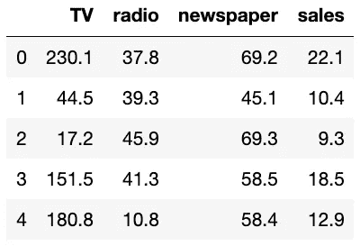
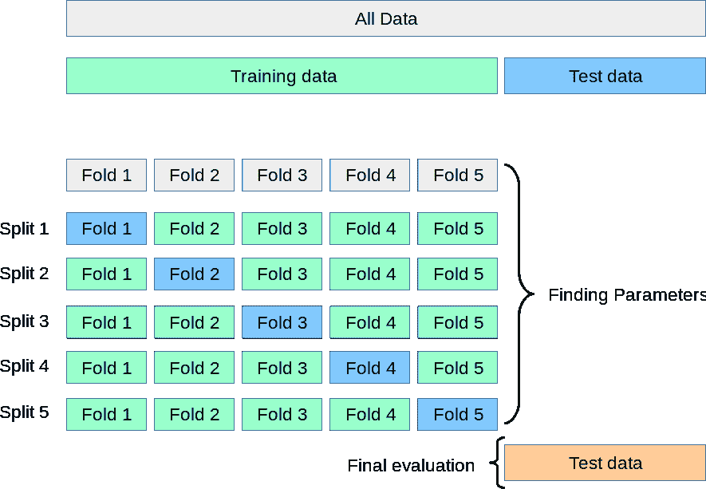

# 如何更全面地了解模型的准确性

> 原文：<https://towardsdatascience.com/how-to-get-a-fuller-picture-of-a-models-accuracy-e3e6f45becb2?source=collection_archive---------21----------------------->

## 交叉验证的案例以及如何实现一个版本(k-fold)

使用单个训练测试分割给你一个机器学习模型或算法的性能的单个快照。这就像根据一场比赛来评价一支足球队(美国队或其他球队)。如果你真的想知道一个团队总体表现如何，你需要的不仅仅是这张快照。同样，我们不应该在一次随机分割中评估我们的算法。幸运的是，有更好的方法。我给你带来 k 倍交叉验证。

# 当火车测试分裂使你误入歧途

今天，我使用的是 Gareth James 的经典广告数据集，其中有 200 条电视、广播和报纸广告支出的记录以及相应的销售数据。



我创建了一个线性回归模型来预测基于 TV*Radio 的销售，并在测试数据集上进行验证:

```
from sklearn.linear_model import LinearRegression
from sklearn.model_selection import train_test_split
import pandas as pd
import numpy as npdf = pd.read_csv(‘data/advertising.csv’) # import data
df[‘TVxradio’] = df[‘TV’] * df[‘radio’] # create featurex = np.array(df[‘TVxradio’]).reshape(-1, 1)
y = np.array(df[‘sales’])x_train, x_test, y_train, y_test = train_test_split(
     x1, y1, test_size=0.3, random_state=54546)model = LinearRegression()
model.fit(x_train, y_train)
print(f’model accuracy on test set: {model.score(x_test, y_test)}’)
```

结果:

```
model accuracy on test set: 0.9721866564067523
```

厉害！！模特太棒了！


[Kevin Jarrett](https://www.flickr.com/photos/kjarrett/7818669582) CC 2.0

或者是？


Image by [htuuli](https://pixabay.com/users/htuuli-2596972/?utm_source=link-attribution&utm_medium=referral&utm_campaign=image&utm_content=2878336) from [Pixabay](https://pixabay.com/?utm_source=link-attribution&utm_medium=referral&utm_campaign=image&utm_content=2878336)

这个分数不能向你展示模型的真正预测能力。在这种情况下，你是在根据一场比赛来评判足球队。你不知道这是不是一种‘幸运’`train_test_split`。在这种情况下，是的。我作弊了。选择新的`random_state` (71464)使我们的模型精度下降到 0.80。

有一种更好的方法来优化模型，而不是随心所欲。一种提供对分数分布的洞察并降低过度适应测试数据集的风险的方法。

# 为什么/何时使用 k-fold 交叉验证

*   **在较小的数据集上。**如果你有一个庞大的数据集，你可以将它分成三个有代表性的部分——训练、测试和最终评估。不幸的是，你并不总是有这种奢侈；您的数据集可能不够大，无法分成三个有代表性的部分。这就是交叉验证的用武之地。K-fold 交叉验证可以防止过度拟合测试数据，而不会进一步减小训练数据集的大小。
*   **让你的模型得到一个不那么偏颇(理解:乐观)的评价。** K-fold 交叉验证报告模型在来自训练集的几个(K)样本上的性能。这使您能够洞察模型中可能看到的精度分布。
*   **当你有足够的计算资源/时间。K-fold 交叉验证比将数据分割成三部分的计算量更大。它重新拟合模型，并在每次迭代中测试 k 次，而不是一次。因此，对于运行时/计算成本不显著的小数据集，它更有价值，并且额外的分区会显著减少训练数据集。**

# **了解 k 倍交叉验证**



Image from [Scikit-learn Developers](https://scikit-learn.org/stable/modules/cross_validation.html)

当您在交叉验证分割策略(cv)设置为整数的情况下运行`cross_val_score`时，它会执行以下操作:

1.  将数据集随机分割成 k 个“折叠”(又名。较小的数据集)
2.  留出一个切片，并在其他切片上训练模型。
3.  在保存的集合上验证模型并记录分数。
4.  重复第二步和第三步，每次折叠一次。

然后，您可以使用这些分数来获得模型准确性的平均值、标准偏差和 95%置信区间的估计值。

**如何使用 k 倍交叉验证**

scikit-learn 的`cross_val_score`的基本用途包括以下参数:

*   估计值-用于拟合数据的模型
*   x-要拟合的数据
*   y —目标变量(如果使用监督学习)[可选]
*   cv-您想要的折叠次数[默认为三次]

注意:没有一个“正确”的折叠次数。您需要考虑每个文件夹中数据集的大小。理想情况下，折叠的大小应该相等，这在非常小的数据集中尤其重要，因此可以考虑选择一个 k 值来均匀划分数据集。斯坦福大学的 Hastie 和 Tibshirani 指出 k=5 或 k=10 是典型的 k 值。

还要注意:`cross_val_score`不会自动洗牌。如果你想多次运行它(类似于引导)，确保包含一个 shuffle。

一如既往，查看[文档](https://scikit-learn.org/stable/modules/generated/sklearn.model_selection.cross_val_score.html#sklearn.model_selection.cross_val_score)和[用户指南](https://scikit-learn.org/stable/modules/cross_validation.html#cross-validation)了解更多信息。

# **例 1:单一回归**

回到广告数据集，同样的单因素线性回归模型(电视花费*电台花费)，只需要几个变化就可以实现 k 倍`cross_val_score`。

```
# import necessary python modules and classes
**from sklearn.model_selection import cross_val_score**
from sklearn.linear_model import LinearRegression # your model here
from sklearn.model_selection import train_test_split
import pandas as pd
import numpy as np# import data
df = pd.read_csv('data/advertising.csv')# engineer feature of interest
df['TVxradio'] = df['TV'] * df['radio']# slice data
x = np.array(df['TVxradio']).reshape(-1, 1)
y = np.array(df['sales'])# train-test split
x_train, x_test, y_train, y_test = train_test_split(
     x, y, random_state=0)# select model
model = LinearRegression()**# k-fold cross validation
scores = cross_val_score(model, x_train, y_train, cv=10)
print(scores)
print(
     f"95% CI Accuracy: "
     f"{round(scores.mean(), 2)} "
     f"(+/- {round(scores.std() * 2, 2)})"
)**# test model on test set
model.fit(x_train, y_train)
print(f'model accuracy on test set: {model.score(x_test, y_test)}')
```

结果:

```
[0.87595678, 0.97943611, 0.8740311, 0.93150634, 0.94679878, 0.89219105, 0.91211392, 0.97882041, 0.8539725, 0.95655506]95% CI Accuracy: 0.92 (+/- 0.09)model accuracy on test set: 0.9041657637532045
```

在这里，你得到了比单一快照更多的东西:重复试验的精确度的平均值和标准偏差。在这种情况下，我打印了大约 95%的置信区间。这才是值得兴奋的。


[Eric Danley](https://www.flickr.com/photos/edanley/3246241416) via Flickr CC 2.0

# **示例 2:使用预处理**

当使用预处理时，交叉验证需要多一点额外的代码，但是仍然是完全可行的，并且为了更好地理解模型的准确性是值得的。

通常，当使用预处理时，您不应该包含您的验证数据，这样这些数据在测试阶段对模型来说是“新的”,而不是通过预处理泄露进来。为了在使用 k-fold 交叉验证时避免这种情况，您需要使用一个`Pipeline`将这些数据转换传递给第一个参数中的`cross_val_score`。尽管这增加了代码的复杂性，但它相当简单，并且对于生成模型性能的有效评估是必不可少的。

在这个例子中，我使用了同样的广告数据集和多元回归。这些特征包括电视消费、广播消费、报纸消费和电视消费*广播消费，并且该模型预测产品销售。随着管道进入`cross_val_score`，该功能将首先将数据分成训练和验证，然后按照`make_pipeline`指示的顺序使用转换器转换训练数据集，在这种情况下，在拟合到`LinearRegression()`之前使用`StandardScaler()`。

```
# import necessary python modules and classes
from sklearn.model_selection import cross_val_score
from sklearn.linear_model import LinearRegression # your model here
from sklearn.model_selection import train_test_split
from sklearn.pipeline import make_pipeline
from sklearn import preprocessing
import pandas as pd
import numpy as np# import data
df = pd.read_csv('data/advertising.csv')# engineer additional feature of interest
df['TVxradio'] = df['TV'] * df['radio']# slice data
X = np.array(df[['TV', 'radio', 'newspaper', 'TVxradio']])
y = np.array(df['sales'])# train-test split
X_train, X_test, y_train, y_test = train_test_split(
     X, y, random_state=5)**# setup pipeline with preprocessing transformers
lr = make_pipeline(preprocessing.StandardScaler(),
                   LinearRegression())**# k-fold cross validation
scores = cross_val_score(lr, X_train, y_train, cv=10)
print(scores)
print(
     f"95% CI Accuracy: "
     f"{round(scores.mean(), 2)} "
     f"(+/- {round(scores.std() * 2, 2)})"
)# test model on test set
model = LinearRegression().fit(X_train, y_train)
print(f'model accuracy on test set: {model.score(X_test, y_test)}')
```

结果:

```
[0.9859427, 0.97482388, 0.97914505, 0.82607816, 0.97520017, 0.98505002, 0.96018605, 0.973842, 0.984283, 0.8727062]95% CI Accuracy: 0.95 (+/- 0.11)model accuracy on test set: 0.9715483746381636
```

您在这里可以看到，随着这些特征的增加，平均模型精度增加，并且 95%的精度置信区间也变宽了。与我上面的更简单的模型相比，这个模型的准确性随着训练数据集的变化而变化。

# **期末笔记**

K-fold 交叉验证是一种很好的方式，通过提供更广泛的评估，而不是单一的高度调整的试验，来提供对团队真实质量和机器学习模型准确性的洞察。它允许你最大限度地利用你的训练集，同时仍然避免由于过度适应测试集而导致的偏差。

请随意查看这个博客的 [GitHub 库](https://github.com/allisonhonold/k_fold_cross_validation_blog)。

## 有关更多信息:

[](https://machinelearningmastery.com/k-fold-cross-validation/) [## k-fold 交叉验证的简单介绍

### 交叉验证是一种统计方法，用于评估机器学习模型的技能。它通常用于…

machinelearningmastery.com](https://machinelearningmastery.com/k-fold-cross-validation/)