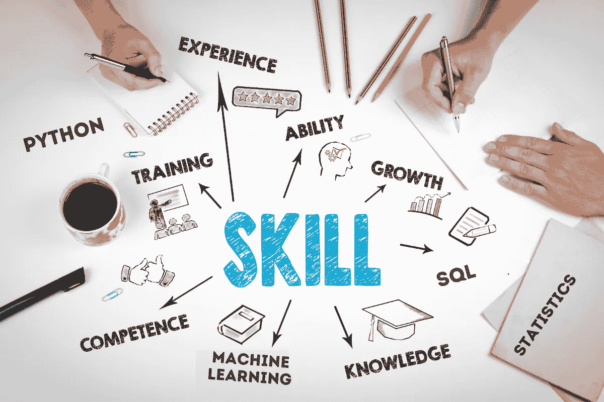

# 如何找到一份数据科学家的工作——7 个可行的建议

> 原文：<https://towardsdatascience.com/how-to-get-a-job-as-a-data-scientist-7-actionable-tips-c8ec166e56bf?source=collection_archive---------10----------------------->

*想知道如何获得数据科学工作？如果你想搬家，这里有 7 个可行的建议需要考虑。*

对许多人来说，找工作可能是一项具有挑战性的任务，但我们都需要经历这一过程，才能找到工作，建立自己的事业。目前就业市场上最理想的工作有很大一部分是与分析相关的工作，比如数据科学家、数据工程师，甚至是数据分析师。

随着像数据科学家这样的工作变得越来越受欢迎，它们的竞争也会越来越激烈。竞争激烈的就业市场意味着最有技能的人往往是最容易被雇佣的。雇主们正在寻找能够解决他们面临的任何问题的数据科学家。那么，一个人如何才能找到一份数据科学家的工作呢？

当谈到获得数据科学家的工作时，许多人不知道从哪里开始以及如何获得数据科学的工作。作为一名数据科学家，成就伟大事业的道路并不复杂。

# **如何获得数据科学工作的 7 个可行建议**

当然，在你申请任何数据科学工作之前，你需要雇主在数据科学家候选人身上寻找的正确技能。这些可行的建议不仅能巩固你的基础，还能帮助你获得正确的技能。这些技巧可以帮助你获得第一份数据科学工作。这 7 个可行步骤包括[基本技能](https://www.stratascratch.com/blog/most-in-demand-data-science-technical-skills/)以及软技能、教育资源和其他决定如何获得数据科学家工作的因素。在这里，我们试图提供非常具体的步骤，让你在数据科学领域找到理想的工作。

# 1.知道最重要的技能

数据科学家是程序员、统计学家、软件工程师以及其他更多人的混合体。数据科学家需要能够从头到尾运行一个项目。因此，想要获得数据科学家工作的人需要具备多种技能才能胜任工作。

拥有一套强大的技能是雇主可以好好利用的。了解数据科学和分析中最重要的技能是任何未来的数据科学家应该做的第一件事。成为数据科学家的一些最重要的技能是:

*   精通 Python
*   精通 SQL 的经验
*   R 的有效使用
*   从事统计学
*   了解机器学习

了解这些技能并能够有效地使用它们是获得数据科学家工作的核心要素。如果你觉得自己还不能胜任使用上述任何一种技能，那么试着专注于提高技能，这也是我们的下一个技巧。

# 2.不断学习

在数据科学领域，为了在你的领域保持领先，你必须掌握技能发展。数据科学和分析领域总是在不断适应，问题每次都在变化。因此，提升和磨练你的技能对于打造数据科学家的职业生涯至关重要。

通过在教育资源中的实践来建立真正的行业知识可以有很长的路要走。拥有强大的分析技术基础是可以在自己家里舒适地建立起来的。

## 利用教育资源

如果你想得到一份数据科学家的工作，了解基础知识是不够的。要在分析领域取得成功，需要深入的知识和解决问题的技能。利用在线练习、训练营和模块等教育资源对掌握分析技能大有帮助。

尝试练习，阅读案例研究，做类似于那些来自 [Strata Scratch](https://www.stratascratch.com/educational-resources.html) 的教程，可以让你在游戏中保持领先。持续学习对于跟上分析领域的步伐是必要的，所以如果你想得到一份数据科学家的工作，就要花时间继续学习。

# 3.增强你的沟通技巧

获得一份数据科学家的工作不仅需要强大的分析工具，沟通等软技能也很重要。能够描述你将如何解决一个问题，以及你为什么选择那条路线来解决问题，是成为一名数据科学家的关键部分。

数据科学家需要能够交流项目的每一步及其背后的推理。当你解决一个问题或处理一个项目时，试着记下你的想法，这样你就可以在将来学会向别人解释每一步。

# 4.熟能生巧

作为一名数据科学家，找到一份完美的工作需要时间。每个成功的数据科学家背后，都有大量的求职申请和数次面试。事实是，获得一份数据科学家的工作需要时间和努力。

保持乐观，[从你没有得到的数据科学](https://www.stratascratch.com/blog/how-to-start-learning-data-science-from-scratch/)职位中学习，从不如你希望的顺利的面试中学习。尽可能多地练习模拟面试。最终，熟能生巧，你会得到一份数据科学家的工作。

# 5.网络

获得一份数据科学家的工作不仅是拥有最强的技能，也是为了结识业内人士，他们可能会帮助你找到一份出色的数据科学工作。通过与其他数据科学家甚至招聘人员建立关系，你可以获得更好的结果。利用 LinkedIn 这样的社交网站，参加行业会议，对获得你梦想中的数据科学家职位大有帮助。所以，开始利用你网络中的关系吧。

# 6.建立投资组合

雇主会看到成百上千的简历，声称该候选人有能力做他们需要的事情，但并不是每个求职者都有很多表现。说你能做某事是很好的，但是表现出你能做并且做得更多会更好。

好的作品集对找数据科学工作非常重要。你应该在你的 [*数据科学投资组合*](https://www.stratascratch.com/blog/data-science-portfolio-project-ideas-that-can-get-you-hired/) 中包含什么，实际上取决于你在寻找什么类型的数据科学角色。

建立一个过去工作和[项目想法的文件夹](https://www.stratascratch.com/blog/data-analytics-project-ideas-that-will-get-you-the-job/)向雇主展示你有能力、有能力并且有所作为。以多样化和有趣的投资组合脱颖而出可能是你申请的决定性部分，这将使你获得一份数据科学家的工作。

额外收获:你在业余时间所做的所有学习对建立投资组合大有帮助。保存你在 [Strata Scratch](https://www.stratascratch.com/) 上完成的问题和练习的最佳解决方案，以充实你的文件夹。

# 7.找一个导师

除了常规的人际交往，你可以遵循的获得数据科学家工作的最佳建议之一是找到一位导师。导师可以指导你完成项目和教育资源，甚至可以帮助你弄清楚雇主到底在数据科学家候选人身上寻找什么。

# **结论**

在你找到一份工作之前，你可能会申请数百份数据科学工作。所以我们建议你耐心点，多做准备。你不仅要学习重要的概念，还要记住你将与不同的人和情况打交道。所以你必须准备好回答在不同的工作环境中你会如何表现的问题。