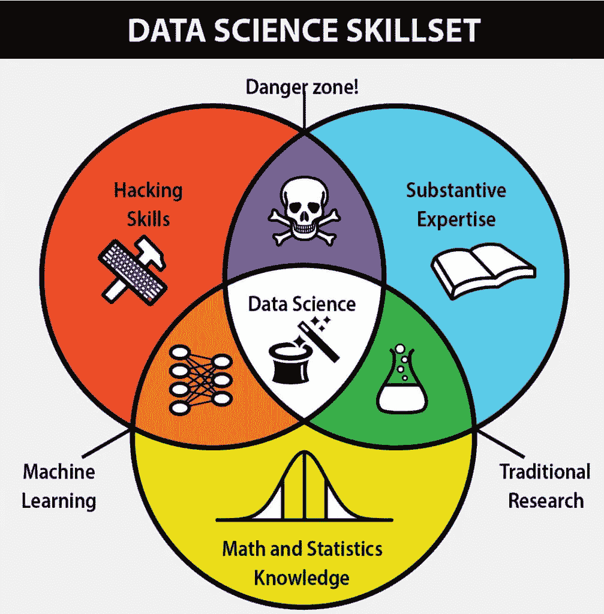

# 如何在数据科学领域找到工作

> 原文：<https://towardsdatascience.com/how-to-get-a-job-in-data-science-cf6f3a87d841?source=collection_archive---------13----------------------->

## 赢得数据科学面试的技巧

[Image credit: fusionanalyticsworld.com](http://fusionanalyticsworld.com/75-must-know-data-science-interview-questions/)

数据科学领域有许多流行词汇，但总体而言，关于面试过程的重要资源很少。鉴于此，我想分享这篇文章，因为我真的对数据科学面试准备的需求产生了共鸣，尤其是对大学生而言。这绝对是一个领域，我希望在进入这个行业之前，我在学校期间有更多的信息。我用粗体突出了我认为每个部分中的一些关键部分，因为它们与我在许多公司的大部分真实面试非常相关。

## 介绍

从事分析工作的数据科学家应该与产品团队紧密合作，以推动产品向前发展。扮演这样一个角色通常需要几项基本技能，这些技能通常会在各种公司的面试中得到广泛测试。本帖将是面试流程的介绍，重点是各知名公司的资源和样题。

## 一般提示

很重要的一点是，要很好地理解手头具体职位的角色和职责，以及你可能从事的产品。这是因为面试官可能会问你一些基于他们已经完成或正在进行的工作和项目的问题。因此，你可以问自己以下类型的问题:

*   公司是什么样的企业，处于什么阶段？根据对这些问题的回答，不同类型的指标，以及分析数据的方式将会很重要。Alistair Croll 和 Benjamin Yoskovitz 的书《精益分析》是这方面的一个很好的资源。
*   该产品如何融入公司产品套件的更广泛的生态系统？我喜欢和不喜欢该产品的哪些方面？产品应该有哪些新功能？这些问题通常也会在产品管理面试中出现，因为那里的工作职能主要是考虑产品问题。这里有一些有用的资源，比如 PM 面试和产品经理面试。
*   **如果我正在开发这个产品，我应该衡量哪些关键绩效指标(KPI)，即基本的业务指标？**哪些因素和变量会影响这些指标，它们是如何影响这些指标的？每个公司都有自己的衡量标准，但基于商业模式和公司创收方式，这些标准有很多重叠之处。基于商业模式，YC 有一个很棒的视频覆盖指标:【https://www.startupschool.org/videos/66 
*   产品如何赚钱？这里的关键是考虑推动核心业务的产品和流程中的各种杠杆。Keith Rabois 使用了术语“商业方程式”，这是一个有用的概念。他的用法的一个例子是:[http://growth . eladgil . com/book/chapter-8-financing-and-evaluation/going-public-why-do-an-IPO-an-interview-with-Keith-rabois-part-2/](http://growth.eladgil.com/book/chapter-8-financing-and-valuation/going-public-why-do-an-ipo-an-interview-with-keith-rabois-part-2/)

在面试前做调查会表明你对手头的工作和产品感兴趣。此外，你或许可以开始想象你可能会被问到什么类型的问题——在脸书这样的公司，对话可能会集中在用户、社交图和内容上，而在优步这样的公司，对话可能会围绕乘客、拼车算法和定价。最后，重要的是不要忽视一般的提示，包括:润色你的简历，拥有一个项目组合，等等。

## 产品感

这类面试问题的主要功能是更好地理解如何衡量和改进产品。**目标是评估你对产品决策和相关数据的看法**。它们可以是开放式的(更常见，询问要跟踪什么指标以及如何优化它们)，也可以是更详细和技术性的(关于您可能跟踪什么类型的数据以及这些数据可能如何影响指标)。

示例问题:

*   假设你是第一个使用 Facebook Messenger 的人。你会跟踪什么 KPI？您将如何衡量和改进这些 KPI？
*   假设你在 Youtube，有两个新想法要实现来增加收入。您将如何决定实施哪一个，为什么？

## 概率与统计

这些是经过测试以确保数字素养的核心主题，对于数据科学角色的成功至关重要。通常，概率主题将限于你可能在统计学 101 课程中找到的东西:**基本分布，条件概率，以及像中心定理和大数定律这样的概念**。对于统计主题，像**假设检验、统计显著性和其他与统计推断**相关的主题是常见的，因为 A/B 检验是许多公司实验的核心部分。有许多这类主题的教科书(例如，谢尔登·罗斯的《概率入门教程》)以及涵盖这一内容的在线课程。

**这些问题的技术细节水平可能因角色类型而异**。例如，如果这个角色专门在一个实验团队中处理 A/B 测试和大规模推理问题，那么你在这个类别中收到的问题可能会比在纯产品方面工作的人涉及更多的数学。这种数学将涉及分布、统计测试、优化等背后的技术细节。另一方面，许多公司也会问用通俗的语言解释这些技术概念的问题。这是为了**测试你对更复杂主题的理解和沟通能力，这对他们评估很有用，因为作为一名数据科学家，你将经常与其他部门的非技术人员互动**。

示例问题:

*   掷两个骰子。假设两者的最大值是 4，那么总和超过 6 的概率是多少？
*   向外行解释什么是 p 值和置信区间。

## 编码和 SQL

尽管数据科学家的主要角色不同于软件工程，但数据科学家应该对编码和计算机科学有相当的熟练程度。最常用的语言是 Python 和 r。此外，SQL 问题在面试中也很常见，因为它们更简单，而且大多数数据科学职位都会涉及查询大型数据集。

**涵盖的常见算法和数据结构将涉及 and 数组、流、图和矩阵，因为它们经常用于产品的实际应用中**。适用于软件工程的相同原则也适用于此:总是从强力解决方案开始，然后慢慢优化，重点关注最差的运行时和内存使用情况。LeetCode 和破解编码面试都是练习编码问题的绝佳资源。

与编码问题类似，SQL 问题通常具有真实公司中常见的结构，因为**它们对收集用户、交易等特定类型的数据感兴趣**。例如，优步和 Lyft 可能会问关于用户最后一次乘车的时间、最繁忙的时间或其他关于拼车体验的问题，而脸书可能会问关于用户和友谊图的问题。

示例问题:

*   给定一个包含一段时间内销售的产品的表:date，product_id，sales_amount，按时间顺序计算每种产品在一段时间内的累计总和。
*   给定一个整数数组，找出第一个缺失的正整数。例如，如果给定[0，2，1]返回 3，如果给定[-1，4，1，3]返回 2。

## 最后的想法

虽然这篇文章并没有完全涉及整个过程的所有部分(例如，没有简历和人际关系网方面)，但我认为它从实际面试中需要注意的方面对整个过程进行了很好的概述。如果你对更多的面试准备资料感兴趣，一定要去看看:[https://datascienceprep.com/](https://datascienceprep.com/)