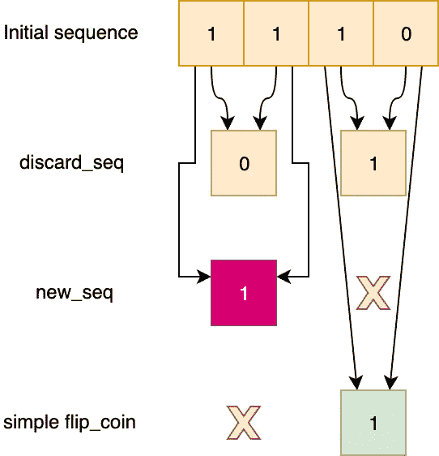

# 如何从一个不平衡的 RNG 得到一个无偏的

> 原文：<https://towardsdatascience.com/how-to-get-an-unbiased-rng-from-an-unbalanced-one-dbb44850e5f7?source=collection_archive---------13----------------------->

## Python 中的一个随机抽取器，适用于从倾斜的硬币到莎士比亚

Stars, quasars, and other celestial objects generate photons in a random way that can be used to generate random numbers

> "当然，任何考虑用算术方法产生随机数的人都是有罪的."
> —约翰·冯·诺依曼

有可能从一枚不公平的硬币中获得公平的投掷吗？或者，一般来说，是否有可能从具有非均匀分布输出的源中提取随机性？还是从任何一种文字中？也就是说，**我们怎样才能平衡不平衡呢？**

假设我们有一枚硬币正面朝上的概率是 30%。你能使用这样一枚硬币(以任何你想要的方式，但只有这枚硬币)并期望总是有 50%的机会得到正面或反面吗？

这里是一个简单的 Python lambda 函数，它定义了不偏不倚的硬币的投掷:

头部编码为“0”，尾部编码为“1”，所以 *flip_a_biased_coin()* 实际上是一个非平衡二进制随机生成器。

现在让我们定义函数 *flip_the_coin()* ，该函数必须使用 *flip_a_biased_coin()* 才能创建一个均匀分布的二进制生成器。

在求职面试中，我见过很多关于这个问题的答案，包括基于二叉树或哈希表的怪异策略，以及过度设计的决策算法。

但是解决方案更简单。你要做的就是玩…

# 可能性

用 *flip_a_biased_coin()* 得到连续两个“0”的概率是多少？我们把这个概率命名为 ***p***

连续得到两个“1”的概率是多少？

好吧…这些概率好像没啥用。但是得到一个“01”或者“10”序列的概率有多大呢？

最后一丝平衡！

*flip_a_biased_coin()* 输出一个“01”序列或“10”序列，概率相同:21%。

为了利用这一特性，每个“01”序列都被编码为“0 ”,或者换句话说，每次抛两次硬币，先投正面，然后投反面，结果是正面。反之亦然,“10”序列被编码为“1 ”,也就是说，每次抛两次硬币，一次是正面，一次是反面。

可以简化说，每两次投掷，如果结果不同，返回第一次；否则继续抛硬币两次。

这是一个完美平衡的随机发生器！

您可以粗略地检查这种发电机的输出:

`Number of 0s: 495
Number of 1s: 505`

# 另一个有趣的属性

你可以用这种方法作为随机抽取器来抽取任意序列的比特！

例如，让我们用二进制编码莎士比亚戏剧《罗密欧与朱丽叶》第二幕第二场最著名的部分:

> 噢，罗密欧，罗密欧！你为什么是罗密欧？否认你的父亲，拒绝你的名字。
> 或者，如果你不愿意，只要你发誓做我的爱人，我就不再是凯普莱特家族的人了。
> 
> 100111111000001010010111111110111101111011001000010011011111111110111101110111001111001110111001111111001111111111111000111111101111111111111111111111111111111100……共 1040 位

我们可以通过使用为 *flip_the_coin()* 函数所采用的相同策略，以诗意的方式提取具有均匀分布的比特序列。

对于每一对比特，如果比特不同，则打印第一个比特；否则不会打印任何内容。这就是结果:

> 100010101111110010110000000010010010001100100111100000111001010111111010000101110110101000100100010001011001000001010011101101110100001000100110000001110001110011001100100100001100111001110110101011010011111110010100101100110101001011100100101111011

这个序列是从原始的 1040 位中提取出来的，包含 130 个“0”和 119 个“1”，这意味着有 52%的概率得到“0”(或头部)，有 48%的概率得到“1”(或尾部)。

**🎲你能找到一个装骰子的策略吗？🎲**

对于这种简单的算法来说，这确实很好，但是您可以注意到，该算法丢弃了 1040 位中的 791 位，导致了大约 76%的拒绝率…非常糟糕！

还能改进吗？

# 熵的浪费

*flip_the_coin()* 和*debias _ Romeo _ and _ Juliet()*使用的原始策略在产生一个比特之前丢弃了许多比特。

如前所述，丢弃一个“00”序列(或两个头)的概率是*，丢弃一个“11”序列(或两个尾)的概率是***【1-p】***。这意味着期望拒绝率 ***rej(p)*** 为*

**

*这意味着*

**

*换句话说，考虑到硬币已经平衡的最佳情况，一半的硬币投掷将被丢弃。*

**

*graph as a function of **p** (x axis) and **rej** (y axis)*

*实际上，我们浪费了大量可以从序列中提取的“随机性”,使我们的输出变得更短，或者需要一个必须生成很长比特序列的源！*

*因此，这个简单的策略似乎能完成任务，但远非最佳。该算法没有以任何方式使用其浪费的“00”和“11”序列。*

*让我们想办法使用它们吧！*

# *简单有效的方法*

*主要概念是重新使用“00”和“11”序列，并在进一步的提取循环中将它们转换成新的“0”和“1”序列。*

*新策略将通过使用两个不同的来源递归地回收“浪费的随机性”:序列“丢弃/非丢弃”(即 *discard_seq* )和丢弃对的值(“00”编码为“0”，“11”编码为“1”，即 *new_seq* )。直觉上，它依赖于这样一个事实，即给定已经生成的序列，这两个源仍然是可交换的比特序列，因此有资格进行另一轮提取。*

*让我们看一个输入“10011011”的例子:*

**

*Step 1 with initial input*

*根据初始输入，我们计算 3 个序列:*

*   **discard_seq* :如果初始输入没有被 *flip_coin()* 丢弃，则每一位为“1”，否则为“0”。这个序列将被相同的策略递归地重复使用。*
*   **new_seq* :将“00”映射成“0”，将“11”映射成“1”。这个序列将被相同的策略递归地重复使用。*
*   *简单的*抛硬币*:这是我们在文章中使用的第一个策略。这将不会被重复使用，是最终输出的一部分。*

*图像中使用的颜色将被重新用作后续步骤的参考(相同的颜色，相同的来源)。*

*现在我们继续第 2 步，使用 *discard_seq* 作为输入:*

**

*Step 2 with discard_seq from Step 1 as input*

*这里我们还有 3 个新的序列，它们具有与上一步完全相同的属性。请注意，当没有产生输出时，会出现一个红色的 **X** 。*

*现在我们以同样的方式将此步骤的 *discard_seq* 用于下一步(步骤 2.1):*

**

*Step 2.1 with discard_seq from Step 2 as input*

*如上所述，该算法创建了 3 个新序列，其中 2 个被递归地重复使用，然后以固定顺序相互连接。当每个计算步骤都没有输出时，该过程结束。*

**

*In one image, Step 2.1.1 with discard_seq from Step 2.1, Step 2.2 with new_seq from Step 2 and Step 3 with new_seq from Step 1*

*从步骤 2.1 我们可以只使用一个“1”，我们不能从中提取随机性，因为没有熵了，对于步骤 2.2 和 3 也是一样。*

*这里是每一步算法的递归可视化，以便让您更好地了解该过程:*

**

*A visual diagram with the step executed with input “10011011”*

*最终的结果是“10110”，而简单的 *flip_coin()* 在相同的输入下只会产生“101”！现在让我们来看一个快速的 Python 实现，名为 *better_flip_coin()* 函数:*

**

*您会注意到，如果一个序列的位数为奇数，最后一位将被丢弃。该函数返回一个列表并直接对列表进行操作:一个用于经典的 *flip_coin()* ，一个用于 *new_seq* ，一个用于 *discard_seq* 。*

*好了，现在我们已经完成了作业，我们可以使用所学的知识并将其应用于…*

# *第二幕，第二场…算法反击了*

*这里是相同的函数，但是应用于一个字符串位序列(注意 better_flip_coin()生成的是字符串位列表，而不是位列表):*

**

*结果非常有希望:*

**

*`Number of extracts bits: 893
Number of 0s: 450
Number of 1s: 443`*

*这意味着我们刚刚丢弃了 147 位，这意味着丢弃率仅为 15%！甚至分布似乎更好，得到“0”(头)的概率为 **50.39%** ，得到“1”(尾)的概率为 **49.61%** ！！！*

*现在让我们检查每对比特(或每对掷硬币)由两种算法产生的比特的平均值***(p)***。*

*我们已经发现 *flip_coin()* 的拒绝率是
***rej(p)= 1–2p(1-p)***，因此平均***ā(p)***只是它的“互补”:*

**

*为了计算 *better_flip_coin()* 的平均值***ā’【p】***，需要进行非平凡的分析，但是可以证明*

**

*我不打算在这里写演示，因为它很长。*

*注意，描述由 *better_flip_coin()* 产生的平均比特的函数等于[熵函数](https://en.wikipedia.org/wiki/Entropy_(information_theory))的定义！*

**

*two graphs as function of **p** (x axis) and the average of bits produced by each algorithm (y axis)*

*这意味着 *better_flip_coin()* 函数本质上是你能得到的最好的！如果源已经具有均匀分布，则该算法将为来自源的每个被处理的比特产生 1 个比特。*

*感谢你阅读这篇文章(或者至少感谢你来到这里)。
**让我知道你对这篇文章的看法，以及是否有人可以将 *flip_coin()* 策略应用到一个已装载的骰子上！***