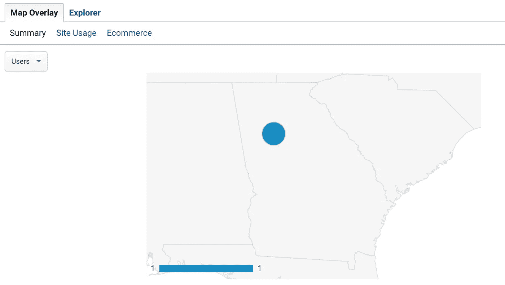
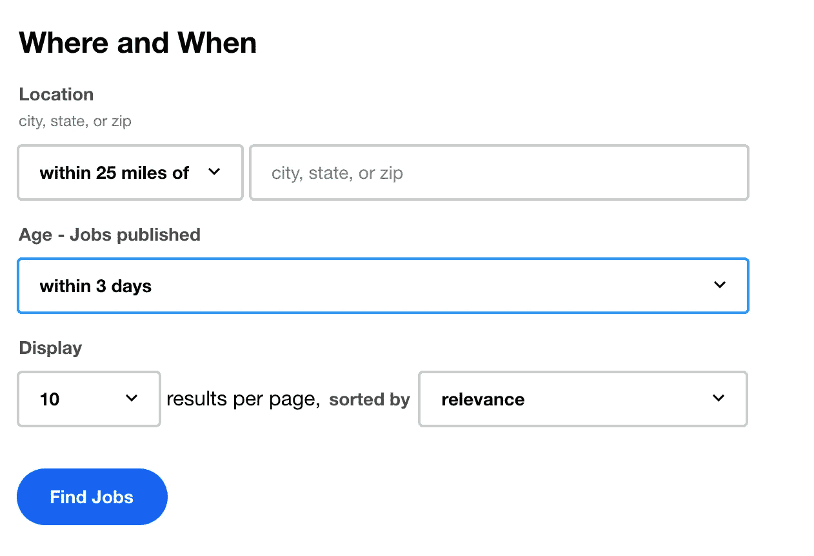
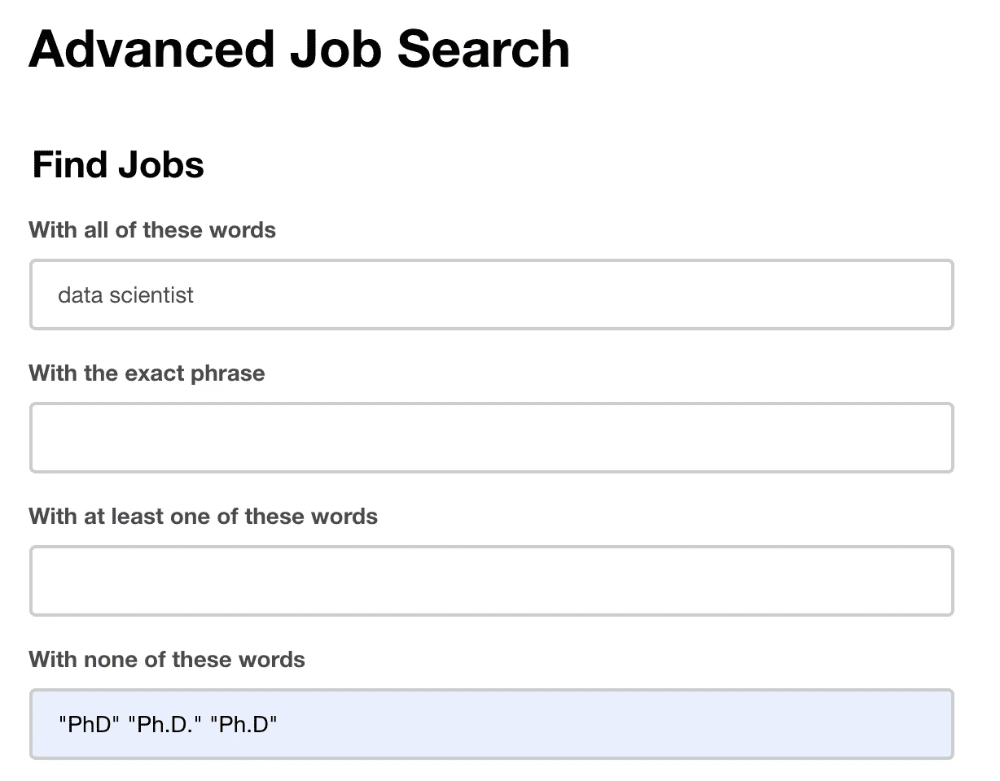
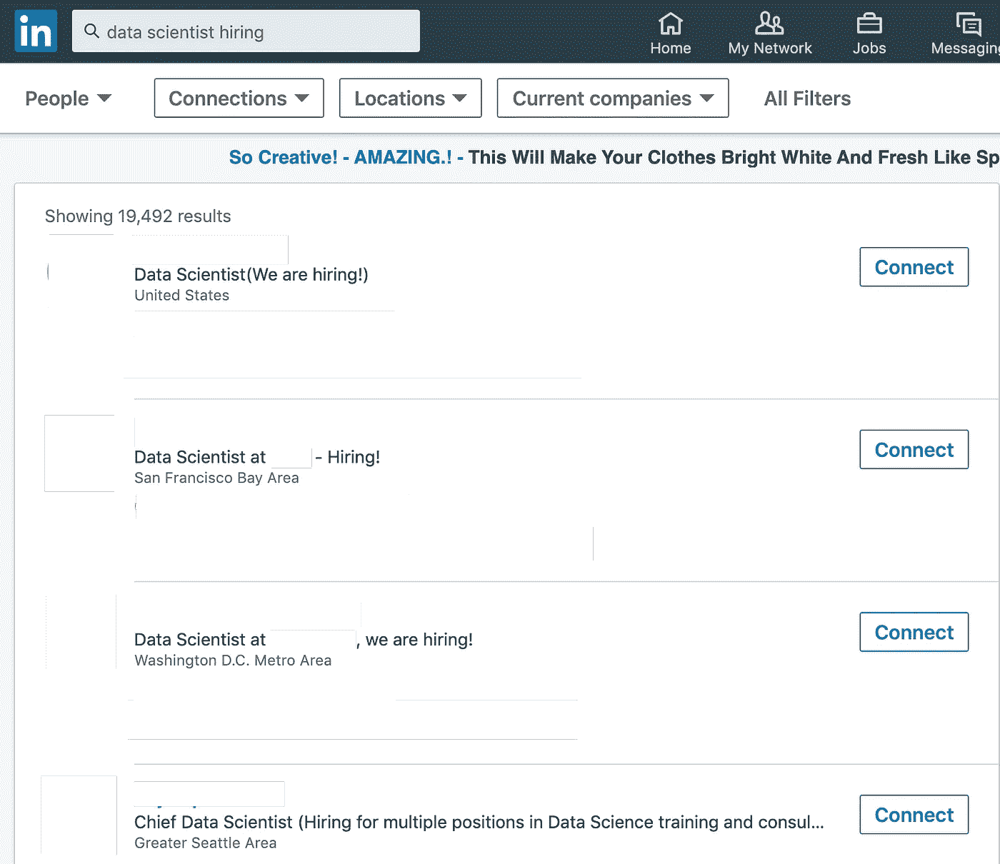

# 当你还没有 3 年工作经验和博士学位时，如何被聘为初级数据科学家

> 原文：<https://towardsdatascience.com/how-to-get-hired-as-an-entry-level-data-scientist-when-you-dont-already-have-3-years-experience-476394f2cc2c?source=collection_archive---------3----------------------->

作为一个新的复杂领域，招聘人员很难判断谁是合格的数据科学家，这是可以理解的。因此，你可能会看到工作申请有着难以置信的要求，例如数据科学博士学位和 3 年工作经验。如果被招聘为数据科学家的最佳方式是已经成为一名数据科学家，那么你如何才能找到一份数据科学的工作呢？以下是我对获得数据科学工作的具体建议。有些很容易实现，有些很难，但我保证它们都是值得的。

# 有网站

数据科学职位是一个技术职位。作为一名技术人员，拥有一个网站增加了你作为技术人员的合法性。我建议“自己”做，不要使用 Wix 或 Squarespace 这样的基本编辑器。就我个人而言，我用 R+blogdown+T1 相当快速地制作了我的网站。这是我的第一条建议，因为几乎在每次面试中，面试官都会提到我的网站有多好。我也有过几次招聘人员联系我*，因为我网站的*。

我已经在我的网站上添加了谷歌分析。这让我知道来自特定地理区域的人何时查看我的站点。如果我在亚特兰大申请一份且只有一份工作，拥有一个来自亚特兰大的网站视图给了我一个暗示，有人正在从那个公司看我的网站。如今，大多数公司甚至不会给你发拒绝邮件，所以浏览你的网站可能比你通常得到的信号更多。

你也应该得到一个自定义域名。除了让你的简历看起来更好之外，这还能让你的电子邮件看起来像 yourname@yourname.com 的邮件，这很不错。

网站也是一个展示你正在做的一些个人项目的地方，这就引出了我的下一个技巧。

# 有一个投资组合

招聘人员不一定很懂数据科学。投资组合是向他们证明你做了的最好方式。在简历上列出项目清单是很好的。更好的是有招聘人员可以点击在线查看的网址。理想情况下，你的项目有一个互动元素(例如，对招聘人员上传的图像进行物体检测，或者在他们的社交媒体上进行一些 NLP)。让你的项目变得有趣是一件大事，我在最近的文章[“你的个人数据科学项目很无聊。让我们改变这一点。”](/your-personal-data-science-projects-are-boring-lets-change-that-e356c5949e2f)我建议至少有 3 个项目，我的投资组合只有几个，但我仍然偶尔会得到积极的评价。

下面是一些你应该快速制作一个在线项目的东西:

*   [Rpubs](https://rpubs.com/)
*   [闪亮的](https://www.shinyapps.io/)
*   [nbviewer](https://nbviewer.jupyter.org/)
*   [Tableau Public](https://public.tableau.com/en-us/s/)
*   [烧瓶](http://flask.palletsprojects.com/en/1.1.x/) / [姜戈](https://www.djangoproject.com/)
*   YouTube 教程

# 擅长核心数据科学技能

核心的数据科学技能是 python(包括 numpy、pandas、sklearn)和 SQL。我建议看这么多教程，直到你完全厌倦为止，制作自己的教程也是一个好主意。

我参加过的很多技术面试都是一些基本的 python 或 numpy 问题(例如，寻找数组中的第二大值，寻找数组中数字的出现频率，从有序序列中寻找缺失的元素)。做 [leetcode](https://leetcode.com/) 并对 [Big O Notation](https://en.wikipedia.org/wiki/Big_O_notation) 和数据结构有一个很好的理解应该会让你为大多数数据科学面试做好充分的准备。

# 在数据科学中占有一席之地

在我看来，你应该在数据科学中有一个技术和非技术的利基。以下是数据科学中的一些技术领域(不要选择 python 或 SQL，那是你的核心技能):

*   稀有
*   MongoDB
*   商务智能工具
*   计算机视觉
*   自然语言处理
*   时间序列
*   火花
*   张量流

但是，开发非技术领域也很重要，例如:

*   金融
*   运动
*   形象化
*   制造业

基本上，我认为精通一个不是 Python/SQL 的工具或过程，并且有一个专业领域是很重要的。成为数据科学子领域的专家会让你更有可能在那个领域找到工作。我相信，在未来几年内，数据科学“通才”岗位会越来越少，而对特定工具和知识的需求会越来越多。

与此相关的一些其他想法是:

*   为你的领域建立一个俱乐部/聚会
*   为 it 开源项目做贡献
*   做关于覆盖利基的 Kaggle 竞赛
*   创建专门针对你的领域的教程

# 要么重写你的简历，要么复印两份

如今，你的简历很可能会被电脑阅读。虽然有很多人在谈论人工智能如何彻底改变招聘，但大多数用来解析简历的程序并没有那么好。你可能认为“我应该做一份漂亮的简历来脱颖而出”，但实际上你应该想的是“我应该做一份简单的简历，这样计算机就能读懂。”有情节，表格，或者有趣布局的简历，其实是阻碍你的。

你的简历会通过一个叫做申请人跟踪系统的东西。我在这里找到了一个免费的网站来测试你的简历在 ATS 上的表现。编辑它，直到它很容易通过，并检查多个 ATS 测试人员。

你可能只想要两份简历，一份通过 ATS，另一份看起来很棒，可以亲自交给别人。

# 使用 Indeed 的高级搜索

据 [J.T .安东内尔](https://twitter.com/jtodonnell?ref_src=twsrc%5Egoogle%7Ctwcamp%5Eserp%7Ctwgr%5Eauthor)称，招聘人员接待第一个求职者的平均时间为 200 秒。大多数工作会有 200 名申请人。从我在 LinkedIn 上看到的情况来看，对于数据科学来说，它甚至不止于此。

如果你想让你的简历真正被浏览，如果你申请的工作发布日期是旧的，你就没有机会了。我的建议是使用 Indeed 的高级搜索，并将工作限制在“3 天内”如果这移除了很多工作，不要惊慌，新的工作一直在发布。

接下来，我建议删除那些需要大量经验的招聘信息，你也可以这样做。这些工作要么需要大量的经验，而你不适合这个职位，要么他们不需要大量的经验，但招聘人员要求很多，因为他们不太了解数据科学，认为要求类似“7 年的 TensorFlow 经验”是可以的，尽管它只有 4 年左右。不管怎样，这都不是你应该申请的工作。以下是我对取消这些工作的建议:

博士学位是消除不适合你的工作的最好方法。如果你是在申请你的第一份工作，你也可以试着加上“初级”、“小”或“入门级”这样的词。你也可以在“至少其中一个词”部分添加你的专业领域，来寻找你特别适合的工作。老实说，这是我求职的最佳建议之一，幸运的是这很容易实现。不要气馁，如果只有几个工作，在你做了这些筛选后，新的工作会一直发布。

# 您的 LinkedIn 个人资料

填写你的 LinkedIn 个人资料是个好主意。以下是我对此的最佳建议

*   你过去的工作描述应该至少有两段。确保使用你可能想要的工作的关键词，例如，如果你想从事计算机视觉方面的工作，在你的描述中提及计算机视觉技能。当我重写我的工作描述时，LinkedIn 开始向我展示不同的工作。
*   添加到 LinkedIn 个人资料的技能部分。很多人忘记了它的存在，但它在向你展示你可能想要申请的工作时发挥了作用。
*   利用 LinkedIn 学习，如果你是一名在校大学生，你很有可能免费获得这个或 Lynda.com。参加这些课程极大地增加了我对主题和技能的理解，但一个很好的优势是你可以直接将课程证书添加到你的个人资料中。
*   我建议在你的个人资料中放一张封面照片，而不是默认的，这表明你在乎你的 LinkedIn。最后，确保你确实有一张个人资料照片，而且是在中性背景下拍摄的。

# 联系 LinkedIn 上的人

一般来说，我不认为 LinkedIn 是一个申请工作的好地方，但是直接接触人们可以帮你很多。试着输入“数据科学家招聘”,搜索人而不是工作。许多人会在他们的简历中提到这一点。这些人通常不介意别人向他们寻求机会。当你提出要求时，**要简短**，有一个**令人信服的理由**你对他们公司感兴趣，有一个**你申请的具体工作**，**包括你的简历**，我建议包括一个**链接到你的网站**。如果你没有包括所有这些，你很可能会被忽视。我不建议在简历中没有注明要招聘的人身上试用。我在下面进行了测试，屏蔽了人们的照片、公司和姓名，但你可以看到他们的简历正是你要找的。

# 打动开发者的技能

你将不得不与开发人员一起工作，在许多公司的面试过程中，你甚至可能会被一些人面试。要让这些人认为你很好共事，就要投资那些让你很好共事的技能。这些包括 git、flask、docker、使用 API 以及将模型部署到云。杰瑞米·哈里斯在这篇博客文章中对此做了比我更好的报道。

# 打造“你的品牌”

为自己扬名是有用的，因为它可能会让人们试图雇佣你，甚至不用你去申请工作。这里有一些你可以做的事情来建立你的品牌，其中一些我已经提到过了。即使你有工作，做这些事情也是有用的，因为你永远不知道你什么时候会去找另一份工作。

*   制作一个网站(它应该包括博客部分)
*   拥有一个专业的 twitter 账户，与你尊敬的人互动，实际上我从 twitter 上学到的比 LinkedIn 多得多
*   在 YouTube 上建立教程(尤其是关于新兴技能的)
*   在介质上写东西
*   参加会议
*   参加黑客马拉松比赛(或者指导，如果你太老的话)
*   志愿者数据科学为非营利组织工作吗
*   开始聚会或俱乐部