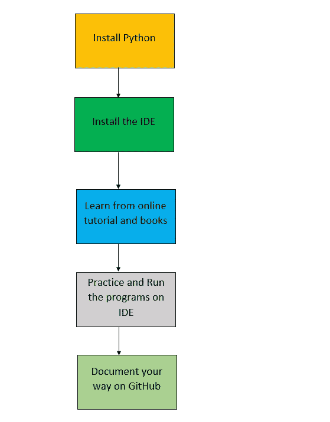

# 如何入门 Python 编码？

> 原文：<https://towardsdatascience.com/how-to-get-started-coding-in-python-41fa7ea5106b?source=collection_archive---------12----------------------->

让我们从零开始了解如何成为一名优秀的 python 程序员。

Credits: [Udemy](https://www.udemy.com/course/python-beginner-to-advanced-with-web-scraping-projects/)

因此，朋友们让我们学习在真正用 python 编码之前你需要入门的所有东西，以及成为一名优秀的 python 程序员你需要知道的所有东西，你需要掌握编程语言的资源。这不是一个编码教程，我不会教你们如何用 Python 编码，相反，我会分享一些想法，资源，通过一些步骤，你需要遵循成为一个好的程序员。我会尽量不让你觉得无聊，我会给你提供所有教程、书籍、GitHub 资源库等等的链接。因为你如何学习内容并不重要，重要的是你是否知道概念。对于那些在本教程主要面向您之前从未使用 python 编写过代码的初学者来说，不要担心，因为这是入门的好地方。我将告诉你我的经验，让你掌握 python 编程。我再次重申这不是一个编码教程，因为我不能一口气教你 python，但是，我会提供足够的内容让你开始。

## 我在下面列出了一些重要的步骤，帮助你开始成为一名 python 程序员:

## 1.安装 Python

在开始学习 python 之前，你必须做的第一件事就是在你的 Windows 或 Mac OS X 或其他平台上安装 python，点击下面的链接下载:

**对于 Windows:**

 [## 适用于 Windows 的 Python 版本

### Python 编程语言的官方主页

www.python.org](https://www.python.org/downloads/windows/) 

**为 Mac OS X**

 [## 面向 Mac OS X 的 Python 版本

### Python 编程语言的官方主页

www.python.org](https://www.python.org/downloads/mac-osx/) 

**针对其他平台**

 [## 为其他平台下载 Python

### Python 已经被移植到许多专门的和/或旧的平台上，下面按字母顺序列出。请注意…

www.python.org](https://www.python.org/download/other/) 

一定要下载最新的稳定版本，因为每次下载安装最新版本是一个好习惯，python 几乎每个月都会发布一个新的稳定版本。另外，我推荐你下载 python 3，因为 python 3 是 python 2 的增量版本，python 3 比 python 2 有很多更方便的特性。

## 2.安装 IDE

到目前为止，您已经知道 IDE 是一个集成开发环境，它允许您编译和执行不同的编程语言。首先，我建议大家下载名为 PyCharm 的 IDE。PyCharm 是 Jet Brains 开发的 IDE。可能是这个星球上最好的 IDE 之一，非常容易使用和练习你的代码。我建议你从下面的链接下载它，你也可以在你的[命令提示符下运行 python 程序或者使用](https://swcarpentry.github.io/python-novice-inflammation/10-cmdline/index.html) [anaconda](https://docs.anaconda.com/anaconda/user-guide/getting-started/) ，但是 PyCharm 是最好的，也是最容易编程的:

**对于 Windows:**

 [## 下载 py charm:JetBrains 为专业开发人员提供的 Python IDE

### PyCharm 现在也可以作为快照包使用。如果你使用的是 Ubuntu 16.04 或更高版本，你可以从…

www.jetbrains.com](https://www.jetbrains.com/pycharm/download/#section=windows) 

**对于 Mac:**

 [## 下载 py charm:JetBrains 为专业开发人员提供的 Python IDE

### PyCharm 现在也可以作为快照包使用。如果你使用的是 Ubuntu 16.04 或更高版本，你可以从…

www.jetbrains.com](https://www.jetbrains.com/pycharm/download/#section=mac) 

**对于 Linux:**

 [## 下载 py charm:JetBrains 为专业开发人员提供的 Python IDE

### PyCharm 现在也可以作为快照包使用。如果你使用的是 Ubuntu 16.04 或更高版本，你可以从…

www.jetbrains.com](https://www.jetbrains.com/pycharm/download/#section=linux) 

现在，我还将提供使用由 JetBrains 官方提供的 PyCharm IDE 的提示和技巧的链接，如下所示:

 [## 42 个 PyCharm 提示和技巧

### 发展是关注和流动。学习你的工具有助于你进入流程并停留在那里。此播放列表显示…

www.jetbrains.com](https://www.jetbrains.com/pycharm/guide/playlists/42/) 

## 3.从在线教程和书籍中学习

显然，你不能仅仅通过自学来掌握一门编程语言，你必须并且应该在网上阅读一些教科书或文章。网上有一些最好的教科书。我建议你们仔细阅读并学习这些材料。试着一点一点地学，你不可能在一天内读完整本书。这需要时间来完成，现在下面我给了一些我认为最好的教科书的链接，现在你不需要购买它们，但是你可以通过下载来离线阅读它们，下面提供了它们的链接。

**1)Python 的搭便车指南！**

 [## Python 的搭便车指南

### 《Python 的搭便车指南》将熟练工 Pythonista 带到了真正的专业领域。比其他任何语言都多…

shop.oreilly.com](http://shop.oreilly.com/product/0636920042921.do) 

**下载:**[**Python 的搭便车指南！**](http://index-of.es/Varios-2/The%20Hitchiker%27s%20Guide%20to%20Python.pdf)

**2) Headfirst Python 第二版**

 [## 头先蟒蛇

### 想要学习 Python 语言而不苦读入门手册吗？使用 Head First Python，您将…

shop.oreilly.com](http://shop.oreilly.com/product/0636920036777.do) 

**下载:** [**头头蟒**](https://doc.lagout.org/programmation/python/Head%20First%20Python%20%5BBarry%202010-11%5D.pdf)

**3)想 Python**

 [## 想想 Python

### 这是 Think Python 的第一版，用的是 Python 2。如果您正在使用 Python 3，您可能希望使用…

greenteapress.com](https://greenteapress.com/wp/think-python/) 

**下载:** [**想 Python**](https://greenteapress.com/thinkpython2/thinkpython2.pdf)

**4)艰难地学习 Python**

 [## 艰难地学习 Python 3:一个非常简单的介绍可怕的美丽世界…

### 索引符号:(冒号)，创建函数，61-62(点)运算符，146-148，193 "(双引号)避免与…一起使用

www.oreilly.com](https://www.oreilly.com/library/view/learn-python-3/9780134693866/index.html) 

**下载:** [**敬酒不吃吃罚酒**](http://ptgmedia.pearsoncmg.com/images/9780134123486/samplepages/9780134123486_exercises%206and40.pdf)

**5)流畅的 Python**

 [## 流畅的 Python

### Python 的简单性让您很快变得高效，但这通常意味着您没有使用它必须的一切…

shop.oreilly.com](http://shop.oreilly.com/product/0636920032519.do) 

**下载:** [**流畅的 Python**](https://evanli.github.io/programming-book-3/Python/Fluent%20Python.pdf)

现在让我们看看一些掌握 python 编程技能的最佳文章。据报道，现在互联网上有大量不同的文章和出版商。最好的文章是:

**1。走向数据科学**

 [## 搜索和查找-中等

### 在 Medium 上搜索，找到关于重要话题的最受欢迎的声音。

medium.com](https://medium.com/search?q=Python) 

这是我几乎每天阅读有趣文章的最好的网站之一。养成每天阅读本网站文章的习惯。

**2。真正的 Python**

 [## 在线学习 Python 编程-真正的 Python

### 我们正在更新此页面，以使其更加有用，如果您有时间分享您对我们如何改进此页面的想法…

realpython.com](https://realpython.com/start-here/) 

只要输入你的需求，这个网站会尽一切可能帮助你。可能是我推荐你们去的第二好的网站。

**3。Python.org**

 [## Python 教程- Python 3.7.5rc1 文档

### Python 是一种简单易学、功能强大的编程语言。它有高效的高级数据结构和简单但…

docs.python.org](https://docs.python.org/3/tutorial/index.html) 

如果你像我一样是个喜欢每次都阅读官方文档的极客(因为我是个书呆子)，那么 python.org 就是你需要经历的一切。因为很明显，官方网站是保持内容更新的一方。他们会试图解释所有的概念，并确保每个人都理解这些概念。

**4。GitHub**

 [## 极客电脑/Python

### 我不认为自己是程序员。我创建这些小程序作为试验来玩语言，或者…

github.com](https://github.com/geekcomputers/Python) 

除此之外，还有一个 GitHub 库，这也是一个在线阅读的好方法。通常在将来，即使你知道更多的东西，你也应该在 GitHub 上工作，并与世界分享你的想法。

## 4.在您的 IDE 上练习并运行程序

现在，这一步是显而易见的，因为现在你知道你应该做什么，你正在学习所有的材料，现在唯一悬而未决的事情是键入和运行你的程序。这是必须的，因为许多学生特别是学习了概念，但他们从来没有键入和运行程序，因为通常当你键入程序时，有可能当你运行程序时，你在屏幕上得到错误，通过这个你可以看到和了解你得到什么类型的错误。当你遇到错误或有疑问时，不要担心，有一个地方会永远帮助你。

**堆栈溢出:**

 [## 最新的“python”问题

### Python 是一种多范式、动态类型、多用途的编程语言，旨在快速(学习、应用……

stackoverflow.com](https://stackoverflow.com/questions/tagged/python) 

所以请输入程序，并感受它成功执行时的喜悦。

## **5。在 GitHub 上记录您的旅程**

这是每个程序员必须开始做的最重要的事情之一， [GitHub](https://github.com) 就像是程序员的简历，因为它讲述并展示了你的工作。因此，在学习编程的时候，一定要创建一个 GitHub 库。尝试提供一个好的 read.me (Read.me 文件是一个描述文件，它告诉你的存储库是关于什么的——不要担心你在使用它的时候会习惯它)文件，并保持它的更新。谁知道谁会读你的 GitHub 库，也许有时候他们会雇佣你为他们工作。如果你不知道如何创建和使用 GitHub，请观看下面的视频:

Credits: [MicrowaveSam](https://www.youtube.com/user/MicrowaveSam)

正如你现在已经注意到的，你已经有意或无意地到达了我的教程的末尾(查看开头的流程图)。现在我已经尽我最大的努力给你们所有的资源、工具和指导，球在你们的球场上，决定你们想用它做什么。现在，如果你们想看看我的 GitHub 库，并从中学习一些新的东西，请见下文:

 [## 塔努-北帕布/Python

### 对于那些不知道 Pycharm 的人来说:PyCharm 是一个用于计算机的集成开发环境…

github.com](https://github.com/Tanu-N-Prabhu/Python) 

感谢你们阅读我的文章，如果你们对 Python 有任何疑问，请通过评论区告诉我，我会在几分钟内回复，或者几年内回复(开玩笑)。好了，踩油门，开始编程。再见，祝你愉快。

Credits: [Giphy](https://giphy.com/explore/happy-coding-2)