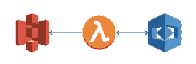
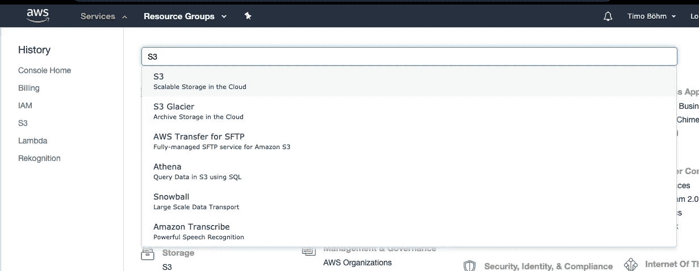
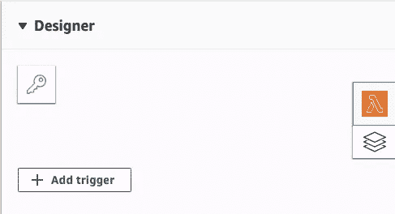
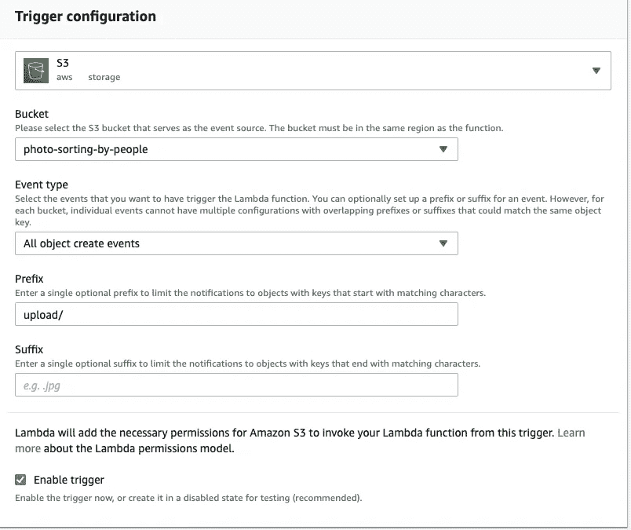
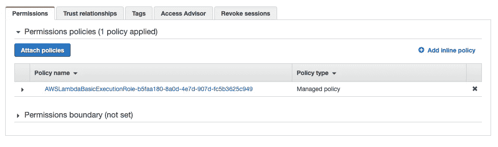
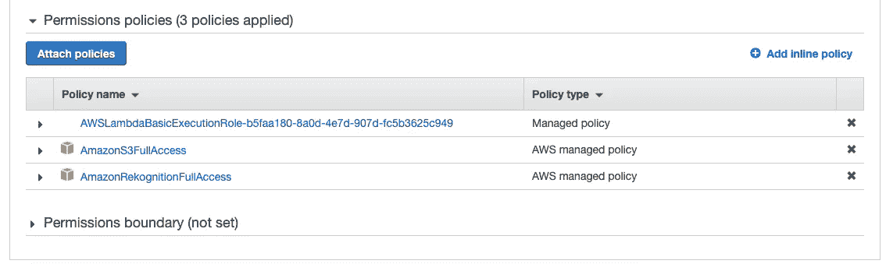

# 如何开始使用 AWS 人工智能服务

> 原文：<https://towardsdatascience.com/how-to-get-started-with-aws-ai-services-877883eecbe1?source=collection_archive---------13----------------------->

Photo by [Ivan Bandura](https://unsplash.com/@unstable_affliction?utm_source=medium&utm_medium=referral) on [Unsplash](https://unsplash.com?utm_source=medium&utm_medium=referral)

## 逐步进入云计算的指南

在过去的六个月里，我帮助在 AWS 上实现了一个复杂的数据管道。这条管道中与机器学习/数据科学相关的两个构建模块由我负责。

在这个过程中，我意识到有多少数据科学家希望开始在云端工作。然而，过多的服务和概念让他们望而生畏。

这篇博文是让你开始使用 AWS 的一步一步的指南。如果您继续下去，您将有一个利用云服务的基本框架。然后，您可以根据您的项目和想法轻松调整它们。唯一的先决条件是你有一个 AWS 帐户。如果没有，在这里创建一个。

我们开始吧！

# 第一步:明确需求。

当我写这篇文章时， [AWS 提供 165 种不同的服务](https://en.wikipedia.org/wiki/Amazon_Web_Services)。有必要首先定义一个用例，以避免迷失在其中。这适用于简单的例子和现实世界的实现。

对于这篇文章，让我们假设我们想要实现一个简单的照片排序管道。每次度假后，我们都想把我们的照片分类放在两个文件夹里:里面有和没有人脸的照片。让我们在云中构建一些东西来自动化这个过程。

更具体地说，我们希望我们的照片排序过程做以下事情:

1.  每当我们上传照片时，它应该会自动启动。
2.  它应该可以识别照片中是否有人。
3.  它应该将文件移动到“面孔”或“风景”文件夹中。

作为附加要求，我们不想一张张上传照片。相反，我们想一口气上传上一次旅行的文件夹，喝一杯咖啡或鸡尾酒，然后回来看结果。

# 第二步:设计整体流程。

在进入实现的细节之前，我们需要决定整体架构。也就是说，我们需要回答两个问题:

1.  我们需要什么样的服务才能让它发挥作用？
2.  它们是如何相互作用的？

先说第一个问题。

## 第 1 部分:选择合适的构建块

为了简单起见，我们希望尽可能少地限制我们的服务。我们还希望它们是按需服务，以最大限度地降低成本。最后，我们希望减少设置照片所需的时间，因为我们的主要重点是对照片进行分类。

**首先，**我们需要一个上传图片的地方，以及存储排序结果以备后用的地方。AWS 上的中央服务称为 **S3** ( [*详情*](https://aws.amazon.com/s3/?nc1=h_ls) )。使用它很便宜。直到第一个 50TB，每个 GB 每月花费 2 美分多一点。

虽然 AWS 控制台上的 S3 界面看起来像您的本地文件系统，但它的工作方式不同。这对该使用情形的最大影响是我们无法移动文件。相反，我们需要将它们复制到一个新位置，然后在旧位置删除它们。

**第二个**，我们需要一种方法来判定图片中是否有人脸。虽然这会很有趣，但我们不需要为此建立机器学习模型。相反，我们可以使用 AWS 提供的 AI 服务之一:**Amazon Rekognition**([*详情*](https://aws.amazon.com/rekognition/?nc1=h_ls) )。我们可以通过 API 调用来访问这个服务。对于前 100 万张图片，每月 1000 次 API 调用总计约为 1 美元。

更具体地说，我们将使用 API 的 *detect_faces* 方法。应用它将为图片中找到的每张脸返回一个元素。如果没有人脸，返回的列表将为空( [*详情*](https://boto3.amazonaws.com/v1/documentation/api/latest/reference/services/rekognition.html#Rekognition.Client.detect_faces) )。

**最后**，我们希望有一个服务来执行我们的排序逻辑，我们只在需要的时候付费。这是无服务器服务的主要优势。在 AWS 生态系统中， **Lambda** 函数就是解决方案( [*细节*](https://aws.amazon.com/lambda/?nc1=h_ls) )。就我们的目的而言，这项服务的成本可以忽略不计。

Lambda 函数是一个庞大的主题，因为它们是 AWS 上无服务器应用程序的主干。对于本演练来说，知道它们是并行运行的就足够了，这将大大加快我们的照片排序过程。

总之，我们只需要 AWS 的三个服务:S3、亚马逊 Rekognition 和 Lambda 函数。如果我们估计一个月拍摄的照片不超过 1000 张，即每天大约 33 张，那么成本可以忽略不计。这三种服务都很容易设置和连接，我们可以在本教程中完成。

## 第二部分:思考它们之间的相互作用。

既然我们知道我们需要哪些构件，我们必须考虑他们的合作。在我们的例子中，我们可以认为λ功能是整个过程的大脑。它负责两件事。

**首先**，我们的函数需要能够读写 **S3** 。这些权利包括新文件的触发器和执行上述数据伪移动的可能性。**第二个**，我们的函数需要能够调用 **Rekognition API** 并接收其答案。

The Lambda function in the middle is the brain of our process. On the left, you can see S3 as its tool. Amazon Rekognition on the right will answer our API calls.

如果这对你来说太简单了:不要担心，在以后的现实生活中，你会遇到很多复杂的(可能是令人费解的)架构。

# 步骤 3:创建构建块和角色

## 第 1 部分:S3 水桶

设置新的 S3 存储桶非常简单。首先，登录 AWS 控制台，在“服务”菜单中找到 S3:

你会看到一个闪亮的蓝色“创建桶”按钮。点击它。键入您喜欢的存储桶名称，然后单击左下角的“创建”。出于我们的目的，我们不需要关心进一步的配置问题。Bucket 名称必须是唯一的，所以在 AWS 允许您创建它之前，您可能需要注入一些创造力。它现在将出现在您的 S3 桶列表中。

出于我们的目的，我们需要四个文件夹:

1.  一个“上传”文件夹，我们可以把上次度假的照片放在那里。
2.  “处理”文件夹，防止并行处理。
3.  “面孔”文件夹，用于存放上面有面孔的照片。
4.  一个“风景”文件夹，用于存放没有人脸的照片。

通过“创建文件夹”按钮创建它们。出于我们的目的，我们不需要担心加密选项。

太好了，我们的储物件已经就位，随时可以使用！

## 第 2 部分:Lambda 函数

与 S3 类似，通过 AWS 控制台找到 lambda 服务。这一次，按钮在右边，亮橙色，上面印着“创建功能”。定义一个名称，选择“Python 3.7”作为运行时。点击“创建函数”,等待 AWS 完成创建。为了完成基本设置，我们必须定义两件事:

1.  上传新照片时触发的触发器。
2.  一个允许我们的功能做我们要求它做的任何事情的角色。

要添加触发器，请查找“Designer”选项卡，它应该是从顶部开始的第一个选项卡。如您所见，左侧有一个“添加触发器”按钮:

当您单击它时，AWS 会建议您可以定义为触发器的服务列表。选择 S3。在下一步中，为这个项目选择您的 bucket 并添加您的文件夹作为前缀。因此，您的配置应该如下所示:

现在，每次你上传一个文件到 S3，你的 Lambda 函数的一个新实例将开始执行它的代码。很简单，对吧？

设置具有必要权限的角色更加棘手。向下滚动，直到在左侧找到“执行角色”选项卡。如您所见，AWS 已经为您的 Lambda 函数创建了一个角色。单击允许您在 IAM 控制台中查看该角色的链接。

目前，唯一的权限策略是标准执行角色:

为了让我们的应用程序工作，我们需要添加允许完全访问 S3 和 Rekognition API 的策略。为此，点击“附加策略”，查找“AmazonS3FullAccess”并点击右下角的“附加策略”。对“AmazonRekognitionFullAccess”策略进行同样的操作。现在,“权限”选项卡应该如下所示:

现在我们的 Lambda 函数有了所有必要的权利去做我们想让它做的事情。它可以从 S3 读取和写入，并使用 Rekognition API。

> **注意:**这种添加策略的方式很方便，因此适合本演练。然而，使用策略的一般最佳实践是所谓的“授予最小特权”方法。点击查看[的更多信息。](https://docs.aws.amazon.com/IAM/latest/UserGuide/best-practices.html#grant-least-privilege)

## 步骤 3:重新识别 API

AWS AI 服务是 API 调用，所以这里不做什么。

# 步骤 4:编码并测试实现

现在一切都准备好了，我们可以实现并测试代码使其工作。由于我们简单的架构，我们只需要在 Lambda 函数中编写代码。

## 第 1 部分:收集有效照片的路径

在 S3 逻辑中，有效照片的路径由一个桶和一个键组成。为了实现这一点——以及 AWS 和 Python 的所有其他事情——我们可以使用 *boto3* 库。实现同一个目标有不同的方法，但我发现这个方法对初学者来说很容易理解:

注意，如果至少有一个带有*的文件，这个函数只返回一个键。上传文件夹中的 jpg* 后缀。它也只处理它找到的第一个。

## 第 2 部分:“移动”照片从上传到处理

请记住，没有办法移动 S3 上的文件。相反，你必须将它们复制到其他地方，并删除原始文件。这个函数的确切作用是:

如果您想调整文件名，您可以进一步修改 *destination_key* 。

## 第 3 部分:调用 Amazon Rekognition API

为了优化 API 的使用，阅读关于响应结构的文档是至关重要的。在我们的例子中，我们只关心 Amazon Rekognition 识别的人脸细节(如果有的话)。

结果，我们得到一个布尔值，它告诉我们照片中是否至少有一张脸。

## 第 4 部分:“移动”照片到正确的文件夹

最后，我们执行与上面相同的复制/删除过程，但这次是从处理文件夹到正确的输出文件夹:

## 第 5 部分:在我们的 Lambda 函数中组合它

Lambda 函数的核心是所谓的 *lambda_handler* 。每次触发器启动 Lambda 函数时，它都会运行里面的任何东西。对于我们的示例，它看起来像这样:

# 第五步:享受工作成果

上传 S3 的图片，观看奇迹发生。

Photo by [kyryll ushakov](https://unsplash.com/@ushakov_kyryll?utm_source=medium&utm_medium=referral) on [Unsplash](https://unsplash.com?utm_source=medium&utm_medium=referral)

# 那么，下一步是什么？

如果你跟着做，你就有了一个开始进一步实验的好地方。只是一些启发你的想法:

*   实施更精细的照片分类流程。例如，只保留笑脸照片。或者反过来，我不做判断。
*   通过将“风景”照片分成更好的子类别来扩展 API 的使用。
*   集成一个额外的 AWS 服务，一旦“上传”文件夹再次为空，它会向您发送一封电子邮件。
*   …

无论您做出什么决定，云计算之旅都是一次不容错过的冒险。

如果这篇文章对你有所帮助，或者你想补充什么，请在评论或 Twitter 上告诉我。我也很乐意在 [LinkedIn](https://www.linkedin.com/in/timo-boehm-datascience/) 上联系。**感谢阅读！**