# 数据科学入门:使用 Anaconda、Python、Jupyter 笔记本& Kaggle 竞赛的简要教程。

> 原文：<https://towardsdatascience.com/how-to-get-started-with-data-science-a-brief-tutorial-on-using-anaconda-python-jupyter-a72e17d6f903?source=collection_archive---------24----------------------->

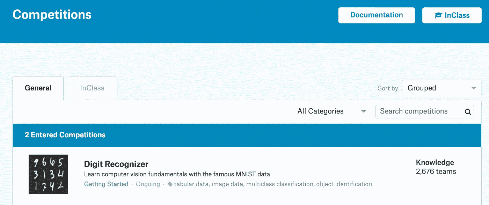

在本文中，我想写下我克服最初障碍并开始学习数据科学的经历。学习数据科学是一个旅程，一旦开始，你将不断学习。在本文中，我们将通过以下 **5 个开始步骤**进入学习数据科学领域:

1.  **报名参加卡格尔比赛** ( [房价比赛](https://www.kaggle.com/c/home-data-for-ml-course))。本文的最终目标是成功地向 Kaggle 上的房价竞赛提交一个输出。同时学习如何使用 Python 和机器学习。
2.  [**下载并安装 Anaconda 发行版**](https://www.anaconda.com/distribution/)
3.  开始使用 **Jupyter 笔记本**和**编写 Python 代码**
4.  使用我们的 Jupyter 笔记本为房价竞争生成输出，即**测试数据的价格预测。**
5.  **成功提交预测输出**到 Kaggle 竞赛，在排行榜上看到你的名字。

**第一步:注册卡格尔比赛**

学习数据科学的最佳方式是实际研究数据科学。处理数据，使用 python 分析数据，创建有用的输出，不断学习和改进结果。如果你把一个你想要解决的问题摆在你面前，所有这些都会自然发生。一旦你开始解决问题，你就会不断发现和学习解决问题所需的新事物。为此，需要一个明确定义的问题和原始数据。这正是 Kaggle 比赛给你提供的。一个起点，即一个确定的问题和一个数据集。这也是我们将开始的地方。

让我们先在 [Kaggle](https://www.kaggle.com/) 上注册。 [Kaggle](https://www.kaggle.com/) 归谷歌所有，是数据科学家和机器学习工程师的在线平台。它提供了大量的数据科学竞赛——有些有丰厚的金钱奖励。现在，让我们把奖励集中在学习上，开始一个 Kaggle 入门竞赛- [房价竞赛](https://www.kaggle.com/c/home-data-for-ml-course)。

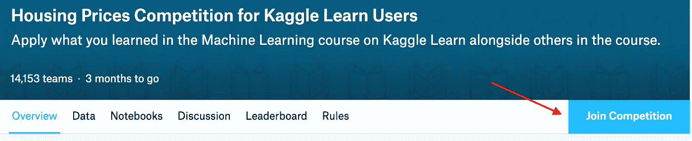

在这场竞赛中，挑战是根据训练数据集中提供的数据预测测试数据集中每个房屋的价格。您可以点击数据选项卡，并看到为您提供了 [train.csv 和 test.csv](https://www.kaggle.com/c/home-data-for-ml-course/data) 文件。你可以下载这些文件并保存在你的电脑上。因此，现在的问题是，我们如何使用训练数据集，并预测测试数据集的房价。答案是分析数据和使用机器学习。分析数据和使用机器学习的一个简单方法是使用 Python，这就是我们现在要学习的。

**第二步:** [**下载安装 Anaconda 发行版**](https://www.anaconda.com/distribution/)

开源的 Anaconda 发行版是使用 Python 进行数据科学和机器学习的最简单的方法。一旦您为您的操作系统下载了 Anaconda 发行版，它将自动下载并安装 python 以及 1500 多个 Python 数据科学包。以后随着你不断学习，你会用到很多重要的包，比如 NumPy、matplotlib、pandas、scikit-learn、TensorFlow 等等。所有这些包和 python 将在您安装 [Anaconda 发行版](https://www.anaconda.com/distribution/#download-section)时安装。选择您的操作系统(macOS、Windows 或 Linux)并下载 Python。最新版本是 Python 3.7。

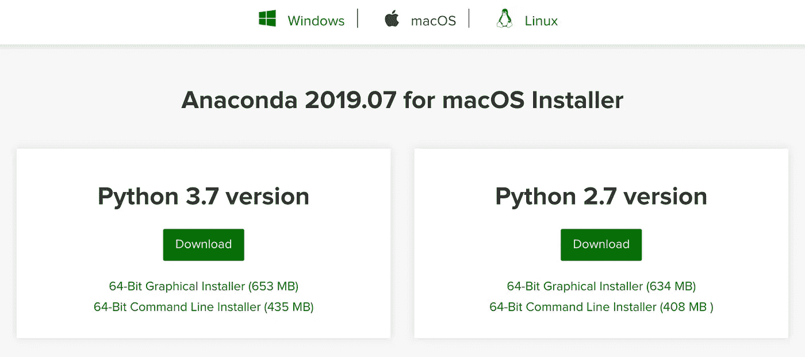

安装了 Anaconda 发行版搜索并启动 Anaconda-Navigator。你会看到类似这样的东西

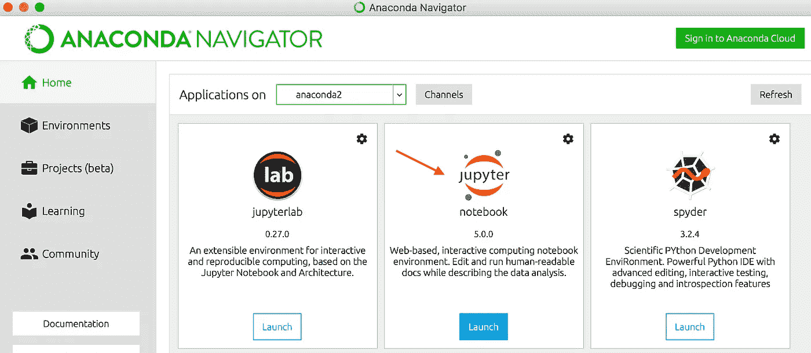

在这里，我们将使用 Jupyter 笔记本。你可以在这里了解更多关于 Jupyter 笔记本的信息。

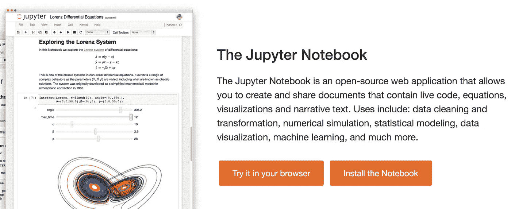

**步骤 3:开始使用 Jupyter 笔记本和编写 Python 代码**

让我们现在开始吧。按照下面的图像顺序。这是在苹果电脑上。这个想法是在终端中找到你想要的笔记本所在的文件夹。您可以右键单击您想要的文件夹→服务→在文件夹中新建终端。或者从搜索栏打开终端，将工作目录切换到所需的文件夹(Windows 用户可以使用 Anaconda 终端，搜索 Anaconda 终端)。一旦你在终端的目标目录中，输入 **jupyter notebook** 并按回车键。这将带您到默认浏览器。下一步是单击新建→ Python 2 或 Python 3(如您已安装的)。这将为您打开一个新的无标题 jupyter 笔记本，您可以在那里开始编写 python 代码。这是你的游乐场:)

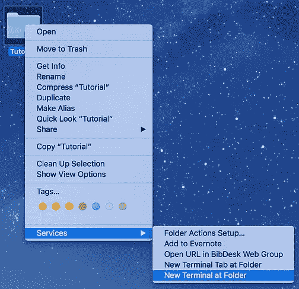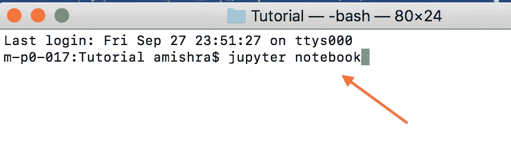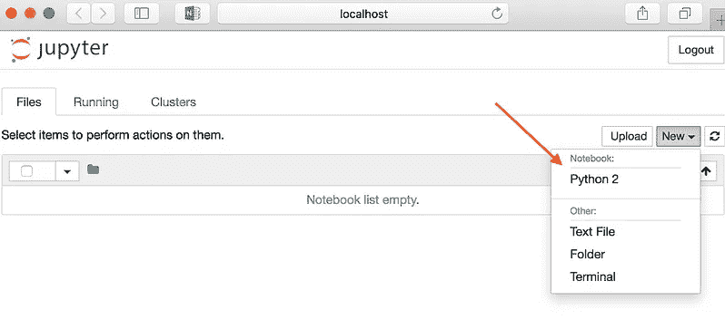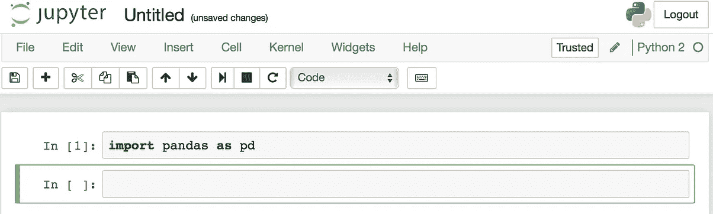

**第四步:使用我们的 Jupyter 笔记本为房价竞争制作输出，即测试数据的价格预测。**

现在的想法是用机器学习来预测房价。我不会在这里详细解释机器学习的技术方面。我们将简要回顾总体想法的摘要，并生成最终输出，作为 submission.csv 文件，该文件可提交到房价卡格尔竞赛。你可以在我的 github 上使用[这个笔记本来详细了解代码。简单解释一下相关步骤:](https://github.com/abhishekmshr956/Kaggle-Machine-Learning-Courses/blob/master/Intro_to_MachineLearning/Tutorial%20for%20getting%20started.ipynb)

*   我们导入必要的包:熊猫，scikit-learn
*   读取训练数据(train.csv 文件)，将目标(即销售价格)存储在变量 y 中，选择所需的功能(功能选择)
*   将培训数据分为培训数据和验证数据
*   定义 RandomForestRegressor 模型，使用定型数据拟合模型，预测验证数据，计算误差
*   为整个训练数据拟合模型，使用此模型为测试数据集预测房价
*   将最终预测输出以所需格式存储为“submission.csv”

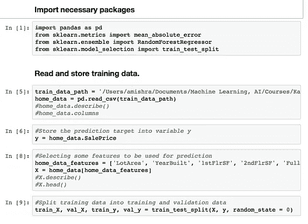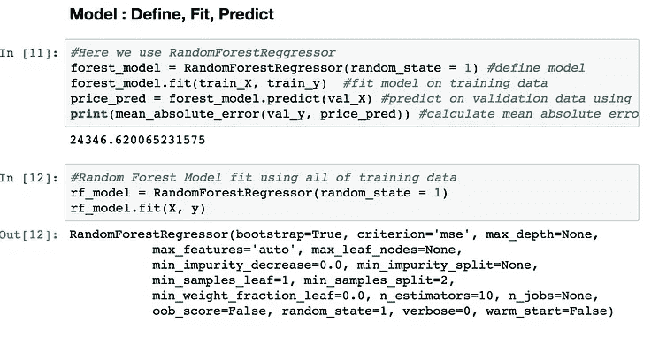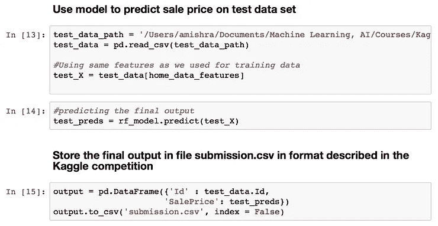

这里使用的代码是一个简化版本。最终的预测还有很大的改进空间。你可以在不断学习的过程中不断修改代码，改进预测。我在这里的目的是让你感受一下机器学习和 python 可以做什么。下一步是向 Kaggle 提交预测，即 submission.csv 文件。

**第五步:成功将预测输出提交给 Kaggle 竞赛，并在排行榜上看到自己的名字。**

进入[比赛页面](https://www.kaggle.com/c/home-data-for-ml-course/submit)。点击提交预测并上传 submission.csv 文件。

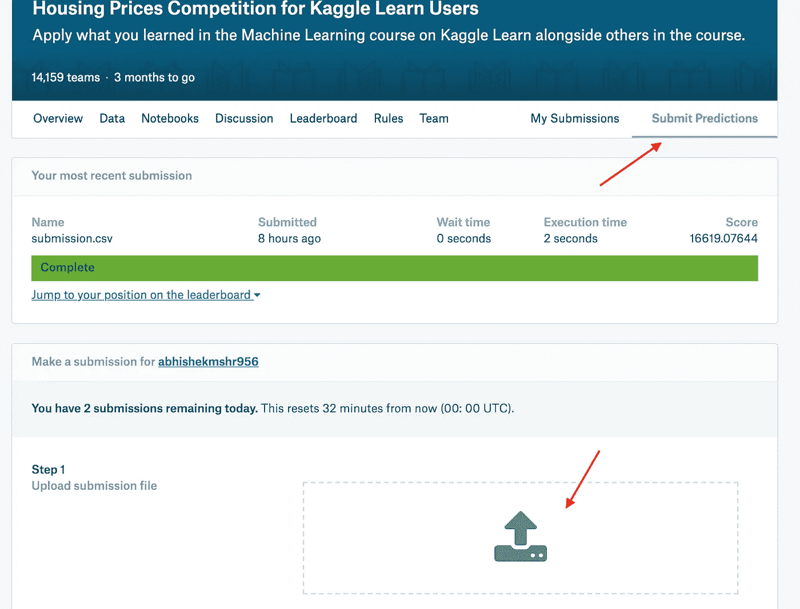

提交完成后，您可以在排行榜上查看自己的名字。随着你不断学习，你将不断提高最终预测。可以重新提交输出，不断提高分数。一切顺利，学习愉快:)