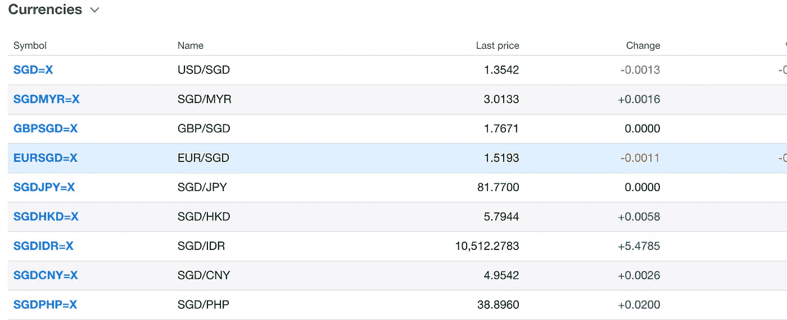
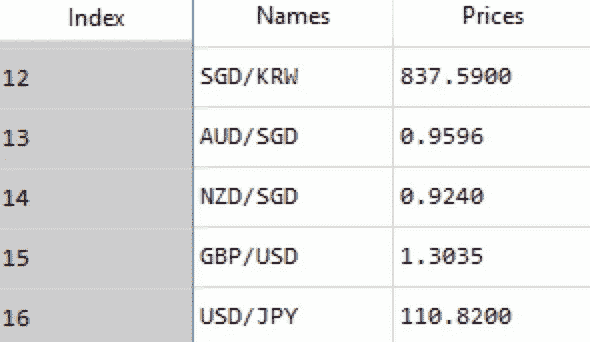
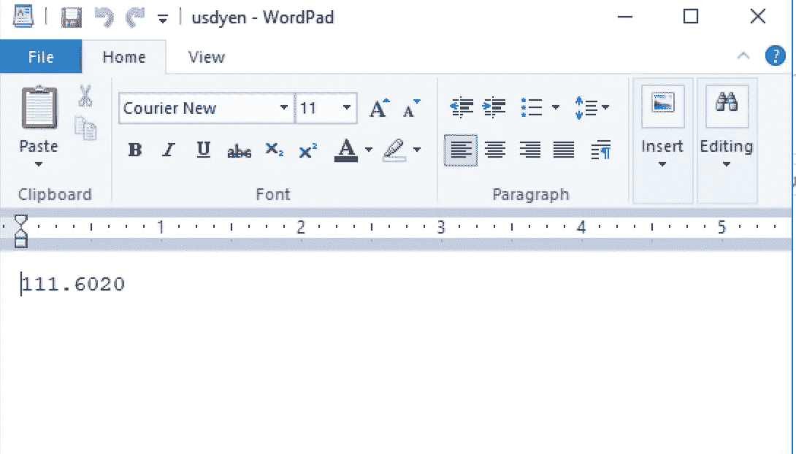
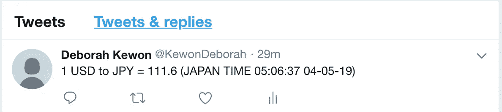

# 如何获得关于货币汇率的 Twitter 通知:网络抓取和自动化

> 原文：<https://towardsdatascience.com/how-to-get-twitter-notifications-on-currency-exchange-rate-web-scraping-and-automation-94a7eb240d60?source=collection_archive---------19----------------------->

Image by Photo Mix from Pixabay

随着世界变得更加一体化，我们比以往任何时候都更加紧密地联系在一起。更多的学生出国留学，更多的人环游世界。无论是为了教育还是为了旅游，当我们出国或向外国汇款时，我们不得不考虑汇率。出于这个原因，我创建了一个自动通知系统，当指定货币的汇率下降或上升时，我们可以收到 Twitter 警报。

在本文中，我将解释我是如何从雅虎财经搜集汇率数据，并通过 Twitter 建立自动通知系统的。我们开始吧！

# **1。安装网页抓取所需的软件包**

我首先安装了几个必需的包。BeautifulSoup 用于解析 HTML 页面，与时间相关的包用于记录货币兑换的日期和时间。

# 2.使用 BeautifulSoup 从 Yahoo Finance 中删除汇率数据

Structure of Yahoo Finance

如上图所示，雅虎财经由“符号”、“名称”、“最后价格”和“变化”组成。对于这篇文章，我只使用了“名称”和“最后价格”。

使用 BeautifulSoup，我解析了汇率页面。

解析之后，我使用 for 循环语句提取一些信息。因为我不需要完整的数据，所以我在第 40 次观察时开始解析，在第 404 次观察时停止，间隔为 14，并创建了一个只有“名称”和“最后价格”信息的货币数据帧。

由于我对美元/日元汇率感兴趣(1 美元等于多少日元？)，我选择了第 16 次观察，赋给 now_usd_jpy(当前美元/JPY 汇率)。

dataframe “Currency”

我从雅虎财经提取的汇率记录在我创建的文本文件“usdyen”中。如果当前汇率与旧汇率不同，则当前汇率会替换旧汇率。

Text file where I recorded the current USD/JPY exchange rate

# 3.通过 Twitter 建立一个自动通知系统

现在是时候通过 Twitter 建立一个自动通知系统了。让我们根据文本文件中记录的汇率向我们的 Twitter 关注者发送汇率通知。

为了做到这一点，我安装了 TwitterAPI 并请求 Twitter 提供访问令牌(更多详细信息，请参考【https://developer.twitter.com/】en/docs/basics/authentic ation/guides/access-tokens . html)。有了访问令牌，我的程序现在可以用“1 美元兑日元= 111.6(日本时间 05:06:37 04–05–19)”的格式发布美元兑日元的汇率。

USD/JPY exchange rate tweet

如果我们只是在 Twitter 上更新汇率，那就没什么意思了。每当我们想知道汇率时，手动运行程序实际上没有意义。说到这里，我让程序全天候运行。每隔 5 小时(60 秒 x 60 秒 x 5 小时)，我的算法会自动检查当前的货币汇率并更新旧的货币汇率，然后发布到 Twitter 上。由于 Twitter 不允许发布相同的消息，所以我使用 try 和 except block 使其可以接受。

上面提到的 web 抓取和自动化算法非常易于使用，并且可以灵活地应用于加密货币和股票价格等其他主题。在下一篇文章中，我想讨论 Rasberry pi——我们如何使用 Raspberry pi 让程序 24/7 运行，因为在我们的计算机或笔记本电脑上整天运行这个 python 脚本不是很实际。

感谢您的阅读！我希望我的文章是有帮助的，并且容易理解。如果您有任何意见或反馈，请随时在下面留下您的评论。

如果你喜欢我做的事情，请不要犹豫，在 [GitHub](https://github.com/dkewon) 上关注我，在 [Linkedin](https://www.linkedin.com/in/deborah-kewon/) 上与我联系。