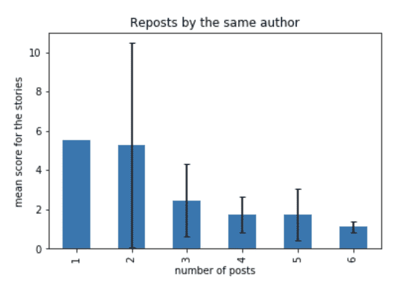

# 如何在黑客新闻上获得投票

> 原文：<https://towardsdatascience.com/how-to-get-upvoted-on-hacker-news-692360e85ef8?source=collection_archive---------20----------------------->

## 来自一个在 HN 最多只能投一票的人

Photo by [Ben White](https://unsplash.com/@benwhitephotography?utm_source=medium&utm_medium=referral) on [Unsplash](https://unsplash.com?utm_source=medium&utm_medium=referral)

# 动机

[黑客新闻](https://news.ycombinator.com/)定期向 Kaggle 发布一个数据集。当我看着我的帖子在“新”部分迅速消失时，我想知道分数和故事在“新”部分的可见部分保留多长时间之间的关系，这提高了向上投票的概率。

在这篇文章中，我研究了分数和故事的不同属性之间的相关性:

*   发布日期/时间，显示发布的故事比率和分数之间的关系
*   故事类型(展示 HN……)
*   转贴效率
*   主题类别(仅使用 NLP 从标题中聚类故事)

附带的笔记本可以在 [Kaggle](https://www.kaggle.com/blocks/hacker-news-better-days-to-post) 上找到。

# HN 数据集的初步观察

我们来看看分数的分布。分数从 1 开始(当你发布你的故事时，你会自动投自己一票，这就是我目前的分数:)。

Distribution of score (capped to 20) on Hacker News

> 在黑客新闻上发布一个故事就像抛硬币一样。你的故事得不到支持的可能性大约是 50%

让我们通过对标题进行单词云来快速阅读 HN 上发布的主题。

Ask HN and Show HN not surprisingly stand out in word frequency

有 3.4%的展示 HN 故事和 3.3%的询问 HN 故事。让我们把这些从标题中去掉。

Hacker News summarized

更多关于趋势话题的信息，请见文章末尾。让我们深入了解是什么影响了分数。

# 周末出版

看看分数和几个计算属性之间的相关矩阵，最大的影响因素是一周中的某一天。

Correlation matrix of the score and other attributes of the posting

放大每周日的平均分数，我们看到周末日非常突出。

Scores are on average higher during the week-end, and so is the time between stories posted.

同样在周末，发布的故事也比平时少。周六故事之间的平均时间约为 300 万，约为周一等工作日的两倍。

不足为奇的是，当绘制平均分与故事之间的平均时间时，你会得到一个非常好的趋势。应该有同等影响的是观众的数量，我们不知道，但根据简单的假设，平均得分= k *读者*故事之间的时间，那么周末 HN 的读者应该会减少 25%左右。

Choose your luck

> 这导致周末期间的平均故事分数比一周内高出约 30%。

# 做一个创造者(或者保持好奇心)

“展示 HN”的故事比“询问 HN”的故事更受欢迎，后者又比普通帖子更受欢迎。运行演示的价值是一个显著的优势。

> 一个普通的故事被否决的可能性是 50%,而一个 HN 秀的故事被否决的可能性是 30%

# 故事转贴的效率

虽然黑客新闻政策允许在合理范围内转发，但一些用户或机器人显然在滥用它，没有得到回报。

大约 4%的故事被发布了不止一次(基于标题是相同的，所以这是一个下限)。在转帖的高端，这些是我们发现的故事…

Of utmost quality

看看平均分数和转发次数，我们看到它上升到 3 次转发，然后下降，暗示垃圾邮件，如上表所示。

Higher reposts appear to be correlated with low quality of stories

由于其中一些转发来自不同的人，可能是代理一个值得注意的故事，而不是为了能见度，现在让我们来看看由同一作者转发的同一故事。下图显示了转帖的显著差异。

Big variation on story score with reposts, for apparently higher quality stories

我们可以看到你的分数有很大的变化，转贴的分数低，转贴的分数高(分数低的假设从没有足够的眼球到没有足够的兴趣)。这是一个平均值，你可以从最近的例子中看到一些边缘情况，分数徘徊在 2 左右，然后在 8 次转发后爆炸到 192。

Know your prior

让我们仔细看看你能获得的最高分和你的初始分。

Note the number of reposts are going down dramatically after 3, the bump on 5 is likely not significant

> 在转贴你的故事时，平均来说，你的得分会是最初的三倍多。最有影响力的转发日是周末

Looking at the days where repost is most effective

# 自我参考黑客新闻获得 50%的分数提升

黑客新闻喜欢黑客新闻。虽然这些故事(在标题中寻找“黑客新闻”)很少(0.2%)，但它们的平均得分为 8.4，而非黑客新闻故事的平均得分为 5.6。

> 关于 HN 的故事比平均得分高 50%

# 话题发现和流行度

我想做一些有趣的话题发现，看看是否有特定的话题得分通常较高。

为此，我使用 BERT 计算了标题的嵌入(在这种情况下，我对每个单词的嵌入进行了平均，以获得句子的固定向量长度)，还尝试了 [Google 的句子编码器](https://ai.googleblog.com/2019/07/multilingual-universal-sentence-encoder.html)，结果工作得更快更好。虽然在如此高的维度上(句子编码为 512 长)通常使用余弦距离(由于点在边缘上，成对距离是相似的)，但在实践中，我发现对于 Google 的句子嵌入器(Transfomer 的编码器)的输出，欧几里德距离给出了更好的结果。此外，这种类型的分析是内存饥饿，所以我只能在我的标准问题 kaggle 内核上采样 30000 个标题。

这是发现的主题，以及它们的平均分数。**请注意，这是日期，可用数据集涵盖 2013 年 12 月至 2015 年 10 月期间**

Popular topics: web technology, net neutrality, the next frontier and privacy

And some unpopular topics: Hacker News readers write software and like users to be fair with it, and rise on their own merits

> 热门话题:网络技术、隐私、网络中立和太空探索。当然还有人工智能。

The learning machine king (ok, not many samples…)

# TL；速度三角形定位法(dead reckoning)

*   在太平洋时间 12 点左右的周末出版
*   转贴你的故事是有效的，但仅仅超过一次。
*   黑客新闻奖励工作代码(展示 HN 的故事)