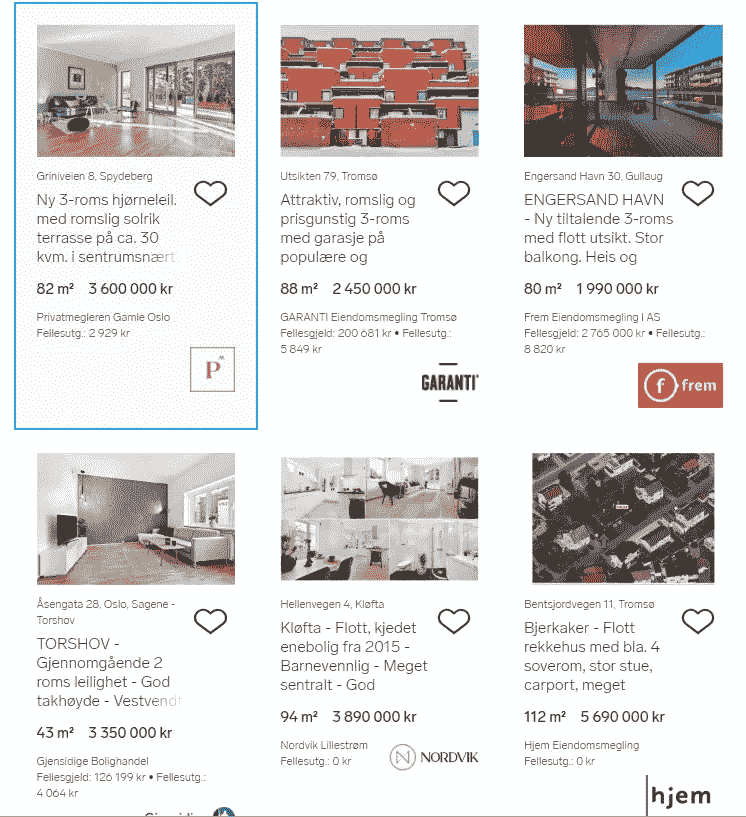
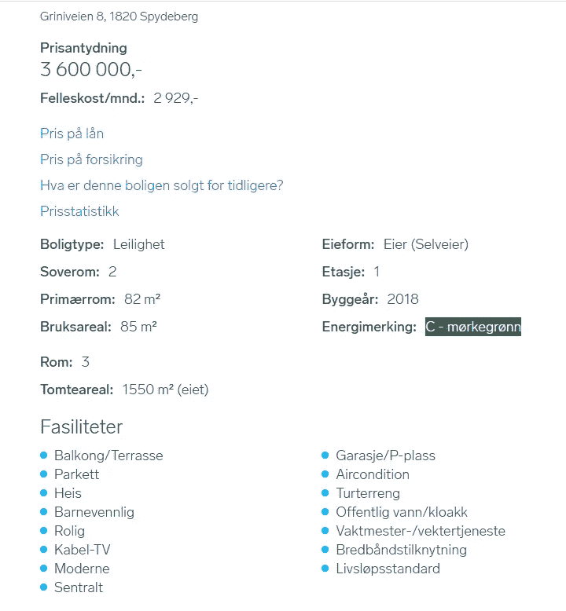
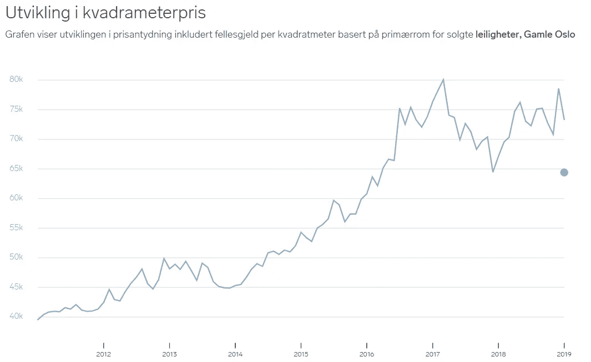
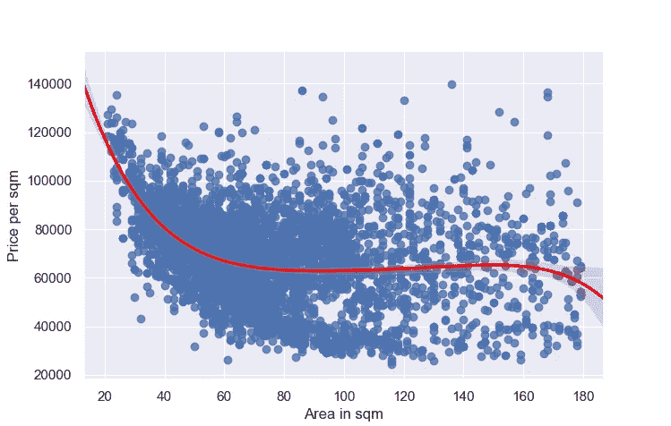
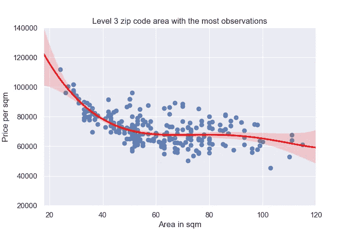
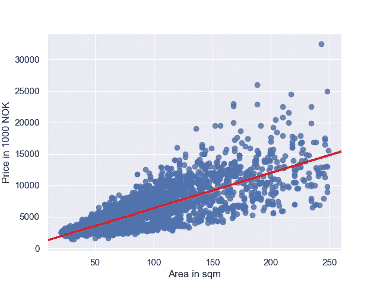
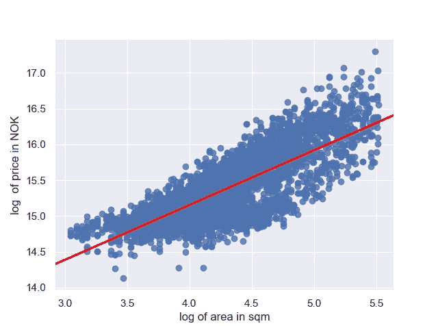
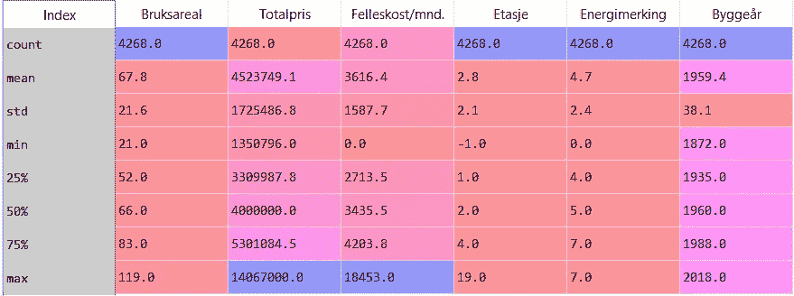

# 如何从偏见走向购买者

> 原文：<https://towardsdatascience.com/how-to-go-from-bias-to-buyer-2fd25d5e8e4a?source=collection_archive---------22----------------------->


Photo by [Arvid Malde](https://unsplash.com/@omalley?utm_source=medium&utm_medium=referral) on [Unsplash](https://unsplash.com?utm_source=medium&utm_medium=referral)

这里有很多关于估算房价的文章，也有很多关于网络搜集的文章。虽然这两者在本文中都有所涉及，但我还想重点关注那些在使用数据进行决策支持时非常容易上当的典型偏见。

最近，我离开了美丽的阿姆斯特丹，离开了一个很棒的社区里一个可爱的、明亮的小城市公寓，只是为了在奥斯陆我岳父母冰冷的地下室里过一种类似肉体的生活。不完全有资格被称为伟大的成功故事。
但因为我知道这一天会到来，我提前几个月就开始网上搜索当地的房地产市场，以尽可能缩短我寄生生活的时间，重新找到自己的家，并利用(幻觉中的)高级信息这样做。

我过去使用网络抓取收集谷歌新闻标题，这相当容易，因为我访问的网站结构非常简单。这一次，结构有点复杂，所以让我先解释一下这个网站:
网站 finn.no 是挪威几乎所有内容的首选网站。这是一个二手市场，就像房地产或就业市场一样。在房地产板块，网站提供了大约 50 个公寓的缩略图，你可以点击浏览几十个页面。



Typical structure of the real estate website

缩略图包含的信息比住房单元的大小和价格多不了多少。只有当你通过缩略图链接到一个新的网站时，你才能得到所有相关的信息，所以我不得不分两轮设置网页抓取器。

第一部分将从每个页面的每个缩略图收集“href”或链接，并将它们写入一个简单的列表。在第二部分中，一个循环遍历收集到的链接，逐个访问特定的 web 地址，并从每个存储了更多有趣信息的网站收集所有细节。



Detailed information after accessing an individual ad

高层结构到此为止。我使用 BeautifulSoup 包进行网络搜集，并收集了许多 *try- except: Exception pass* 语句的属性。这些代码的工作原理听起来很像:它们试图处理某个命令，但是如果它不起作用，代码就会继续运行。这在处理稍微不同的内容时是完美的，例如网页具有非常相似的结构，但不完全相同的元素。没有指定建造年份？没问题，代码继续运行，没有错误。

我在嵌套字典中收集了详细信息。在最高级别上，href 充当键，值是属性的集合。这个集合同样由多个键(属性名)和值(属性值)组成。


On the top in the back is the high level key (the web-address) and the value. In the front is this value expanded, showing the lower level key and value pairs.

字典在格式上很灵活，使用高级关键字作为索引，低级关键字作为列，可以非常快地转换成整洁的数据帧。在收集非数字属性并将它们转换成虚拟变量时，它们也很方便。像`{balcony:1}`这样的属性可以很容易地作为键值对收集。稍后，当将字典转换成数据帧时，键变成一个单独的列，不包含阳台键-值对的数据点得到一个`None`条目。通过一个 liner 和 Python 的`df.fillna(0)`命令，我们可以用 0 替换 None 条目，并立即得到一个二进制虚拟变量列，指示是否存在阳台。

我对奥斯陆的所有公寓运行了一次 webscraper，然后添加了一个“今天新”过滤器，并设置了一个任务调度程序来每天运行它，每天用大约 50 到 100 个新数据点扩展数据集。奥斯陆不是一个大城市，冬季是房地产市场的淡季，但几个月后，数据集约为 5500 次观察。足以获得一些洞察力和更好的市场信息。

一旦你在 Finn 上发现了一个有趣的广告，你就可以看到同一地区一段时间内出售的住房单元的平均价格，并检查你选择的单元与这个平均价格相比如何。



Finn shows average prices per m² over time in an area. The green dot displays the housing unit you inspect.

如果一所房子相对便宜或昂贵，人们很容易将此作为一个指标，我曾有房地产经纪人告诉我，某套公寓的价格“低于该地区的平均价格”。但是，如果你看到平均价格是每平方米 75 000 挪威克朗，而有问题的单元以每平方米 65 000 欧元的价格售出，这并不一定意味着它是“偷窃”。通常小公寓的每平方米价格较高，大公寓的价格较低。因此，一个地区显示的平均价格可能包含许多每平方米价格非常高的小公寓。如果你正在查看的“低于平均价格”的房子比**的平均价格**大得多，那么它的每平方米价格仍然可能比同一地区同样大的**公寓贵。让我们看看在我的数据集中，m 的价格是否真的随着大小而下降:**



Price per m² by size

这种趋势在 45 平方米以下的小公寓中尤为明显，几乎不可能找到每平方米价格低于 10 万挪威克朗(在撰写本文时约为 1 万欧元)的 25 平方米的工作室。但是小公寓也经常聚集在最吸引人的地段，因此 m 价自然已经因此而更高了。调查同一地区内的同一张图片**降低了位置差异的影响，并表明这种影响持续存在:较小的公寓具有较高的 m 价格。每个人都知道比较平均值是棘手的，但值得思考的变量在发挥作用，以避免做出粗糙的误判。**



我发现了我的数据库的另一个非常方便的特性；在浏览数据时，我注意到有些公寓已经被上传了不止一次，而且价格也有所调整。我很快得出结论，这将告诉我总体市场趋势的方向。正如我们所看到的，几乎所有这些都向下调整了一个大约-5%的大峰值！


Density plot of the price adjustments done on re-uploaded ads.

公寓以更低的价格重新上传对整个市场意味着什么？有那么一会儿，我推断价格正在下降，我说得对吗？不，我没有。想象一下从低价到高价的公寓分布。定价过低的公寓卖得很快，甚至可能高于最初的要价。在中间区间，具有公平要价的单位也在没有更大发行的情况下被出售，并离开市场，因此价格过低和价格公平的区间都消失了。我们只观察定价过高的设备，需要用更有竞争力的价格标签再试一次。我们从来没有看到定价过低的作品以高于其售价的价格上传。生存偏见的一种形式在这里发挥作用，而不一定是挪威房地产市场的崩溃。我仍然认为，如果你对某个特定的公寓感兴趣，并且观察到它没有卖出某个价格，回来时更便宜，这是有用的信息。想象一下，你会去看这样一套公寓。你已经知道市场拒绝了某个价格，你可能不会在第一个不成功的价格区域出价。知道卖方可能会变得不耐烦，这也可能会给谈判一点点权力。

几周后，我发现了一个我非常喜欢的公寓的广告。它看起来相对便宜，但是只有平均价格。不，我怎么能确定。我认为，根据我的数据集训练的预测模型，并预测我感兴趣的公寓价格可能会有所帮助。清理完数据后，最好稍微研究一下数据，寻找可以转换或删除以获得更好的拟合和性能的要素。让我们先看看奥斯陆的 m 和房价之间的一般关系，并在此基础上进行线性拟合。



我们观察到预期的积极关系和住房市场散点图的一个共同属性:价格的方差随着单元的大小而增加。虽然具有这种扩展形状的回归模型中的估计量保持无偏，并且预测模型仍然是可行的，但是通常有一种简单的方法来解释这种现象(称为异方差)。我们可以取两个变量的对数，而不是大小和价格之间的线性关系。



查看对数散点图，我们可以看到散点图的分布有所减少。

接下来，我必须从收集的大量属性中选择有意义的特征。我见过有人用散点图进行特征选择。他们探索解释变量和目标变量之间所谓的因果关系。有时结论是特征对目标变量没有影响，因为图形显示的是水平线拟合。但是散点图只是多维关系的二维表示，因此，它并不能说明全部情况。想象一下这个例子:假设我们有不同大小和不同位置的房子。最小的一个直接在热门的市中心。其他的位于离市中心越来越远的地方，并且随着距离的增加也越来越大。到中心的距离增加的负面影响抵消了额外的占地面积将带来的价格上涨。如果你把这些观察结果绘制成散点图，y 轴是价格，x 轴是尺寸，你可能会观察到一条水平线，并错误地得出尺寸对价格绝对没有影响的结论。我们宣扬相关性不一定意味着因果关系，但是没有相关性也不意味着没有潜在的因果关系。图中只显示了孤立的两个维度，但没有给出一些特征如何相互作用的信息。

为了研究这种相互作用，通常使用相关矩阵。对我来说，重要的是要记住，**数据是如何产生的。并不是每个观察都有价值。房地产经纪人只是列出他们认为值得列出的东西。由于许多变量经常以完全相同的措辞出现，可能会有预先选择的属性可供选择，但许多“奇异”的特征对于特定的广告只出现一次，这表明它们是手动输入的。因此，一些看似可靠的变量被视为不可靠，并显示出与其他特征的错误相关程度。一些广告声称房子或公寓在“中心”。价格的一个主要驱动力当然是它所处的区域，或者像每个房地产经纪人所宣扬的那样:“位置，位置，位置！”**

但并不是每个位于中心的住房单元都在数据集中获得了这一属性。只有那些房产经纪人想特别强调这种品质的房子。
比依赖这样一个弱功能更好的方法是根据住房单元的地址创建邮政编码虚拟变量。我们无法列出某个地点吸引人的每一个单独因素，我们当然也无法从芬恩那里收集这些因素，但我们知道或接受一些邮政编码通常是好的地点。邮政编码模型捕捉了一个地方无法解释的全部吸引力，包括位于市中心、有很棒的学校或低犯罪率。由于邮政编码通常在地理上是群集的(0251 紧挨着 0252，以此类推)，我们使用一个更高的级别，比如 3 位数，来对邮政编码进行分组，并确保我们对每个邮政编码哑元有足够的观察。为了得到邮政编码假人，你可以使用非常方便的“get_dummies”函数:

```
df = pd.concat([df, pd.get_dummies(df.post_code3)], axis=1)
```

同样重要的是要记住，广告就是广告(废话),因此只列出积极的属性，有时会方便地省略掉那些可能被认为是消极的属性(一楼的公寓经常“忘记”说明他们所在的楼层)。对此我无能为力。但是，即使没有这种复杂性，数据中属性相同的两个公寓也不一定是相同的。在我的数据中，如果一套公寓的窗外被邻近建筑的外墙挡住，或者浴室看起来像 70 年代的半腐烂真菌换妻派对，那么没有属性捕捉到这一特征。数据捕捉到了很多东西，但审美不在其中。所以预测也不会考虑公寓的条件。

另一方面，连续变量相当可靠，因为它们包含最基本的信息。



From left to right: floorspace, price (in NOK), running costs, floor, energylabel (converted from letters), construction year.

在分类变量中，我发现最有用的是:房屋类型和所有权的模型、邮政编码、有无阳台、花园、壁炉(在挪威非常普遍和流行)→所有观察的 25%!)、电梯、车库或停车点。我还保留了一些更“奇特”的假人，如果它们被足够频繁地提到(超过 10%的观察)，但不会像“基本的下水道入口”那样过时。这些变量包括“看门人服务”。

我运行了两个不同的模型。对数规范中的线性回归和梯度推进模型。在训练模型之前，我分离了我想要预测的一个观察值，以便该观察值是真正“新”的。对于线性模型，没有必要进行训练-测试-分割，因为如果限制估计量的函数形式，过拟合就不是问题。

```
from sklearn.metrics import mean_squared_errorfrom sklearn.linear_model import LinearRegression
Y = df.price_log
X = df.drop(columns = 'price_log')
regressor = LinearRegression()
regressor.fit(X, Y)
print('Liner Regression R squared: %.4f' % regressor.score(X, Y))
mse_linear = mean_squared_error(Y, regressor.predict(X))
print("MSE: %.4f" % mse_linear)
regressor.predict(ad_for_pred)
```

对于梯度推进模型，我尝试了一些参数设置，但没有花太多时间优化它们，因为预测不会随着每次变化而显著变化。在线性模型中，测试集的 R 比整个集的 R 稍高(0.89 比 0.85)，并且均方误差降低(0.012 比 0.014)。该模型很容易建立:

```
from sklearn.model_selection import train_test_split
from sklearn import ensemble
X_train, X_test, y_train, y_test = train_test_split(X, Y, test_size=0.3, random_state=0)
params = {'n_estimators': 500, 'max_depth': 4, 'min_samples_split': 30, 'min_samples_leaf':10,'learning_rate': 0.1, 'loss': 'ls'}
regressor_gr_boost = ensemble.GradientBoostingRegressor(**params)regressor_gr_boost.fit(X_train, y_train)
mse_gb = mean_squared_error(y_test, regressor_gr_boost.predict(X_test))
print("MSE: %.4f" % mse_gb)
print('Gradient Boosting training set R squared: %.4f' %regressor_gr_boost.score(X_train,  y_train)
print('Gradient Boosting test set R squared: %.4f' %regressor_gr_boost.score(X_test,  y_test)
regressor_gr_boost.predict(ad_for_pred)
```

根据线性预测，我感兴趣的物品的价格比 Finn 上列出的要价高 5%。梯度增强显示甚至有 8%的差异。在这种情况下，准确的预测是次要的，鉴于之前讨论的数据质量缺陷，对欧元肯定是不正确的。但我们得到了一个明确的指示，鉴于其特点，该公寓的价格处于低端。

我决定去看房，看看这套公寓是否物有所值。它位于一条热闹的街道上，有许多商店和咖啡馆，但也有一些交通，甚至有一条电车线，这可能是价格较低的原因。我仍然认为它相对便宜，因为我的预测给了我一种感觉，如果我要在一个更安静的小街上寻找一个类似的公寓，我必须期待的价格。其实最后还是买了(真人真事，不只是为了本文的叙述)。数据分析并没有让我决定买什么样的公寓，但它提供了决策支持。当我获得几十万欧元的贷款时，我会很乐意接受任何我能得到的支持。