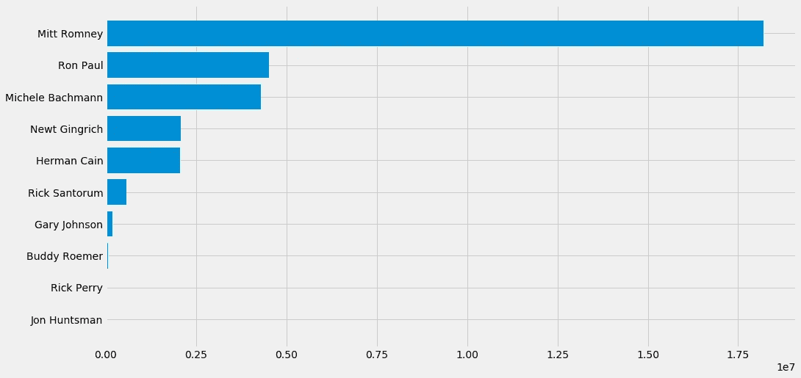
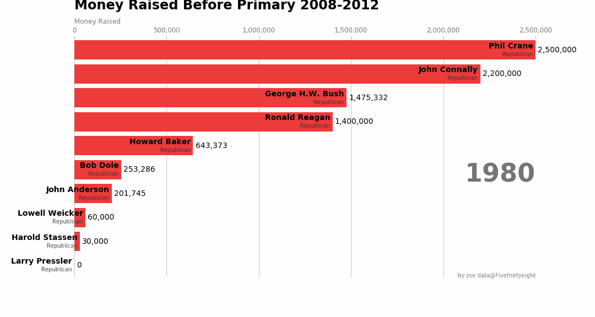

# 条形图竞赛？

> 原文：<https://towardsdatascience.com/how-to-graph-a-bar-chart-race-and-realize-i-dont-need-one-4af698998b2e?source=collection_archive---------22----------------------->

我的好奇心始于这种在 reddit/datasibeautiful、youtube/wawamustats 上非常流行的“条形图竞赛”。

有一种更简单的方法，你可以输入你的参数，制作你自己的条形图比赛。[https://app.flourish.studio/@flourish/bar-chart-race](https://app.flourish.studio/@flourish/bar-chart-race)。看起来是这样的:

[https://youtu.be/dwCXwaBghpc](https://youtu.be/dwCXwaBghpc)

数据科学家喜欢应用如此多的模型和方法，但当涉及到向具有各种技术技能水平的人解释时。图表抓住了注意力，更好地进行叙述。

为了练习和展示一个例子，我从 FiveThirtyEight github repo:【https://github.com/fivethirtyeight/data/】T2 获得数据集，或者如果你是一个 R 用户，有一个直接的包，你可以安装并从中获得乐趣。我的练习数据集是关于:[https://github . com/fivethirtyeight/data/tree/master/approvals-June-30](https://github.com/fivethirtyeight/data/tree/master/endorsements-june-30)的数据集。数据集是关于初选前的背书数据。其中包括 2000 年至 2012 年 6 月 30 日前候选人的背书点数据。

如果你对我如何绘制赛车条形图感兴趣，你可以阅读我在本教程中关于如何使用 *matplotlib.animation* 模块从简单的 matplotlib 动画开始的笔记。

让我们一步一步来看看发生了什么。导入所需的模块后。获得 FiveThirtyEight 样式的一个简单方法是使用 style.use()。Matplotlib 还有一个动画模块，可以帮你做大部分工作。

*   步骤 1:导入库

让我们尝试绘制将在动画结尾显示的第一个条形图，这是观众应该看到的最后一帧。

*   步骤 2:布局基本条形图

步骤 3:添加颜色和分组数据

我使用 python 颜色常量模块来格式化颜色:

 [## Python 颜色常量模块- Webucator 博客

### 对于 Pygame 和其他图形作品，拥有保存颜色 RGB 值的颜色常量是很有帮助的。我不能…

www.webucator.com](https://www.webucator.com/blog/2015/03/python-color-constants-module/) 

*   第四步:将它们放入一个函数中

第五步:使用动画。FucAnimation 函数来完成画面

您也可以导出为 gif 或 mov 文件。在*中，只需改变速度参数 fps(每秒频率)和 dpi 来调整分辨率。保存*功能。

我完全可以带着后见之明的偏见阅读图表，竞选资金并不能预测候选人的表现。但除此之外，一个很酷的动画条形图并不能告诉你未来会发生什么。毕竟，如果我们想阅读一篇真正科学和分析性的文章，仅仅进行一些可视化是远远不够的。我研究了内特.西尔弗和他的团队。以下是一些关键要点。

## 先问正确的问题

当 x 轴上有大范围的值和 y 轴上有分类变量时，条形图竞赛的类型是这种情况的典型代表。看到这些年来的巨大变化或谁在某些行业“领先”是很有趣的。然而，对于像这样的特定数据集，没有足够的年度数据来绘制条形图竞赛。在这次尝试之后，我再也不会为了仅仅是为了审美上的绘图或者为了它的流行而开始绘图了。

根据对 FiveThirtyEight 的编辑和评论员的采访，在他们的主要“项目”中，该团队提出了一个问题——“谁将在 2016 年赢得总统大选？”，“唐纳德·特朗普有多受欢迎/不受欢迎？”—然后确定要包括哪些类型的数据集，并相应地构建模型。该方法大致基于棒球衍生的策略“ *sabermetrics* ”，即统计学家收集广泛和深入的可能相关的定量信息，并使用它来模拟潜在的未来结果。科学家这个词提醒我们所有人，工程思维和科学思维都是前进道路上的精华。

## 图表的准确性

上面条形图的主要视觉指示器是频率计数，而不是突出显示百分比。这种可视化强调了数据分析的科学本质，而不是提供一个理想的，但更容易解读的对现在演员比例的未来的一瞥。这种方法也有助于数据可视化中正在进行的问题，其中“美丽”数据的美学与如何准确传达信息的问题相交叉——这是艺术辩论中常见的形式挑战。( *1)*

除了创建精确的图表，并不总是有一致的数字解释。Nate Silver 在一次采访中提到，73%的读者误读了他们发布的图表和结果，称其中一些人没有以正确的方式解释几率和百分比。数据新闻似乎在我们身上有如此大的力量，有可能改变我们的认知和行为。

参考资料:

1.  t .布莱克(2018)。数字不会说谎:FiveThirtyEight 概率预测中的事实和未来。*剧院杂志* *70* (4)，519–538
2.  斯蒂格勒(2016)。统计智慧的七大支柱