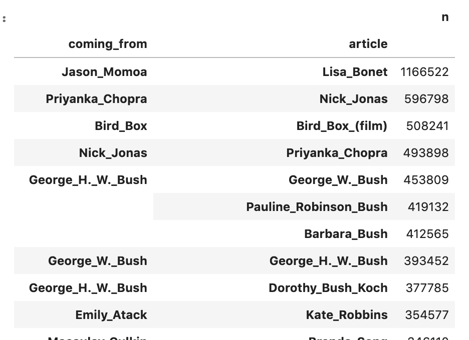
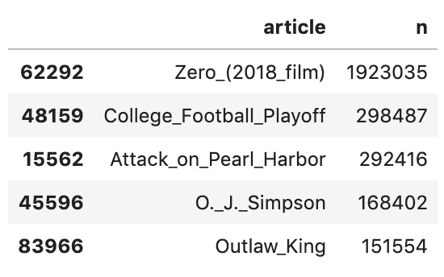
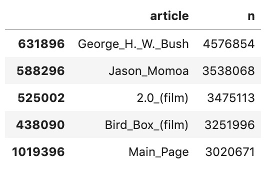
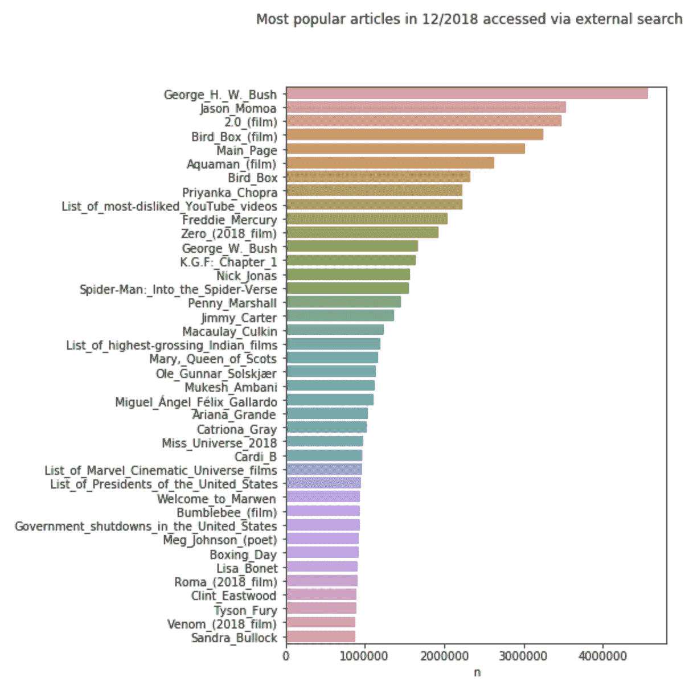
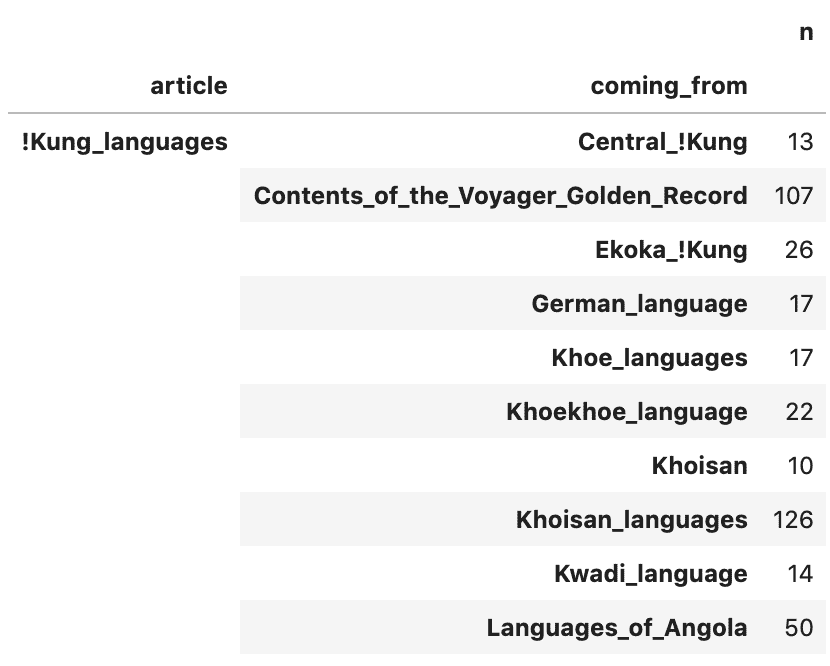
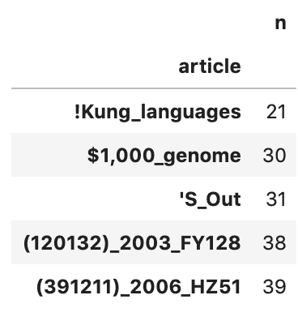
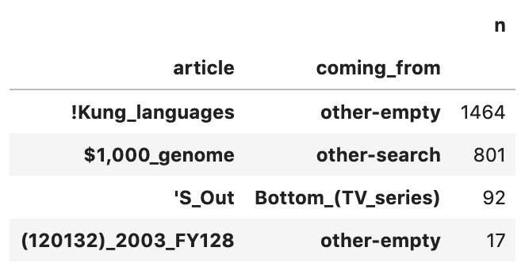
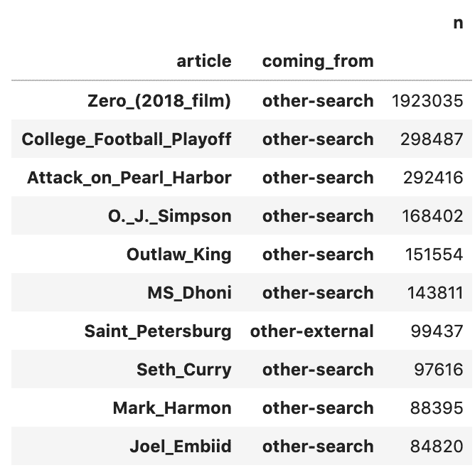
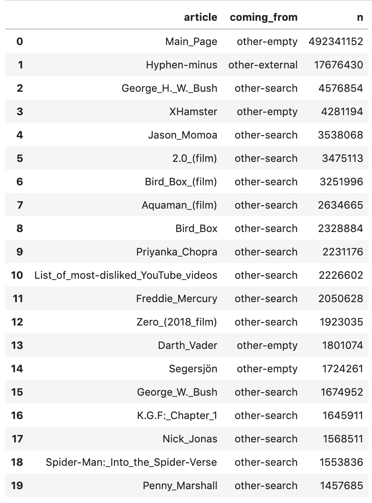

# 如何用 Pandas 和 Dask 在 Python 中处理大型数据集

> 原文：<https://towardsdatascience.com/how-to-handle-large-datasets-in-python-with-pandas-and-dask-34f43a897d55?source=collection_archive---------2----------------------->

## 如何使用 Pandas 和 Dask 进行并行计算来处理大型数据集，以及何时将更大的问题转移到 SQL。

# TL；速度三角形定位法(dead reckoning)

Python 数据科学家经常使用熊猫来处理表格。虽然 Pandas 非常适合中小型数据集，但较大的数据集存在问题。在本文中，我将展示如何使用 Pandas 和 Dask 并行计算来处理大型数据集——以及在其他方法都失败的情况下何时将更大的问题转移到 SQL。


Photo by [Debbie Molle](https://unsplash.com/@djmle29n?utm_source=medium&utm_medium=referral) on [Unsplash](https://unsplash.com?utm_source=medium&utm_medium=referral)

# 在大型数据集上使用熊猫

Pandas 是一个处理数据表的极好的库。它的 dataframe 构造为数据分析提供了一个非常强大的工作流，类似于 R 生态系统。它相当快，功能丰富，并且有据可查。事实上，它已经成为遵循 Python 方式的数据科学家使用的基本工具。

然而，在使用 Python 而不是 R 的数据科学家的生活中，总会有笔记本电脑发脾气、拒绝再做任何工作、死机的时候。

尽管如此，Pandas 在执行计算时通过将数据集保存在 RAM 中来实现其速度。这就是为什么它有一定的限制(当然，这也取决于机器的规格)。

# 为什么会这样？

该问题通常源于过度复杂的转换过程中数据帧的意外扩展，或者从文件盲目导入表。这可能非常令人沮丧。

# 那么如何才能修复呢？

一种解决方案是将数据限制在一个较小的子集内——例如，每隔 n 个值探测一次数据源。但通常这还不够。

但是如果限制数据不是一个选项呢？

# 是不是意味着我们就是不能用熊猫做大数据集？

幸运的是，有一种方法可以解决这个问题。

最常见的解决方案是将 Pandas 与另一个解决方案结合使用，如关系型 SQL 数据库、MongoDB、ElasticSearch 或类似的解决方案。在 Sunscrapers，我们完全同意这种方法。

**但是你有时可以使用 Pandas 和另一个方便的** [**开源 Python 库**](https://sunscrapers.com/blog/python-best-practices-how-to-contribute-to-python-open-source-projects/?utm_source=medium&utm_medium=article) **、Dask 来处理 Python 中大于内存的数据集。**

Dask 是一个健壮的 Python 库，用于执行分布式和并行计算。它还为 Python 定义的任务(类似于 Apache Airflow)的动态调度提供了工具。它与 NumPy 紧密集成，并为 Pandas 提供了数据帧等效结构——dask . data frames——该结构基于延迟加载，可用于以块和并行方式执行数据帧操作。它还通过在幕后执行数据洗牌来自动支持分组。

**本文概述了一些方便的提示和技巧，帮助开发人员在使用 Python 处理大型数据集时减少一些障碍。**

# 这是数据集

为了展示 Pandas/Dask 的威力，我从维基百科[选择了一个关于网站访问者来源的开源数据集。您可以在](https://meta.wikimedia.org/wiki/Research:Wikipedia_clickstream)这里获得【点击流】表格(在`.tsv` ) [。](https://dumps.wikimedia.org/other/clickstream/)

点击流数据包含 4 个主要列:

1.  **Prev**’—访问者来自的站点(我将其重命名为‘coming _ from’)
2.  **curr**’—目标文章页面(重命名为“文章”)
3.  **类型**’—该列描述了推荐的类型，例如，外部链接(我将其重命名为‘referral _ type’)
4.  **n**’—访问次数

接下来，我想出了几个问题来摆弄我的数据集，并检查 Pandas 和 Dask 的组合是否有效:

1.  **在给定的文章中，人们最常点击哪些链接？**
2.  **用户从所有外部搜索引擎获取的最受欢迎的文章是什么？**
3.  **在一个给定的文章页面上，有百分之多少的访问者点击了链接到达那里？**
4.  **每篇文章最常见的访问来源是什么？(显示在单个表格中)**

数据集大小为 1.4 Gb，因此存在内存过载的巨大风险。这就是为什么我把研究分成两部分。

首先，我只使用 Pandas 库对有限的数据子集进行了分析。然后，我尝试使用 Dask 在完整集上做完全相同的操作。

好了，接下来进行分析。

# 准备数据集

让我们获取数据进行分析:

```
if [ ! -d “./data” ] 
then
 mkdir ./data
 echo ‘created folder ./data’
fi*# get the data if not present:*
if [ ! -f “./data/clickstream_data.tsv” ]; then
 if [ ! -f “./data/clickstream_data.tsv.gz” ]
 then
 wget [https://dumps.wikimedia.org/other/clickstream/2018-12/clickstream-enwiki-2018-12.tsv.gz](https://dumps.wikimedia.org/other/clickstream/2018-12/clickstream-enwiki-2018-12.tsv.gz) -O ./data/clickstream_data.tsv.gz
 fi
 gunzip ./data/clickstream_data.tsv.gz
fi
```

现在，让我们看看这里有什么样的数据，并将其导入数据框。

此时，我们可以执行的第一个内存优化步骤(假设我们现在已经知道了我们的表结构)是在导入期间指定列数据类型(通过`dtype=`输入参数)。

这样，我们可以强制熊猫将一些值转换成内存占用明显较低的类型。

如果您正在处理几千行，这可能没有多大意义，但是在几百万行中会有显著的不同！

例如，如果您知道一个列应该只有正整数，那么使用无符号整数类型(`uint32`)而不是常规的 int 类型(或者更糟— `float`，这有时可能会自动发生)。

```
df = pd.read_csv(‘data/clickstream_data.tsv’, 
    delimiter=’\t’,
    names=[‘coming_from’, ‘article’, ‘referrer_type’, ‘n’],
    dtype={
        ‘referrer_type’: ‘category’, 
        ’n’: ‘uint32’}
)
```

最后，为了提高速度，我们将数据帧的大小限制在前 100k 行。

注意，这通常是个坏主意；当对子集进行采样时，每隔 n 行进行一次采样更为合适，这样可以获得尽可能均匀的采样。但是因为我们只是用它来演示分析过程，所以我们就不打扰了:

```
df = df.iloc[:100000]
```

# Q1:在一篇给定的文章中，人们最常点击哪些链接？

为了回答这个问题，我们需要创建一个表，在这个表中我们可以看到每篇文章和每个来源的访问者总数(`coming_from`列)。

因此，让我们对文章中的表进行聚合，`coming_from`列，对'`n`'值求和，然后根据'`n`'和对行进行排序。以下是我们对熊猫的研究方法:

```
top_links = df.loc[
    df['referrer_type'].isin(['link']),   
    ['coming_from','article', 'n']
]\
.groupby([‘coming_from’, ‘article’])\
.sum()\
.sort_values(by=’n’, ascending=False)
```

和结果表:


# 熊猫+达斯克

现在让我们使用 Dask 库重新创建这些数据。

```
from dask import dataframe as dddfd = dd.read_csv(
    ‘data/clickstream_data.tsv’, 
    delimiter=’\t’,
    names=[‘coming_from’, ‘article’, ‘referrer_type’, ‘n’],
    dtype={
        ‘referrer_type’: ‘category’, 
        ’n’: ‘uint32’},
    blocksize=64000000 # = 64 Mb chunks
)
```

注意，`read_csv`函数与 Pandas 函数非常相似，除了这里我们指定了每个块的字节大小。我们执行的聚合逻辑也几乎与 Pandas 相同:

```
top_links_grouped_dask = dfd.loc[
    dfd[‘referrer_type’].isin([‘link’]), 
    [‘coming_from’,’article’, ‘n’]]\
        .groupby([‘coming_from’, ‘article’])
```

这还不会做任何计算，`top_links_grouped_dask`将是一个 Dask 延迟数据帧对象。然后我们可以通过`.compute()`方法计算它。

但是我们又不想堵塞内存，就直接存到硬盘吧。我们将使用 hdf5 文件格式来实现这一点。让我们宣布 hdf5 商店:

```
store = pd.HDFStore(‘./data/clickstream_store.h5’)
```

并将数据帧计算到其中。

注意，用 Dask 对列值进行排序并不容易(毕竟，数据是一次读取一个块)，所以我们不能像在 Pandas 示例中那样使用`sort_values()`方法。

相反，我们需要使用`nlargest()` Dask 方法并指定我们想要确定的顶部值的数量:

```
top_links_dask = top_links_grouped_dask.sum().**nlargest**(20, ‘n’)
```

它也返回一个延迟的 Dask 对象，所以为了最终计算它(并将其保存到存储中),我们运行以下命令:

```
store.put(‘top_links_dask’,
           top_links_dask.compute(),
           format=’table’,
           data_columns=True)
```

在这种情况下，结果与 Pandas 示例中的值不同，因为这里我们处理整个数据集，而不仅仅是前 100k 行:



# Q2:用户从所有外部搜索引擎获得的最受欢迎的文章是什么？

那一个很容易。我们需要做的就是过滤掉包含“外部”`referrer_type`和“其他-搜索”`coming_from`值的行:

```
external_searches = df.loc[
 (df[‘referrer_type’].isin([‘external’])) &   
 (df[‘coming_from’].isin([‘other-search’])),
 [‘article’, ‘n’]
]
```

然后，我们只需根据访问者的数量对值进行排序:

```
most_popular_articles = external_searches.sort_values(
    by=’n’, ascending=False).head(40)
```

瞧啊。



# 熊猫+达斯克

这次用 Dask 在完整数据集上做同样的事情怎么样？

```
external_searches_dask = dfd.loc[
    (dfd[‘referrer_type’].isin([‘external’])) &      
    (dfd[‘coming_from’].isin([‘other-search’])),
    [‘article’, ‘n’]
]
```

因为我们只需要存储前 40 个结果，所以我们可以简单地将它们直接存储在 Pandas 数据帧中:

```
external_searches_dask = external_searches_dask.nlargest(
    40, ‘n’).compute()
```

它返回以下内容(此处仅显示前 5 行):



这是一个很好的问题，需要用图形来回答，所以让我们画出前 40 个最高值:

```
sns.barplot(data=external_searches_dask, y=’article’, x=’n’)
plt.gca().set_ylabel(‘’)
```



# 问题 3:给定文章页面的访问者中有多少人点击了链接到达那里？

这个问题的框架表明，我们需要能够计算特定文章标题的分数。因此，让我们创建一个函数，它接受一个数据帧和所需的文章标题，然后返回百分比值。

该函数必须过滤给定文章的行，对所有访问者计数求和，然后在`referrer_type`列中找到带有“链接”值的访问子集的累积和 n:

```
def visitors_clicked_link_pandas(dataframe, article):
    df_article = dataframe.loc[dataframe[‘article’].isin([article])]
    a = df_article[‘n’].sum()
    l = df_article.loc[
        df_article[‘referrer_type’].isin([‘link’]), 
        ‘n’].sum()
    return round((l*100)/a, 2)
```

让我们测试其中一篇文章，比如标题为“Jehangir_Wadia”的文章:

```
>>> visitors_clicked_link_pandas(df, ‘Jehangir_Wadia’)
81.1
```

这表明约 81%的“Jehangir_Wadia”文章访问者是通过点击外部链接到达的。

# 熊猫+达斯克

我们如何使用 Dask 将它扩展到整个数据集？很容易。我们所要做的就是使用 dask-dataframe 而不是 Pandas 的，并将`.compute()`方法添加到函数的两个内部语句中，就像这样:

```
def visitors_clicked_link_dask(dataframe, article):
    df_article = dataframe.loc[dataframe[‘article’].isin([article])]
    a = df_article[‘n’].sum()**.compute()** l = df_article.loc[
        df_article[‘referrer_type’].isin([‘link’]),
        ‘n’].sum()**.compute()**
    return round((l*100)/a, 2)
```

运行该函数将返回相同的结果:

```
>>> visitors_clicked_link_dask(dfd, ‘Jehangir_Wadia’)
81.1
```

# Q4:每篇文章最常见的访问来源是什么？

要回答这个问题，我们需要两列:一列用于目标文章和源标题，以及访问次数的总和。此外，我们必须过滤掉每篇文章中访问者数量最多的行。

首先，让我们通过对每个`coming_from` / `article`组合的`referrer_type`计数进行聚合和求和，去掉所有不必要的额外列:

```
summed_articles = df.groupby([‘article’, ‘coming_from’]).sum()
```



接下来，让我们找到为每个文章页面产生最高访客数的推荐者(`coming_from`)。

一种方法是通过`df.iloc[]`方法使用带有所需行索引的过滤表。因此，让我们为`summed_articles`表找到那些对应于每篇文章最高的`n`。

我们将使用一个叫做`idxmax`的漂亮的 Pandas 方法，它返回具有最大值的分组列的索引。再次聚合`summed_articles`，这次是在`coming_from`列上，我们可以这样运行它:

```
max_n_filter = summed_articles.reset_index()\
    .groupby(‘article’)\
    .idxmax()
```

让我们先预览一下过滤器:



现在我们可以用这个表过滤掉`summed_articles`行:

```
summed_articles.iloc[max_n_filter[‘n’]].head(4)
```



最后，我们需要按访问者的最高数量对值进行排序:

```
summed_articles.iloc[max_n_filter[‘n’]]\
    .sort_values(by=’n’, ascending=False)\
    .head(10)
```



搞定了。

# 熊猫+达斯克

现在，让我们尝试在完整数据集上用 Dask 重新创建这个中等复杂的任务。第一步很容易。我们可以像这样用`summed_articles`创建一个表，没有任何问题:

```
summed_articles = dfd.groupby([‘article’, ‘coming_from’])\
    .sum()\
    .reset_index()\
    .compute()
```

但是最好不要将它存储在内存中——我们将不得不在稍后执行聚合，这将需要大量内存。因此，让我们将它(在计算时)直接写在硬盘上，例如 hdf5 或一个拼花文件:

```
dfd.groupby([‘article’, ‘coming_from’])\
    .sum()\
    .reset_index()\
    .to_parquet(‘./summed_articles.parquet’, engine=’pyarrow’)
```

到目前为止一切顺利。

第二步是创建过滤表。这就是问题的开始:在撰写本文时，Dask dataframes 还没有可用的`idxmax()`实现。我们必须随机应变。

# 第一种方法

例如，我们可以将`summed_articles`索引复制到一个新列中，并通过一个定制的 apply 函数输出它。然而，还有另一个问题——数据的 Dask 分区意味着我们不能使用`iloc`来过滤特定的行(它要求所有行都使用"`:`"值)。

我们可以尝试使用一个`loc`方法，通过检查它们的索引是否出现在先前确定的过滤表的列表中来选择行，但是这将是一个巨大的计算开销。真扫兴。

# 第二种方法

这里有另一种方法:我们可以编写一个自定义函数来处理聚合数据，并与`groupby-apply`组合使用。这样，我们可以很容易地克服上述所有问题。

但是……`apply`方法的工作原理是将来自单独处理的行子集的所有数据输出连接到一个最终的表中，这意味着它必须临时存储在内存的一个部分中，不幸的是……

取决于我们对数据的运气，它可能足够小，也可能不够小。我试了几次，发现它堵塞了我的(16BG RAM 笔记本电脑)内存，最终迫使笔记本内核重新启动。

# 第三种方法

我没有放弃，而是求助于解决方案的黑暗面，尝试迭代各个组，找到正确的行，并将其添加到磁盘上的 hdf5/parquet 存储中。

**第一个问题:** `**DaskGroupBy**` **对象没有实现** `**iteritem**` **方法(在写的时候)，所以我们不能使用** `**for-in**` **逻辑。**

最后，我们可以找到所有的`article` / `coming_from`唯一组合，并迭代这些值，用`get_group()`方法对`summed_articles`行进行分组:

```
dfd[[‘article’, ‘coming_from’]]\
    .drop_duplicates()\
    .to_parquet(‘./uniques.parquet’)for item in pd.read_parquet(‘./uniques.parquet’,   
                            engine=’pyarrow’).itertuples():

    t = dfd.groupby([‘article’,‘coming_from’])\
        .get_group(item)\
        .compute()
    ...
```

这应该可行，但这个过程会慢得令人难以置信。这也是我放弃用 Dask 解决这个问题的原因。

**我在这里想说的是，不是所有面向数据的问题都可以用熊猫(轻松)解决。当然，一个人可以投资大量的 RAM，但大多数时候，这不是一个好办法——对于一个拥有笔记本电脑的普通数据人员来说当然不是。**

这类问题最好还是用传统的 SQL 和关系数据库来解决，即使是简单的 SQLite 也能在非常合理的时间内执行得更好。

我们可以用几种方法解决这个问题。这是其中之一。

我的解决方案基于将数据存储在 PostgreSQL 数据库中，并在`PARTITION BY`和`ROW_NUMBER`函数的帮助下执行复合查询。我在这里使用 PostgreSQL 数据库，但它也可以是最新的 SQLite3(版本 3.25 或更高版本)，因为它现在支持按功能分区——这就是我们的解决方案所需要的。

为了能够保存结果，我创建了一个新的 PostgreSQL 数据库“点击流”,在 Docker 容器中本地运行，并通过 SQLAlchemy 接口引擎从 Jupyter 笔记本连接到它:

```
import psycopg2
from sqlalchemy import create engineengine = create_engine(‘postgres://<db hostname>/clickstream’)conn = psycopg2.connect(
    dbname=”clickstream”,
    user=”postgres”, 
    password=”<secure-password>”,
    host=”0.0.0.0")cur = conn.cursor()
```

然后，我们对 group by article 和`coming_from`列上的 Dask 数据帧进行求和，并清除制表符和返回字符中的字符串数据，这会干扰 PostgreSQL 上传:

```
summed_articles = dfd.groupby([‘article’, ‘coming_from’])\
    .sum()\
    .reset_index()\
    .compute()for c in ['\t', '\n', '\\']:
    summed_articles[‘article’] =  \ 
    summed_articles[‘article’].str.replace(c, ‘ ‘)summed_articles[‘coming_from’] = \
    summed_articles[‘coming_from’].str.replace(‘\t’, ‘ ‘)
```

同样，在这一点上我们仍然没有执行任何编辑，并且`summed_articles`仍然是一个延迟的 Dask 对象。

在将数据帧上传到数据库之前，要做的最后一件事是在现有的数据库中创建一个空表，因此发送一个具有正确列名的空表将会非常有效:

```
pd.DataFrame(columns=summed_articles.columns).to_sql(
    ‘summed_articles’, 
    con=engine, 
    if_exists=’replace’, 
    index=False)
```

最后，让我们上传数据到里面。注意，在编写 Dask dataframe 时没有提供`to_sql`方法，所以我们可以使用另一个技巧来快速逐块完成:

```
for n in range(summed_articles.npartitions): table_chunk = summed_articles.get_partition(n).compute()
    output = io.StringIO()
    table_chunk.to_csv(output, sep=’\t’, header=False, index=False)
    output.seek(0)
    try:
        cur.copy_from(output, ‘summed_articles’, null=””)
    except Exception:
        err_tables.append(table_chunk)
        conn.rollback()
        continue
    conn.commit()
```

接下来，我们创建一个`SELECT`语句，该语句通过`article`对行进行分区，通过访问次数列`n`对行进行局部排序，并用整数对排序后的组进行增量索引(每个分区子集从 1 开始):

```
SELECT 
  row_number() OVER (
    PARTITION BY article
    ORDER BY n DESC
  ) ArticleNR, 
  article,
  coming_from,
  n
FROM article_sum
```

然后，我们通过文章列再次聚合这些行，只返回那些索引等于 1 的行，本质上是过滤掉给定文章中具有最大'`n`'值的行。以下是完整的 SQL 查询:

```
SELECT t.article, t.coming_from, t.n 
FROM (
  SELECT row_number() OVER (
      PARTITION BY article
      ORDER BY n DESC
    ) ArticleNR, 
    article,
    coming_from,
    n
  FROM article_sum 
) t
WHERE t.ArticleNR = 1
ORDER BY n DESC;
```

然后，通过以下方式对数据库执行上述 SQL 查询:

```
q = engine.execute(‘’’<SELECT statement here>’’’).fetchall()
pd.DataFrame(q, columns=[‘article’, ‘coming_from’, ‘n’]).head(20)
```

瞧，我们的桌子准备好了。

此外，显然连字符和减号之间的差异让许多人在 2018 年夜不能寐:



我希望这篇指南能够帮助你使用 Pandas + Dask 组合来处理 Python 中的大型数据集。很明显，一些复杂的分析任务最好还是用其他技术来处理，比如传统的关系数据库和 SQL。

**注 1:在使用 Dask 时，每个 dask-dataframe 块以及最终输出(转换为 Pandas dataframe)必须足够小，以适合内存。**

**注 2:这里有一些有用的工具，有助于关注与数据大小相关的问题:**

1.  `[**%timei**](https://ipython.readthedocs.io/en/stable/interactive/magics.html)**t**`**Jupyter 笔记本中的魔法功能**
2.  `[**df.memory_usage()**](https://pandas.pydata.org/pandas-docs/stable/generated/pandas.DataFrame.memory_usage.html)`
3.  `[**ResourceProfiler**](http://docs.dask.org/en/latest/diagnostics-local.html)`从到`**dask.diagnostics**`
4.  `[**ProgressBar**](http://docs.dask.org/en/latest/diagnostics-local.html)`
5.  `[**sys.getsizeof**](https://docs.python.org/3/library/sys.html#sys.getsizeof)`
6.  `[**gc.collect()**](https://docs.python.org/2/library/gc.html)`