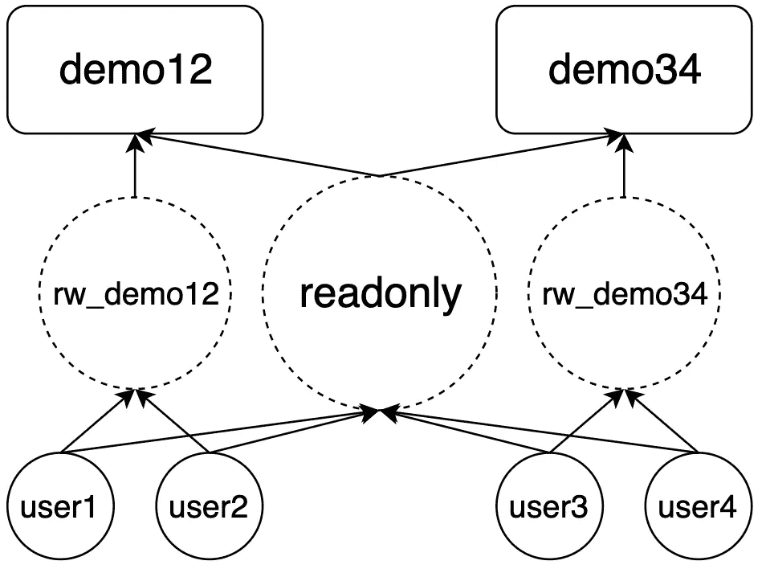

# 如何在 PostgreSQL 中处理特权

> 原文：<https://towardsdatascience.com/how-to-handle-privileges-in-postgresql-with-specific-use-case-and-code-458fbdb67a73?source=collection_archive---------3----------------------->

我曾经低估了内部工具处理特权的重要性，或者至少误解了它的意图。我将在这里讨论的用例是一个数据库集群，其中的用户是一个研究小组中的研究人员。因为这是一个小团体，本质上每个人都有权利阅读和修改数据。当我被要求将集群迁移到新的服务器并在此之前做一些数据清理时，问题就暴露出来了。事实证明

*   大多数数据库都没有很好的文档记录，人们很难弄清楚一些旧数据库的语义。这个问题可以通过 [schemaspy](http://schemaspy.org/) 和 PostgreSQL 自己的[注释](https://www.postgresql.org/docs/12/sql-comment.html)这样的工具部分解决。
*   有些字段使用类似于`varchar(n)`的类型，但是只存储数值——我通过模式匹配查询发现了这一点。
*   一个数据库有多个名为`xyz-[year]`的模式，模式间有重复的数据。从第一点，你可以看到我不知道这样的设计是故意的还是简单的错误。

因此，即使没有人想以任何方式破坏数据，由于缺乏权限管理和使用数据库的明确准则，人们也可以很容易地将数据库集群弄得一团糟，维护数据变得极其困难。这些问题很大程度上是由于学术界的研究人员非常独立地工作，他们主要关心的是做自己的研究项目。确保每个人在数据库集群中做出正确的行动实际上是不可能的。我们决定在新的服务器中限制用户的权限，当创建、删除和更新发生时，必须通知数据库管理员。

为了更好地用代码演示我们的解决方案，假设现在我们组中只有五个人。`postgres`将是管理员用户。`user1`和`user2`负责数据库`demo12`。`user3`和`user4`为`demo34`。我们希望只允许人们在数据库管理员的许可下在他们负责的数据库上写。每个人仍然可以读取所有数据。总而言之，我们希望在数据库级别获得**写访问的粒度，在集群级别**获得**读访问的粒度。**

*旁注:小心混淆 PostgreSQL 和 MySQL 中的“数据库”概念。粗略地说，PostgreSQL 中有表<模式<数据库<集群。“<”应读作“包含于”。*

PostgreSQL 中没有简单的内置解决方案。如果你阅读了`GRANT`的文档，听起来下面的代码应该已经解决了我们一半的问题

```
GRANT CREATE, CONNECT, TEMPORARY ON DATABASE demo12 TO user1, user2;
GRANT CREATE, CONNECT, TEMPORARY ON DATABASE demo34 TO user3, user4;
```

不幸的是，事实并非如此。这个 StackOverflow 帖子说明了我们必须处理的繁重工作。

然而，向用户 1/2/3/4 授予相应的权限并不是一个可伸缩的解决方案。首先，这个组中实际上有超过五个人，并且在我们的集群中有超过两个数据库。此外，新的人可能会加入小组，而现有的研究人员将在某个时候离开。为每个用户的特权记账不是一个非常干净的解决方案。

我们将结合使用 PostgreSQL 的`ROLE`和`USER`来构建一个简单的层次结构，如下所示:



Dotted circles represent roles and solid circles represent our users. Rounded squares are our databases. Meanings of the arrows are explained by the demo below.

PostgreSQL 中的`ROLE`和`USER`会造成很大的混乱。但是从我正在使用的版本 10 开始，文档清楚地说

> `CREATE USER`现在是`*CREATE ROLE*`的别名。唯一的区别是当命令拼写为`CREATE USER`时，默认情况下假定为`LOGIN`，而当命令拼写为`CREATE ROLE`时假定为`NOLOGIN`。
> 
> SQL 标准将用户的定义留给实现。

许多人将`ROLE`用作包含多个`USER`的“组”角色。我们在这里也将以这种方式思考。

顺便说一下，如果您想知道为什么处理 PostgreSQL 的特权值得写一篇文章，这里给出了其中一个原因

> 请注意，角色是在数据库集群级别定义的，因此在集群中的所有数据库中都有效。

因此，我们需要数据库级别的写权限，但是角色是在集群级别定义的。更糟糕的是，应该调用`GRANT`(和`REVOKE`)……我想在我们的例子中的每一层都应该调用。虽然这些概念应该很好地协同工作来帮助管理系统中的用户，但它们似乎是由许多人以不同的设计思想设计的。

听够了我的抱怨。让我们静观其变。

# 设置

我们首先创建一些应该存在于系统中的角色和用户。

```
$ psql -U postgrespostgres=# CREATE ROLE readonly;postgres=# CREATE ROLE rw_demo12;postgres=# CREATE ROLE rw_demo34;postgres=# CREATE USER user1 ENCRYPTED PASSWORD 'user1';postgres=# CREATE USER user2 ENCRYPTED PASSWORD 'user2';postgres=# CREATE USER user3 ENCRYPTED PASSWORD 'user3';postgres=# CREATE USER user4 ENCRYPTED PASSWORD 'user4';postgres=# GRANT readonly TO user1, user2, user3, user4;postgres=# GRANT rw_demo12 TO user1, user2;postgres=# GRANT rw_demo34 TO user3, user4;
```

我事先在两个数据库中都注入了一些虚拟数据。这里显示了我们的数据库中有什么。

```
demo12(demo34)=# \dnList of schemasName | Owner----------+----------public | postgres(3 rows)demo12(demo34)=# \dList of relationsSchema |     Name     | Type  |  Owner--------+--------------+-------+----------public | departments  | table | postgrespublic | dept_emp     | table | postgrespublic | dept_manager | table | postgrespublic | employees    | table | postgrespublic | salaries     | table | postgrespublic | titles       | table | postgres(6 rows)
```

# 配置`"readonly"`

我们现在将授予`readonly`读取集群中所有数据库的权限。在外层的`FOR`循环中，我们遍历每个想要设置特权的数据库。在内部的`FOR`循环中，我们遍历每个数据库中的所有模式。

如果我们有不止一个数据库`demo12`和`demo34`，并且我们想要为所有数据库配置`readonly`角色，我们可以使用

```
DATABASE_NAMES=$(psql -U postgres -t -c “SELECT datname FROM pg_database WHERE datistemplate = false AND datname <> ‘postgres’;”)
```

获取集群中所有数据库的列表。然后简单的把`for DBNAME in "demo12" "demo34"`换成`for DBNAME in $DATBASE_NAMES`。

您可能想知道`GRANT`和`ALTER DEFAULT PRIVILEGES`之间的区别，以及为什么前者需要放在一个循环中，而后者不需要。简而言之，`GRANT`改变数据库中特定模式中**当前**对象的权限，而`ALTER DEFAULT PRIVILEGES`改变数据库中**未来**对象的权限。是的，当我们在`ALTER DEFAULT PRIVILEGES`中没有指定任何特定的模式时，这些更改会应用到整个数据库。所以又多了一个不同步的命令:`ALTER DEFAULT PRIVILEGES`可以在数据库级别调用，但是`GRANT`不能。

你注意到`ALTER DEFAULT PRIVILEGES`命令中的`FOR ROLE postgres`部分了吗？密切注意，看看它一会儿能怎样欺骗我们。

# 配置`"rw_demo12" and "rw_demo12"`

让我们看看下面的代码会发生什么。

```
$ psql -d demo12 -U user1 -Wdemo12=> create schema foo;CREATE SCHEMAdemo12=> create table foo.bar(col1 int);CREATE TABLEdemo12=> insert into foo.bar values(1);INSERT 0 1demo12=> \c demo12 user3You are now connected to database "demo12" as user "user3".demo12=> select * from foo.bar;ERROR:  permission denied for schema fooLINE 1: select * from foo.bar;demo12=> \dnList of schemasName  |  Owner--------+----------foo    | user1public | postgres(2 rows)
```

我们以`user1`的身份登录，在`demo12`中创建一个名为`foo`的模式，并在其中创建一个表。现在当`user3`连接到`demo12`并试图读取数据时，显示`user3`没有权限。这怎么可能呢？`user3`不是可以读取所有数据库的`readonly`成员吗？

原因显示在`Owner`栏中。`foo`的主人是`user1`。当我们做`ALTER DEFAULT PRIVILEGES FOR ROLE postgres GRANT SELECT ON TABLES TO readonly`时，我们只授予`postgres`拥有的未来对象的特权。因此，`readonly`及其成员不能在`user1`拥有的表上进行选择。

我知道我刚才说了我们希望负责人能够写入数据库，但是上面的例子表明这会导致阻止其他用户读取数据。因此，一个简单(但非常严格)的解决方法是强制`postgres`拥有所有对象。这对我们的情况来说并不坏，因为创建和删除远不如更新数据那么频繁。

`rw_demo12`和`rw_demo34`的配置如下

不幸的是，这并不能阻止拥有连接权限的用户在模式`public`中创建新表(并因此拥有它们)。为了避免这种情况，我们需要对所有数据库额外执行`REVOKE ALL ON SCHEMA public FROM public`。只要把它放在外部循环中，我们就有了完整的配置脚本。

# 试验

如果我们想从`rw_demo12`组中删除`user1`，我们只需要做

```
REVOKE rw_demo FROM user1;
```

类似地，如果我们想为数据库`rw_demo12`添加一个`newuser`，只需将它授予组

```
GRANT rw_demo TO newuser;
```

如果我们要拒绝所有对`demo12`的更新，而角色`rw_demo12`中的成员远不止`user1`和`user2`呢？我没有找到任何可以检索此类信息的现有查询。我认为这是因为 PostgreSQL 将每个用户映射到他们所属的所有组角色，而不是相反。所以我们需要撤销我们之前授予`rw_demo12`的特权，脚本会像以前一样麻烦。但是，嘿，这次我们有一些一致性😃

# 替代设置

如果你想要一个更灵活的解决方案，即允许除管理员之外的用户拥有对象，我们可以用`NOINHERIT`来破解它。我们采用这种严格实现的原因是，我们不想在像`ALTER DEFAULT PRIVILEGES FOR ROLE postgres, user1,user2,user3,... GRANT SELECT ON TABLES TO readonly`这样的命令中列出所有用户。但是如果我们能确保`demo1`对象的所有者只有`postgres`和`rw_demo12`，那就更容易管理了。我们对使用`NOINHERIT`的用户使用不同的设置。

```
$ psql -U postgrespostgres=# DROP USER user1, user2, user3, user4;postgres=# CREATE USER user1 NOINHERIT ENCRYPTED PASSWORD 'user1';postgres=# CREATE USER user2 NOINHERIT ENCRYPTED PASSWORD 'user2';postgres=# CREATE USER user3 NOINHERIT ENCRYPTED PASSWORD 'user3';postgres=# CREATE USER user4 NOINHERIT ENCRYPTED PASSWORD 'user4';postgres=# GRANT readonly TO user1, user2, user3, user4;postgres=# GRANT rw_demo12 TO user1, user2;postgres=# GRANT rw_demo34 TO user3, user4;
```

现在`user1`只能连接到集群，因为它不会自动继承`rw_demo12`的权限。为了查看数据，`user1`必须显式地做`SET ROLE TO readonly`。同样，如果`user1`想要在某些表中插入值，或者创建新表(这在我们提出的解决方案中是禁止的)，那么`user1`需要`SET ROLE TO rw_demo12`。这样，`user1`或`user2`创建的所有新的未来对象将归`rw_demo12`所有。所以你看，这种替代方案更灵活，但牺牲了用户体验。

# 参考

[](https://www.postgresql.org/docs/12/client-authentication.html) [## PostgreSQL:文档:12:第 20 章。客户端身份验证

### 当客户机应用程序连接到数据库服务器时，它会指定它想要哪个 PostgreSQL 数据库用户名…

www.postgresql.org](https://www.postgresql.org/docs/12/client-authentication.html) [](https://www.postgresql.org/docs/12/user-manag.html) [## PostgreSQL:文档:12:第 21 章。数据库角色

### PostgreSQL 使用角色的概念来管理数据库访问权限。角色可以被认为是一个…

www.postgresql.org](https://www.postgresql.org/docs/12/user-manag.html) [](https://dba.stackexchange.com/questions/114834/cant-alter-default-privileges/114839#114839) [## 无法更改默认权限

### 感谢给数据库管理员栈交换贡献一个答案！请务必回答问题…

dba.stackexchange.com](https://dba.stackexchange.com/questions/114834/cant-alter-default-privileges/114839#114839) [](https://dba.stackexchange.com/questions/117109/how-to-manage-default-privileges-for-users-on-a-database-vs-schema/117661#117661) [## 如何管理用户对数据库和模式的默认权限？

### 我在哪里可以找到这方面的像样的指南、教程或视频系列？你会在手册中找到一切。下面的链接…

dba.stackexchange.com](https://dba.stackexchange.com/questions/117109/how-to-manage-default-privileges-for-users-on-a-database-vs-schema/117661#117661) [](https://dba.stackexchange.com/questions/35316/why-is-a-new-user-allowed-to-create-a-table) [## 为什么允许新用户创建表？

### 我想知道为什么一个新创建的用户可以在连接到数据库后创建一个表。

dba.stackexchange.com](https://dba.stackexchange.com/questions/35316/why-is-a-new-user-allowed-to-create-a-table) [](https://dba.stackexchange.com/questions/135168/alter-default-privileges-for-role) [## 更改角色的默认权限

### 我有一个名为 Blackacre 的数据库和两个可以访问它的角色:johnrole 和。janerole 被授予所有…

dba.stackexchange.com](https://dba.stackexchange.com/questions/135168/alter-default-privileges-for-role) [](https://stackoverflow.com/questions/10352695/grant-all-on-a-specific-schema-in-the-db-to-a-group-role-in-postgresql/10353730#10353730) [## 将数据库中特定模式的 all 权限授予 PostgreSQL 中的组角色

### 您找到了为给定模式中的所有现有表设置特权的捷径。手册阐明:(但请注意…

stackoverflow.com](https://stackoverflow.com/questions/10352695/grant-all-on-a-specific-schema-in-the-db-to-a-group-role-in-postgresql/10353730#10353730) [](https://stackoverflow.com/questions/24918367/grant-privileges-for-a-particular-database-in-postgresql/24923877#24923877) [## 在 PostgreSQL 中授予特定数据库的权限

### 我正从 MySQL 迁移到 PostgreSQL，但在用户权限方面遇到了瓶颈。我习惯于给用户分配所有…

stackoverflow.com](https://stackoverflow.com/questions/24918367/grant-privileges-for-a-particular-database-in-postgresql/24923877#24923877) [](https://www.postgresql.org/docs/11/sql-alterdefaultprivileges.html) [## PostgreSQL:文档:11:更改默认权限

### 更改默认权限-定义默认访问权限更改默认权限[针对{角色|用户}…

www.postgresql.org](https://www.postgresql.org/docs/11/sql-alterdefaultprivileges.html)