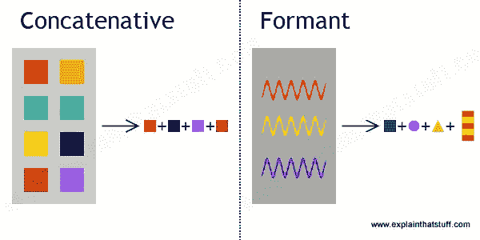
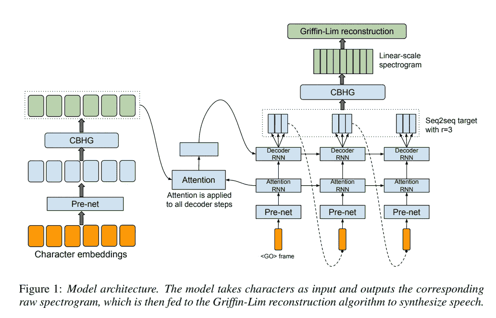
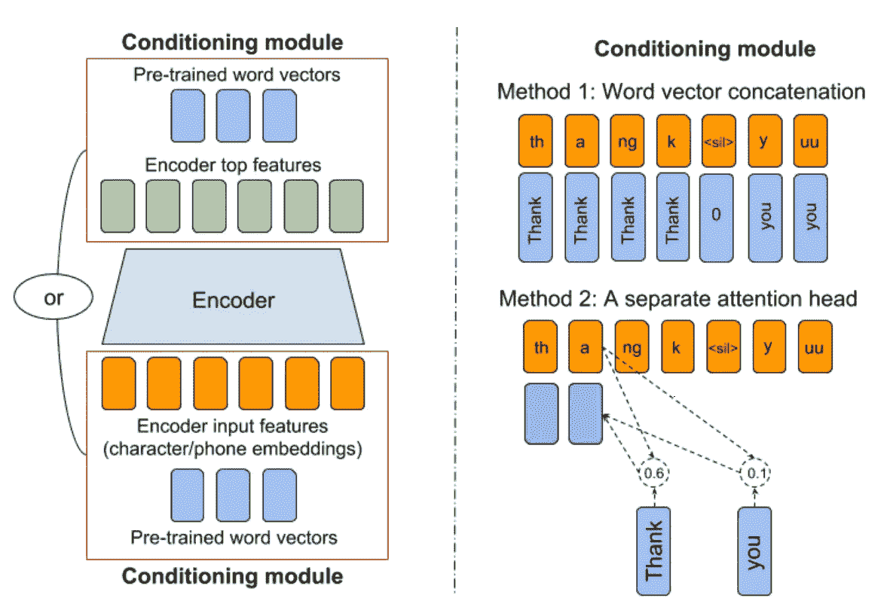
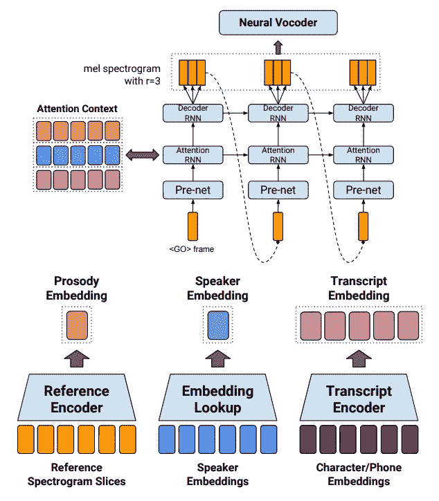
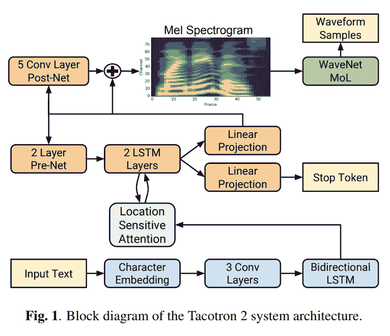

# 如何利用人工智能驾驭语言的力量

> 原文：<https://towardsdatascience.com/how-to-harness-the-power-of-speech-with-artificial-intelligence-ced8dc64721d?source=collection_archive---------21----------------------->

你听说过图灵测试吗？图灵测试是艾伦·图灵在 1950 年设计的一项测试，旨在观察机器是否能够表现出与人类无法区分的对话行为。

当艾伦·图灵(Alan Turing)第一次开发 T2·图灵测试(Turing Test)时，他严格地将实验限定为纯文本对话，而不是完整的语音对话。为什么？他不想让 20 世纪 50 年代蹩脚的机器人声音泄露“机器人是谁”背后的线索测试。但是自从这个测试被首次构思以来，纯文本规则就一直存在了很多年甚至几十年。许多计算机科学家认为，我们实际上更接近于建立一个完全像人类一样的对话代理，而不是建立一个现实的文本到语音系统。

# 文本到语音转换

首先，什么是文字转语音？TTS 是一个语音合成系统，可以将自然语言转换成可听语音。很有可能，你已经多次和使用 TTS 系统的聊天机器人交谈过。Siri 背后的声音？亚马逊 Alexa？Google Home？是的，那些声音实际上是合成的声音(大部分是)。TTS 系统有多种工作方式。

在这篇博客中，我们将特别关注**神经 TTS** 是如何工作的。让我们深入了解语音合成是如何完成的！

## 串联方法

拼接方法，主要是单元选择方法，是最常用和最广泛使用的语音合成技术。拼接模型从非常大的预先录制的音频数据库中检索短的语音片段，并拼接多个片段以生成可听语音。然而，这种方法是不可扩展的，因为每当需要不同风格的语音生成时，它们都需要新的数据集。此外，由于这种方法的性质，合成的音频不具有一致性，听起来很像机器人。

Source: [https://www.explainthatstuff.com/how-speech-synthesis-works.html](https://www.explainthatstuff.com/how-speech-synthesis-works.html)

## 参数方法

可伸缩性的问题导致了参数模型的使用，其中语音的生成可以通过如何定义输入来控制。大多数参数模型都专注于从给定的文本输入中生成声学特征，并通过使用一组称为声码器的算法，将它们转换为音频信号。

# 神经文本语音转换(TTS)

在这篇博客中，我们将具体看看 [Tacotron](https://arxiv.org/pdf/1703.10135.pdf) ，这是一个流行的神经网络，经常被 TTS 追随者在许多机器学习框架中重新实现(经常是多次)！Tacotron 团队已经发表了不少关于神经 TTS 的[论文](https://google.github.io/tacotron/)，所以我们将着眼于那些已发表论文的核心部分，Tacotron！

## 文本到声音特征

大多数参数 TTS 模型具有文本到声学特征的近似阶段。在这里，文本输入被转换成密集的声学特征，声码器可以使用这些声学特征来产生音频信号。在神经 TTS 中，我们不太关心文本的语义，而更关心形成单词的空间和形态结构(音素和字形)。字符级(或甚至音素级)的一维卷积通常用于提取这种信息。因为我们不太关心语义，所以减少了对单词嵌入的需求，并且不经常使用单词级标记。(如下图)

Source: [https://arxiv.org/pdf/1703.10135.pdf](https://arxiv.org/pdf/1703.10135.pdf)

***注*** *:* 有趣的是，最近[研究了](https://arxiv.org/pdf/1808.10128.pdf)通过用相应的单词嵌入来调节字符以注入语义知识，可以实现这些网络的半监督训练的效果。这表明语义上下文可以与形态学信息结合使用，以帮助更好地提取声学特征。这也可能表明，单词嵌入也包含空间和结构信息。(如下图)

Source: [https://arxiv.org/pdf/1808.10128.pdf](https://arxiv.org/pdf/1808.10128.pdf)

Tacotron 遵循标准方法，其中网络具有编码器-解码器结构。在编码器中，采用 3 层逐字符卷积神经网络来从文本的字符序列中提取长期上下文，例如形态学结构。最初由 max pooling 和 highway layer 跟随，但后来被删除。使用批处理规范化和 ReLU 激活。然后，使用单层双向 RNN 以顺序方式组合局部特征。

在解码器端，提取的表示然后被转换成密集的声学特征(声谱图),随后可以使用称为声码器的不同算法将其转换回音频。关注由[位置敏感注意机制](https://arxiv.org/pdf/1506.07503.pdf)在每个时间步长生成的上下文向量，堆叠的 RNN 层被用于预测基于先前隐藏状态和从编码器提取的文本表示的每个帧(或多个帧)。以这种方式训练 Tacotron，可以在推理时从文本特征中近似出完整的声学特征，而无需在基于 HMM 的[参数模型](https://www.cs.cmu.edu/~pmuthuku/mlsp_page/lectures/spss_specom.pdf)中使用特定的对齐算法。

***注:*** 要考虑的一个有趣点是所学的语言和声学表征。由于 Tacotron 提取语言特征，如字符和音素排列，并使用它们来生成频谱图，中间表示可能包含丰富的声学和语言特征。这些信息可以用于其他相关任务吗？还有说话者代表呢？[本文](https://arxiv.org/pdf/1803.09047.pdf)讲的是用说话人和韵律嵌入来训练 Tacotron。我们是否可以通过从这个连续的空间采样，生成一个地球上不存在的任意人声？

Source: [https://arxiv.org/pdf/1803.09047.pdf](https://arxiv.org/pdf/1803.09047.pdf)

## 声码器

那么我们如何将获得的声学特征(即。光谱图)回到音频信号？事实证明，人工生成的频谱图通常过于平滑，缺乏为传统声码器创建高保真音频信号所需的特定信息。这部分是由于相位声码器的质量、声学特征建模的准确性以及频谱图的过度平滑(因为传统的声码器是基于 mel 倒谱的并且具有简单的相位重构算法)。这导致提取的频谱图缺少从频谱图重建语音所必需的相位信息。这意味着合成语音[通常听起来很低沉，并且有伪像](https://www.cs.cmu.edu/~pmuthuku/mlsp_page/lectures/spss_specom.pdf)。

## Wavenet

为了解决上述问题，谷歌 DeepMind 在 2016 年发表了一篇论文，名为“ [Wavenet](https://arxiv.org/pdf/1609.03499.pdf) ”，它可以生成音频信号，不是从频谱方面，而是使用堆叠层的扩张卷积神经网络进行完全自回归采样。Wavenet 生成的音频不会显示伪像和消音，因为它们不是从声谱图以并行方式重建的，而是以先前的音频样本为条件。有很多令人惊讶的博客文章深入讨论了 Wavenet(包括作者的[，所以我不会深入讨论 Wavenet 如何工作的细节。由于这种新的智能架构，Wavenet 实现了最先进的合成音频质量，这仍然是任何其他架构无法比拟的。](https://deepmind.com/blog/wavenet-generative-model-raw-audio/)

关于 Wavenet，我想说的一点是它的灵活性及其根据本地特征调节网络并从中生成语音的能力。[原始论文](https://arxiv.org/pdf/1609.03499.pdf)考虑了其他声学特征，如对数基频和语言特征，如音素排列等。然而，后来的研究表明，Wavenet 可以直接调节简单的声学特征，如 mel-scale 频谱图，以生成更好的语音质量([链接到论文](https://arxiv.org/pdf/1712.05884.pdf))。这表明，受 Wavenet 等强大架构影响的 mel 频谱图是一种用于音频相关任务的特殊音频-声学特征。

Source: [https://arxiv.org/pdf/1712.05884.pdf](https://arxiv.org/pdf/1712.05884.pdf)

# 结论

我们已经研究了从文本中提取声学特征的新标准方法，然后使用它们来生成高保真语音。我们在高层次上研究了用于神经文本到语音转换的两个主要模型。以下是关键要点:

*   文本中的语义上下文对于音频生成任务来说不是必需的，但是如果数据的大小很小，则有点有用
*   语言和声学特征可以与诸如说话者嵌入和韵律嵌入的连续分布连接，以向 Tacotron 模型提供更多的归纳偏差
*   梅尔标度频谱图是非常有用和紧凑的音频声学特征，当以 Wavenet 变体为条件时，能够生成高保真语音。

Tacotron 和 Wavenet 的作者都没有为论文发布代码，但在 Github 上有 Tacotron 和 Wavenet 的惊人实现，你可以分别在这里和这里找到[。我们已经讨论了神经 TTS 的高级管道，但是如果你想更深入地研究这个问题，请看看这篇博客中提到的论文。此外，如果你认为我忘记了添加一个关于神经 TTS 的有价值的信息，或者想讨论更多关于它，请不要犹豫与我在 minsang.kim.142@gmail.com 联系](https://github.com/Rayhane-mamah/Tacotron-2)

感谢阅读，并请在评论中留下问题或反馈！