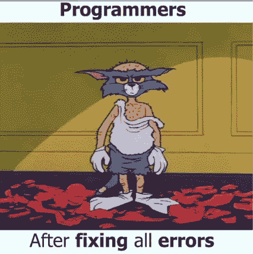

# 如何雇佣和建立一个软件开发团队！

> 原文：<https://towardsdatascience.com/how-to-hire-and-build-a-software-development-team-95cef0706bfa?source=collection_archive---------22----------------------->

> 让软件开发得更快的最好方法是尽早开始。但是这里的问题并不是每个人，特别是小企业有一个 [*软件开发团队*](https://www.binaryfolks.com/services/solutions/software-outsourcing) 听候他们的召唤。所以，问题来了，如何雇佣一个专门的软件开发团队？
> 
> 在本文中，我们将讨论参与软件开发的不同人员，以及是什么让他们成为一个团队。此外，我们还提到了在团队组成中应该注意哪些属性，以雇佣合适的软件开发团队。

招聘从来都不是一件容易的事情，但是当你需要招聘一个软件开发团队来满足你的定制软件需求时，事情就变得更加复杂了。但是，组建一支优秀的团队对任何企业的成功都至关重要。
说到软件开发，通常不止两个人要跳探戈。你需要一个技术可靠、灵活且一致的团队，作为一个整体来开发你梦想中的软件。

现在，有多种方法可以让你开始雇佣你梦想中的软件团队:

[1]口碑，即你认识的人的推荐[2]在独立的第三方门户网站上搜索，如 Upwork

[3]滚动浏览目录网站，如 [Clutch](https://clutch.co/profile/binaryfolks) 或[goodforks](https://www.goodfirms.co/companies/view/11369/binaryfolks-pvt-ltd)

[4]谷歌上的有机搜索

不管你的来源是什么，我们已经列出了一个问题清单，在[雇佣你的软件开发团队](https://www.binaryfolks.com/blog/5-questions-you-need-to-ask-a-software-development-team-before-hiring-them)之前，你绝对需要问你潜在的软件开发人员这些问题。

让我们来谈谈更复杂的下一步——谷歌帮不了你。让我们来谈谈为一个好的软件开发团队创建一个坚实的基础，以及使你预想的软件获得成功所涉及的不同的人或角色。

**业务分析师或项目经理**

项目经理在软件开发中的角色——在雇佣软件团队时，你接触的第一个人是项目经理或业务分析师。他们首先了解您的业务需求，记下功能并进行映射。

然后，他们充实所有细节，并将需求转化为适当的技术需求文档或 SOW。

项目经理的角色是战略性的，包括计划和组织时间和资源以成功完成工作。技术架构师、开发人员、设计人员、测试人员都是重要的资源，但是他们之间的相互作用和项目流程需要有人来协调。因此，项目经理需要在最短的时间内以最大的效率协调资源、任务和人员。

**主要职责:**

[1]引出项目需求和进一步的分析[2]编写必要的文档[3]活动和资源规划[4]协作并激励团队[5]与客户保持沟通

[6]管理项目的范围

不管这个项目有多难或者有多小，一定要在软件团队中包括一个项目经理。

你应该在项目经理身上寻找的一些明显的品质是对细节的关注，非常非常清晰的沟通，资源管理能力，多任务能力，领导素质和对技术平台的一些熟悉。检查这些技能，把好的和优秀的分开，确保项目不偏离轨道。

**设计师**

任何优秀设计的目标都应该是改善整体用户交互体验，并提供最大的客户满意度。设计师最初从理解业务流程和用户交互序列开始，然后根据用户流程创建基本的线框和解决方案。

他的主要职责是设想最佳方法，并提供屏幕的模型和设计，以便它们可以用于创建最佳体验。他们需要不断改进用户交互——屏幕、按钮和其他视觉元素。

**主要职责:**

[1]了解完整的用户旅程[2]开发线框

[3]设计原型

好的设计不仅仅是美学，更多的是用户交互。查看一些他们设计的现场网站，确保他们对设计有眼光，并且总体上很好奇。当然还有很棒的沟通！

**网络开发者**

这分为两种资源—前端开发人员和后端开发人员。

**(一)前端开发人员:**一旦业务需求明确，设计完成，接下来是什么？将设计带入生活。完全是前端开发者做的事情！他们采用静态设计，并将其转化为一个全功能的交互式网络应用程序，可在所有设备上运行。HTML/CSS、JavaScript/jQuery、Angular、Aurelia、Bootstrap、Backbone.js 等。是前端开发人员使用的一些技术。

**主要职责:**

[1]确保 UI/UX 设计的技术可行性[2]优化用户交互元素以获得最大速度和可扩展性[3]针对 SEO 优化的有意义的语义

**(b)** 后端开发人员:设计完成，用户流程完善后，有人要确保所有的业务逻辑和数据存储都正确实现。这就是后端开发者的工作。后端是任何软件的主干。它由服务器、数据库和服务器端应用程序组成。Linux、Apache、MySQL、PHP、MongoDB、Express.js、AngularJS、Node.js 等是后端开发人员使用的一些技术。

**主要职责:**

[1]数据库创建、集成和管理[2]云计算[3] API 集成[4]安全检查[5]备份和恢复

[6]发布新的应用程序版本

寻找那些不仅能写好代码，而且对逻辑和系统也很在行的人。他们必须愿意付出额外的努力来确保您的系统是健壮的，并且完美地代表了您的业务逻辑。此外，确保开发人员有良好的沟通和任务管理技能。最后，他们不应该反对调试和修复错误。

**质量保证和测试专家**

因此，分析了业务需求，设计和开发了 web 应用程序，现在您想要让您的 web 应用程序运行起来！诱人！保持冷静，因为现在是质量保证的时候了。

实际上，QA 测试应该从软件供应商提供给你的第一个可交付产品开始。一旦实现了新的特性，QA 测试人员就会勤奋地、刻苦地审查这些特性，寻找业务逻辑或设计方面的问题。[这也将帮助你降低软件开发成本](https://www.binaryfolks.com/blog/5-effective-ways-to-reduce-custom-software-development-costs)。

**主要职责:**

[1]编写测试[2]进行测试

[3]测试应用程序与各种浏览器和设备的兼容性

QA 测试人员应该始终牢记用户交互和接受，并相应地准备测试场景。一个以客户为导向，关注细节，能够区分轻重缓急的人应该是一个好的测试人员。

**-…总结::-**

为了确保你的网络应用的成功，请一个有能力端到端管理项目的软件开发团队。在项目经理的领导下，您的定制软件开发团队必须由设计师、前端和后端开发人员以及软件验证人员组成。

你的项目是否成功最终取决于你雇佣的软件开发团队采取的方法。花一些时间与软件开发团队交流，并保持最新的功能。永远记住，如果你想开发一个优秀的产品，你需要一个优秀的团队。

*最初发表于:* [*双星*](https://www.binaryfolks.com/blog/how-to-hire-and-build-a-software-development-team?utm_source=medium_towardsdatascience&utm_medium=Social&utm_campaign=content_marketing_feb_2019_hire_and_build_software_team)