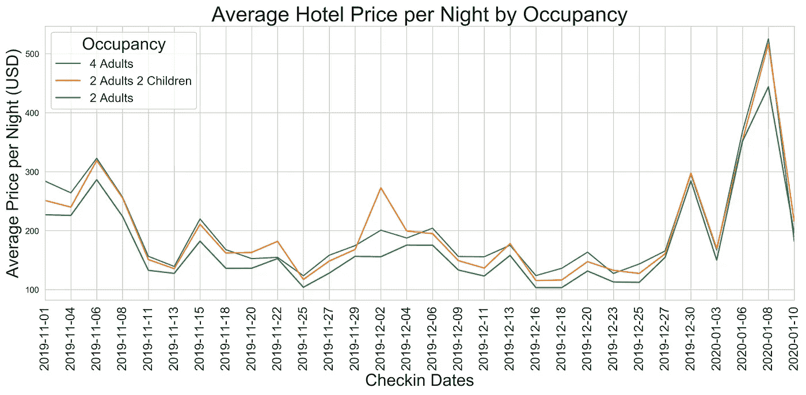
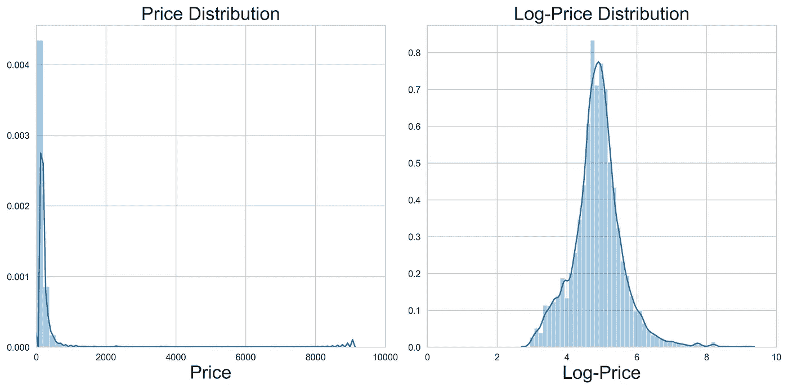
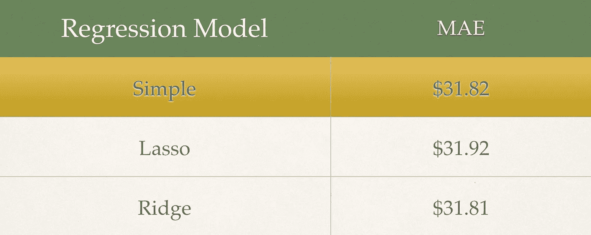
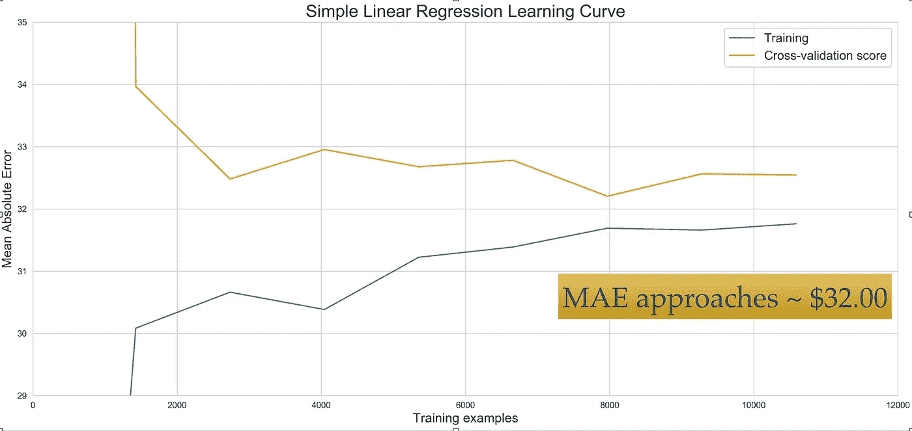
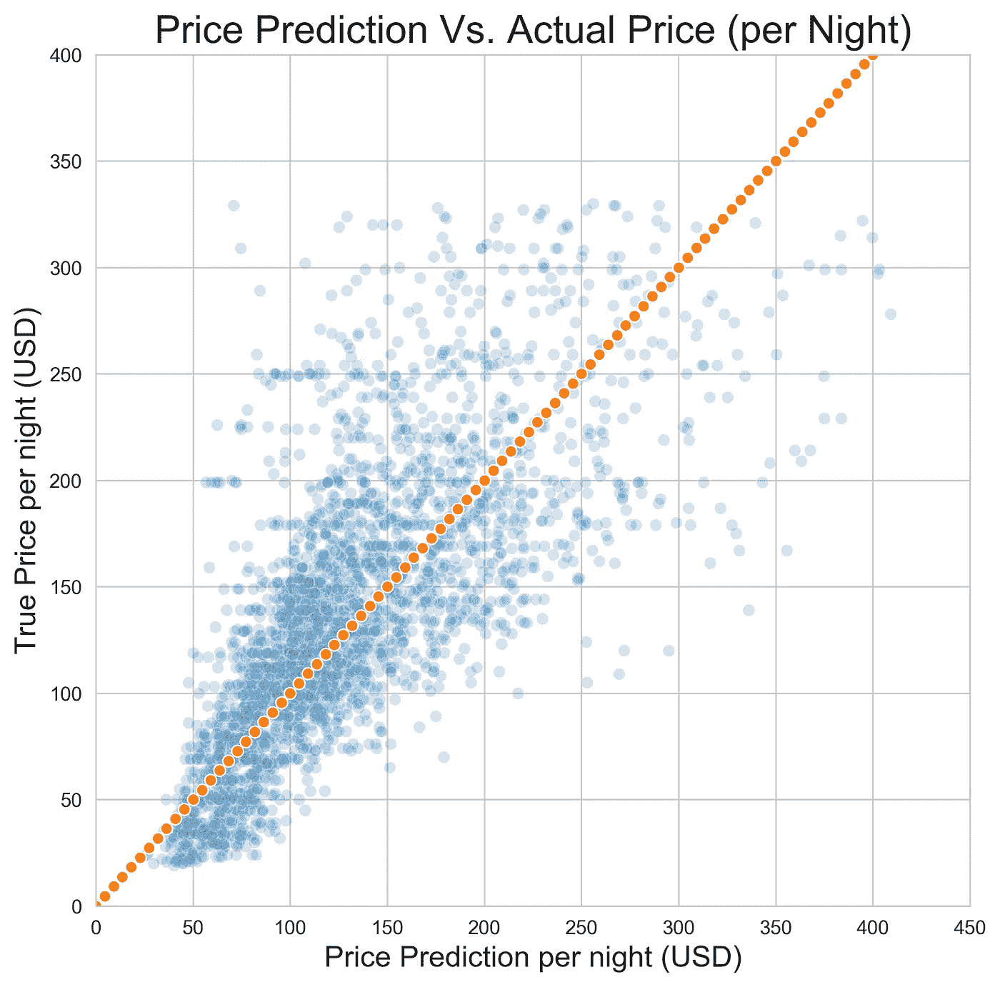
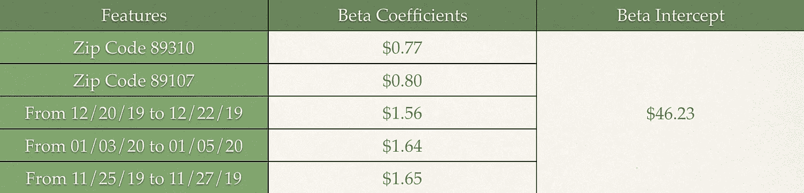

# 如何使用机器学习识别酒店交易

> 原文：<https://towardsdatascience.com/how-to-identify-hotel-deals-using-machine-learning-b9195e6a7b7f?source=collection_archive---------19----------------------->

A beautiful shot of Las Vegas to catch your attention — photo credit to Prexels

拉斯维加斯是世界上最好的度假目的地之一。它是世界娱乐业的中心。在这篇摘录中，我想探索使用机器学习预测拉斯维加斯酒店价格的理论，以最终确定是否有人向你提供交易。我们开始吧！

借助当今的动态定价技术，酒店价格每分钟都可能波动。这是由多种原因造成的，如供求、竞争、季节性、位置和一周中的某一天。为了这个项目的简单，我想知道我们是否可以使用两个主要因素来预测拉斯维加斯的酒店价格:位置和星期几。当然，除了这些主要因素之外，我们还将使用其他属性，但我们将在稍后讨论。我希望用这个博客来解释我在这个项目中的工作流程，并详细阐述一些决定。尽情享受吧！

## 这是我的方法:

1.  从 Hotels.com 收集酒店列表信息
2.  预处理数据
3.  训练一个机器学习模型
4.  评估模型性能
5.  要点和建议

## 网页抓取

我同时使用 BeautifulSoup 和 Selenium 从 hotel 收集了 3 个月的酒店列表信息。我搜集的一些信息包括入住和退房日期、成人和儿童的数量、到城市和会议中心的距离、酒店地址、酒店评论和评级、猫途鹰的评论和评级、酒店设施以及标价。我希望这篇节选更侧重于机器学习，这样我就不会用抓取的细节来烦你。如果你对我如何使用 BeautifulSoup 和 Selenium 感兴趣，你可以在我的 [GitHub](https://github.com/BentleyOu/Projects/tree/master/Hotel%20Price%20Prediction) 上找到更多信息。

## 数据预处理和 EDA

刮出来的原始数据极其杂乱。从 2019 年 11 月到 2020 年 1 月，我总共收集了 2 万个酒店列表。如果你对数据感兴趣，你可以在我的 [GitHub](https://github.com/BentleyOu/Projects/tree/master/Hotel%20Price%20Prediction) 上找到一个腌制的数据集。在预处理和提取所有有用的信息后，我们得到了以下特征:

*   入住和退房日期
*   成人和儿童人数
*   距离市中心和会议中心的距离
*   邮政区码
*   酒店评级和评论
*   访客评论的数量
*   猫途鹰评分和评论
*   挂牌价格
*   酒店便利设施

尽管酒店的价格在很大程度上受到我上面提到的供需、季节性、竞争、位置和星期几的影响，但我想看看我们是否可以仅使用我收集的特征来产生一个强大的机器学习模型。以下是 2019 年 11 月至 2020 年 1 月拉斯维加斯的酒店平均价格…

一个直接的观察结果是，在 2006 年 11 月、2008 年 12 月 30 日和 2008 年 1 月出现了价格高峰。我还看了价格分布，它严重倾斜，所以通常的处理步骤是转换它。在这种情况下，我使用了对数变换来使价格分布看起来更为正常。

接下来，我使用一键编码方法将所有分类特征转换为 1 或 0。我还过滤掉了一些标价在每晚 450 美元以上的房源。最后，在预处理之后，我们总共有大约 16，000 个观察值和 104 个特征。

## 建模

不用说，这是一个线性回归问题。为了提醒我们，以下是线性回归分析的五个假设:

*   我们的输入特征和输出变量之间的关系是线性的
*   特征呈正态分布
*   要素之间几乎没有多重共线性
*   这些特征之间几乎没有自相关
*   余数均匀分布在零附近

我们的数据不需要遵循上面的每一个假设来产生一个好的模型。我们稍后将会看到如何处理其中的一些问题…

按照标准程序，我们将数据分为训练集、验证集和测试集。我们将拿出测试集进行最终评估。我使用 Statsmodel 软件包生成了一个初步的普通最小二乘(OSL)模型。Statsmodel 可以方便地生成一个汇总表，显示 R 和调整后的 R 值。更重要的是，它还输出我们所有特征的 p 值列表。p 值是对特征显著性的度量。我移除了 p 值为 0.05 或更大的所有特征。p 值为 0.05 意味着观察到的数据可能有 5%的几率是随机的。R 值是模型解释了多少可变性。在我们的例子中，R 值是 0.602，这意味着我们的模型解释了大约 60%的方差。

根据初步的模型，我使用了 Scikit-learn 软件包中的 Lasso 和 Ridge regression。套索和山脊算法允许我们应用正则化来帮助过度拟合。

*   Lasso 回归将通过向系数(β)分配零来惩罚对模型不太重要的要素，从而有助于要素选择。发现正则化系数为 0.0001。这告诉我们，Lasso 回归模型本质上与我们的简单线性回归模型相同，没有特征被消除。
*   另一方面，岭回归将有助于处理要素多重共线性。它通过分配一个非常低的值系数β来抑制具有高度多重共线性的要素的影响。发现正则化系数为 13.970。这意味着我们的数据中存在多重共线性，但岭回归可以减少这种影响。
*   找到最佳超参数(例如正则化系数)的有效方法是使用 GridSearchCV。这是一种交叉验证技术，用于搜索一系列参数，同时优化用户指定的分数。

## 估价

对于我们的问题，我们可以使用许多评估指标。我马上想到的两个是*平均绝对误差(MAE)* 和*均方根误差(RMSE)。*如果我们想惩罚那些预测异常值很差的模型，RMSE 是一个很好的指标。由于我们将数据集过滤到每晚 450 美元或更低的标价，使用 MAE 就足够了。最后，结果如下:

Cross-validation score for hotel price prediction in Las Vegas

所有三个模型进行了类似的比较。我选择了简单的线性回归模型。更简单、更快速的模型的好处超过了性能的小幅提升。我还生成了一条学习曲线来验证模型是否存在偏差或方差。

Learning Curve: a bias/variance tradeoff analysis

从学习曲线中，我们看到训练和验证分数都接近 32 美元的渐近值。该模型不存在高偏差或高方差。为了提高分数，我们将需要额外的功能或更复杂的算法。

最后但同样重要的是，下面是预测价格与实际价格的对比。我们可以看到，该模型更好地预测了低于 150 美元的较低等级酒店。这是有道理的，因为随着酒店变得越来越贵，还有其他特征，如房间大小、服务质量或其他便利设施，我们的模型没有考虑在内。

## 要点和建议

解决机器学习问题最重要的部分是从我们的结果中找到潜在的信息。我们经常会问——为什么我们要关心这些结果？这些结果有意义吗？或者这些结果揭示了关于我们问题的深刻信息？

让我们来看看我们的特征系数(beta)。

Lowest Feature coefficients (Beta)

如果酒店在这些日期内预订和/或位于这些邮政编码区内，那么它们是最便宜的。

最后一次提醒我们，酒店价格受供求、季节性、竞争、位置和一周中的日子的影响很大。我们只使用了五个变量中的两个(位置和星期几)来建立一个模型。最后，该模型在预测较便宜酒店的标价时平均表现更好。

如果你做到了这一步，让我们回到我们最初的问题(如标题所示)——如何识别酒店交易

1.  你想在拉斯维加斯预订，有一个价格为每晚 150 美元的交易。
2.  该模型预测价格为 182 美元。
3.  平均来说，由于 MAE 是 32 美元，酒店应该贵到 214 美元或便宜到 150 美元。
4.  如果预测价格比挂牌价格高出至少 32 美元，那么你就找到了一笔交易！

这个方法一点也不完美。我们假设酒店价格是固定的，但我们知道不是。我们还假设您提前几个月进行预订，因为所刮取的数据是相对于刮取时间的未来数据。

总之，如果没有季节性、供求和竞争方面的数据，预测酒店价格是很困难的。让一台机器使用静态数据集来确定你是否得到了一笔交易就更难了。

## 感谢您的阅读！

项目存储库可以在这里找到[。](https://github.com/BentleyOu/Projects/tree/master/Hotel%20Price%20Prediction)

你也可以在我的 [LinkedIn](https://www.linkedin.com/in/bentleyou/) 上找到这个帖子。