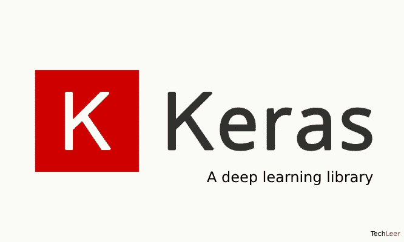
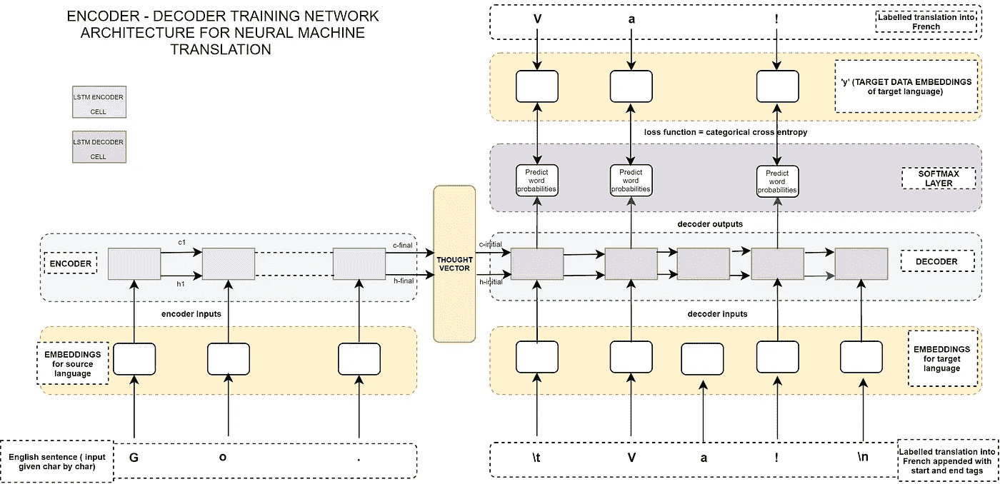
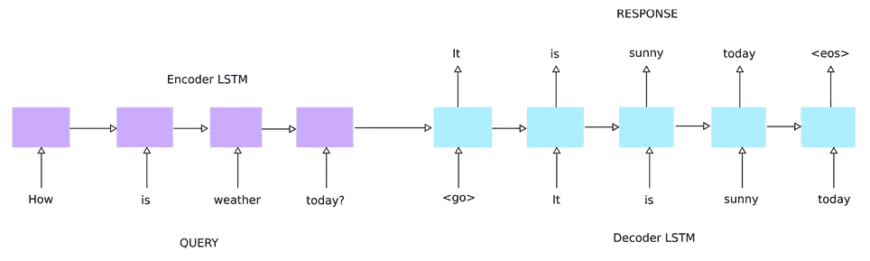
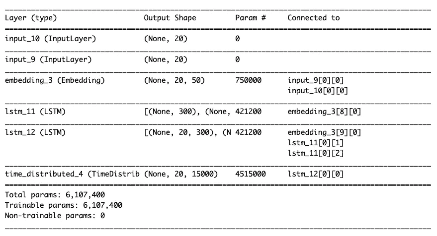
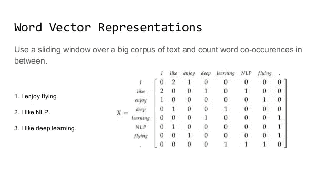
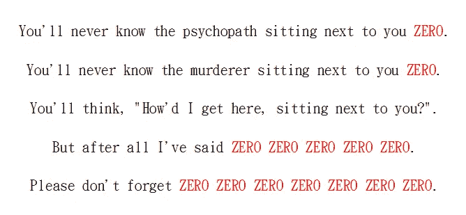

# 如何在 Keras 中实现 Seq2Seq LSTM 模型

> 原文：<https://towardsdatascience.com/how-to-implement-seq2seq-lstm-model-in-keras-shortcutnlp-6f355f3e5639?source=collection_archive---------4----------------------->

## 如果你被尺寸问题困扰，这是给你的



[Keras: Deep Learning for Python](https://www.techleer.com/articles/440-keras-deep-learning-for-python/)

# 为什么需要看这个？

当我第一次尝试为聊天机器人任务实现 seq2seq 时，我卡了很多次，特别是关于输入数据的维度和神经网络架构的输入层。

现在我明白了，除非你对矩阵、张量等线性代数概念，或者 Keras API 是如何工作的有很深的理解，否则你会不断地得到错误(而且那太惨了！).

因此在本文中，我将通过仔细检查每个过程中的输入和输出，来解释 seq2seq for Keras 的完整分步指南。

此外，我将提供一些可移植的原始函数，您可以在任何其他 NLP 项目中使用这些函数进行预处理。

我们开始吧！

# 菜单

1.  Seq2Seq 文本生成模型是什么？
2.  任务定义和 Seq2Seq 建模
3.  Seq2Seq 中各层的尺寸
4.  Seq2Seq 的预处理(在聊天机器人的情况下)
5.  最简单的代码预处理:您现在就可以使用！

# 1.Seq2Seq 文本生成模型是什么？



Fig A — Encoder-Decoder training architecture for NMT — image copyright@[Ravindra Kompella](https://medium.com/u/c3f8c66f5451?source=post_page-----6f355f3e5639--------------------------------)

> Seq2Seq 是一种使用 RNN 的编码器-解码器模型。它可以作为机器交互和机器翻译的模型。

通过学习大量的序列对，该模型从另一个生成一个。更友好地解释一下，Seq2Seq 的 I/O 如下:

*   输入:文本数据的句子，例如“你好吗？”
*   输出:文本数据的句子，例如“还不错”

这里是 Seq2Seq 的业务应用示例:

*   一个聊天机器人(你可以从我的 GitHub 中找到它)
*   机器翻译(可以从我的 [GitHub](https://github.com/samurainote/seq2seq_translate_slackbot) 中找到)
*   问题回答
*   摘要文本摘要(可以从我的 [GitHub](https://github.com/samurainote/Text_Summarization_using_Bidirectional_LSTM) 中找到)
*   文本生成(可以从我的 [GitHub](https://github.com/samurainote/Text_Generation_using_GRU) 中找到)

如果你想了解更多关于 Seq2Seq 的信息，这里我有一个来自 Youtube 上微软的[机器学习的推荐。](https://www.youtube.com/channel/UCXvHuBMbgJw67i5vrMBBobA)

现在我们可以理解这项技术的多功能性，所以让我们来看看整个过程！

— — — — —

# 2.任务定义和 Seq2Seq 建模



[https://www.oreilly.com/library/view/deep-learning-essentials/9781785880360/b71e37fb-5fd9-4094-98c8-04130d5f0771.xhtml](https://www.oreilly.com/library/view/deep-learning-essentials/9781785880360/b71e37fb-5fd9-4094-98c8-04130d5f0771.xhtml)

为了训练我们的 seq2seq 模型，我们将使用[康奈尔电影对话语料库数据集](https://www.cs.cornell.edu/~cristian/Cornell_Movie-Dialogs_Corpus.html)，该数据集包含 10，292 对电影角色之间超过 220，579 次对话交流。它涉及 617 部电影中的 9035 个角色。

这是数据集中的一段对话:

```
Mike: 
"Drink up, Charley. We're ahead of you."Charley: 
"I'm not thirsty."
```

然后我们将这些对话对输入编码器和解码器。这意味着我们的神经网络模型有两个输入层，如下图所示。

这是我们这次的 Seq2Seq 神经网络架构:

copyright Akira Takezawa

让我们用 LSTM 来形象化我们的 Seq2Seq:



copyright Akira Takezawa

# 3.Seq2Seq 中各层的尺寸



[https://bracketsmackdown.com/word-vector.html](https://bracketsmackdown.com/word-vector.html)

“NLP 新手”的黑盒是这样的:

> 每一层如何编译数据并改变它们的数据维度？

为了说明这一点，我将详细解释它是如何工作的。这些层可以分为 5 个不同的部分:

1.  输入层(编码器和解码器)
2.  嵌入层(编码器和解码器)
3.  LSTM 层(编码器和解码器)
4.  解码器输出层

我们开始吧！

# 1.编码器和解码器的输入层(2D->2D)

*   **输入层维度:2D (sequence_length，无)**

```
# 2D
encoder_input_layer = Input(shape=(sequence_length, ))
decoder_input_layer = Input(shape=(sequence_length, ))
```

*注意:sequence_length 是 MAX_LEN 在预处理中通过填充统一的*

*   **输入数据:2D(样本数量，最大序列长度)**

```
# Input_Data.shape = (150000, 15)array([[ 1, 32, 2, 0, 0, 0, 0, 0, 0, 0, 0, 0, 0],
       [ 123, 56, 3, 34, 43, 345, 0, 0, 0, 0, 0, 0, 0],
       [ 3, 22, 1, 6543, 58, 6, 435, 0, 0, 0, 0, 0, 0],
       [ 198, 27, 2, 94, 67, 98, 0, 0, 0, 0, 0, 0, 0],
       [ 45, 78, 2, 23, 43, 6, 45, 0, 0, 0, 0, 0, 0]
        ], dtype=int32)
```

*注意:样本数量可以是训练数据的长度(150000)*

*   **输出数据:2D**

*注意:* `Input()` *仅用于 Keras 张量实例化*

— — — — —

# 2.编码器和解码器的嵌入层(2D->3D)

*   **嵌入层维度:2D (sequence_length，vocab_size)**

```
embedding_layer = Embedding(input_dim = **vocab_size**,
                            output_dim = **embedding_dimension**, 
                            input_length = **sequence_length**)
```

*注:****vocab _ size****是数字的唯一字*

*   **输入数据:2D (sequence_length，vocab_size)**

```
# Input_Data.shape = (15, 10000)array([[ 1, 1, 0, 0, 1, 0, ...... 0, 0, 1, 0, 0, 0, 0],
       [ 0, 0, 1, 0, 0, 1, ...... 0, 0, 0, 0, 0, 0, 1],
       [ 0, 1, 0, 0, 0, 0, ...... 0, 0, 1, 0, 0, 0, 0],
       [ 0, 1, 0, 0, 0, 1, ...... 0, 0, 0, 1, 0, 1, 0],
       [ 0, 0, 1, 0, 1, 0, ...... 0, 0, 1, 0, 1, 0, 0]
        ], dtype=int32)
```

*注意:数据应该是一组单热向量*

*   **输出数据:3D(样本数，序列长度，嵌入尺寸)**

```
# Output_Data.shape = (150000, 15, 50)array([[[ 1, 1, 0, 0, ...... 0, 1, 0, 0],
        [ 0, 0, 1, 0, ...... 0, 0, 0, 1],
         ..., 
         ..., 
        [ 0, 1, 0, 0, ...... 1, 0, 1, 0],
        [ 0, 0, 1, 0, ...... 0, 1, 0, 0]], 
       [[ 1, 1, 0, 0, ...... 0, 1, 0, 0],
        [ 0, 0, 1, 0, ...... 0, 0, 0, 1],
         ..., 
         ..., 
        [ 0, 1, 0, 0, ...... 1, 0, 1, 0],
        [ 0, 0, 1, 0, ...... 0, 1, 0, 0]], ....,] * 150000      , dtype=int32)
```

*注:数据是嵌入 50 维的字*

— — — — —

# 3.编码器和解码器的 LSTM 层(3D->3D)

LSTM 层的棘手论点是这两个:

> 1.返回状态:
> 
> 是否随输出一起返回上一个状态
> 
> **2。返回序列**:
> 
> 是否返回输出序列的最后一个输出或完整序列

你可以从 [**中找到很好的解释理解 Keras**](https://machinelearningmastery.com/return-sequences-and-return-states-for-lstms-in-keras/) 作者[**Jason Brownlee**](https://machinelearningmastery.com/author/jasonb/)中 LSTMs 的返回序列和返回状态的区别。

*   **图层维度:3D (hidden_units，sequence_length，embedding_dims)**

```
# HIDDEN_DIM = 20encoder_LSTM = LSTM(HIDDEN_DIM, return_state=True)    encoder_outputs, state_h, state_c = encoder_LSTM(encoder_embedding)decoder_LSTM = LSTM(HIDDEN_DIM, return_state=True, return_sequences=True)   
decoder_outputs, _, _ = decoder_LSTM(decoder_embedding, initial_state=[state_h, state_c])
```

*   **输入数据:3D(样本数，序列长度，嵌入尺寸)**

```
# Input_Data.shape = (150000, 15, 50)array([[[ 1, 1, 0, 0, ...... 0, 1, 0, 0],
        [ 0, 0, 1, 0, ...... 0, 0, 0, 1],
         ..., 
         ..., 
        [ 0, 1, 0, 0, ...... 1, 0, 1, 0],
        [ 0, 0, 1, 0, ...... 0, 1, 0, 0]], [[ 1, 1, 0, 0, ...... 0, 1, 0, 0],
        [ 0, 0, 1, 0, ...... 0, 0, 0, 1],
         ..., 
         ..., 
        [ 0, 1, 0, 0, ...... 1, 0, 1, 0],
        [ 0, 0, 1, 0, ...... 0, 1, 0, 0]], ....,] * 150000      , dtype=int32)
```

*注:数据是嵌入 50 维的字*

*   **输出数据:3D(样本数，序列长度，隐藏单位)**

```
# HIDDEN_DIM = 20
# Output_Data.shape = (150000, 15, 20)array([[[ 0.0032, 0.0041, 0.0021, .... 0.0020, 0.0231, 0.0010],
        [ 0.0099, 0.0007, 0.0098, .... 0.0038, 0.0035, 0.0026],
         ..., 
         ..., 
        [ 0.0099, 0.0007, 0.0098, .... 0.0038, 0.0035, 0.0026],
        [ 0.0021, 0.0065, 0.0008, .... 0.0089, 0.0043, 0.0024]], [ 0.0032, 0.0041, 0.0021, .... 0.0020, 0.0231, 0.0010],
        [ 0.0099, 0.0007, 0.0098, .... 0.0038, 0.0035, 0.0026],
         ..., 
         ..., 
        [ 0.0099, 0.0007, 0.0098, .... 0.0038, 0.0035, 0.0026],
        [ 0.0021, 0.0065, 0.0008, .... 0.0089, 0.0043, 0.0024]], ....,] * 150000      ,   dtype=int32)
```

*注:数据被 LSTM 整形为 20 维隐藏层*

**附加信息:**

如果`return_state = False`和`return_sequences = False`:

*   **输出数据:2D(数量 _ 样本，隐藏 _ 单位)**

```
# HIDDEN_DIM = 20
# Output_Data.shape = (150000, 20)array([[ 0.0032, 0.0041, 0.0021, .... 0.0020, 0.0231, 0.0010],
       [ 0.0076, 0.0767, 0.0761, .... 0.0098, 0.0065, 0.0076],
         ..., 
         ..., 
       [ 0.0099, 0.0007, 0.0098, .... 0.0038, 0.0035, 0.0026],
       [ 0.0021, 0.0065, 0.0008, .... 0.0089, 0.0043, 0.0024]]
       , dtype=float32)
```

— — — — —

# 4.解码器输出层(3D->2D)

*   **输出层维度:2D (sequence_length，vocab_size)**

```
outputs = TimeDistributed(Dense(VOCAB_SIZE, activation='softmax'))(decoder_outputs)
```

*注意:时间分布密度*层*允许我们将一个层应用到输入*的每个时间片

*   **输入数据:3D(样本数，序列长度，隐藏单元数)**

```
# HIDDEN_DIM = 20
# Input_Data.shape = (150000, 15, 20)array([[[ 0.0032, 0.0041, 0.0021, .... 0.0020, 0.0231, 0.0010],
        [ 0.0099, 0.0007, 0.0098, .... 0.0038, 0.0035, 0.0026],
         ..., 
         ..., 
        [ 0.0099, 0.0007, 0.0098, .... 0.0038, 0.0035, 0.0026],
        [ 0.0021, 0.0065, 0.0008, .... 0.0089, 0.0043, 0.0024]],[ 0.0032, 0.0041, 0.0021, .... 0.0020, 0.0231, 0.0010],
        [ 0.0099, 0.0007, 0.0098, .... 0.0038, 0.0035, 0.0026],
         ..., 
         ..., 
        [ 0.0099, 0.0007, 0.0098, .... 0.0038, 0.0035, 0.0026],
        [ 0.0021, 0.0065, 0.0008, .... 0.0089, 0.0043, 0.0024]],....,] * 150000      ,   dtype=int32)
```

*注:数据被 LSTM 整形为 20 维隐藏层*

*   **输出数据:2D (sequence_length，vocab_size)**

```
# Output_Data.shape = (15, 10000)array([[ 1, 1, 0, 0, 1, 0, ...... 0, 0, 1, 0, 0, 0, 0],
       [ 0, 0, 1, 0, 0, 1, ...... 0, 0, 0, 0, 0, 0, 1],
       [ 0, 1, 0, 0, 0, 0, ...... 0, 0, 1, 0, 0, 0, 0],
       [ 0, 1, 0, 0, 0, 1, ...... 0, 0, 0, 1, 0, 1, 0],
       [ 0, 0, 1, 0, 1, 0, ...... 0, 0, 1, 0, 1, 0, 0]
        ], dtype=int32)
```

在数据通过这个完全连接的层之后，我们使用**反向词汇**，我将在后面解释它来从一个热点向量转换成单词序列。

— — — — —

# 4.Seq2Seq 的整个预处理(在聊天机器人的情况下)



Creating A Language Translation Model Using Sequence To Sequence Learning Approach

在开始 Seq2Seq 的预处理之前，我想提一下:

> 在数据预处理过程中，我们需要一些变量来定义我们的 Seq2Seq 神经网络的形状

1.  MAX_LEN:统一输入句子的长度
2.  VOCAB_SIZE:决定句子的一个热点向量的维数
3.  EMBEDDING_DIM:决定 Word2Vec 的尺寸

— — — — —

**seq 2 seq 的预处理**

好了，请把这些信息记在心里，我们开始讲预处理。整个过程可以分为 8 个步骤:

1.  文本清理
2.  为解码器输入放置<bos>标签和<eos>标签</eos></bos>
3.  制作词汇表(VOCAB_SIZE)
4.  将单词包标记为 id 包
5.  填充(MAX_LEN)
6.  单词嵌入(EMBEDDING_DIM)
7.  重塑数据取决于神经网络的形状
8.  为培训和验证、测试拆分数据

— — — — —

# **1。文本清理**

*   **功能**

我总是使用我自己的函数来清理 Seq2Seq 的文本:

*   **输入**

```
# encoder input text data["Drink up, Charley. We're ahead of you.",
 'Did you change your hair?',
 'I believe I have found a faster way.']
```

*   **输出**

```
# encoder input text data['drink up charley we are ahead of you',
 'did you change your hair',
 'i believe i have found a faster way']
```

— — — — —

# 2.为解码器输入放置<bos>标签和<eos>标签</eos></bos>

*   **功能**

<bos>表示“序列开始”，<eos>表示“序列结束”。</eos></bos>

*   **输入**

```
# decoder input text data[['with the teeth of your zipper',
  'so they tell me',
  'so  which dakota you from'],,,,]
```

*   **输出**

```
# decoder input text data[['<BOS> with the teeth of your zipper <EOS>',
  '<BOS> so they tell me <EOS>',
  '<BOS> so  which dakota you from <EOS>'],,,,]
```

— — — — —

# 3.制作词汇表(VOCAB_SIZE)

*   **功能**

*   **输入**

```
# Cleaned texts[['with the teeth of your zipper',
  'so they tell me',
  'so  which dakota you from'],,,,]
```

*   **输出**

```
>>> word2idx{'genetically': 14816,
 'ecentus': 64088,
 'houston': 4172,
 'cufflinks': 30399,
 "annabelle's": 23767,
 .....} # 14999 words>>> idx2word{1: 'bos',
 2: 'eos',
 3: 'you',
 4: 'i',
 5: 'the',
 .....} # 14999 indexs
```

— — — — —

# 4.将单词包标记为 id 包

*   功能

*   **输入**

```
# Cleaned texts[['with the teeth of your zipper',
  'so they tell me',
  'so  which dakota you from'],,,,]
```

*   **输出**

```
# decoder input text data[[10, 27, 8, 4, 27, 1107, 802],
 [3, 5, 186, 168],
 [662, 4, 22, 346, 6, 130, 3, 5, 2407],,,,,]
```

— — — — —

# 5.填充(MAX_LEN)

*   **功能**

*   **输入**

```
# decoder input text data[[10, 27, 8, 4, 27, 1107, 802],
 [3, 5, 186, 168],
 [662, 4, 22, 346, 6, 130, 3, 5, 2407],,,,,]
```

*   **输出**

```
# MAX_LEN = 10
# decoder input text data array([[10, 27, 8, 4, 27, 1107, 802, 0, 0, 0],
       [3, 5, 186, 168, 0, 0, 0, 0, 0, 0],
       [662, 4, 22, 346, 6, 130, 3, 5, 2407, 0],,,,,]
```

— — — — —

# 6.单词嵌入(EMBEDDING_DIM)

*   **功能**

我们使用手套的预训练和 Word2Vec 模型。我们可以通过 3 个步骤用手套创建嵌入层:

1.  从 XX 调用手套文件
2.  从我们的词汇表中创建嵌入矩阵
3.  创建嵌入层

我们来看看吧！

*   **从 XX** 调用手套文件

*   **从我们的词汇中创建嵌入矩阵**

*   **创建嵌入层**

— — — — —

# 7.将数据重塑为神经网络形状

*   **功能**

*   **输入**

```
# MAX_LEN = 10
# decoder input text dataarray([[10, 27, 8, 4, 27, 1107, 802, 0, 0, 0],
       [3, 5, 186, 168, 0, 0, 0, 0, 0, 0],
       [662, 4, 22, 346, 6, 130, 3, 5, 2407, 0],,,,,]
```

*   **输出**

```
# output.shape (num_samples, MAX_LEN, VOCAB_SIZE)
# decoder_output_data.shape (15000, 10, 15000)array([[[0., 0., 0., ..., 0., 0., 0.],
        [0., 0., 0., ..., 0., 0., 0.],
        [0., 0., 1., ..., 0., 0., 0.],
        ...,
        [1., 0., 0., ..., 0., 0., 0.],
        [1., 0., 0., ..., 0., 0., 0.],
        [1., 0., 0., ..., 0., 0., 0.]], ..., ], , dtype=float32)
```

— — — — —

# 8.为培训和验证、测试拆分数据

*   **功能**

*   **输入**

```
array([[[0., 0., 0., ..., 0., 0., 0.],
        [0., 0., 0., ..., 0., 0., 0.],
        [0., 0., 1., ..., 0., 0., 0.],
        ...,
        [1., 0., 0., ..., 0., 0., 0.],
        [1., 0., 0., ..., 0., 0., 0.],
        [1., 0., 0., ..., 0., 0., 0.]],..., ], , dtype=float32)
```

*   **输出**

```
array([[[0., 0., 0., ..., 0., 0., 0.],
        [0., 0., 0., ..., 0., 0., 0.],
        [0., 0., 1., ..., 0., 0., 0.]],..., ], , dtype=float32)
```

现在，在将学习数据输入到我们的 LSTM 模型之前，我们已经完成了整个预处理过程。

在这之后，你只需要喂他们，等待完成学习。

感谢阅读，下一篇文章再见。

— — — — —

# 参考

[](https://chunml.github.io/ChunML.github.io/project/Sequence-To-Sequence/) [## 使用序列到序列学习方法创建语言翻译模型

### 大家好。距离我上一篇博客已经有很长时间了。这听起来像是借口，但我一直在挣扎…

chunml.github.io](https://chunml.github.io/ChunML.github.io/project/Sequence-To-Sequence/)  [## 基于 Keras 的问答深度学习模型

### 上周，我参加了一个由我们搜索协会组织的关于问答的(公司内部)研讨会，其中…

sujitpal.blogspot.com](http://sujitpal.blogspot.com/2016/10/deep-learning-models-for-question.html) [](https://nextjournal.com/gkoehler/machine-translation-seq2seq-cpu) [## 使用序列对序列学习的机器翻译

### 在本文中，我们正在训练一个基于两个长短期记忆(LSTM)层的递归神经网络(RNN)模型…

nextjournal.com](https://nextjournal.com/gkoehler/machine-translation-seq2seq-cpu)