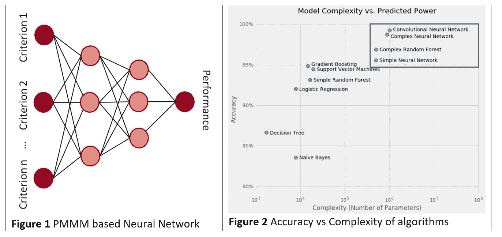
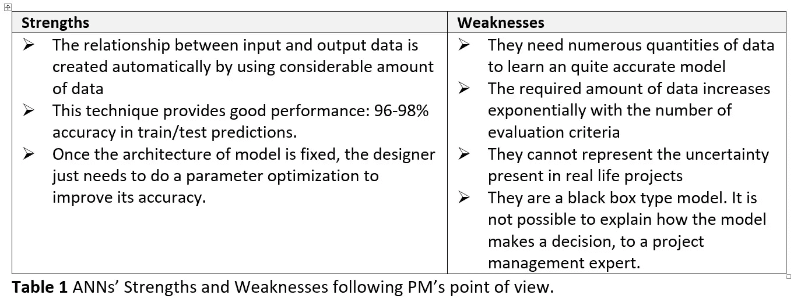
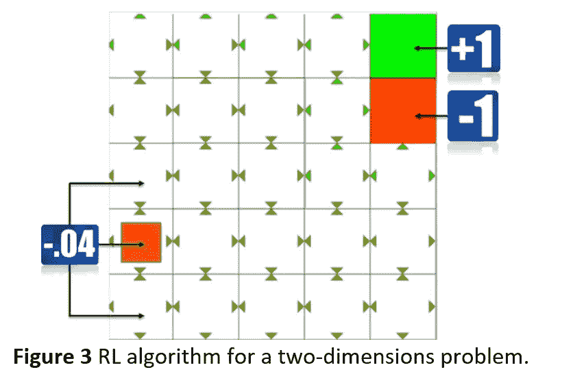
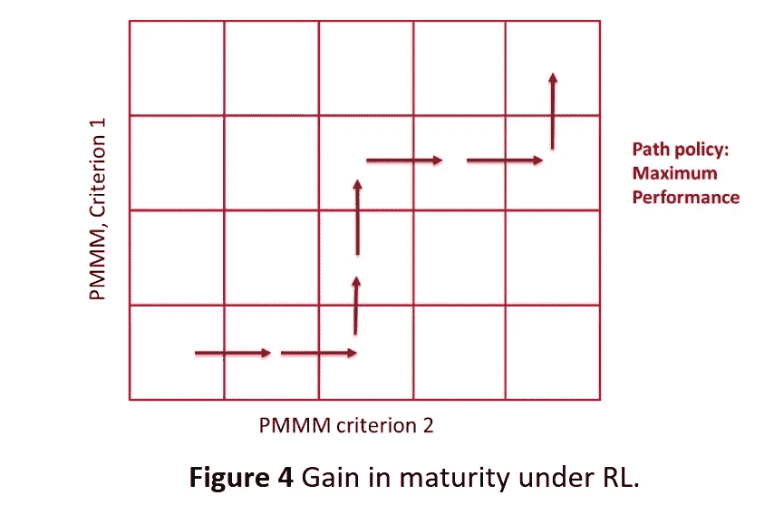
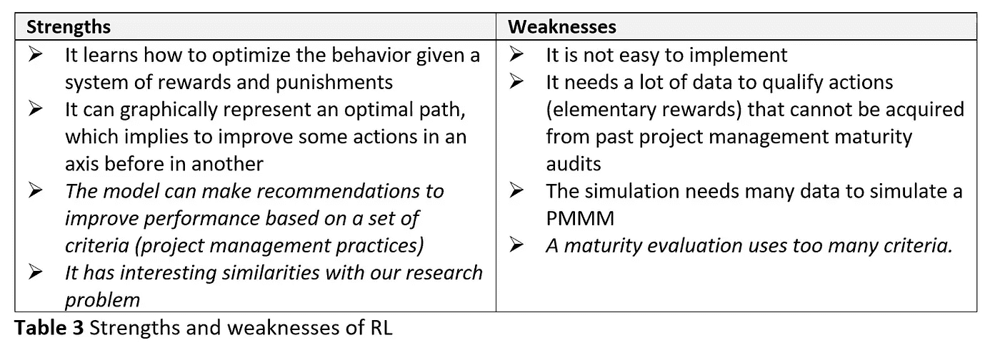
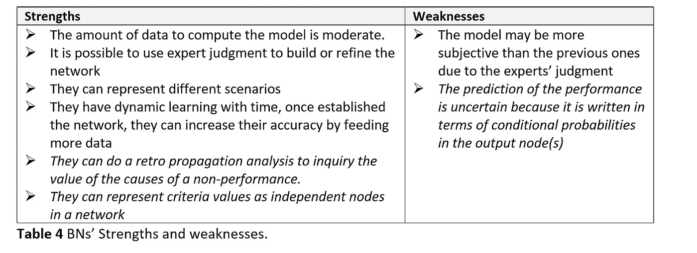
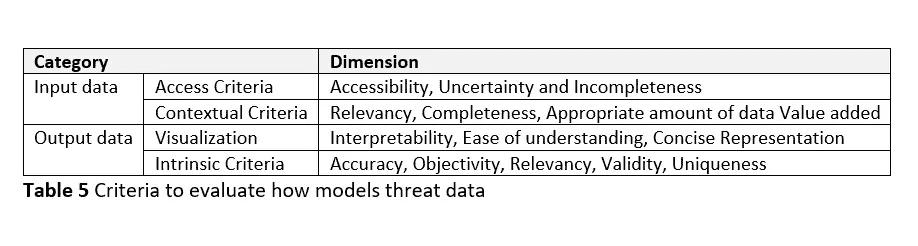
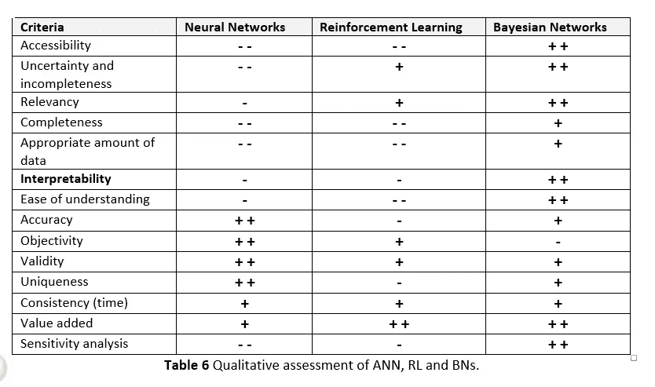

# 何时实施正确的机器学习技术？

> 原文：<https://towardsdatascience.com/how-to-implement-the-right-ai-technique-for-your-digital-transformation-projects-part-1-b3a628b6ff56?source=collection_archive---------23----------------------->

Photo by [Caleb Jones](https://unsplash.com/@gcalebjones?utm_source=unsplash&utm_medium=referral&utm_content=creditCopyText) on [Unsplash](https://unsplash.com/s/photos/path?utm_source=unsplash&utm_medium=referral&utm_content=creditCopyText)

## 深度学习 VS 强化学习 VS 贝叶斯网络

# 1 导言

最初，人工智能技术旨在“计算机化”表征人类认知、知识、推理等的过程。人工智能的主要挑战是:确定一种可以计算机化的过程，然后将其计算机化并验证其相关性或效率。ML 研究专注于一个特定的过程，也就是学习。主要的挑战是给计算机最少的知识和数据来训练它们。此外，ML 需要人与计算机之间的互动，选择数据并验证机器的结果，并赋予它们更大的决策自主权。自 20 世纪 90 年代以来，大型数据集(尤其是带标签的数据)之间的协同作用，以及使用图形处理器单元的计算机能力的增强，更强大的技术应用出现了。技术和推理逻辑能够实现几个目标，例如降低语音识别中的单词错误率，处理图像识别(Krizhevsky，Sutskever 和 Hinton，2012 年)，在围棋上击败人类冠军(Silver 等人，2016 年)，以及将图像翻译成自然语言(Karpathy 和飞飞，2017 年)。

在项目管理的特定领域，作者仍然建立了项目管理因素(过程实施、团队管理等)之间的统计相关性。)和以往项目的业绩(Ko & Cheng，2007；黄，赖，&林，2000)。更一般地，我们假设 AI 和 ML 技术是 PM 的有价值的解决方案；它们有助于系统地利用项目数据，以便更清楚地了解因果关系的相关性或强度。其中一个主要问题是选择一个好的人工智能和最大似然技术，因为这个非常活跃的领域包括各种各样的统计方法，可以实现自动决策、预测建模、数据分类和数据聚类。这解释了为什么这篇文章关注于选择适合项目管理特性的人工智能和 ML 技术

# 2 人工智能技术综述

在项目管理中，一些最常用的人工智能技术是:双变量相关和多元回归测试(Mir & Pinnington，2014 年)，数据挖掘(Ahiaga-Dagbui & Smith，2014 年)，人工神经网络(Al-Tabtabai 等人，1997 年；高和程，2007；王&吉布森，2010；王等，2012)，强化学习(毛，阿里扎德，梅纳切，&坎杜拉，2016；Tesauro，Jong，Das 和 Bennani，2006 年；叶&李，2018)，遗传算法与多准则决策(Baron，Rochet，& Esteve，2006)和贝叶斯网络(Qazi et al .，2016)甚至贝叶斯网络与进化算法的杂交方法(Pitiot，Coudert，Geneste，& Baron，2010)。

这就是为什么为了解决我们的研究问题，我们探索了 PM 研究人员可能熟悉的三种建模技术:

人工神经网络(深度学习)，因为我们现在已经在几个领域证明了其结果的准确性(王和吉布森，2010)，

一种称为强化学习(RL)的 ML，因为它与我们对成熟度的概念有相似之处，

贝叶斯网络(BNs)，因为这些动态工具结合了专家的知识和数据、因果推理和相关性。

# 2.1.监督学习技术:深度学习/人工神经网络(ANN)

最初，我们探索使用监督学习，更具体地说是人工神经网络(ANN)来预测基于项目管理成熟度的绩效。

如果你想了解更多关于监督学习算法的知识，我建议你看下一个帖子:

 [## 监督学习算法:解释和简单代码

### 监督学习算法采用一组已知的输入数据(学习集)和已知的数据响应(学习集)

towardsdatascience.com](/supervised-learning-algorithms-explanaition-and-simple-code-4fbd1276f8aa) 

神经网络用于提取人类无法感知的复杂模式，因为它们具有从复杂数据中获取趋势的非凡能力(Castillo & Melin，1999)。它们在商业应用中有广泛的用途(Wong 等人，2000 年)，特别是评估风险管理实践(Kampianakis & Oehmen，2017 年)。在本节中，我们将介绍它们，然后解释如何在我们的研究工作中使用这项技术。

受人类大脑的启发，神经生理学家沃伦·麦卡洛克和逻辑学家沃尔特·皮茨提出了第一个由相连的功能节点组成的神经网络。通过反复修改连接的权重来训练网络(麦卡洛克和皮茨，1943)。后来，同样受到神经科学的启发，罗森布拉特(Rosenblatt，1958)开发了感知器，这是一种简单的学习功能。它将每个神经元的输出映射为 1 或 0。它将标准向量 **x** 、权重向量 **w** 作为输入，并评估它们的标量积是否超过阈值 **u、**，即*f(****x****)= { 1 if****wx>u****；否则 0}* 。在一个简单的层神经网络中，这个函数不是很有用，因为二进制分类是有限的。然而，它在多层网络中更有用，称为多层感知器(MLP) (Rumelhart，Hinton，& Williams，1986)。MLP 于 20 世纪 80 年代开发，包括反向传播，*即*算法，分配好的权重，使神经网络在学习中具有较低的误差。最常用的反向传播方法之一是随机梯度下降(SGD)，它通过使用偏导数的链规则来最小化错误率。SGD 传播所有导数或梯度，从顶部输出开始到底部，然后直接计算每个链接各自的权重。

自从 MLP 和 SGD 的实现，在解决神经网络方面没有相关的进展，直到 1997 年，另一种反向传播方法，称为长短期记忆 LSTM，被提出(Hochreiter & Schmidhuber，1997)。LSTM 缩短新币；它还引入了循环网络的概念来学习长程相关性。LSTM 的学习速度比 SGD 快，它解决了复杂的人工长时间滞后的任务。

神经网络应用于许多科学和工业部门。然后，我们需要界定对项目管理有用的神经网络的类型。此外，在我们的特殊情况下，神经网络必须具有:(1)作为输入，表征项目管理成熟度的标准，以及(2)作为输出，项目的运营绩效。根据惯例，创建因果模型可能需要使用几个层(见图 1)。然而，即使神经网络已经表现出很高的准确性，在 PM 中，我们也不能访问构建足够有效的网络所需的数据量。在这些标准下，我们没有足够的项目来训练网络。ANN 对数据的需求随着输入标准的数量呈指数增长(图 2)。尽管存在固有的局限性，人工神经网络仍被用于一些商业应用(Wong 等人，2000 年)，例如评估风险管理实践(Kampianakis & Oehmen，2017 年)。

人工神经网络非常有趣，甚至令人着迷。在表 1 中，我们总结了他们与项目经理观点相关的优势和劣势。

我们要介绍的第二种技术是强化学习(RL)。

# 2.2.强化学习

强化学习算法是从马尔可夫决策过程(MDP)发展而来的。它们是在随机情况下进行决策的数学模型，其中*每个事件仅取决于前一个事件中达到的状态(马尔可夫特性)。*1957 年，贝尔曼(Bellman，1957)提出了一个沿 MDP 优化所有报酬总和的递归公式。解这个方程意味着找到最优策略。然而，贝尔曼方程是不可能解析求解的，因为它涉及到一个函数的最大化，而这个函数是不能求导的。这个问题让 RL 没有任何相关的进展，直到 1995 年 Watkins 提出了 Q-learning 算法(Watkins，1995)。该算法有助于解决探索-开发困境的挑战:计算机代理花费最优时间探索解决方案并获得奖励，不至于陷入局部最优，而是最大化总体奖励。

例如，在图 3 中，黄色方块代理尝试了几种途径来最大化长期累积奖励并达到其目标:带+1 奖励的绿色位置。在 RL 下，该代理人没有直接的指令来指示做出哪个决定或者哪个决定是其决定的直接结果。尽管如此，每个决定都要花费 *-0.04 分*。代理完成所有步骤(从起点，到绿色方块)；然后，在决策过程的最后，它会获得累积的回报。然后，它会模拟几个路径，直到积累的回报最大化(萨顿，1988)。

非常令人惊讶的是，RL 是基于一种接近过程成熟度的学习概念。PMMMs 被设计成根据实施(或不实施)的最佳实践的数量和类型对组织进行分类和排名。类似地，在 RL 下，改进是基于某件事的成功重复，这类似于实施的最佳实践。RL 使用计算机代理，这些代理通过与模拟环境的交互来学习如何直接做出决策。RL 旨在最大化来自经验的回报信号；也就是说，通过创建最优策略(类似于项目管理建议)来最大化奖励效用函数(类似于项目绩效)。在 RL 下，计算机代理从不知道如何处理外部环境开始；随着它变得越来越成熟，它以更有效的方式完成它的任务，就像在成熟过程完美性量表中一样(表 2)。

此外，PM 数据库可以被定义为标准轴。图 4 显示了具有两个标准简化。这个想法是这样的:当代理人——旨在改进的系统——向每个方向移动时。它会从环境中得到回报。一个项目管理评估代理将探索状态(也就是说，它满足在每个轴上移动到下一个级别的标准)，并且它将获得奖励点(项目操作性能的增加)。RL 模型在产生较好性能的同时，会根据通过不同级别的步骤产生相应的策略。使用 RL 需要创建一个模拟，包括几个项目管理标准和代理满足这些标准时“奖励”点的定义。

尽管 RL 很有价值，但在 PM 中也不容易实现。许多参数必须在之前*定义。不幸的是，在我们的研究调查中，我们没有足够的数据来创建健壮的 RL 场景。表 3 显示了 RL 的优势和劣势。*

ann 和 RL 的结合是**深度强化学习** (DRL)的基础。在这种情况下，处于状态的计算机代理使用深度神经网络来学习策略。有了这个策略，代理在环境中采取行动，并从它达到的特定状态中获得奖励。奖励为神经网络提供信息，并产生更好的政策。这是在一篇名为*“用深度强化学习玩雅达利*”的论文中开发和应用的，在论文中，他们学习一台机器直接从像素开始玩雅达利游戏，经过训练，这台机器产生了优秀的结果(Mnih，Silver，& Riedmiller，2013)。作者学习一台计算机直接从像素玩雅达利游戏，经过训练后，机器产生了优秀的结果。RL 还被用来，在 2016 年下围棋，这是一个非常复杂的游戏，打败了世界冠军(Silver et al .，2016)。在这部作品之后，RL 受到了投资者更多的关注。自那以后，投资增加了，应用程序也在增长(Huddleston & Brown，2018)。

# **2.3 贝叶斯网络**

bn 是基于图形的工具，对专家的知识和推理进行建模；BN 结合了数据和知识、知识状态和知识更新、相关性和因果性。如果你不熟悉 BN，我建议你看下一个帖子:

 [## 贝叶斯思维导论:从贝叶斯定理到贝叶斯网络

### 假设世界上存在一种非常罕见的疾病。你患这种疾病的几率只有千分之一。你想要…

towardsdatascience.com](/will-you-become-a-zombie-if-a-99-accuracy-test-result-positive-3da371f5134) 

BNs 明确管理不确定性的能力使其适用于各种现实世界问题的大量应用，包括风险评估(Fenton & Neil，2013 年)、破产预测(Sun & Shenoy，2007 年)、产品可接受性(Arbelaez，Rakotondranaivo，& Bonjour，2016 年)、医疗诊断(康斯坦蒂努，Fenton，Marsh，& Radlinski，2016 年)、建筑设计过程诊断(Matthews & Philip，2012 年)等。

然而，我们可以注意到 BNs 适用于以下问题:(1)原因必须与结果相关联，例如，作为输入变量的项目管理成熟度标准，以及作为输出变量的特定项目的运营绩效，(2)数据量不大，并且随时间变化(其不确定性水平很高)，(3)必须结合数据和专家知识。我们可以在表中总结 BNs 的优势和劣势

一旦 ANN、RL 和 BNs 被提出，我们就可以定义一个令人满意的 AI 和 ML 技术的以数据为中心的需求，以阐述项目管理过程成熟度和项目运营绩效之间的因果关系。

# 3 选择适当的技术

我们提出了三种人工智能和最大似然技术——ann、RL、BNs——可以用来解决我们的研究问题。在本节中，我们对它们进行定性比较，以选择最有价值的。我们将使用的标准是指数据，而不是知识。

# 3.1.数据质量评估框架

我们提出了三种技术，可以用来解决我们的研究问题。在本节中，我们将对它们进行定性比较，以选择最合适的一个。为此，我们选择了几个标准来评估如何根据上述技术处理数据。表 5 介绍了从《经合组织统计术语汇编》(经合组织统计术语汇编，2008 年)和(Nam，Wuillemin，Leray，Becker 和 Pourret，2008 年)中提取的概念。

# 3.2.与我们的调查相关的数据评估

表 6 通过上述标准列表显示了 ANN、RL 和 BNs 之间的比较。如果满足特性，每个 AI 和 LM 技术都有一个 **+** 符号，如果技术在特性中更好，则有一个 **++** 符号。同样— —如果没有达到该特征，请签名，如果该技术在该特征中有重要的弱点，请**—**签名。

**访问标准:**数据可访问性受限于我们的查询。最大的挑战之一是获得项目管理成熟度审计和项目运营绩效评估的结构化数据库。因此，需要大量数据输入(ANN，RL)的方法是不合适的。就可及性而言，BNs 似乎是最合适的。他们以处理混合数据(来自数据库和专家)的能力脱颖而出，处理数据的不确定性并易于阅读。

**上下文标准:**给定项目管理成熟度评估的上下文，数据的类型和数量是有限的。BNs 比其他技术更好地确保了结果的完整性。创建相关 BN 所需的数据量与研究问题的现实相一致。

**表示标准:** BNs 的图形表示是明确的、直观的，并且是项目管理专家可以理解的。这有助于模型的验证和使用。决策者对其工作可以理解的模型比像人工神经网络这样的黑箱模型更有信心。

**内在标准**:人工神经网络已经在准确性、客观性、独特性和一致性方面显示了它们的能力。只有当他们收到足够数量的数据时，才能达到这种熟练程度。BNs 在“客观性”上失败了:他们可能会有偏见。然而，BNs 可以从输入到输出传播数据演化，并在另一个方向反向传播信息，这一特性使它们对这一研究问题非常有用。

项目管理数据通常是稀缺和不完整的，从以前的数据做出好的决策是这项研究的总体挑战。虽然神经网络等经典机器学习基于可用数据给出答案，但贝叶斯网络包括相关的非样本或先验人类专业知识。通常，采访专家询问几个参数的影响是回忆所有信息的最好方式，这使得贝叶斯网络比其他技术更丰富。将这种专业知识与样本数据结合起来，可以产生一种强大的技术，能够生成一个可实现的、足够高性能的模型。

模型的图形表示结构总是比黑盒模型更好，如神经网络。更容易解释和交流这在与人合作时提供了优势，这些人不是模型技术方面的专家，而是业务领域的专家，即医疗保健，或者在这种情况下是项目管理。贝叶斯网络的另一个积极优势是它能够通过专家知识和原始数据来构建，即使其中一组知识是不完整的。可以从专家开始，然后用数据进行提炼，或者先用数据创建一个模型，然后用专家进行改进。

# 感谢阅读！！

> 如果你想继续阅读这样的故事，你可以在这里订阅！