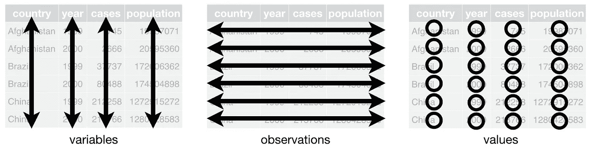
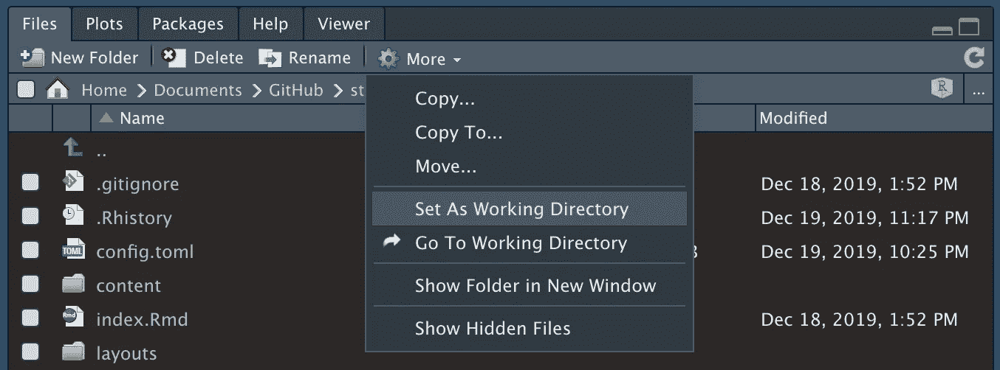
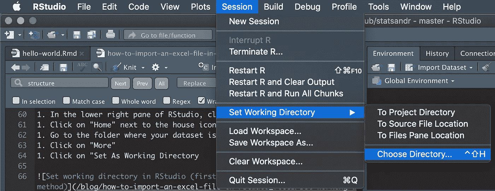
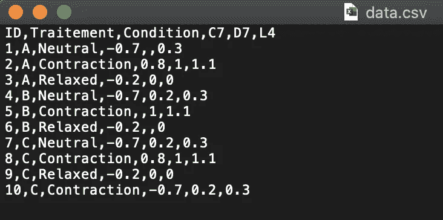
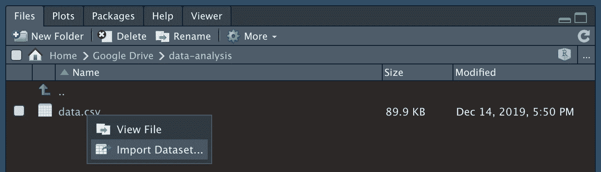
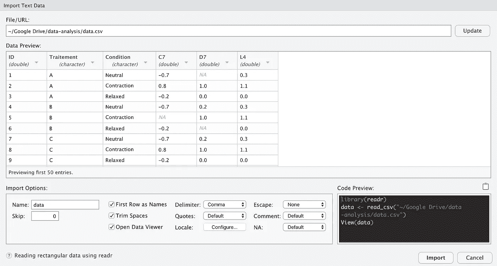

# 如何在 RStudio 中导入 Excel 文件

> 原文：<https://towardsdatascience.com/how-to-import-an-excel-file-in-rstudio-8b74c2abab13?source=collection_archive---------29----------------------->

## 在[安装了 R 和 RStudio](https://www.statsandr.com/blog/how-to-install-r-and-rstudio/) 之后，学习几种导入 Excel、CSV 或 SPSS(.sav)文件导入到 RStudio 中


Photo by [Avi Waxman](https://unsplash.com/@aviosly?utm_source=medium&utm_medium=referral)

# 介绍

正如我们在这篇关于[如何安装 R 和 RStudio](https://www.statsandr.com/blog/how-to-install-r-and-rstudio/) 的文章中所看到的，R 对于许多种计算任务和统计分析都很有用。然而，如果没有将数据集导入 R 的可能性，它就不会如此强大和有用。由于您最有可能将 R 与您自己的数据一起使用，因此能够将其导入 R 对于任何用户来说都是至关重要的。

在本文中，我介绍了两种导入 Excel 文件的不同方法；(I)通过文本编辑器,( ii)以更“用户友好”的方式。我还讨论了这两种方法的主要优缺点。请注意:

*   如何导入数据集往往取决于文件的格式(Excel、CSV、text、SPSS、Stata 等。).我在这里只关注 Excel 文件，因为它是数据集最常见的文件类型
*   还有其他几种导入 Excel 文件的方法(甚至可能是一些我不知道的方法)，但是我给出了两种最简单而又健壮的方法来导入这样的文件
*   无论是什么类型的文件以及如何导入，关于数据集的结构都有一个黄金标准:列对应于变量，行对应于观察值(广义而言)，每个值都必须有自己的单元格:



Structure of a dataset. Source: R for Data Science by Hadley Wickham & Garrett Grolemund

# 将 Excel 文件转换为 CSV 文件

在处理导入之前，首先要做的是将 Excel 文件的格式转换为 CSV 格式。 [1](https://www.statsandr.com/blog/how-to-import-an-excel-file-in-rstudio/#fn1) CSV 格式是处理数据集和编程语言的标准格式，因为与 Excel 相比，它是一种更强大的格式。

如果您的文件已经是 CSV 格式(扩展名为。csv)，可以跳过这一节。如果文件不是 CSV 格式(例如扩展名是。xlsx)您可以通过以下步骤轻松地将其转换为 CSV:

1.  打开您的 Excel 文件
2.  点击文件>另存为
3.  选择格式。战斗支援车
4.  点击保存

检查您的文件是否以扩展名. csv 结束。如果是这样，您的文件现在就可以导入了。但是首先，让我介绍一个将数据集导入工作目录 RStudio 时的重要概念。

# r 工作目录

尽管编程语言可能非常强大，但它经常需要我们的帮助，导入数据集也不例外。事实上，在导入数据之前，您必须告诉 RStudio 您的文件位于何处(因此让 RStudio 知道在哪个文件夹中查找您的数据集)。不过在这之前，我先介绍一下**工作目录**。工作目录是 RStudio 当前工作的位置(在您的计算机中)(事实上，RStudio 并不在您的整个计算机上工作；它在你电脑的一个文件夹里工作)。关于这个工作目录，我们需要两个函数:

1.  `getwd()` ( `wd`代表工作目录)
2.  `setwd()`

# 获取工作目录

在大多数情况下，当您打开 RStudio 时，工作目录(即它当前工作的位置)与数据集所在的位置不同。要知道 RStudio 当前使用的工作目录是什么，运行`getwd()`。在 MacOS 上，这个函数很可能会渲染一个位置，比如`"/Users/yourname/"`，而在 Windows 上，它很可能会渲染`"c:/Documents/"`。如果您的工作目录不同，不要担心，最重要的是正确设置工作目录(因此您的文件所在的位置)而不是它现在的位置。

# 设置工作目录

如前所述，数据集很可能位于与工作目录不同的位置。如果您不采取任何措施，RStudio 将永远无法导入您的文件，因为它没有在正确的文件夹中查找(您将在控制台中遇到以下错误:无法打开文件“data.csv”:没有这样的文件或目录)。现在，为了指定文件的正确位置(也就是告诉 RStudio 应该在哪个文件夹中查找数据集)，您有三种选择:

1.  用户友好的方法
2.  通过控制台
3.  通过文本编辑器(见下文，为什么这是我的首选)

# 用户友好的方法

要设置正确的文件夹，以便将工作目录设置为文件所在的文件夹，请按照下列步骤操作:

1.  在 RStudio 的右下方窗格中，单击“文件”选项卡
2.  点击房屋图标旁边的“主页”
3.  转到数据集所在的文件夹
4.  点击“更多”
5.  点击“设为工作目录”



Set working directory in RStudio (user-friendly method)

或者，您也可以通过点击会话>设置工作目录>选择目录…来设置工作目录



Set working directory in RStudio (user-friendly method)

正如您在控制台中所看到的，这两种方法中的任何一种都将实际执行代码`setwd()`,其路径指向您指定的文件夹。所以通过点击按钮，你实际上要求 RStudio 为你写一行代码。这种方法的优点是您不需要记住代码，并且不会在文件夹的路径名中出错。缺点是，如果您离开 RStudio 并在稍后再次打开它，您将不得不再次指定工作目录，因为 RStudio 不会通过按钮保存您的操作。

# 通过控制台

您可以通过在控制台中直接运行`setwd(path/to/folder)`来指定工作目录，其中`path/to/folder`是包含数据集的文件夹的路径。但是，重新打开 RStudio 时，您需要再次运行该命令。

# 通过文本编辑器

这种方法实际上是上述两种方法的结合:

1.  按照与用户友好方法(通过按钮)完全相同的步骤设置工作目录
2.  复制在控制台中执行的代码，并将其粘贴到文本编辑器(即您的脚本)中

我推荐这种方法有几个原因。首先，你不需要记住`setwd()`功能。第二，你不会在你的文件夹路径中输入错误(如果文件夹中有文件夹，路径有时会很长)。第三，当保存你的脚本时(我假设你这样做了，否则你会丢失你所有的工作)，你也保存了你刚才通过按钮所做的动作。因此，当您将来重新打开您的脚本时，无论当前目录是什么，通过执行您的脚本(现在包括用于设置工作目录的代码行)，您将同时指定您为此项目选择的工作目录。

# 导入数据集

现在，您已经将 Excel 文件转换为 CSV 文件，并且通过设置工作目录指定了包含数据的文件夹，现在就可以实际导入数据集了。提醒有两种方法可以导入文件:

1.  以用户友好的方式
2.  通过文本编辑器(也见下面为什么它是我的首选)

无论您选择哪种方法，最好先在“文本编辑”( Mac)或“记事本”( Windows)中打开文件，以便查看原始数据。如果您在 Excel 中打开文件，您会看到数据已经格式化，因此会错过导入所需的一些重要信息。下面是一个原始数据的例子:



Example of raw data

为了正确导入数据集，我们需要注意以下几点:

*   变量名是否存在？
*   值是怎么分开的？逗号，分号，空格，制表符？
*   十进制是点还是逗号？
*   如何指定缺失值？空单元格，NA，null，O，other？

# 用户友好的方式

如下所示，只需点击文件>导入数据集…



Import dataset in RStudio

将会打开一个如下所示的窗口:



Import window in RStudio

从这个窗口，您可以预览您的数据，更重要的是，检查您的数据是否正确导入。如果您的数据已经正确导入，您可以点击“导入”。如果不是这样，您可以根据查看原始数据时收集的信息，更改窗口底部(数据预览下方)的导入选项。下面是您最可能使用的导入选项:

*   名称:设置数据集的名称(默认为文件的名称)。避免使用特殊字符和长名称(因为您将不得不多次键入数据集的名称)。我个人用一个通用的名字给我的数据集重新命名，比如“dat”，其他人用“df”(data frame)、“data”，甚至“my_data”。例如，如果您使用网球比赛的数据，您可以使用更明确的名称，如“tennis_data”。但是，为数据集使用特定名称的主要缺点是，例如，如果您想要在分析其他数据集上的网球数据时重复使用您创建的代码，您将需要通过用新数据集的名称替换所有出现的“tennis_data”来编辑您的代码
*   跳过:指定要跳过的顶部行数(默认值为 0)。大多数时候，0 就可以了。但是，如果文件顶部包含一些空白行(或您想要忽略的信息)，请设置要跳过的行数
*   第一行作为名称:指定变量名称是否存在(默认情况下是变量名称存在)
*   分隔符:分隔值的字符。从上面的原始数据中，您可以看到分隔符是逗号(“，”)。如果您的值由“；”分隔，请将其更改为分号
*   NA:如何指定缺失值(默认为空单元格)。从上面的原始数据中，您可以看到缺少的值只是空的单元格，因此将 NA 保留为默认值或将其更改为“empty”。如果原始数据中的缺失值编码为“NA”或“0”，请更改此选项(提示:不要将自己的缺失值编码为“0”，否则您将无法区分真正的零值和缺失值)

更改与您的数据对应的导入选项后，单击“导入”。现在，您应该可以在一个新窗口中看到您的数据集，并从那里开始分析您的数据。

这种用户友好的方法的优点是您不需要记住代码(完整的代码见下一节)。但是，主要缺点是您的导入选项不会被保存以备将来使用，因此您需要在每次打开 RStudio 时手动导入数据集。

# 通过文本编辑器

与设置工作目录类似，我也建议使用文本编辑器而不是用户友好的方法，原因很简单，使用文本编辑器时可以保存导入选项(而使用用户友好的方法时不行)。将导入选项保存在脚本中(多亏了一行代码)允许您以完全相同的方式快速导入数据集，而不必在每次导入数据集时重复所有必要的步骤。导入 CSV 文件的命令是`read.csv()`(或`read.csv2()`，它是等效的，但具有其他默认导入选项)。下面是一个与用户友好方法中的文件相同的示例:

```
dat <- read.csv(
  file = "data.csv",
  header = TRUE,
  sep = ",",
  dec = ".",
  stringsAsFactors = TRUE
)
```

*   `dat <-`:r studio 中数据集的名称。这意味着在导入之后，我将需要通过调用`dat`来引用数据集
*   `file =`:工作目录中文件的名称。不要忘记在名称、扩展名周围加上" "。csv 结尾，并且 RStudio 区分大小写(`"Data.csv"`将给出错误)，在“”内部区分空格(`"data .csv"`也将抛出错误)。在我们的例子中，文件被命名为“data.csv ”,所以`file = "data.csv"`
*   `header =`:变量名存在吗？默认为`TRUE`，如果您的数据集中不是这种情况，请将其更改为`FALSE`(`TRUE`和`FALSE`始终是大写字母，`true`将不起作用！)
*   `sep =`:分离器。相当于用户友好方法中的分隔符。不要忘记" "。在我们的数据集中，值的分隔符是逗号，所以`sep = ","`
*   `dec =`:十进制。不要忘记" "。在我们的数据集中，数值的小数是一个点，所以`dec = "."`
*   `stringsAsFactors =`:字符向量要不要转换成因子？默认选项曾经是`TRUE`，但是从 R 版本 4.0.0 开始默认为`FALSE`。如果你所有的角色向量实际上都是[定性变量](https://statsandr.com/blog/variable-types-and-examples/#qualitative)(所以[因子](https://statsandr.com/blog/data-types-in-r/#factor)在 R 中)，设置为`TRUE`
*   我没有写缺失值在我的数据集中被编码为空单元，因为这是默认的
*   最后但同样重要的是，不要忘记参数是用逗号分隔的

存在其他参数，运行`?read.csv`查看所有参数。

导入后，您可以通过运行`View(dat)`来检查您的数据是否被正确导入，其中`dat`是您为数据选择的名称。一个类似于用户友好方法的窗口将显示您的数据。或者，您也可以运行`head(dat)`来查看前 6 行，并检查它是否对应于您的 Excel 文件。如果有些地方不正确，请编辑导入选项并再次检查。如果数据集已正确导入，现在就可以开始分析数据了。如果您想了解如何操作，请参阅 R 上的其他[文章。](https://www.statsandr.com/tags/R/)

通过文本编辑器中的代码直接导入数据集的优点是，您的导入选项将被保存以供将来使用，从而避免您在每次打开脚本时手动导入它。然而，你需要记住函数`read.csv()`(不是参数，因为你可以在帮助文档中找到它们)。

# 导入 SPSS(。sav)文件

这里只详细介绍 Excel 文件。但是，SPSS 文件(。sav)也可以通过使用以下命令在 R 中读取:

```
library(foreign)
dat <- read.spss(
  file = "filename.sav",
  use.value.labels = TRUE,
  to.data.frame = TRUE
)
```

`read.spss()`函数输出一个检索所有特性的数据表。sav 文件，包括不同级别分类变量的名称和变量的特征。如果您需要关于该命令的更多信息，请参阅帮助文档(`library(foreign)`然后是`?read.spss`)。

感谢阅读。我希望本文能帮助您在 RStudio 中导入 Excel 文件。如果数据集被正确导入，学习[如何操作它](https://www.statsandr.com/blog/data-manipulation-in-r/)。

和往常一样，如果您有与本文主题相关的问题或建议，请将其添加为评论，以便其他读者可以从讨论中受益。

1.  我知道可以直接将一个 Excel 导入到 R 中，而不用将其转换成 CSV 文件，例如用`{readxl}`包中的`read_excel()`函数。然而，CSV 格式是标准格式，更重要的是，导入 CSV 不需要[安装和加载软件包](https://www.statsandr.com/blog/an-efficient-way-to-install-and-load-r-packages/)(这对初学者来说有时会很困惑)。 [↩︎](https://www.statsandr.com/blog/how-to-import-an-excel-file-in-rstudio/#fnref1)

**相关文章:**

*   [安装和加载 R 包的有效方法](https://www.statsandr.com/blog/an-efficient-way-to-install-and-load-r-packages/)
*   我的数据符合正态分布吗？关于最广泛使用的分布以及如何检验 R 中的正态性的注释
*   [R 中的 Fisher 精确检验:小样本的独立性检验](https://www.statsandr.com/blog/fisher-s-exact-test-in-r-independence-test-for-a-small-sample/)
*   [R 中独立性的卡方检验](https://www.statsandr.com/blog/chi-square-test-of-independence-in-r/)
*   [如何在简历中创建时间线](https://www.statsandr.com/blog/how-to-create-a-timeline-of-your-cv-in-r/)

*原载于 2019 年 12 月 18 日 https://statsandr.com**T21*[。](https://statsandr.com/blog/how-to-import-an-excel-file-in-rstudio/)