# 如何用正则化方法改进神经网络

> 原文：<https://towardsdatascience.com/how-to-improve-a-neural-network-with-regularization-8a18ecda9fe3?source=collection_archive---------1----------------------->

## 了解如何应用 L2 正则化和辍学的神经网络

Photo by [Jessica Ruscello](https://unsplash.com/@jruscello?utm_source=medium&utm_medium=referral) on [Unsplash](https://unsplash.com?utm_source=medium&utm_medium=referral)

您刚刚构建了您的神经网络，并注意到它在训练集上表现得非常好，但在测试集上却没有那么好。

这是过度拟合的标志。你的神经网络有很高的方差，它不能很好地概括未经训练的数据。

解决过度拟合有两种常见方法:

*   获取更多数据
*   使用正则化

获取更多的数据有时是不可能的，有时又非常昂贵。因此，正则化是减少过拟合从而提高模型性能的常用方法。

在这篇文章中， **L2 正则化**和**退出**将被介绍为神经网络的正则化方法。然后，我们将对每种方法进行编码，看看它是如何影响网络性能的！

我们走吧！

> 对于机器学习、深度学习和人工智能的实践视频教程，请查看我的 [YouTube 频道](https://www.youtube.com/channel/UC-0lpiwlftqwC7znCcF83qg?view_as=subscriber)。

# L2 正则化

回想一下，在深度学习中，我们希望最小化以下成本函数:

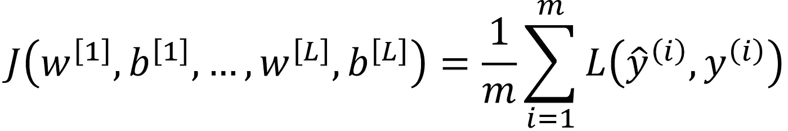

Cost function

其中 *L* 可以是任意损失函数(如[交叉熵损失函数](/step-by-step-guide-to-building-your-own-neural-network-from-scratch-df64b1c5ab6e))。现在，对于 **L2 正则化**我们增加了一个惩罚大权重的组件。

因此，等式变为:

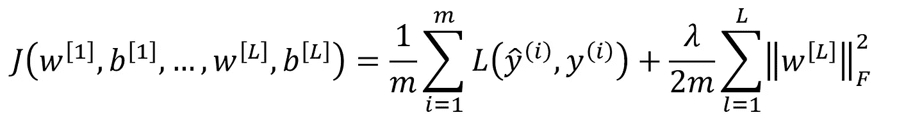

L2 regularization

其中*λ*是**正则化参数**。注意增加了 Frobenius 范数，用下标 *F* 表示。这实际上相当于矩阵的平方范数。

现在，*λ*是一个可以调整的参数。如果*λ*的值较大，则较大的权重值将受到更多的惩罚。类似地，对于较小的*λ*值，正则化效果较小。

这是有意义的，因为成本函数必须最小化。通过添加权重矩阵的平方范数并将其乘以正则化参数，大的权重将被降低，以便最小化成本函数。

## 为什么正规化有效？

如前所述，添加正则化分量将使权重矩阵的值下降。这将有效地去相关神经网络。

回想一下，我们为激活函数提供了以下加权和:

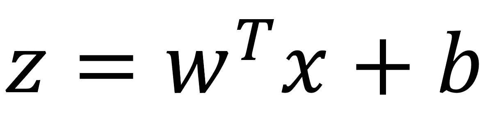

Weighted sum

通过减少权重矩阵中的值， *z* 也将减少，这反过来减少了激活函数的效果。因此，一个不太复杂的函数将适合数据，有效地减少过度拟合。

# 辍学正规化

退出包括检查神经网络中的所有层，并设置保留或不保留某个节点的概率。

当然，输入层和输出层保持不变。

保持每个节点的概率设置为**随机**。您只需决定**阈值**:一个决定节点是否被保留的值。

例如，如果您将阈值设置为 0.7，则有 30%的概率会从网络中删除一个节点。

因此，这将产生一个更小、更简单的神经网络，如下所示。

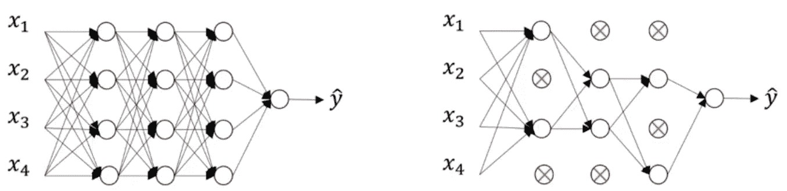

Left: neural network before dropout. Right: neural network after dropout.

## 为什么退学有效？

从一个神经网络中随机移除节点来调整它可能看起来很疯狂。然而，这是一种广泛使用的方法，并且被证明可以极大地提高神经网络的性能。那么，为什么它的效果这么好呢？

丢失意味着神经网络不能依赖任何输入节点，因为每个节点都有被删除的随机概率。因此，神经网络不愿意给予某些特征高的权重，因为它们可能会消失。

因此，权重分布在所有要素上，使它们变得更小。这有效地缩小了模型并使其正规化。

# 正规化的实施

现在，让我们对一些样本数据实施丢失和 L2 正则化，以查看它如何影响神经网络的性能。

参考完整笔记本[这里](https://github.com/marcopeix/Deep_Learning_AI/blob/master/2.Improving%20Deep%20Neural%20Networks/1.Practical%20Aspects%20of%20Deep%20Learning/Regularization.ipynb)。

## 创建样本数据集

我们首先创建一个样本数据集。在导入必要的[库之后，](https://github.com/marcopeix/Deep_Learning_AI/blob/master/2.Improving%20Deep%20Neural%20Networks/1.Practical%20Aspects%20of%20Deep%20Learning/Regularization.ipynb)我们运行下面这段代码:

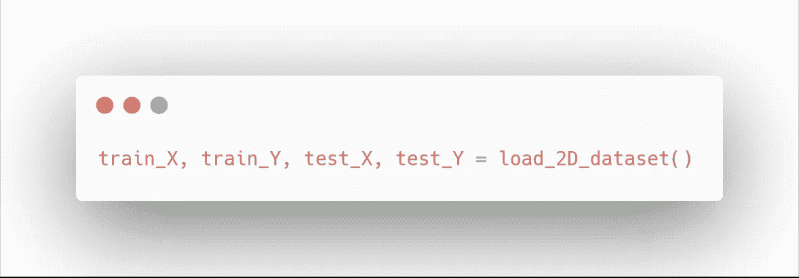

我们应该得到:

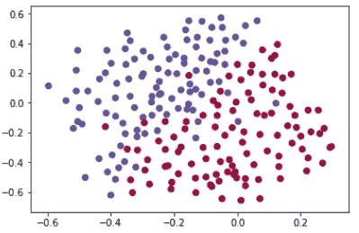

太好了！这是一个简单的随机数据集，有两个类，我们现在将尝试编写一个神经网络，它将对每个数据进行分类，并生成一个决策边界。

## 非正则化模型

现在，我们定义一个模型模板来适应正则化:

花时间阅读代码并理解它的作用。请注意对 L2 正则化有用的 *lambd* 变量。此外， *keep_prob* 变量将用于 dropout。

现在，让我们运行一个没有正则化的神经网络，作为基准性能。

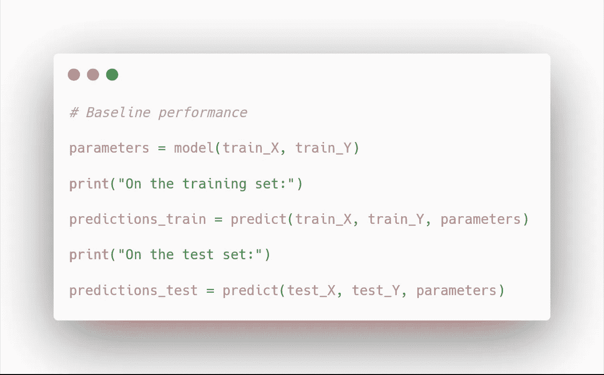

我们得到了:

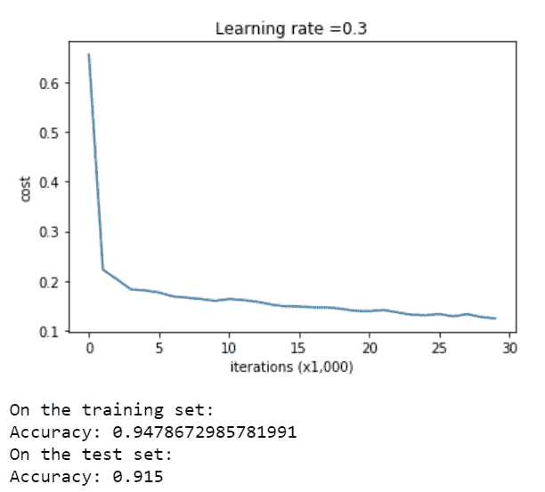

Baseline performance of a non-regularized model

还不错！让我们画出决策边界:

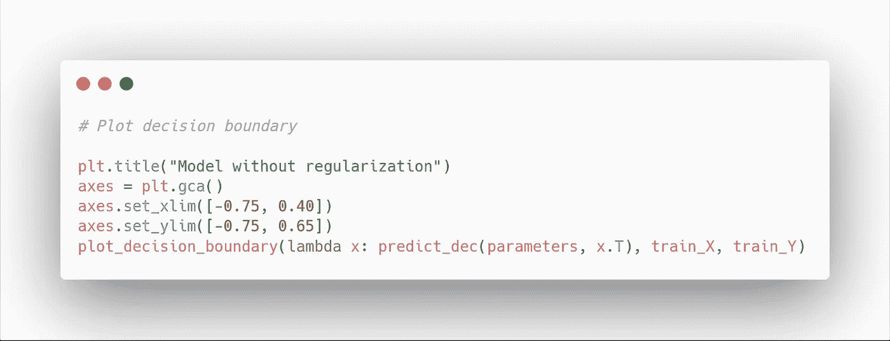

您应该会看到:

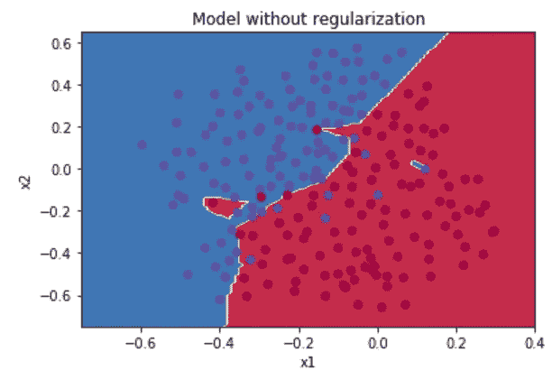

Decision boundary without regularization

在上面的图中，您会注意到模型过度拟合了数据的某些部分。我们将以此为基准，看看正则化如何提高模型的性能。

## L2 正则化

在使用 L2 正则化之前，我们需要定义一个函数来计算适应正则化的成本:

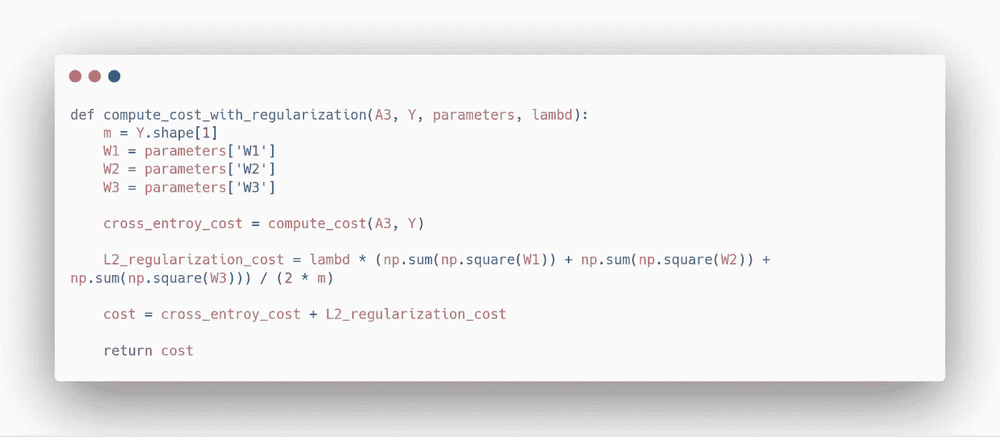

最后，我们用正则化定义反向传播:

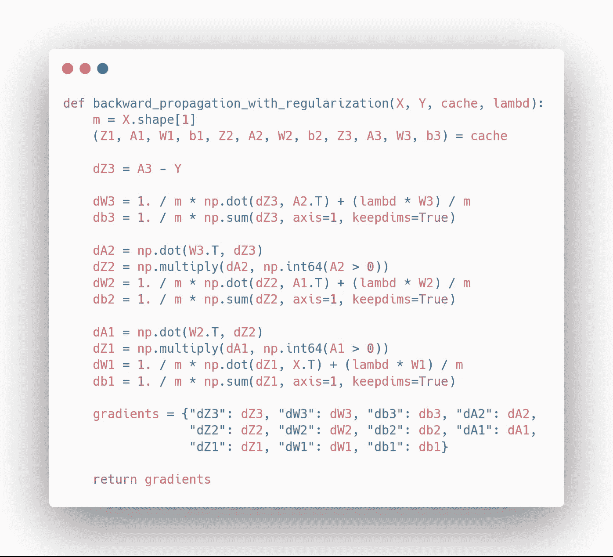

太好了！现在，我们可以使用我们的模型模板与 L2 正则化！将*λ*的值设置为 0.7，我们得到:

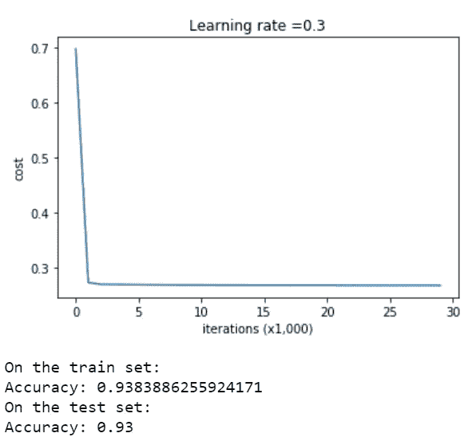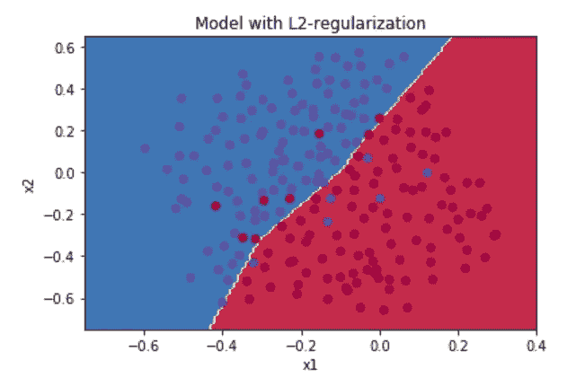

Decision boundary with L2 regularization

厉害！我们提高了测试精度，您会注意到模型不再过度拟合数据了！

现在，让我们看看辍学者是否能做得更好。

## 拒绝传统社会的人

首先，我们需要重新定义正向传播，因为我们需要随机消除某些节点的影响:

当然，我们现在必须定义辍学的反向传播:

太好了！让我们看看阈值为 0.8 时，模型在辍学情况下的表现如何:

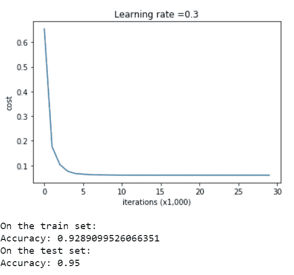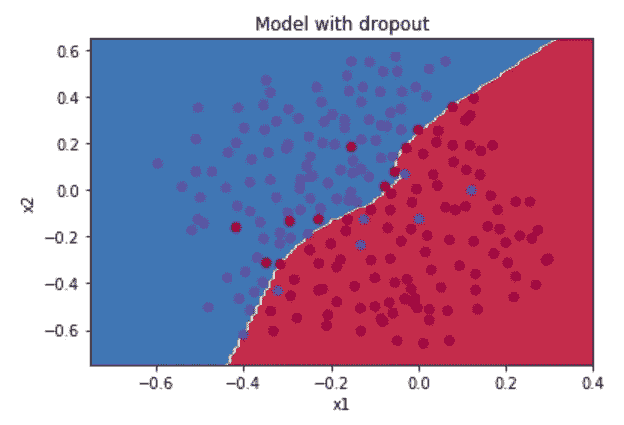

Decision boundary with dropout

太神奇了！我们实现了更高的精度和下降率！

干得好！您了解了正则化如何改进神经网络，并且实现了 L2 正则化和剔除来改进分类模型！

在以后的文章中，我将展示如何通过选择正确的优化算法来进一步改进神经网络。

敬请关注，继续学习！