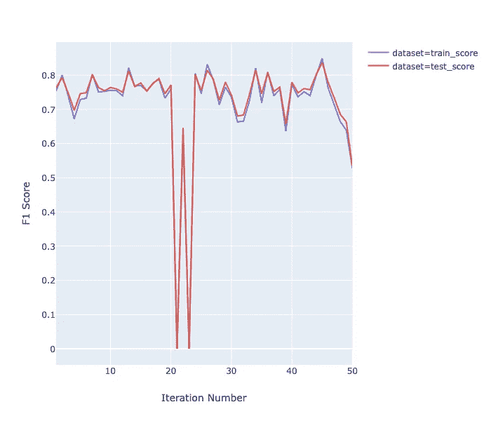

# 使用 Scikit Optimize 调整 XGBoost 超参数

> 原文：<https://towardsdatascience.com/how-to-improve-the-performance-of-xgboost-models-1af3995df8ad?source=collection_archive---------11----------------------->

XGBoost 不再是少数人能够理解和使用的外来模型。它已经成为许多场景中的比较基准。自从首次提出该算法的论文发表以来的三年半时间里，人们对 XGBoost 的兴趣也急剧增加。谷歌趋势表明，人们对 XGBoost 的兴趣目前正处于历史最高水平。

Relative popularity of XGBoost in the since April 2016

**挑战是什么？**

现在，虽然 XGBoost 在过去的几年里越来越受欢迎，但是一些挑战使得它有点难以使用。最坚定的一个是使用什么超参数值——估计器的数量应该是多少，应该允许的最大深度是多少，等等。XGBoost 之所以比线性/逻辑回归模型或决策树更难管理，是因为它比许多其他模型有更多的超参数。简单地手动调整它们需要大量的时间和耐心。你仍然不能确定你是否在朝着正确的方向前进。

**有解决办法吗？**

你可能会想，如果我们能够以某种方式自动化这种无聊又累人的调整超参数的仪式，我们的生活将会容易得多。如果你对此感到疑惑，那么请放心，因为，是的，我们有办法提高 XGBoost 模型的性能，而不需要做所有的手工劳动，只需让计算机为我们解决问题。

选择超参数的*正确值*的过程称为超参数调整，有预建的库可以为我们完成这项工作。所以我们需要做的就是写一些代码，给出一些输入值，让计算机算出最佳值。

**我们是如何做到的？**

在我们进入代码和弄脏我们的手之前，让我们在这里停留一分钟并且问我们自己——如果我们是一台计算机并且被给予同样的问题，我们将如何做它？

让我们好好想想。我假设在这种情况下我们只有两个超参数值，因为这样更容易可视化。我要做的第一件事是用两个超参数的任意随机值建立一个模型，看看我的模型表现如何。

我要做的下一件事是增加一个参数，保持一个参数不变，看看我的模型性能如何响应其中一个参数的增加。如果我的模型性能提高，这意味着我正在向正确的方向移动我的超参数。如果没有，我现在知道我需要降低这个超参数的值。在下一次迭代中，我将更改我的另一个超参数的值，并查看我的模型如何对该更改做出反应。我将这样做几次，一旦我看到我的模型对这些变化做出足够多的反应，我将开始同时改变两者。

因此，我们现在所做的是利用之前模型的输出，并相应地改变超参数的值。在下面的部分中，我们将使用一个专门开发的包来帮助我们做到这一点。

**想法**

在本教程中，我们将使用 [scikit-optimize](https://scikit-optimize.github.io) 包来帮助我们为模型选择合适的值。现在，为了能够使用这些算法，我们需要为它们定义一个搜索区域，比如搜索空间。想象一下，你需要寻找一个地区的最高点，一个朋友愿意为你做这项工作。为了让你的朋友能够有效地做到这一点，你必须告诉他你想让他搜索的区域。你必须定义一个你希望他花时间搜索的区域/空间。

skopt 和其他此类算法也是如此。在这种情况下，算法是您的朋友，您需要它来搜索最佳的超参数值集。为了使算法成功，你需要定义一个搜索区域。

这些是我们将要遵循的步骤

*   使用 sklearn 的`make_classification`功能创建虚拟数据集。我们将使用执行二元分类，因此我们的标签将包含 0 和 1
*   定义一个搜索空间/区域，您要在该空间/区域上建模以搜索最佳超参数值
*   定义一个用不同超参数值拟合模型的函数，并测量模型性能
*   定义您想要训练模型的次数
*   使用 skopt 的`gp_minimize`算法搜索我们的空间并给出结果

仅此而已。这就是你需要做的。现在让我们看一下代码。

**代码**

您将需要 skopt 包，您可以通过在命令行输入`pip install scikit-optimize`来安装它

注意:代码框下面提供了所有代码片段的链接。如果有任何代码看起来不完整，点击 GitHub 链接找到完整的代码

*   进口

[https://gist . github . com/vecto saurus/6a E1 b 455 c 7527 BF 25954 e 834 b 8b 49 a 89](https://gist.github.com/vectosaurus/6ae1b455c7527bf25954e834b8b49a89)

*   创建数据集

[https://gist . github . com/vecto saurus/a 53683 c 4d 6 FDE 396 ce 43 b 92 c 045 a5a 00](https://gist.github.com/vectosaurus/a53683c4d6fde396ce43b92c045a5a00)

*   定义搜索空间。这里，我们通过提供每个超参数可以取的最小值和最大值来定义搜索空间。

[https://gist . github . com/vecto saurus/DC 922 b 0 b 8d 9 db 080 BD 75b 736 c 2e 09 b 0 b](https://gist.github.com/vectosaurus/dc922b0b8d9db080bd75b736c2e09b0b)

*   函数来拟合模型并返回模型的性能

[https://gist . github . com/vecto saurus/73d 257 CB 0 be 61d 88 ab 788 bb 70 f 22 b 857](https://gist.github.com/vectosaurus/73d257cb0be61d88ab788bb70f22b857)

这里，在 return 语句中，我返回`1 - test_score`而不是`test_score`。这是因为 skopt 的`gp_minimize`致力于寻找最小值。我们的目标是找到我们能得到的最大值`f1_score`。所以通过让`gp_minimize`最小化`1 - test_score`，我们就最大化了`test_score`

*   运行算法

[https://gist . github . com/vecto saurus/f 686 bfc 43 fdec 8 f 378d 0 eeae 074 E5 Fe 1](https://gist.github.com/vectosaurus/f686bfc43fdec8f378d0eeae074e5fe1)

**结果**

[https://gist.github.com/vectosaurus/2f6ff57ac4cb4e728d32c65a155ceb78](https://gist.github.com/vectosaurus/2f6ff57ac4cb4e728d32c65a155ceb78)

XGBoost 模型在第一次迭代中以`test_score`开始，现在是`0.762`，但是最终 F1 分数是`0.837`，增加了超过 7%。

**结论**

虽然自动超调在许多情况下有助于提高模型性能，但仍有必要密切关注数据。在许多情况下，探索数据和工程信息变量会更加有效。

此外，重要的是要注意，我们为模型选择的搜索空间是有意义的。简单地声明一个非常大的空间会影响这些算法所能执行的搜索的质量。

超参数调整非常有效，但我们需要确保我们为它提供了足够公平的搜索空间和足够合理的迭代次数。自动化的超参数调整减少了人力，但并没有降低程序的复杂性。