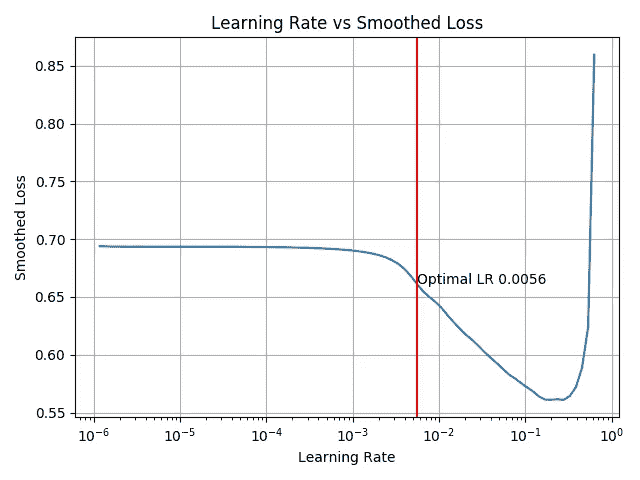

# 如何在 Tensorflow 2.0 中改进训练您的深度神经网络

> 原文：<https://towardsdatascience.com/how-to-improve-training-your-deep-neural-network-in-tensorflow-2-0-a3f62d6367c1?source=collection_archive---------29----------------------->


Taken from [http://www.merzpraxis.de/index.php/2016/06/13/der-suchende/](http://www.merzpraxis.de/index.php/2016/06/13/der-suchende/)

当涉及到建立和训练深度神经网络时，你需要设置大量的超参数。正确设置这些参数对你的网的成功有巨大的影响，也对你花在加热空气上的时间，也就是训练你的模型有巨大的影响。其中一个你必须选择的参数是所谓的学习率(也称为更新率或步长)。在很长一段时间里，选择这种权利更像是试错法或黑色艺术。然而，有一种[聪明而简单的技术](https://arxiv.org/abs/1506.01186)可以找到一个合适的学习率，我猜这种技术通过在 [fastai](https://www.fast.ai/) 中的使用变得非常流行。在本文中，我将向您简要介绍这种方法，并向您展示 Tensorflow 2 中的一个实现，它也可以通过我的[回购](https://github.com/Shawe82/tf2-utils)获得。所以让我们开始吧。

## 问题是

学习率 *l* 是一个单一的浮点数，它决定了你向负梯度方向移动多远，以更新和优化你的网络。正如在介绍中已经说过的，正确地选择它极大地影响了你花在训练你的模型上的时间，直到你得到好的结果并停止咒骂。为什么会这样呢？如果你选择的太小，你的模型将需要很长时间才能达到最佳状态，因为你只需要一小步一小步的更新。如果你选择的太大，你的模型将会反弹，跳过最优值，最终无法达到最优值。

## 解决方案

莱斯利·n·史密斯提出了一个非常聪明和简单的方法，在短时间内系统地找到一个让你非常快乐的学习率。前提是你有一个模型，并且你有一个被分成 *n* 批的训练集。

1.  你将你的学习初始化为一个小值 *l* = *l_min* ，例如 *l_min* =0.00001
2.  你用一批训练集来更新你的模型
3.  计算损失并记录损失和使用的学习率
4.  你成倍地提高了当前的学习速度
5.  如果学习率已经达到预定义的最大值 *l_max* 或者如果损失增加太多，则**返回步骤 2** 或者**停止**搜索
6.  最佳学习速率是导致两次连续试验之间损失最大程度减少的速率。选择最佳学习率的另一种方法是找到导致最小损失的学习率，并将其降低一到两个数量级。

为了让这一切更加直观，我给你看了在对数标度上绘制的学习率的平滑损失。红线标记计算出的最佳学习率。



## 实施

由于我目前正在学习 [Tensorflow 2](https://www.tensorflow.org/guide/effective_tf2) (TF2)，我认为通过使用新的 TF2 概念实现学习率查找器来练习它是一个好主意。除此之外，我(希望你也是)现在有了所有我(或你)想要追求的即将到来的 TF2 项目的 LR Finder。在这里发布的代码中，我用*步骤 1–6*标记了相应的行，以引用上面的清单。这里显示的代码经过了一点简化和重构，以增加在介质上的可读性。你可以在我的 [Github repo](https://github.com/Shawe82/tf2-utils) 上找到完整的代码以及一个小例子和绘图功能。

```
**from** dataclasses **import** dataclass, field
**from** typing **import** List**import** numpy as np
**import** tensorflow **as** tf
**from** tqdm **import** tqdm**def** lr_finder(
    mdl: tf.keras.Model,
    opt: tf.keras.optimizers.Optimizer,
    lossf: tf.keras.losses.Loss,
    dataset,
    learn_rates: LrGenerator,
    losses: SmoothedLoss,
) -> Lr:
    # Step 1 & 4 init and decrease, Step 2 take batch
    **for** lr, (source, target) **in** zip(learn_rates(), dataset): 
        tf.keras.backend.set_value(optimizer.lr, lr)
        # Step 2 model update, Step 3 Calculate loss
        loss = step(mdl, opt, lossf, source, target).numpy()
        # Step 3 record losses
        losses.update(loss) 
        # Step 5 check if done
        **if** losses.no_progress:
            **break****return** Lr(learn_rates, losses)**@tf.function**
**def** step(mld, opt, lossf, src: Tensor, trg: Tensor) -> Tensor:
    **with** tf.GradientTape() **as** tape:
        # Step 3 Compute loss
        loss = lossf(trg, mld(src)) 
        grads = tape.gradient(loss, mld.trainable_weights)
    # Step 2 Update the model
    opt.apply_gradients(zip(grads, mld.trainable_weights))
    **return** loss**@dataclass**
**class** SmoothedLoss:
    sm: float = 1
    _losses:List[float]=field(init=False, default_factory=list)
    _sm: List[float] = field(init=False, default_factory=list)
    _avg: float = field(init=False, default=0)
    _best_loss: float = field(init=False, default=None)**def** update(self, loss):
        # Step 3 record losses
        self._avg = self.sm * self._avg_loss + (1 - self.sm) * loss
        smooth_loss = self._avg / (
            1 - self.sm ** (len(self._sm) + 1)
        )
        self._best_loss = (
            loss
            **if** len(self._losses) == 0 or loss < self._best_loss
            **else** self._best_loss
        )self._losses.append(loss)
        self._sm.append(smooth_loss)**@property**
    **def** no_progress(self):
        **return** self._sm[-1] > 4 * self._best_loss**@dataclass**
**class** LrGenerator:
    min_lr: float
    max_lr: float
    n_steps: int
    _lrs: List[float] = field(init=False)**def** __call__(self):
        self._lrs = [] 
        frac = self.max_lr / self.min_lr
        **for** step **in** tqdm(range(self.n_steps)):
            # Step 1 and 4 update lr and init
            lr = self.min_lr*frac**(step/(self.n_steps - 1))
            # Step 3 record learning rates
            self._lrs.append(lr)
            **yield** lr**@dataclass
class** Lr:
    lr: LrGenerator
    loss: SmoothedLoss
    _opt_idx: int = field(init=False, default=None)**@property
    def** opt_idx(self):
        # Step 6 get best learning rate
        cut = 3
        **if** self._opt_idx **is** None:
            sls = np.array(self.loss._smoothed_losses)
            self._opt_idx = np.argmin(sls[1 + cut :] - sls[cut:-1]) 
        **return** self._opt_idx + 1 + cut**@property
    def** lr_opt(self):
        # Step 6 get best learning rate
        **return** self.lr._lrs[self.opt_idx]
```

## 结束了

感谢您关注我的小文章和我的第一个 TensorFlow 2 实现。如有任何问题、意见或建议，请随时联系我。