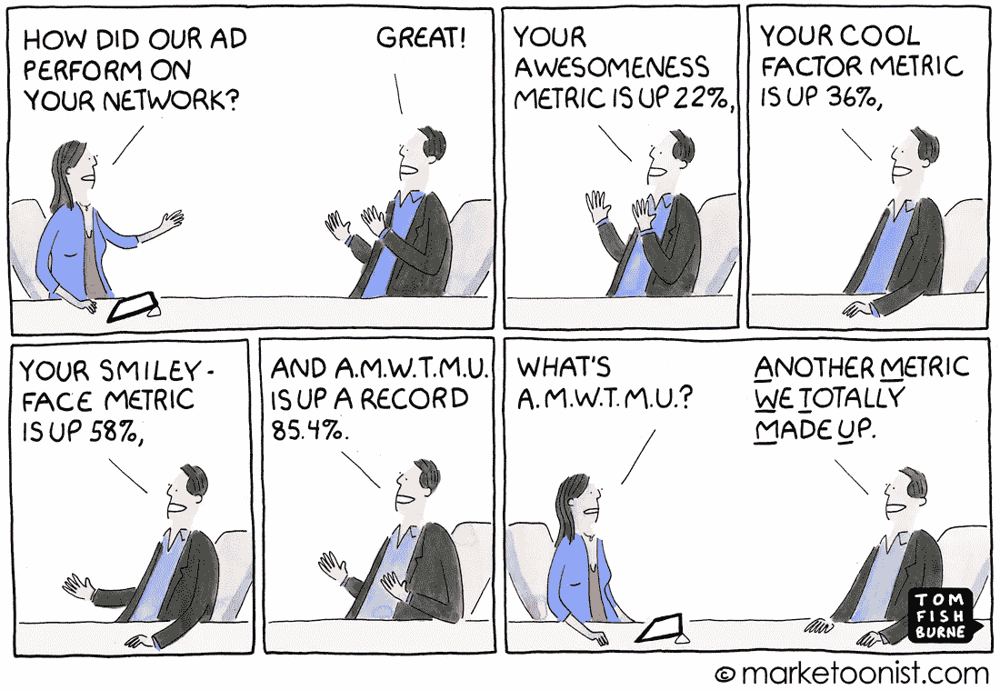
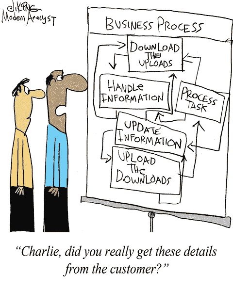

# 如何改进您的数据科学战略

> 原文：<https://towardsdatascience.com/how-to-improve-your-data-strategy-b8f498ac5dc6?source=collection_archive---------17----------------------->

## 这不仅仅是雇佣一名数据科学家和支付 Tableau 许可证的费用

Photo by [Tabea Damm](https://unsplash.com/@tabeadamm?utm_source=unsplash&utm_medium=referral&utm_content=creditCopyText) on [Unsplash](https://unsplash.com/search/photos/strategy?utm_source=unsplash&utm_medium=referral&utm_content=creditCopyText)

创建有效的数据策略并不像雇佣一些数据科学家和数据工程师以及购买 tableau 许可那么简单。也不仅仅是用数据做决策。

创建有效的数据战略就是要创建一个生态系统，在这个生态系统中，获取正确的数据、指标和资源非常容易。这是关于发展一种文化，学会质疑数据，在做出最终结论之前，从多个角度看待一个商业问题。

我们的数据咨询团队与从价值数十亿美元的科技公司到医疗保健公司以及介于两者之间的几乎所有类型的公司都有过合作。我们已经看到好的、坏的和丑陋的数据被用于战略。我们想分享一些简单的变化，这些变化有助于改善贵公司的数据处理方法。

## **在集中和分散实践之间找到平衡**

标准和过度集权不可避免地会拖团队的后腿。对表、数据库和模式进行小的更改可能会被迫经历一些过于复杂的过程，从而影响团队的工作效率。

另一方面，集中化可以更容易地实施新的战略变化，而不必去每个团队，然后强迫他们采取新的流程。

在我们看来，公司可以获得的最大优势之一是开发工具和策略，帮助在集中和分散之间找到一个合适的中间点。这通常包括创建标准来简化开发决策，同时提高管理每个数据团队需要执行的常见任务(如文档和数据可视化)的能力。同时分散通常特定于部门和领域的决策。

这里有一些例子，可以为非标准化的主题提供标准化的工具和过程。

## 为相似的度量创建 UDF 和库

在包括医疗保健、银行和市场营销在内的几个行业工作后，你会意识到许多团队都在使用相同的指标。

这可能是跨行业的，或者至少是跨内部团队的。问题是每个团队将不可避免地创建不同的方法来计算完全相同的数字。

这可能会导致重复的工作、代码和高管做出相互冲突的决策，因为顶线指标会发生变化。

您可以创建使用相同字段来计算正确指标的集中式库，而不是依赖每个团队来负责创建计算各种指标的过程。这使流程标准化，同时仍为最终用户提供足够的灵活性，使他们能够根据自己的特定需求开发报告。

这只有在指标使用一致的情况下才有效。例如，在医疗保健行业，每个患者每月的成本(PMPM)、再入院率或床位周转率等指标都是一致使用的。这些有时由 EMR(如 EPIC)计算，但仍可能由分析师针对更具体的情况再次计算。它也可能由外部顾问计算。

创建能够轻松完成这项工作的函数或库有助于提高一致性并节省时间。相反，让每个团队开发他们自己的方法，你可以简单地提供一个框架，使实现相同的度量变得容易。

## 自动化平凡但必要的任务

创建有效的数据策略就是让数据的使用和管理变得简单。

这个过程的一部分需要将所有数据团队需要做的普通任务自动化。

这方面的一个例子是创建文档。文档是帮助分析师理解他们正在使用的表格和流程的一个重要因素。拥有好的文档可以让分析师进行更好的分析。然而，文档经常被推迟到最后一分钟，或者根本不做。

与其强迫工程师记录每个新表，不如创建一个系统，定期自动抓取可用的数据库，并跟踪存在哪些表、谁创建了它们、它们有哪些列，以及它们是否与其他表有关系。

这将是一个由 devops 团队承担的项目，或者您也可以研究第三方系统，例如用于 SQL Server 的 [dbForge 文档。这并没有涵盖所有内容，这个工具只适用于 SQL Server。但是一个类似的工具可以帮助简化很多人的生活。](https://www.devart.com/dbforge/sql/documenter/download.html)

团队仍然需要描述表和列是什么。但是，实际检查和设置基本信息的初始工作都可以自动跟踪。

这有助于减少必要但重复的工作，使每个人的生活变得更轻松。

## **提供更简单的方法来分享和跟踪分析**

这是专门面向数据科学家的。

数据科学家通常会在 Jupyter 笔记本和 Excel 上工作，只有他们才能访问这些文件。此外，许多公司没有强制要求使用某种形式的存储库，如 git，以便数据科学家可以对他们的工作进行版本控制。

这限制了共享文件以及跟踪分析过程中可能发生的变化的能力。

在这种情况下，协作变得很困难，因为同事们经常被来回传递文件和自我版本控制所困扰。通常情况下，这些文件的后缀类似于 _20190101_final、_20190101_finalfile…

对于那些不明白的人，希望你永远也不会明白。

最重要的是，由于许多 python 脚本利用了多个库，所以当您在环境中安装所有正确的版本时，要确保这一点是很困难的。

老实说，所有这些小困难都可能因为故障排除而导致一两天的损失，这取决于您试图运行的分析的复杂程度。

但是，解决方法多的是！

实际上，有很多很棒的工具可以帮助您的数据科学团队进行协作。这包括像多米诺数据实验室这样的公司。

现在，您也可以随时使用 git 和虚拟环境，但这也要求您的数据科学家非常精通这些技术。情况并非总是如此。

同样，这允许您的团队独立工作，但也很容易分享他们的工作。

# 数据文化转变

当你试图创建一家更加数据驱动的公司时，增加新的库和工具并不是唯一需要发生的变化。一个更重要也更困难的转变是文化上的。

改变人们看待和处理数据的方式是一个非常具有挑战性的关键方面。这里有几个原因。

## 数据谎言

对于没有读过这本书的人来说，[如何用统计数据撒谎](http://faculty.neu.edu.cn/cc/zhangyf/papers/How-to-Lie-with-Statistics.pdf)，剧透一下，用数字来讲述你想要的故事真的很容易。

有很多方法可以做到这一点。

一个团队可以挑选他们想要的统计数据来帮助他们的议程取得成功。或者，如果你不考虑所有其他变量，一个研究团队可能会忽略混杂因素，并报告一些看起来令人震惊的统计数据。

作为一家数据驱动的公司，这意味着你需要发展一种文化，试图查看统计数据和指标，并确保没有任何东西干扰数字。这一点也不容易。说到数据科学和分析。

大多数度量和统计通常有一些规定，可能会否定它们试图表达的任何信息。这就是为什么创造一种关注指标并问为什么的文化是过程的一部分。如果只是简单地获得输出和 p 值。那么数据科学家就会失业，因为有很多第三方公司的产品可以找到最佳算法，为你进行特征选择。

但这并不是数据科学家的唯一工作。他们在那里质疑每一个 p 值，并真正挖掘他们所看到的数字的原因。

## 数据仍然杂乱无章

说实话，数据还是很乱。即使有了今天的现代 ERP 和应用程序，数据也是混乱的，有时坏数据会误导经理和分析师。

这可能是由很多原因造成的。应用程序如何管理数据，这些应用程序的系统管理员如何修改所述系统，等等。从业务流程的角度来看，即使是看似微不足道的变化也会对数据的存储方式产生重大影响。

反过来，当数据工程师提取数据时，由于错误的假设和有限的知识，他们可能无法准确地表示数据。

这就是为什么只有数字是不够的。团队还需要对创建所述数据的业务和过程有很好的理解，以确保他们不允许混乱的数据进入分析师直接使用的表中。

我们的观点是，数据分析师需要确信他们正在查看的数据正确地代表了他们相应的业务流程。如果分析师必须删除任何数据，或者一致地执行连接和 where 子句来准确地表示业务，那么数据就不是“自助”的。这就是为什么每当数据工程师创建新的数据模型时，他们都需要与业务部门密切合作，以确保收集正确的业务逻辑并在表的基础层中表示出来。

这样，分析师可以对他们的数据有近乎 100%的信任。

## **结论**

归根结底，创建有效的数据文化需要自上而下和自下而上的思维转变。从执行层面来看，需要决定在哪些关键领域可以帮助简化数据访问。然后，团队可以开始工作，在实际使用数据做决策方面变得更加熟练。我们经常发现大多数团队花太多时间在需要完成但可以自动化的数据任务上。改进您公司的数据方法可以提供巨大的竞争优势，并让您的分析师和数据科学家能够从事他们都喜欢的项目，并帮助您提高利润！

如果你喜欢这篇关于数据科学的文章，那么也考虑一下这些文章吧！

 [## Hadoop 与关系数据库

### 大数据已经从仅仅是一个时髦词变成了一种必需品，高管们需要想出如何与之争论。今天…

www.acheronanalytics.com](http://www.acheronanalytics.com/acheron-blog/hadoop-vs-relational-databases)  [## 使用 Python 抓取相遇 API

### 我们最近发布了一些你可以参与的项目的想法，添加到你的简历中，并帮助你更多地了解…

www.acheronanalytics.com](http://www.acheronanalytics.com/acheron-blog/using-python-to-scrape-the-meet-up-api)  [## 自动化工作流程的 4 个简单 Python 想法-西雅图数据人

### 自动化。它应该可以消除工作。那么，为什么不帮助它呢？说实话，自动化甚至简单的任务…

www.theseattledataguy.com](https://www.theseattledataguy.com/4-simple-python-ideas-to-automate-your-workflow/)  [## 软件工程师面试学习指南

### 这是一个软件工程学习指南，你可以用它来帮助自己准备面试。这是…

www.coriers.com](https://www.coriers.com/the-interview-study-guide-for-software-engineers/)  [## Python 后端:Flask 对 Django

### 你的下一个项目适合做什么？

medium.com](https://medium.com/better-programming/python-backends-flask-versus-django-5de314fa70ff)  [## 使用 Python 抓取相遇 API

### 我们最近发布了一些你可以参与的项目的想法，添加到你的简历中，并帮助你更多地了解…

开发到](https://dev.to/seattledataguy/using-python-to-scrape-the-meet-up-api-316p)