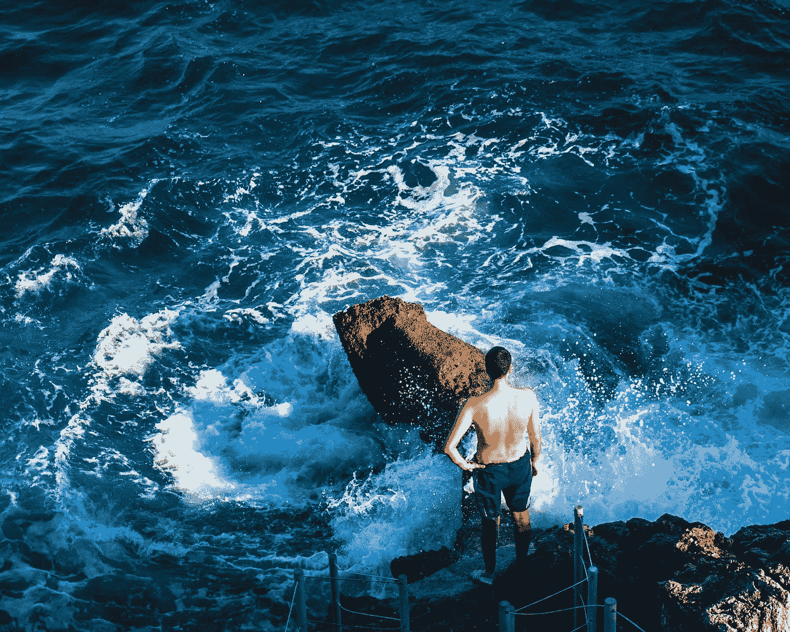
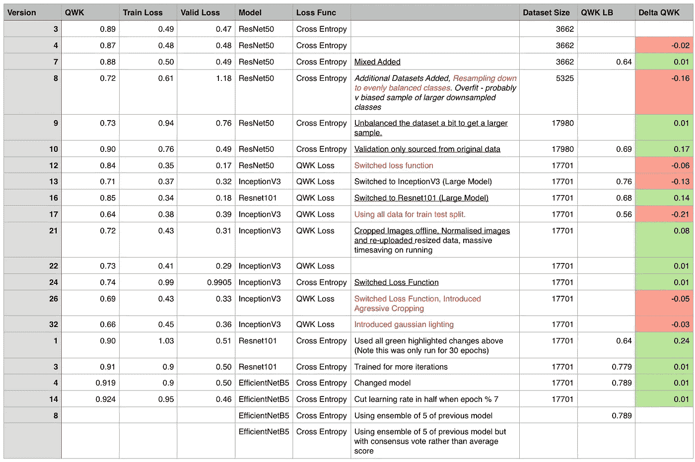
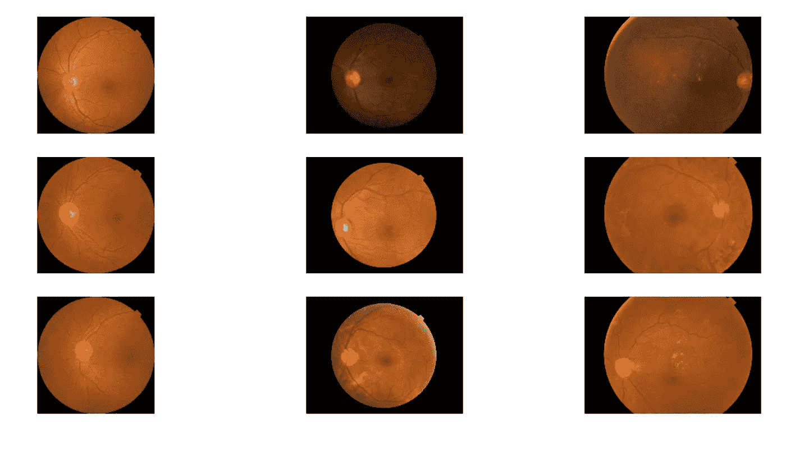
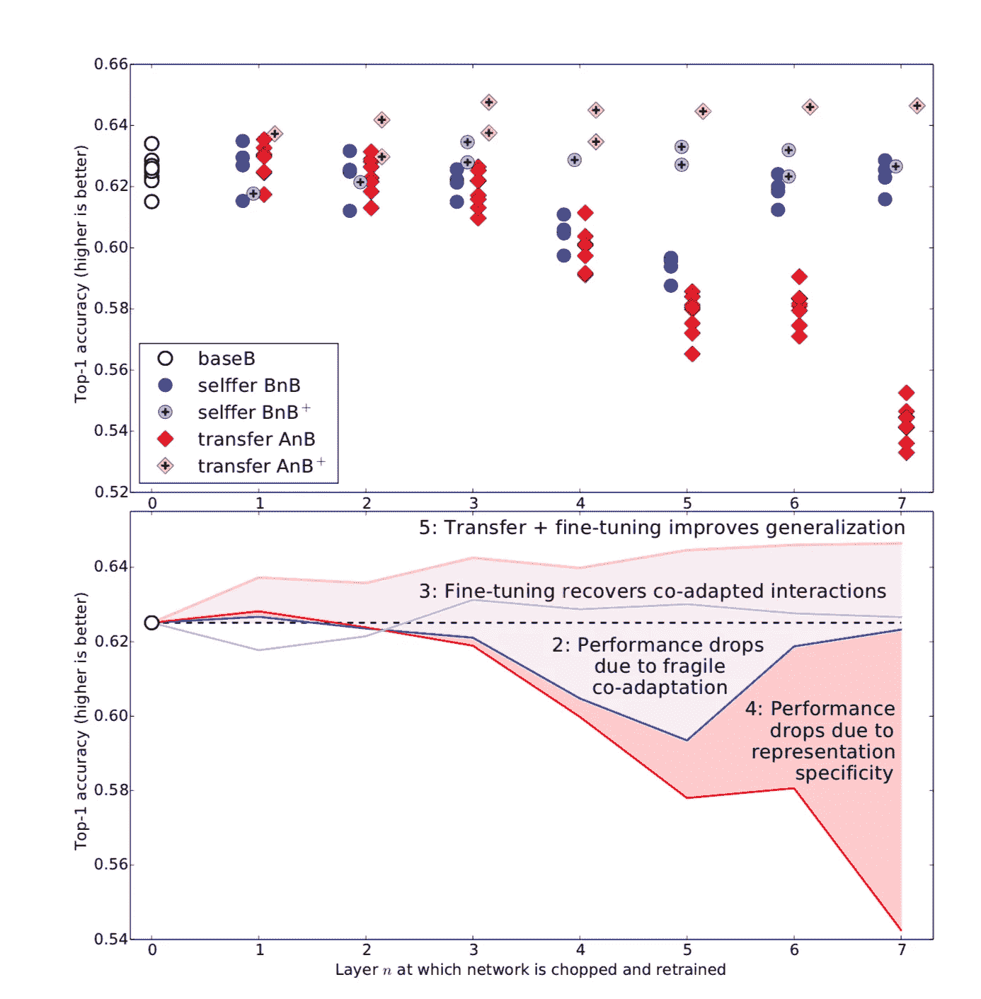

# 如何提高你的 kaggle 竞赛排行榜排名

> 原文：<https://towardsdatascience.com/how-to-improve-your-kaggle-competition-leaderboard-ranking-bcd16643eddf?source=collection_archive---------15----------------------->

## 美国有线电视新闻网失明检测新大楼的提示

> 在最近参加了 2019 年 APTOS 失明检测 Kaggle 比赛并获得前 32%的成绩后，我想分享一下我训练卷积神经网络的过程。我之前唯一的深度学习经验是完成 Deeplearning.ai 专业化，因此这是你阅读本文所需的全部内容。

## **本条的章节**

1.  竞争环境
2.  写日志
3.  获取更多数据
4.  利用现有内核
5.  预处理图像
6.  训练是一个非常非常缓慢的过程(但是不要担心)
7.  迁移学习
8.  型号选择

## 竞争环境

我在过去的 2-3 个月里断断续续地参加了 Kaggle 上的 [APTOS 2019 失明检测比赛](https://www.kaggle.com/c/aptos2019-blindness-detection)，比赛要求你将人们眼睛的图像分为 5 类糖尿病视网膜病变严重程度。在本文的剩余部分，我将谈论一些你可以在*任何 kaggle vision 竞赛中使用的技巧和诀窍，*，因为我觉得我从这个竞赛中学到的东西基本上是普遍适用的*。*

## 记日志

像任何好的科学实验一样，我们一次改变一件事，并将我们的结果与我们的对照进行比较。因此，当训练 CNN(卷积神经网络)时，我们也应该这样做，并在日志中记录变化和结果。这是我在失明检测挑战赛中用过的。

My logbook for Kaggle APTOS Blindness Detection Challenge

我并不声称我在这里使用的精确的表格是理想的(远非如此)，但是我发现至少能够识别每次我进行更改时，模型是否在以前的更改基础上有所改进是非常有用的。无论如何，我强烈建议你保持某种形式的日志，因为很难确定你所做的事情是否有效。

我对下一份比赛日志的一些想法是:

1.  建立一个单一的基线模型来比较所有未来的变化
2.  想出一堆您想要尝试的调整，并为每个调整独立地运行基线的修改版本，而不是以累积的方式。
3.  尽可能长时间保持相同的(最小的)CNN 架构，因为这将使迭代更快，并且通过一些观察，许多超参数应该体面地转移到更大更复杂的模型。

## 获取更多数据

在你开始编码之前做一些研究，看看以前是否有类似的比赛，或者是否有类似标签的训练集的数据库可以使用。更多的数据永远不会对你的模型造成真正的伤害(假设标签的质量还不错)，所以尽可能地获取更多的数据，但是不要忘记从提供给你的原始数据集中保留你的验证和测试集，否则你可能会以训练测试不匹配而告终*。*

## 利用现有内核

如果你是深度学习竞赛的新手(像我一样)，你可能不想从头开始编写整个笔记本——特别是当别人可能已经为你的竞赛发布了一个入门内核时(为什么要重新发明轮子呢？).这可能会为您节省大量调试时间，并通过调整其他人的模型让您更快地学习新东西。

这是一个很好的启动内核,我在几乎所有的进一步试验中使用并改进了它。

 [## [APTOS] resnet50 基准

### 下载数千个项目的开放数据集+在一个平台上共享项目。探索热门话题，如政府…

www.kaggle.com](https://www.kaggle.com/mathormad/aptos-resnet50-baseline) 

**一个警告:**如果一个内核建议你的模型使用一些技术，你应该检查它们是否陈述了最终的性能提升，否则，在盲目地将它们合并到你自己的模型之前，要持怀疑态度并自己进行测试:)

## 预处理图像

**裁剪&其他增强:**这一步是必须的。训练图像可能处于非常原始的状态。例如，在失明检测挑战中，所有图像都以不同的比例裁剪，这意味着一个愚蠢的算法可能会过度适应眼睛周围的黑色空间，这在一个类别中比另一个类别中更普遍。

Source: [https://www.kaggle.com/taindow/be-careful-what-you-train-on](https://www.kaggle.com/taindow/be-careful-what-you-train-on)

因此，以稳健的方式裁剪图像和调整图像大小是这场竞赛的关键部分。也有许多图像增强技术，如随机裁剪，旋转，对比度和亮度等，我有不同程度的成功。

不均衡的职业:总有一些职业比其他职业有更多的训练例子，所以你需要在开始训练前解决这个问题。在小批量梯度下降过程中，*过采样/欠采样*以及*混合* (Zhang 等人，2019)是一组行之有效的技术组合。

**预处理计算:**数据集通常会非常大，应用基本程序(如标准化尺寸和图像裁剪)应在单独的内核 t(或离线 dep)中完成。数据集的大小)并作为原始数据的修改版本重新上传——否则，您将不得不在模型的每个时期/运行时进行这种计算(这是对时间的极大浪费)。

## 训练是一个非常非常缓慢的过程

现在你已经写了你的第一个内核，你需要测试它！Kaggle 内核可以运行长达 9 个小时(内核时间限制可能因竞争而异)，该网站也运行许多模型，因此在一天中的某些时间可能会比其他时间慢。我最好的建议是，首先在浏览器中快速运行 1 到 2 次，以确保你没有犯任何错误，然后获得几个你想同时测试的想法，然后点击提交所有想法，几个小时后再回来检查。注意，如果你点击提交而不是运行内核，你就不必让你的笔记本电脑一直运行:)。

## 迁移学习

你不会从头开始训练一个足够大的模型。通常情况下，我们只需要在 imagenet 或其他大型数据集上预先训练一个大型模型，并根据我们的目的对其进行微调。几乎在所有情况下，您都应该在微调期间解冻模型的所有层，因为结果可能是最稳定的。

> 这张图表很好地说明了这一点(Yosinski 等人，2014 年),其中两个网络在数据集 A 和 B 上进行训练，然后网络在第 n 层被切断，之前的层被冻结或微调(用+表示)。在第二幅图中可以看到结论，其中 to 线 AnB+的所有 7 层都经过了调整，产生了最佳的 top-1 精度。

(Yosinski et al. 2014)

## 型号选择

您可能最好从一个较小的模型(如 ResNet 50)开始，然后尝试一些较大的架构，如(Resnet-101、InceptionNets、EfficientNets)。所有这些网络都有可用的论文，在你继续使用它们之前绝对值得一读，尽管通常你应该期望用新的模型比旧的模型获得更好的准确性。

## 结束语

有了我上面提供的信息，你应该能在公共和私人排行榜上获得一个真正体面的分数。

我参加这项挑战的直觉告诉我，进入公开排行榜的前 30 名，就有很大机会进入私人排行榜的前 10 名，因为剩下的数据集存在不确定性。

在 APTOS 挑战赛中，排名前 32%和赢得第一名之间的差距比我的分数提高了不到 3%，所以继续调整你的模型吧！

## 参考

Yosinski，j .，Clune，j .，Bengio，y .和 Lipson，H. (2019)。深度神经网络中的特征有多大的可转移性？。[在线]arXiv.org。地点:【https://arxiv.org/abs/1411.1792】T2。

张，h .，西塞，m .，多芬，y .和洛佩斯-帕兹，D. (2019)。*混乱:超越经验风险最小化*。[在线]arXiv.org。可在:[https://arxiv.org/abs/1710.09412](https://arxiv.org/abs/1710.09412)【2019 年 9 月 8 日获取】。