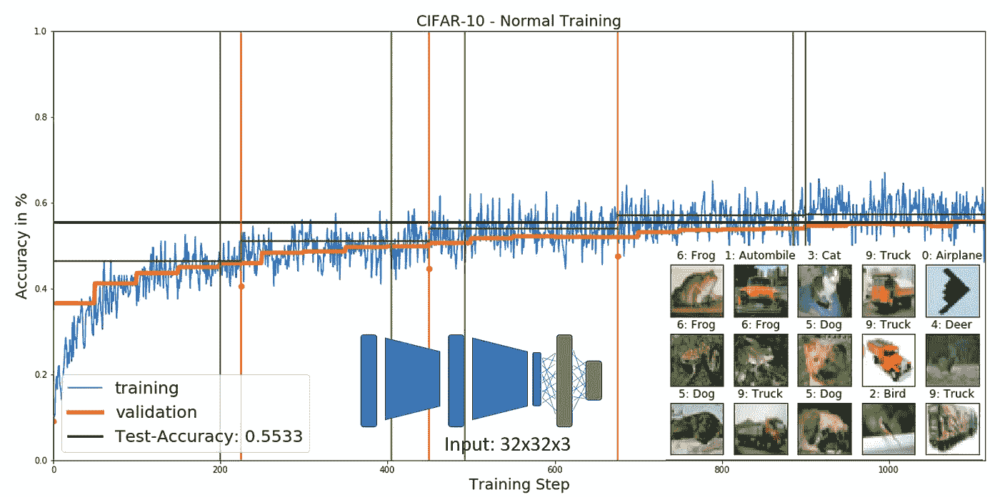
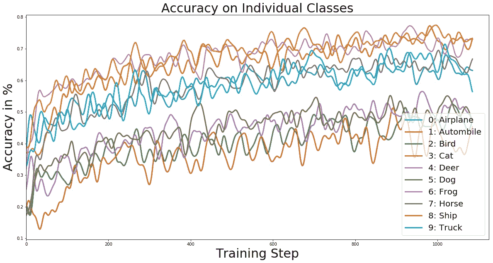
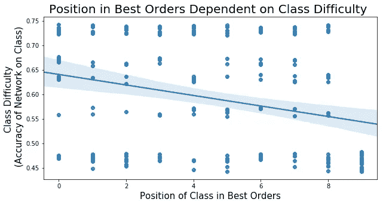
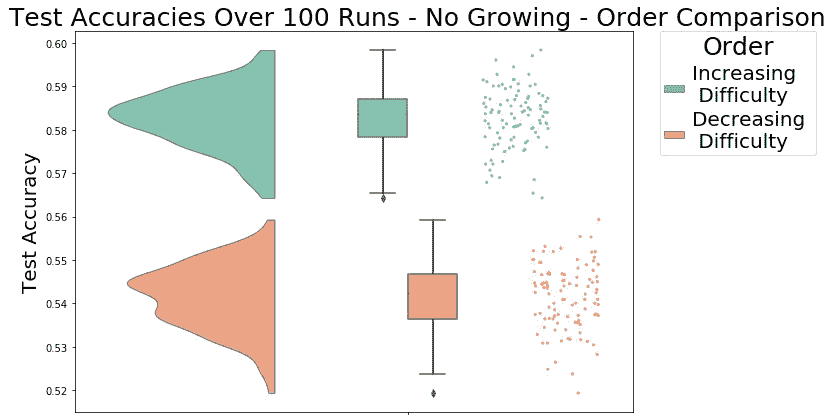
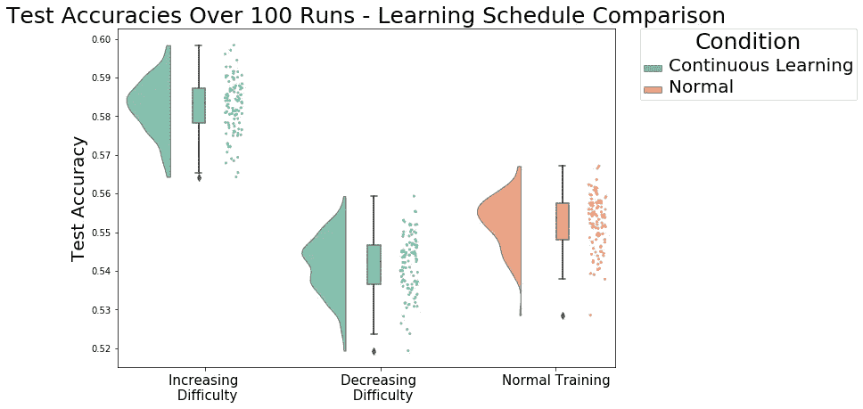

# 如何通过课程学习提高您的网络性能

> 原文：<https://towardsdatascience.com/how-to-improve-your-network-performance-by-using-curriculum-learning-3471705efab4?source=collection_archive---------9----------------------->

## Elman 在 1993 年已经提出了课程学习的思想，Bengio 在 2009 年的几个任务中证明了课程学习可以提高网络性能。然而，这些天你很少听到关于它的消息，这就是为什么我决定写一篇关于它的文章。

课程学习描述了一种学习类型，在这种学习中，你首先从一项任务的简单例子开始，然后逐渐增加任务的难度。几十年来，我们人类一直在根据这一原则进行学习，但我们没有将它转移到神经网络，而是让它们从一开始就对整个数据集进行训练，尽管它有各种困难。

为了演示课程学习的效果，我将使用一个相当小的卷积神经网络，尝试将图像分为 10 类。数据集被称为 CIFAR-10，可以在这里找到:[https://www.cs.toronto.edu/~kriz/cifar.html](https://www.cs.toronto.edu/~kriz/cifar.html)网络由两个卷积层组成，后面是一个具有 512 个神经元的全连接层和一个具有 10 个神经元的读出层。网络太小，无法实现 60%以上的性能，但这将更容易看到课程学习如何提高性能，以及如何通过使用这种技术从小型网络中挤出更多的准确性。

Network performance over time on the CIFAR-10 data set. Training with all classes at once for 5 epochs. Red lines mark the beginning of a new epoch. In the bottom right corner you can see some examples out of the data set.

当我们现在查看网络在各个类上的表现时，我们可以看到一些类似乎比其他类更难学。虽然网络在飞机、汽车、轮船或卡车等物体上取得了相当好的性能，但它与猫、狗、鹿和鸟进行了斗争。

接下来，我们想看看如果不从一开始就对所有的类进行训练，而是一步一步地介绍它们，网络性能会有什么变化。在这个实验中，我从十个类中的六个开始，然后在每个新的时期引入一个新的类。这意味着在五个时期之后，所有十个类都在数据集中。之后，网络继续训练另外 20 个时期，以达到稳定的性能。更多关于渐进学习过程和网络成长的信息可以在我的[上一篇文章](/progressive-learning-and-network-growing-in-tensorflow-e41414f304d2)中找到。

当重复这个实验很多次时，每次以随机的班级顺序，人们可以观察到一些表现特别好的运行。如果你现在观察这些表现最好的网络训练，并绘制在运行中使用的课堂顺序与各自的课堂难度的关系，你可以观察到两者之间的显著负相关为-0.27，F(1，16.43)，p<0.001。作为班级难度，我定义了一次正常训练结束时网络在班级上的表现(见上图)。

One dot represents the difficulty of a class shown at the respective point in time during the best performing runs. Class difficulty = the accuracy on this class at the end of a normal network training -> The higher the accuracy the lower the difficulty. Position 0–5 are equal since the network starts out training on six classes.

上图显示了具有最佳执行类顺序的运行如何倾向于首先显示简单类，而从不最后显示简单类。在上一个纪元中引入的所有职业都是普通网络努力学习的职业，因此看起来更难学习。

现在将这些结果再进一步，我们可以将难度递增的训练和难度递减的训练的网络性能进行比较。

Test accuracy distribution over a hundred runs for training with increasing and decreasing class difficulty.

结果显示了两种情况之间的非常显著的差异，其中，随着难度的增加而训练的网络在准确性方面具有大约 4%的领先。

可能最有趣的部分是将这些性能与从一开始就在所有类上训练的正常网络的性能进行比较。

Test accuracy distribution of 100 network trainings for continuous learning (increasing and decreasing difficulty) compared to a normal network training for an equal amount of epochs.

即使正常训练相对于连续学习有一点优势，因为后者在一些类上训练的次数较少，因为它们只是后来才引入的，但是以逐渐增加的难度训练的网络达到显著更高的性能，F(1，953.43)，p <0.001.

It seems as if learning the broad concept on a few easy examples and only later on refining the concept with more complex examples gives the continuously learning network a distinct advantage over a network which needs to grasp the whole concept at once.

When thinking about real life this appears quite intuitive, one would not mix advanced calculus into a first grader’s math homework, but with neural networks this seems to be common practice. Of course it is an additional effort to determine individual class difficulties, but for reaching or exceeding benchmarks and deploying an optimal model this additional effort can
很容易值得。

**代号**:[https://github . com/vkakerbeck/progressive-Growing-Networks](https://github.com/vkakerbeck/Progressively-Growing-Networks)

**参考文献**:

Bengio，Yoshua 等人(2009 年)。“课程学习”。载于:《第 26 届机器学习国际年会论文集》,第 41-48 页。刊号:0022–5193。多伊:10。1145 / 1553374 .1553380.arXiv: arXiv : 1011。1669v3。

埃尔曼，L (1993 年)。“神经网络中的学习和发展:从小处着手的重要性”。载于:第 48 页，第 71-99 页。