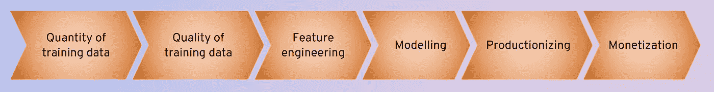

# 增加你的机器学习模型的影响

> 原文：<https://towardsdatascience.com/how-to-increase-the-impact-of-your-machine-learning-model-73f44a59f08?source=collection_archive---------26----------------------->

## 关于平衡努力

随着媒体的大肆宣传和学术机器学习社区的最新发展，有时感觉这就是最重要的事情:

或者，在例如用于自然语言处理的单词嵌入的情况下:

## 那有什么问题？

通常，行业机器学习项目并不基于像 MINST 这样固定的、预先存在的参考数据集。很多努力都花在了获取训练数据上**和清理训练数据上**和**。由于这些任务是高度具体的项目，不能一概而论，他们很少被谈论，也没有得到媒体的关注。**

后期建模步骤也是如此:如何将你的模型带入**制作**？模型输出将如何创造实际的**商业价值**？还有对了，这些问题不是应该事先就想好了吗？虽然服务工作流的模型在某种程度上是可转移的，但货币化策略通常是特定的，不会公开。

有了这些考虑，我们可以描绘一幅更准确的画面。这是真正影响你的机器学习项目的因素:

## 现在，我如何最好地增加模型的影响？

关键是**平衡你的努力**。更准确地说:注意**在花费的时间和总体影响方面，哪个步骤产生的投资回报最高**。这将随着你的进步而改变:一旦你充分改进了一个组件，在另一个组件上的工作将变得更加有效。请记住，您不需要在最终的执行顺序中这样做:货币化阶段，也就是上图中的最后一步，可能是您应该首先考虑的。

获得更多的训练数据或提高其质量可能比吹嘘使用最先进的深度学习架构更乏味，也没有那么迷人，但从整体模型性能来看，往往更有价值。如果你还不知道如何建立一个高效的机器学习系统，以及它将如何实际影响公司决策，就不要专注于花哨的技术。

那么，当**开始一个新项目**时，这意味着什么呢？你可以

*   把数据转储到 Keras。如果模型性能不令人满意，请使用更多的层。调整所有参数。
*   几周过去了。

或者你可以

*   想想这个项目将如何真正帮助你的公司。尽早让**需要的人**加入进来，让他们**感受到努力的一部分**。为所有步骤设计一个计划。确保一个关键决策者支持你。**钻研数据**，做一些**可视化**和**清理**，获得关于平均值、异常值、相关性、缺失字段和底层业务流程的良好感觉。尝试决策树或逻辑回归作为简单、可解释的基线模型。例如，使用云平台进行原型**部署**和**测试**您的工作流程。
*   **从那里迭代**。在每一步中，**改进**你认为目前在商业价值和时间方面能给你带来最高投资回报的组件。得到**反馈**。
*   你将有一个早期的原型展示。这将建立**信任**并解锁**资源**。进一步的**渐进、平衡的改进**确保你不会浪费时间拧紧错误的螺丝。

就是这样！感觉少了点什么？完全不同意？请在评论中分享你的观点！