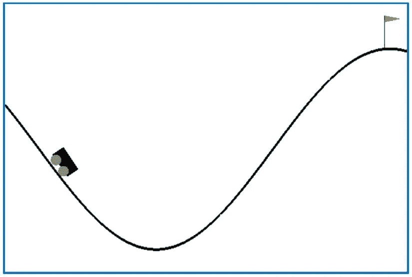
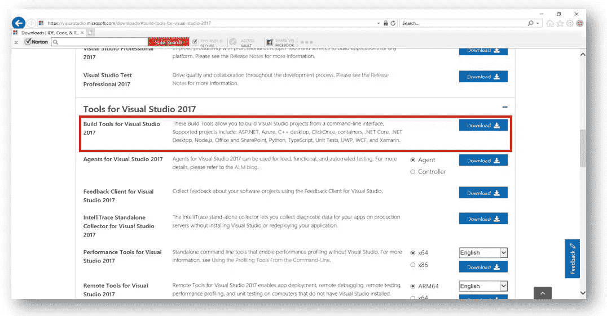
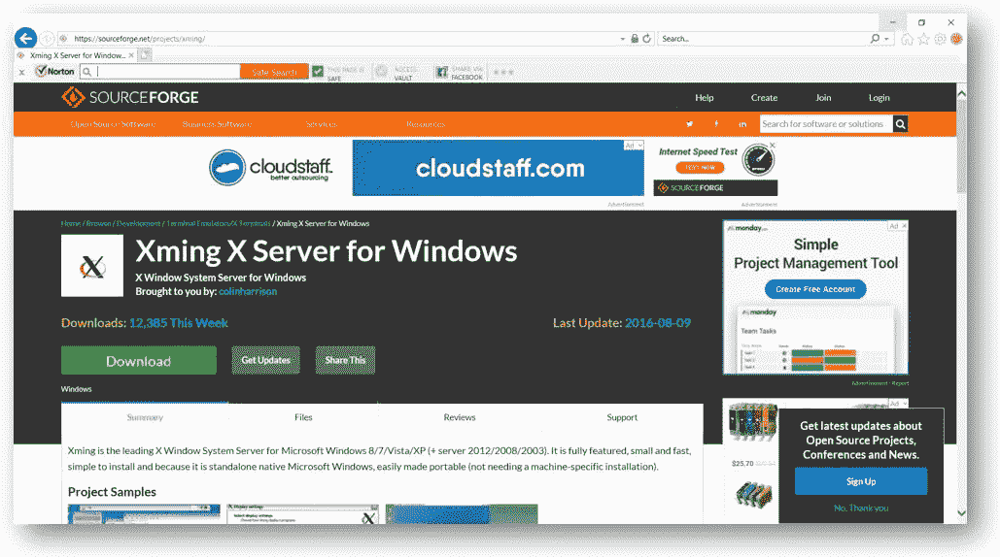
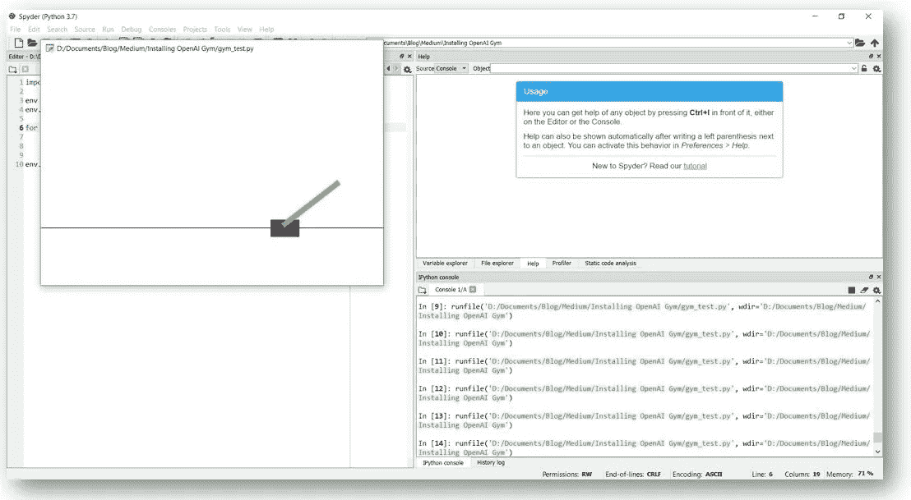

# 如何在 Windows 环境下安装 OpenAI Gym

> 原文：<https://towardsdatascience.com/how-to-install-openai-gym-in-a-windows-environment-338969e24d30?source=collection_archive---------0----------------------->



## 一步一步的指导如何建立和运行 OpenAI 健身房

这是关于强化学习和 OpenAI 健身房系列文章的第二篇。第一部分可以在这里找到[。](/the-other-type-of-machine-learning-97ab81306ce9)

# 介绍

OpenAI Gym 是一个非常棒的工具，它使业余和专业的计算机科学家有可能实验一系列不同的强化学习(RL)算法，甚至有可能开发他们自己的算法。

OpenAI Gym 旨在成为 RL 研究的标准化环境和基准，是一个 Python 包，包含一系列 RL 环境，从简单的“玩具”环境到更具挑战性的环境，包括模拟机器人环境和 Atari 视频游戏环境。

该软件包唯一的缺点是，尽管世界上超过 80%的台式机和笔记本电脑都运行 Windows 操作系统，但 OpenAI Gym 只支持 Linux 和 MacOS。

然而，仅仅因为 OpenAI Gym 不支持 Windows，并不意味着你不能让 OpenAI Gym 在 Windows 机器上工作。在这篇文章中，我将提供如何在我的 Windows 10 PC 上安装和运行 OpenAI Gym 的说明。

*注意:这些指令足以让 OpenAI Gym 的算法、玩具文本、经典控制、Box2D 和 Atari 环境工作。OpenAI Gym 还包括 MuJoCo 和机器人环境，允许用户使用 MuJoCo 物理模拟器进行实验。然而，要运行这些环境，你还需要安装* [*MuJoCo*](http://www.mujoco.org/) *这将花费你至少 500 美元购买一年的许可证(除非你是学生)。*

# 说明

这些说明假设您的计算机上已经安装了 Python 3.5+。

## 步骤 1:安装用于 Visual Studio 2017 的 Microsoft Visual C++构建工具

如果你的电脑上还没有，安装*Microsoft Visual c++ Build Tools for Visual Studio 2017*。这可以在这里免费下载。

您需要将页面向下滚动到“Visual Studio 2017 工具”部分。



## 步骤 2:安装所有必要的 Python 包

鉴于 OpenAI Gym 在 Windows 环境中不受支持，我认为最好将其设置在单独的 Python 环境中。这是为了避免潜在地破坏我的主要 Python 安装。

在 Conda 中，可以使用下面的命令(在终端或 Anaconda 提示符下)来实现这一点:

```
conda create -n gym python=3 pip
```

这个命令创建一个名为“gym”的 Conda 环境，它运行 Python 3 并包含 *pip* 。

如果您在创建 Conda 环境时没有安装 *pip* ，那么您试图在该环境中安装的任何包都将被全局安装到您的基本 Python 环境中，而不仅仅是本地安装到该环境中。这是因为在您的本地环境中不存在一个版本的 *pip* 。

要激活新的环境类型:

```
activate gym
```

接下来运行以下命令:

```
pip install gym
```

*这是 OpenAI 健身房的最小安装。*

```
conda install pystan
```

这是运行 ToyText 环境所必需的。

```
conda install git
pip install git+https://github.com/Kojoley/atari-py.git
```

*这是运行 Atari 环境所必需的。*

```
conda install swig
pip install Box2D
```

*这是运行 Box2D 环境所必需的。*

```
pip install gym[all]
```

*这将安装剩余的 OpenAI Gym 环境。可能会出现一些错误，但请忽略它们。*

```
pip install pyglet==1.2.4
pip install gym[box2d]
```

*最后两行是必要的，以避免 Pyglet 和 Box2D 环境中可能出现的一些错误。*

一旦你完成了这些，安装你希望在 Conda 环境中安装的任何其他 Python 包。

## 步骤 3:安装 Xming

在你的电脑上安装 Xming，可以从[这里](https://sourceforge.net/projects/xming/)免费下载。



## 第四步:开始跑步

每次您想要使用 OpenAI Gym 时，在启动 Python IDE 之前，通过在 Windows 命令提示符下输入以下命令来启动 Xming running:

```
set DISPLAY=:0
```

## 第五步:测试

要测试新的 OpenAI Gym 环境，请运行以下 Python 代码:

如果一切都设置正确，应该会弹出一个窗口，显示在 Cart Pole 环境中进行的 1000 次随机操作的结果。



为了测试其他环境，将代码第 3 行中的“CartPole-v0”替换为环境名。比如《Taxi-v2》《太空入侵者-v 0》《lunar lander-v2》。

你可以在 OpenAI 健身房网站[这里](https://gym.openai.com/envs/#classic_control)找到所有可用环境的名称和描述。

# 结论

如果你遵循了这些说明，你现在应该已经成功地在你的电脑上运行 OpenAI Gym 了。然而，现在它已经开始运行了，你用它做什么呢？

在我的下一篇文章中，我将介绍如何将这个令人兴奋的工具应用于强化学习问题。

**想了解更多关于价值驱动的数据科学？** [**加入我的邮件列表，让我的最新文章和建议直接发送到你的收件箱。**](http://www.genevievehayes.com/)