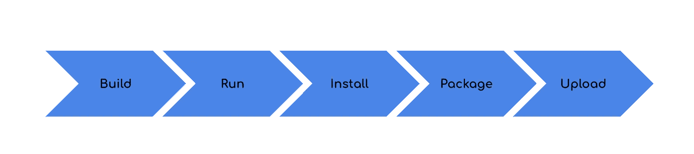
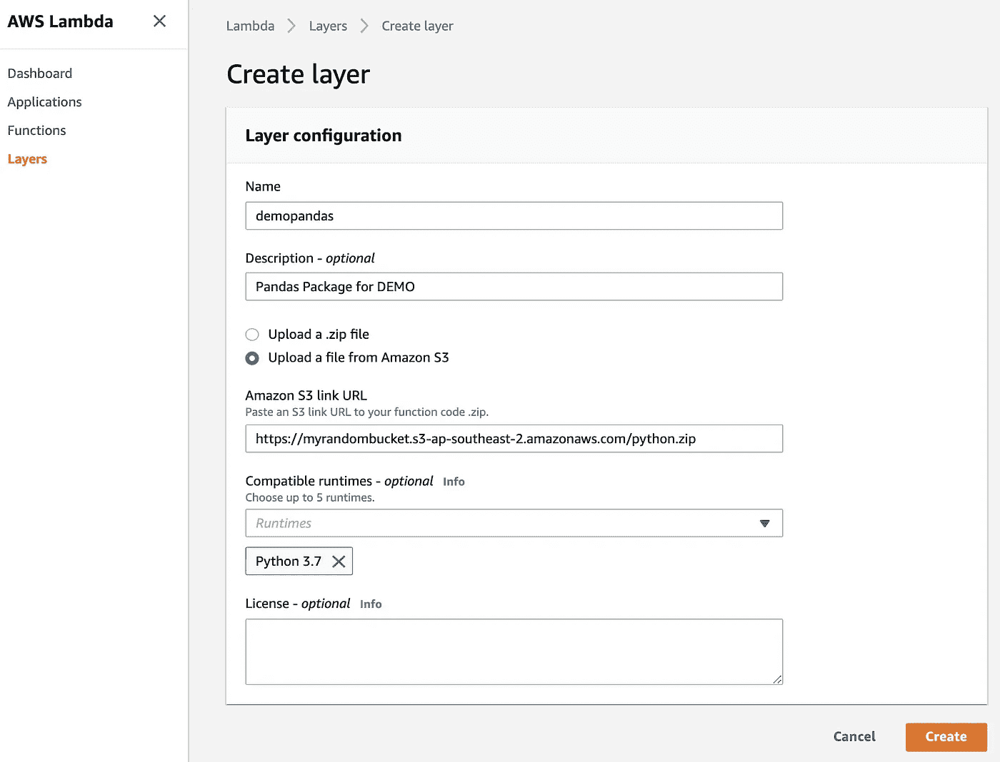

# 如何为 AWS Lambda 层安装 Python 包

> 原文：<https://towardsdatascience.com/how-to-install-python-packages-for-aws-lambda-layer-74e193c76a91?source=collection_archive---------1----------------------->

## 关于如何使用 Docker 容器为 AWS Lambda 层构建 Python 包的指南。


Image Source: bvoyles4 from Pixabay (Modified by Author)

# Lambda 及其层

当我第一次听说 **AWS Lambda** 时，我对它是什么感到非常困惑，并试图用它来训练一个简单的 ML 模型，但遇到了 5 分钟的执行限制。快进几年，我相信 Lambda 已经发展了很多，人们对**事件驱动系统**和**无服务器计算**的理解也是如此。它已经成为许多现代应用程序和数据架构师的一部分。

在 **re:Invent 2018** 上，Lambda 进行了大量的定制运行时改进，并将执行运行时限制增加到 15 分钟。 **Lambda Layers** 也发布了，它允许你共享公共依赖项，以简化 Lambda 部署规模和更新。然而，AWS 仍然没有解决友好步骤的**需求，以引入**非原生 python 包**，例如熊猫。**

# 引入外部包的麻烦方法…

目前，你要么压缩你的 Lambda 函数和 Linux 兼容的依赖项，要么上传你的依赖项作为 Lambda 层。如果你以前玩过 Google Cloud Functions 和 Azure Function，你会知道这就像在`requirements.txt`中写一个愿望清单一样简单。

为了增加额外的复杂性，一些 Python 包需要编译 **C** 或 **C++** 扩展(包如 Numpy 和 Pandas)。如果你想用你的 **macOS** 或 **Windows** 机器来`pip install -t . pandas`然后为 Lambda 层压缩它们，这是一个亚马逊 Linux 环境，这可能有点麻烦。

有几种方法可以引入 Linux 兼容的依赖项，无论是通过无服务器还是使用 EC2 实例。现在，如果你以前读过我的一些博客，我真的很喜欢在黑客马拉松中使用 Lambdas，因为时间是关键，我想向你展示如何使用 **Docker** 将 Python 依赖作为 Lambda 层的最简单**和最快**的方式。

# 5 个简单的步骤:



## 1.建设

希望你已经设置了 Docker，但是如果你没有，那么一定要先设置。你要做的第一件事是使用一个 Amazon Linux 作为基本映像，并用几个**实用程序**、 **python3.7** 和 **Virtualenv** 创建一个 Dockerfile。

```
**FROM** **amazonlinux:2.0.20191016.0****RUN** yum install -y **python37** && \
    yum install -y **python3-pip** && \
    yum install -y **zip** && \
    yum clean all**RUN** python3.7 -m pip install --upgrade pip && \
    python3.7 -m pip install **virtualenv**
```

运行下面的命令来创建带有标签的 docker 文件。

```
usr> **docker build** -f **"<filename>.Dockerfile"** -t **lambdalayer:latest .**
```

## 2.奔跑

你应该可以通过做`docker images`看到图像。在那之后，你想要撞击你的容器。

```
usr> **docker run** -it --name lambdalayer **lambdalayer:latest** **bash**
```

## 3.安装

在您的容器中创建一个新的虚拟环境来隔离您的 python 环境，并重用同一个容器，而不用担心全局安装破坏东西。您可以为每个依赖项创建一个容器，但是时间是关键…

```
bash> **python3.7** -m venv **pandas**
```

我把它命名为熊猫，你可以叫它任何你想要的名字，但是一定要激活它，把你的包安装到一个特定的文件夹中，然后再去激活它。

```
bash> **source pandas/bin/activate** (pandas) bash> pip install **pandas** -t **./python** (pandas) bash> deactivate
```

## 4.包裹

这些包及其依赖项应该已经安装在 python 文件夹(或您的特定文件夹)中。现在您可以将该文件夹压缩为`python.zip`并退出容器。您需要将压缩文件夹复制到本地环境中，以便将其上传到 Lambda 图层或 S3。

```
bash> **zip** -r **python.zip** ./python/usr> **docker cp** lambdalayer:python.zip ./Desktop/
```

## 5.上传

如果你的压缩文件大于 50mb，那么你需要把它上传到 S3，而不是直接上传到 Lambda 层。一定要记录下 **S3 对象的网址**。



就这样，现在你有 Pandas(和 Numpy)作为你的 Python Lambda 的一部分作为一个层使用，如果你想创建一个部署包，那么一定要把你的 Lambda 函数代码作为一个`.py`文件添加到压缩文件夹中。

# λ层的限制

您需要了解一些限制，包括:

1.  每个 Lambda 最多只能使用 5 层。
2.  解压缩后的所有图层的大小不能超过 250mb。
3.  层安装在函数执行环境中的/opt 目录中，因此如果您要有多个函数，请确保正确地对函数进行分层。

# 部署 Lambda

请随意查看我的文章[关于如何使用无服务器或 AWS SAM 将 Lambda(和 Pandas)部署到 AWS。](/using-serverless-and-sam-to-deploy-a-scheduled-lambda-with-packages-ed7efdc73070)

# 关于我

> 我喜欢写媒体文章，并为知识共享社区做贡献。除了尝试新的食物配方，我还帮助企业构建云和数据解决方案。请随时与我联系并向我问好！
> 
> ——[李帝努·雅玛](https://www.linkedin.com/in/cyamma/)