# 如何安装 R 和 RStudio？

> 原文：<https://towardsdatascience.com/how-to-install-r-and-rstudio-584eeefb1a41?source=collection_archive---------20----------------------->


Photo by [Cris DiNoto](https://unsplash.com/@crisdinoto?utm_source=medium&utm_medium=referral)

# R 和 RStudio 是什么？

# 稀有

统计程序 **R** 只不过是一种编程语言，主要用于数据操作和执行统计分析。在撰写本文时，这种语言是统计学中的主要程序之一，尽管不是统计学家使用的唯一编程语言。

为了使用 R，我们需要两样东西:

*   用于编写代码的文本编辑器
*   运行这段代码的地方

# RStudio

这就是 RStudio 派上用场的地方。

RStudio 是 R. R 和 RStudio 协同工作的集成开发环境(IDE)。R 是一个运行你所有代码的程序，RStudio 是另一个可以让你以更舒适友好的方式控制 R 的程序。RStudio 的优势在于，它既提供了一个用于编写代码的强大文本编辑器，又提供了一个运行在该编辑器中编写的代码的地方。

出于这些原因，我强烈推荐使用 RStudio 而不是 R。我每天都使用 RStudio(而不是 R ),你会看到这个博客上所有的[文章](https://statsandr.com/blog/)都是用 RStudio 写的。

请注意，RStudio 需要预先安装 CRAN 提供的 R 软件才能正常工作。仅仅在个人电脑上安装 RStudio 是不够的。请参阅下一节，了解如何安装两者。

# 如何安装 R 和 RStudio？

你可以在 https://cran.r-project.org/mirrors.html[下载 R。选择离你的国家最近的 CRAN mirror 网站。如果您所在的国家有多个链接，只需选择一个:](https://cran.r-project.org/mirrors.html)

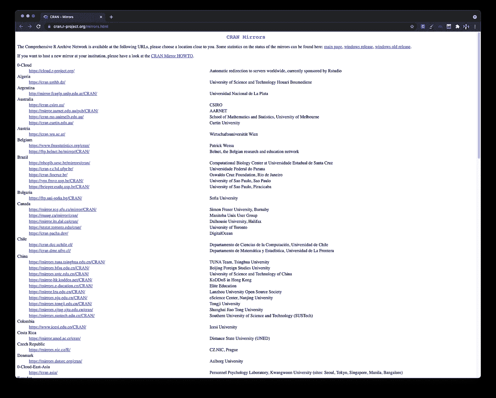

Select the CRAN mirror site closest to your country

然后在标有“下载并安装 R”的框中(位于顶部)，单击与您的操作系统(Windows、Mac 或 Linux)对应的链接:

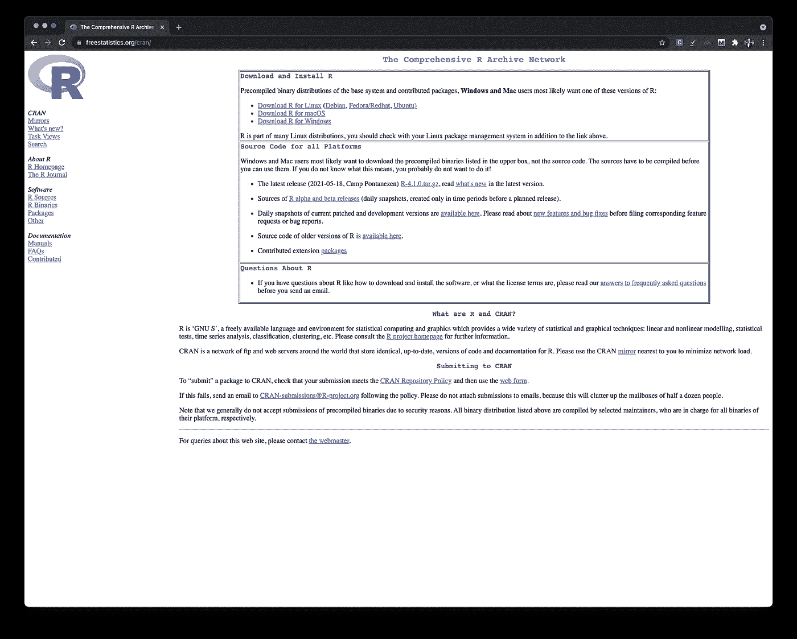

Click on the link corresponding to your operating system

现在 R 已经安装在您的计算机上，您可以下载 RStudio 了。可以下载免费版的 RStudio(对绝大多数用户来说完全够用，包括我！)在他们的[网站](https://www.rstudio.com/products/rstudio/download/#download)上。

# RStudio 的主要组件

现在，这两个程序都已经安装在您的计算机上，让我们深入了解 RStudio 的主要组件。

默认情况下，RStudio 窗口有三个窗格:

1.  控制台(红色窗格)
2.  环境(绿色窗格)
3.  文件、图、帮助等。(蓝色窗格)

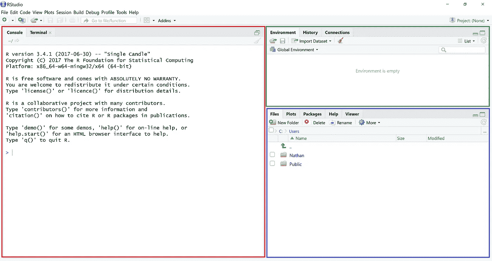

RStudio window

控制台(红色窗格)是您可以执行代码的地方(稍后会有关于红色和蓝色窗格的更多信息)。默认情况下，文本编辑器不会自动打开。要打开它，点击文件>新建文件> R Script，或者点击左上角标有绿色小叉的按钮，然后点击 R Script:

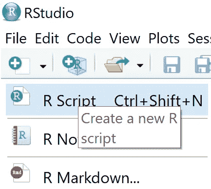

New R script in RStudio

一个新的窗格(下面的橙色部分)，也称为文本编辑器，将会打开，您可以在其中编写代码。代码将被执行，结果显示在控制台(红色窗格)中。

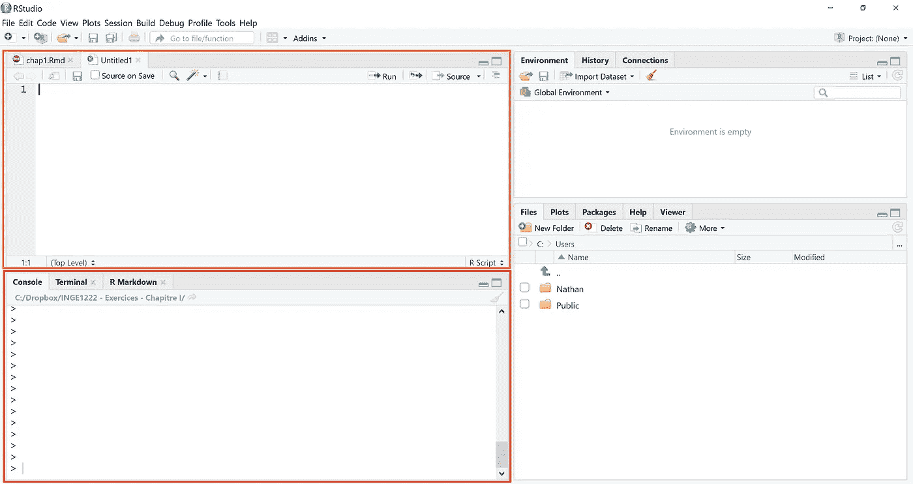

Write and execute your code in RStudio

请注意，您也可以在控制台(红色窗格)中编写代码。但是，我强烈建议在文本编辑器(橙色窗格)中编写代码，因为您可以保存在文本编辑器中编写的代码(并在以后再次执行)，而不能保存在控制台中编写的代码。

要执行在文本编辑器(橙色窗格)中编写的代码，您有两种选择:

*   键入您的代码，然后按“运行”按钮(见下文)或使用键盘快捷键 CTRL+Enter(Mac 上为 cmd + Enter)。只有光标所在的代码块会被执行。
*   键入代码，在文本编辑器中选择要执行的部分，然后按“运行”按钮或使用键盘快捷键 CTRL+Enter(Mac 上为 cmd + Enter)。所有**选择的**代码将被执行

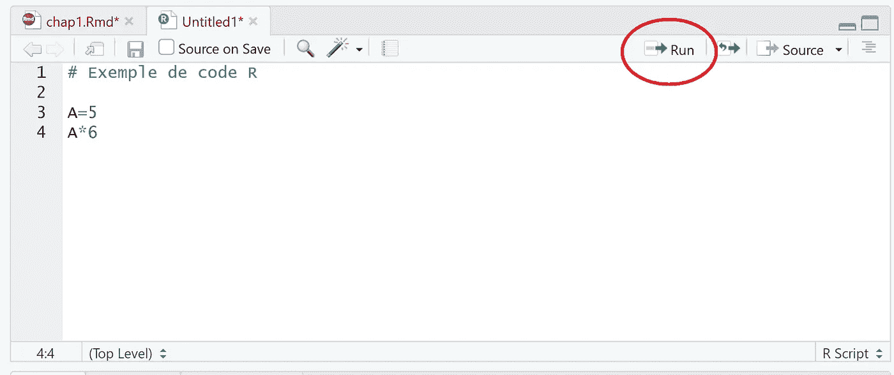

Run code in RStudio

例如，尝试在文本编辑器中键入`1+1`，点击“运行”(或 CTRL/cmd + Enter)来执行。您应该会在控制台中看到结果`2`，如下图所示:

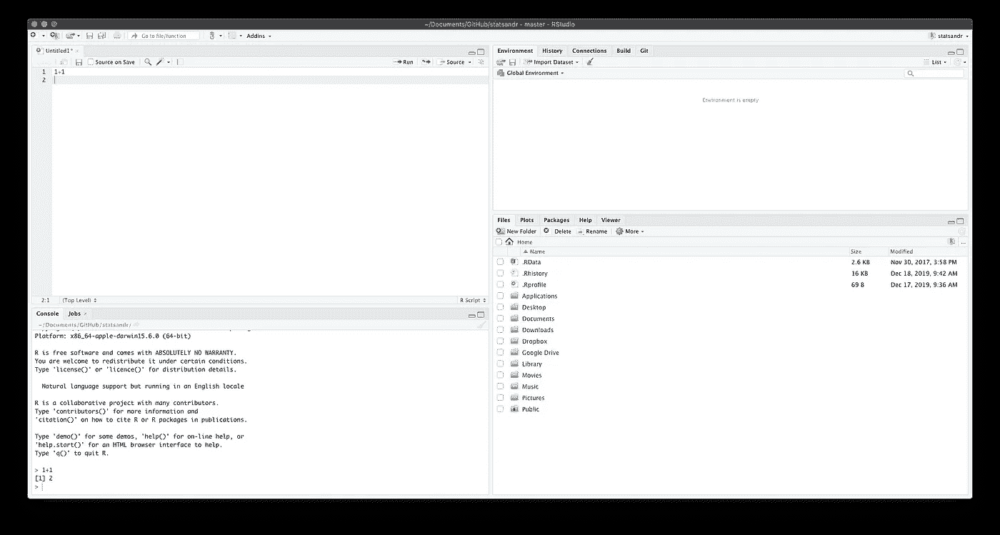

Example of code executed in RStudio

文本编辑器和控制台是您最常用的窗格。然而，在使用 RStudio 时，其他两个窗格(前面介绍的蓝色和绿色窗格)仍然非常有用。

环境(绿色窗格)显示 RStudio 存储的所有值。例如，如果您键入并执行代码`a = 1`，RStudio 将为`a`存储值`1`，如下图所示:

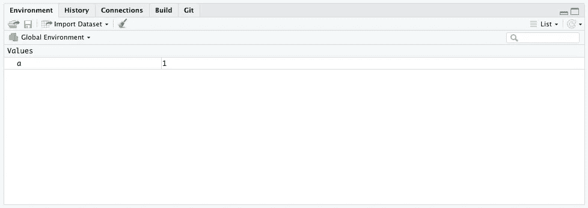

Environment pane in RStudio

这意味着您现在可以使用`a`执行任何计算，因此如果您执行`a + 1`，RStudio 将在控制台中呈现`2`。在该窗格中，您还可以看到一个标签，其中包含所执行代码的历史记录和一个用于导入数据集的按钮(更多信息请参见[在 RStudio](https://www.statsandr.com/blog/how-to-import-an-excel-file-in-rstudio/) 中导入数据集)。

最后一个窗格(蓝色)是你可以找到所有其他东西的地方，比如你的文件、图表、软件包、帮助文档等等。我在这里[更详细地讨论了文件选项卡](https://www.statsandr.com/blog/how-to-import-an-excel-file-in-rstudio/)，所以让我们讨论一下其他选项卡:

*   绘图:您将看到渲染的绘图。例如，运行`plot(1:10)`，您应该会在这个选项卡中看到它。如果您绘制了多个图，您可以通过单击箭头在它们之间导航。您可以通过单击缩放在新窗口中打开绘图，并通过单击导出导出您的绘图。这些按钮位于绘图选项卡的正下方(见下图)
*   软件包:在这里你可以看到所有已安装的软件包。r 只提供基本的功能，其他的都必须从包中安装。提醒一下 R 是开源的；每个人都可以编写代码并作为一个包发布。然后，您就可以免费使用这个包(以及这个包中内置的所有功能)。一些包是默认安装的，所有其他的包必须通过运行`install.packages("name of the package")`来安装(不要忘记在包的名字后面加上`""`！).软件包安装后，您必须加载软件包，只有在它被加载后，您才能使用它包含的所有功能。要加载一个包，运行`library(name of the package)`(这一次包名两边的`""`是可选的，但是如果你愿意，仍然可以使用)。您还可以通过 packages 选项卡下的按钮来安装和加载软件包。为此，单击“软件包”下的“安装”按钮，键入要安装的软件包的名称，然后单击“安装”。您将看到代码出现在控制台中。要加载软件包，请在“软件包”窗口中找到您要加载的软件包(您可以使用搜索框)，然后单击软件包名称旁边的复选框。同样，代码在控制台中运行。如果需要，请参见下图。请注意，您只需安装一次**软件包**、 [1](https://www.statsandr.com/blog/how-to-install-r-and-rstudio/#fn1) ，但每次打开 RStudio 时都会加载软件包**。此外，请注意，安装软件包需要互联网连接，而加载软件包则不需要**
*   帮助:为 r 编写的所有函数的文档。要访问函数的帮助，运行`help("name of the function")`或简单的`?name of the function`。例如，要查看关于均值函数的帮助，运行`?mean`。将光标放在某个函数上时，也可以按 F1

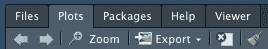

Plot buttons in RStudio

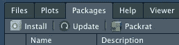

Step 1: click on the Install button

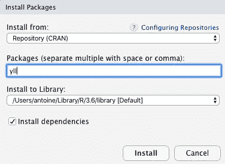

Step 2: type the name of the package and click on Install

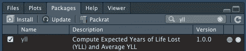

Step 3: load your package by clicking on the box next to the package’s name

# 代码示例

现在您已经安装了 R 和 RStudio，并且知道了它的主要组件，下面是一些基本代码的例子。更多高级代码和分析在[其他关于 R 的文章](https://www.statsandr.com/tags/R/)中介绍。

# 计算器

计算 5÷5

```
5 * 5## [1] 25
```

计算

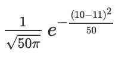

```
1 / sqrt(50 * pi) * exp(-(10 - 11)^2 / 50)## [1] 0.07820854
```

如您所见，有些值(如π)是默认存储的，因此您不需要指定它的值。请注意，RStudio 区分大小写，但不区分空间。这意味着`pi`与`Pi`不同，但`5*5`给出的结果与`5 * 5`相同。

# 评论

要在代码中添加注释，请在代码前使用`#`:

```
# A comment
# Another comment
1 + 1## [1] 2
```

# 存储和打印数值

注意，为了在对象内部存储一个值，使用`=`或`<-`是等效的。然而，我建议使用`<-`来遵循 R 编程的准则。您可以随意命名您的对象(在我们的例子中是 A 和 B)。但是，建议使用简短的名称(因为您很可能会多次键入这些名称),并避免使用特殊字符。

```
A <- 5
B <- 6
```

存储值时，RStudio 不会将其显示在控制台上。要在控制台中存储并打印一个值，请使用:

```
(A <- 5)## [1] 5
```

或者:

```
A <- 5
A## [1] 5
```

# 向量

也可以通过函数`c()` (c 代表合并)在一个对象中存储多个值。

```
A <- c(1 / 2, -1, 0)
A## [1]  0.5 -1.0  0.0
```

# 矩阵

或者通过`matrix()`创建一个矩阵:

```
my_mat <- matrix(c(-1, 2, 0, 3), ncol = 2, nrow = 2)
my_mat##      [,1] [,2]
## [1,]   -1    0
## [2,]    2    3
```

您可以通过`?matrix`或`help("matrix")`访问该功能的帮助。请注意，在一个函数中，可以有多个由逗号分隔的参数。在`matrix()`内部，第一个参数是向量`c(-1, 2, 0, 3)`，第二个是`ncol = 2`，第三个是`nrow = 2`。对于 RStudio 中的所有函数，您可以通过函数内的顺序或参数名称来指定参数。如果您指定参数的名称，顺序不再重要，因此`matrix(c(-1, 2, 0, 3), ncol = 2, nrow = 2)`相当于`matrix(c(-1, 2, 0, 3), nrow = 2, ncol = 2)`:

```
my_mat2 <- matrix(c(-1, 2, 0, 3), nrow = 2, ncol = 2)
my_mat2##      [,1] [,2]
## [1,]   -1    0
## [2,]    2    3my_mat == my_mat2 # is my_mat equal to my_mat2?##      [,1] [,2]
## [1,] TRUE TRUE
## [2,] TRUE TRUE
```

# 生成随机值

基于均值μ=400、标准差σ=10 的正态分布生成 10 个值:

```
my_vec <- rnorm(10, mean = 400, sd = 10)
# Display only the first 5 values:
head(my_vec, 5)## [1] 397.5906 394.1163 395.8203 395.1248 397.3691# Display only the last 5 values:
tail(my_vec, 5)## [1] 411.7824 402.6334 399.0726 399.9974 398.0901
```

你会有不同于地雷的价值，因为它们是随机产生的。如果你想确保总是有相同的随机值，使用`set.seed()`(括号内有任何数字)。例如，对于下面的代码，无论何时何地运行，都应该有完全相同的值:

```
set.seed(42)
rnorm(3, mean = 10, sd = 2)## [1] 12.741917  8.870604 10.726257
```

# 情节

```
plot(my_vec,
  type = "l", # "l" stands for line
  main = "Plot title",
  ylab = "Y-axis label",
  xlab = "X-axis label"
)
```

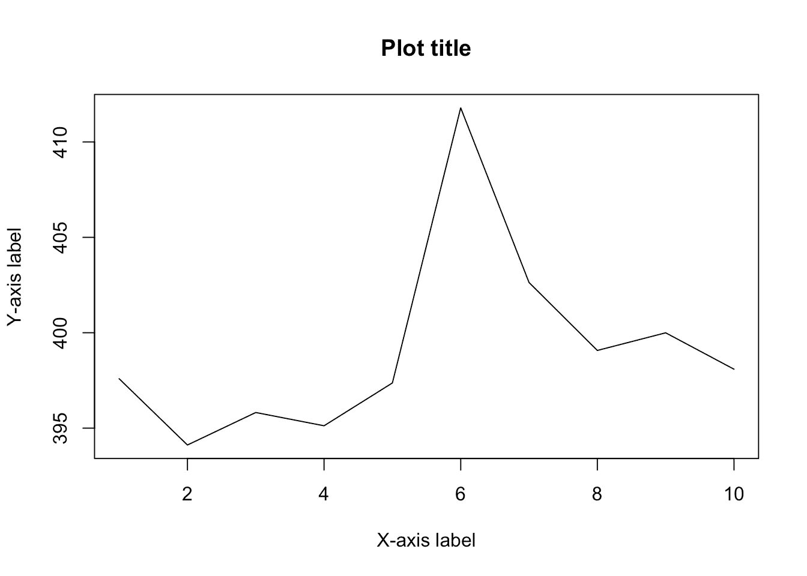

这只是对 RStudio 可能性的非常有限的介绍。如果你想了解更多，我建议你阅读与 R 相关的其他[文章，从](https://www.statsandr.com/tags/R/)[如何导入 Excel 文件](https://www.statsandr.com/blog/how-to-import-an-excel-file-in-rstudio/)或[如何操作数据集](https://www.statsandr.com/blog/data-manipulation-in-r/)开始。

感谢阅读。我希望这篇文章能帮助你安装 R 和 RStudio。

和往常一样，如果您有与本文主题相关的问题或建议，请将其添加为评论，以便其他读者可以从讨论中受益。

**相关文章:**

*   [安装和加载 R 包的有效方法](https://www.statsandr.com/blog/an-efficient-way-to-install-and-load-r-packages/)
*   [我的数据服从正态分布吗？关于最广泛使用的分布以及如何检验 R 中的正态性的注释](https://www.statsandr.com/blog/do-my-data-follow-a-normal-distribution-a-note-on-the-most-widely-used-distribution-and-how-to-test-for-normality-in-r/)
*   [R 中的 Fisher 精确检验:小样本的独立性检验](https://www.statsandr.com/blog/fisher-s-exact-test-in-r-independence-test-for-a-small-sample/)
*   [R 中独立性的卡方检验](https://www.statsandr.com/blog/chi-square-test-of-independence-in-r/)
*   [如何在简历中创建时间线](https://www.statsandr.com/blog/how-to-create-a-timeline-of-your-cv-in-r/)

*原载于 2019 年 12 月 17 日*[*https://statsandr.com*](https://statsandr.com/blog/how-to-install-r-and-rstudio/)*。*