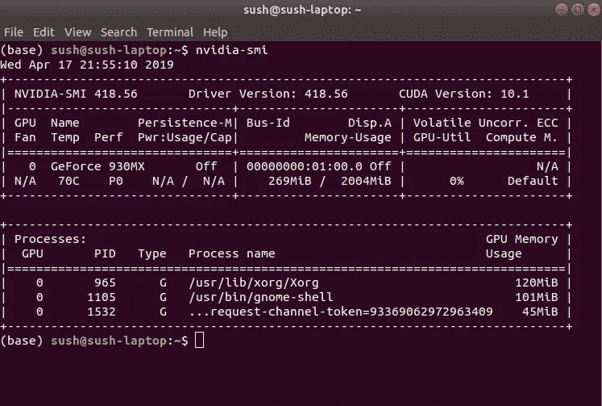
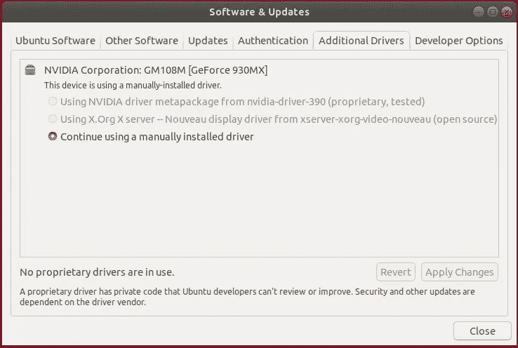
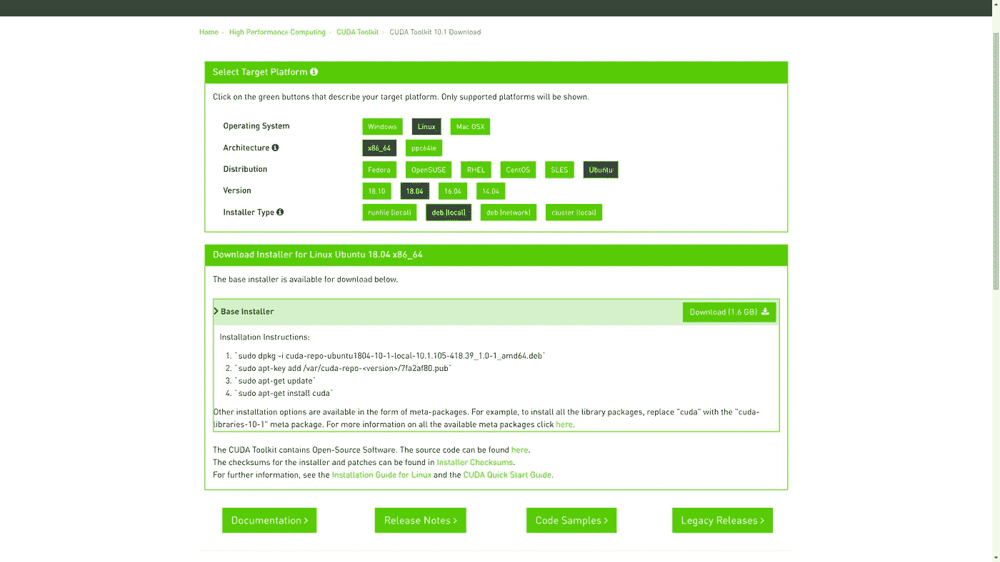

# 如何在 UBUNTU 18.04 上安装 TensorFlow GPU

> 原文：<https://towardsdatascience.com/how-to-install-tensorflow-gpu-on-ubuntu-18-04-1c1d2d6d6fd2?source=collection_archive---------2----------------------->

在教授计算机和机器人如何看待世界、理解世界，并最终在物理和虚拟领域执行复杂任务的热潮中，人工智能领域的进展速度是最激烈的争论之一。这个行业发展的速度和目的通常不仅仅是通过实际的产品进步和研究里程碑来衡量，还通过人工智能领导者、未来学家、学者、经济学家和政策制定者的预测和表达的担忧来衡量。人工智能将改变世界——但如何以及何时改变仍然是个悬而未决的问题。

大多数已经在装有 Nvidia GPU 的台式机/笔记本电脑上训练机器学习模型的用户由于安装 TENSORFLOW 的 GPU 版本的困难而与 CPU 妥协。在对安装过程进行了一些研究后，我正在编写我在装有 nvidia 930MX 的笔记本电脑上尝试过的程序。

> **为什么是 TensorFlow？** TensorFlow 是机器学习的端到端开源平台。它有一个全面、灵活的工具、库和社区资源的生态系统，让研究人员推动 ML 的最新发展，让开发人员轻松构建和部署 ML 驱动的应用程序。

# 让我们从安装过程开始

# 步骤 1: Nvidia 驱动程序

第一步是检查你是否安装了 nvidia 驱动程序。
您可以通过在终端中键入以下命令来检查。

**英伟达-smi**

如果你的系统已经检测到 nvidia 驱动，那么你会看到一些类似的输出。



nvidia output for my gpu drivers.

如果你还没有安装显卡驱动，我建议你从官方网站安装驱动，然后输入上面的命令重新检查。

可选的，如果你不能找到你的 gpu 的图形驱动程序，那么你可以尝试下面的过程。

转到软件和更新->附加驱动程序->在那里您可以找到您的驱动程序。选择驱动程序—使用 NVIDIA 驱动程序元包，然后单击应用更改。



Ubuntu 18.04 Additional Drivers settings

正如你可以检查有一个驱动程序安装的系统默认选项，但你可以看到我已经手动安装了我的图形驱动程序。我强烈建议手动安装 gpu 驱动程序。

如果你正试图安装来自。运行文件，然后你可能会面临与“新内核驱动程序”的冲突，不要强迫安装在这种情况下。先把司机加入黑名单。这是强制性的，因为它会阻止内核使用你的 gpu 资源。
将下面的命令加入黑名单。
回显选项 nouveau modeset = 0 | sudo tee-a/etc/modprobe . d/nouveau-kms . conf

之后，运行
**sudo update-initramfs-u**

要更新 initframs
，请再次尝试安装驱动程序。

# 步骤 2:安装 NVIDIA CUDA

CUDA 是 NVIDIA 开发的并行计算平台和编程模型，用于图形处理单元(GPU)上的一般计算。有了 CUDA，开发人员就可以利用 GPU 的强大功能，大幅提高计算应用的速度。

在 GPU 加速的应用中，工作负载的顺序部分在 CPU 上运行(针对单线程性能进行了优化)，而应用的计算密集型部分在数千个 GPU 内核上并行运行。当使用 CUDA 时，开发人员使用 C、C++、Fortran、Python 和 MATLAB 等流行语言编程，并通过几个基本关键字形式的扩展来表达并行性。

访问 nvidia 官方网站为您的操作系统下载 cuda。



选择适当的操作系统版本、发行版、版本，并选择安装程序类型为 deb(本地)

你需要下载 cuda deb 文件(1.6GB)并按照上面提到的步骤安装。

# 第三步:安装深度神经网络库(cuDNN)

NVIDIA CUDA 深度神经网络库(cuDNN)是一个针对[深度神经网络](https://developer.nvidia.com/deep-learning)的 GPU 加速原语库。cuDNN 为标准例程提供了高度优化的实现，例如前向和后向卷积、池化、规范化和激活层。

全球深度学习研究人员和框架开发人员依赖 cuDNN 进行高性能 GPU 加速。这使得他们可以专注于训练神经网络和开发软件应用程序，而不是花时间在低级别的 GPU 性能调优上。cuDNN 加速了广泛使用的深度学习框架，包括 [Caffe](http://caffe.berkeleyvision.org/) 、 [Caffe2](https://www.caffe2.ai/) 、 [Chainer](https://chainer.org/) 、 [Keras](https://keras.io/) 、 [MATLAB](https://www.mathworks.com/solutions/deep-learning.html) 、 [MxNet](https://mxnet.incubator.apache.org/) 、 [TensorFlow](https://www.tensorflow.org/) 、 [PyTorch](http://pytorch.org/) 。要访问 NVIDIA 优化的深度学习框架容器，该框架已将 cuDNN 集成到框架中，请访问 [NVIDIA GPU CLOUD](https://www.nvidia.com/en-us/gpu-cloud/) 了解更多信息并开始使用。

转到[https://developer.nvidia.com/cudnn](https://developer.nvidia.com/cudnn)并下载(需要登录和协议)。

登录并接受协议后。

根据上一步安装的 CUDA 版本选择合适的 cuDNN **开发者**库(deb 文件)。


I have used [cuDNN Developer Library for Ubuntu18.04 (Deb)](https://developer.nvidia.com/compute/machine-learning/cudnn/secure/v7.5.0.56/prod/10.1_20190225/Ubuntu18_04-x64/libcudnn7-dev_7.5.0.56-1%2Bcuda10.1_amd64.deb)

运行以下步骤来安装 cuDNN 库。

**sudo dpkg-I</PATH/to/cud nn _ file . deb>** 如果安装时出现 cupti 依赖项错误，则使用下面的命令安装 cupti 依赖项:
**sudo apt-get install libcupti-dev
echo ' export LD _ LIBRARY _ PATH =/usr/local/cuda/extras/CUPTI/lib64:＄LD _ LIBRARY _ PATH '>>~/。bashrc**

# 第四步:最后安装有 GPU 支持的 TENSORFLOW

```
pip install --upgrade tensorflow-gpu
```

# 步骤 5:检查安装

**验证 TensorFlow 安装:**请执行以下 Python 代码来验证您的 TensorFlow 安装:

```
python -c "from tensorflow.python.client import device_lib; print(device_lib.list_local_devices())
```

执行上述命令后，您将收到类似于我的输出的输出，如下所述。

```
2019-04-17 23:10:19.343549: I tensorflow/core/platform/cpu_feature_guard.cc:141] Your CPU supports instructions that this TensorFlow binary was not compiled to use: AVX2 FMA
2019-04-17 23:10:19.377027: I tensorflow/core/platform/profile_utils/cpu_utils.cc:94] CPU Frequency: 2400000000 Hz
2019-04-17 23:10:19.377323: I tensorflow/compiler/xla/service/service.cc:150] XLA service 0x56231cab6c90 executing computations on platform Host. Devices:
2019-04-17 23:10:19.377360: I tensorflow/compiler/xla/service/service.cc:158]   StreamExecutor device (0): <undefined>, <undefined>
2019-04-17 23:10:19.427725: I tensorflow/stream_executor/cuda/cuda_gpu_executor.cc:998] successful NUMA node read from SysFS had negative value (-1), but there must be at least one NUMA node, so returning NUMA node zero
2019-04-17 23:10:19.428532: I tensorflow/compiler/xla/service/service.cc:150] XLA service 0x56231cbb9310 executing computations on platform CUDA. Devices:
2019-04-17 23:10:19.428551: I tensorflow/compiler/xla/service/service.cc:158]   StreamExecutor device (0): GeForce 930MX, Compute Capability 5.0
2019-04-17 23:10:19.428797: I tensorflow/core/common_runtime/gpu/gpu_device.cc:1433] Found device 0 with properties: 
name: GeForce 930MX major: 5 minor: 0 memoryClockRate(GHz): 1.0195
pciBusID: 0000:01:00.0
totalMemory: 1.96GiB freeMemory: 1.50GiB
2019-04-17 23:10:19.428833: I tensorflow/core/common_runtime/gpu/gpu_device.cc:1512] Adding visible gpu devices: 0
2019-04-17 23:10:19.429703: I tensorflow/core/common_runtime/gpu/gpu_device.cc:984] Device interconnect StreamExecutor with strength 1 edge matrix:
2019-04-17 23:10:19.429717: I tensorflow/core/common_runtime/gpu/gpu_device.cc:990]      0 
2019-04-17 23:10:19.429744: I tensorflow/core/common_runtime/gpu/gpu_device.cc:1003] 0:   N 
2019-04-17 23:10:19.429924: I tensorflow/core/common_runtime/gpu/gpu_device.cc:1115] Created TensorFlow device (/device:GPU:0 with 1307 MB memory) -> physical GPU (device: 0, name: GeForce 930MX, pci bus id: 0000:01:00.0, compute capability: 5.0)
[name: "/device:CPU:0"
device_type: "CPU"
memory_limit: 268435456
locality {
}
incarnation: 7335559256733264271
, name: "/device:XLA_CPU:0"
device_type: "XLA_CPU"
memory_limit: 17179869184
locality {
}
incarnation: 5312720144392370303
physical_device_desc: "device: XLA_CPU device"
, name: "/device:XLA_GPU:0"
device_type: "XLA_GPU"
memory_limit: 17179869184
locality {
}
incarnation: 4529346810094966789
physical_device_desc: "device: XLA_GPU device"
, name: "/device:GPU:0"
device_type: "GPU"
memory_limit: 1370750976
locality {
  bus_id: 1
  links {
  }
}
incarnation: 2845160405845590596
physical_device_desc: "device: 0, name: GeForce 930MX, pci bus id: 0000:01:00.0, compute capability: 5.0"
]
```

# 结论

我真的希望这篇指南能帮助你在装有 nvidia 显卡的机器上安装 TensorFlow GPU。如果您在安装过程中发现任何困难，请告诉我。

谢谢；)