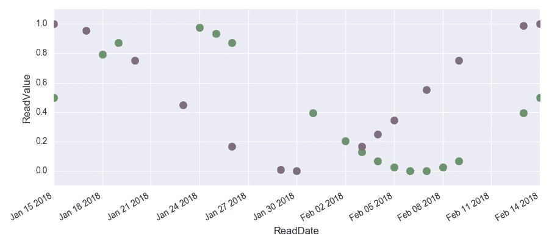
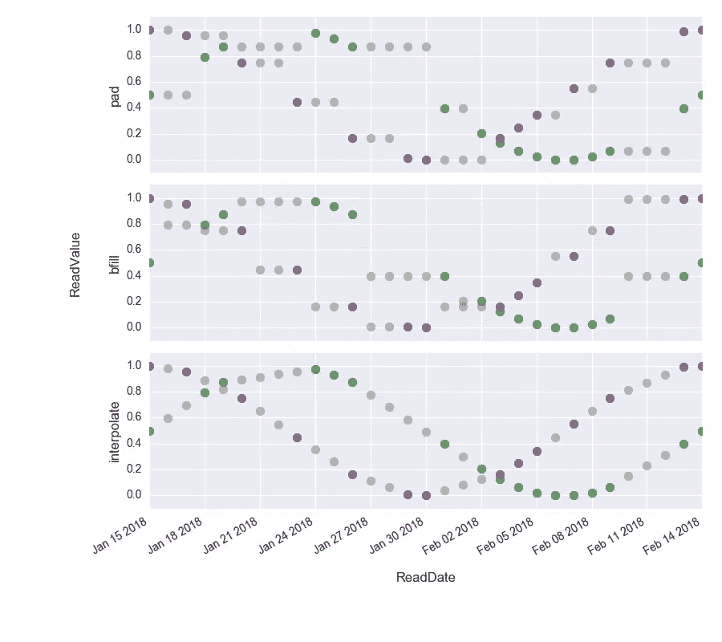

# 如何在 Python Pandas 中内插时间序列数据

> 原文：<https://towardsdatascience.com/how-to-interpolate-time-series-data-in-apache-spark-and-python-pandas-part-1-pandas-cff54d76a2ea?source=collection_archive---------2----------------------->


Time Series Interpolation for Pandas: Eating Bamboo Now — Eating Bamboo Later (Photo by [Jonathan Meyer](https://unsplash.com/@jmeyer1220?utm_source=unsplash&utm_medium=referral&utm_content=creditCopyText) on [Unsplash](https://unsplash.com/search/photos/panda?utm_source=unsplash&utm_medium=referral&utm_content=creditCopyText))

注:熊猫 0.20.1 版(2017 年 5 月)更改了分组 API。这篇文章反映了更新版本的功能。

任何处理数据的人都知道现实世界中的数据通常是不完整的，清理数据会占用你大量的时间(有人知道 80/20 法则吗？).最近从 Pandas 搬到 Pyspark，我已经习惯了 Pandas 提供的便利，而 Pyspark 由于它的分布式特性有时会缺乏这些便利。我特别欣赏的一个特性是 Pandas 提供的内插(或填充)时间序列数据的直接方式。这篇文章旨在使用在一组房屋中收集的传感器读取数据的示例，以简单易懂的方式展示这种能力。这篇文章的完整笔记本可以在我的 GitHub 中找到[。](https://github.com/walkenho/tales-of-1001-data/blob/master/timeseries-interpolation-in-spark/interpolating_time_series_p1_pandas.ipynb)

# 准备数据和初步可视化

首先，我们用一些测试数据生成一个熊猫数据帧 df0。我们创建了一个包含两个房屋的模拟数据集，并使用 sin 和 cos 函数为一组日期生成一些传感器读取数据。为了生成缺失值，我们随机丢弃一半的条目。

```
data = {'datetime' : pd.date_range(start='1/15/2018',
                                  end='02/14/2018', 
                                  freq='D')\
                     .append(pd.date_range(start='1/15/2018',
                                           end='02/14/2018',
                                           freq='D')),
        'house' : ['house1' for i in range(31)] 
                  + ['house2' for i in range(31)],
        'readvalue' : [0.5 + 0.5*np.sin(2*np.pi/30*i) 
                       for i in range(31)]\
                     + [0.5 + 0.5*np.cos(2*np.pi/30*i) 
                       for i in range(31)]}df0 = pd.DataFrame(data, columns = ['readdatetime', 
                                    'house', 
                                    'readvalue'])# Randomly drop half the reads
random.seed(42)
df0 = df0.drop(random.sample(range(df0.shape[0]),
                             k=int(df0.shape[0]/2)))
```

生成的表格如下所示:

Raw read data with missing values

下图显示了生成的数据:一个 sin 和一个 cos 函数，两者都有大量缺失的数据点。



我们现在来看三种不同的内插缺失读取值的方法:前向填充、后向填充和内插。请记住，为每项任务选择合适的插值方法至关重要。特别是对于预测任务，我们需要考虑在进行预测时是否有插值数据。例如，如果你需要插值数据来预测天气，那么你不能用明天的天气来插值今天的天气，因为明天的天气还是未知的(合乎逻辑，不是吗？).

# 插入文字

为了对数据进行插值，我们可以使用 *groupby()-* 函数，然后是 *resample()* 。但是，首先我们需要将读取的日期转换为 datetime 格式，并将它们设置为数据帧的索引:

```
df = df0.copy()
df['datetime'] = pd.to_datetime(df['datetime'])
df.index = df['datetime']
del df['datetime']
```

因为我们想分别对每栋房子进行插值，所以在使用带有选项“D”的 *resample()* 函数将数据重新采样到每日频率之前，我们需要按“房子”对数据进行分组。

下一步是使用均值填充、前向填充或后向填充来确定新生成的网格应该如何填充。

## 平均值()

因为我们使用 *mean()* 方法进行严格的上采样，所以所有缺失的读取值都用 nan 填充:

```
df.groupby('house').resample('D').mean().head(4)
```

Filling using mean()

## pad() —向前填充

使用 *pad()* 代替 *mean()* 向前填充 NaNs。

```
df_pad = df.groupby('house')\
            .resample('D')\
            .pad()\
            .drop('house', axis=1)
df_pad.head(4)
```

Filling using pad()

## bfill() —反向填充

使用 *bfill()* 代替 *mean()* 后向填充 NaNs:

```
df_bfill = df.groupby('house')\
            .resample('D')\
            .bfill()\
            .drop('house', axis=1)df_bfill.head(4)
```

Filling using bfill()

## 插值()-插值

如果我们想要对缺失值进行插值，我们需要分两步来完成。首先，我们通过使用 *mean()生成底层数据网格。*这会生成以 NaNs 为值的网格。然后，我们通过调用 read value 列上的 *interpolate()* 方法，用插值填充 nan:

```
df_interpol = df.groupby('house')\
                .resample('D')\
                .mean()
df_interpol['readvalue'] = df_interpol['readvalue'].interpolate()
df_interpol.head(4)
```

Filling using interpolate()

# 可视化结果

最后，我们可以可视化三种不同的填充方法，以更好地了解它们的结果。不透明点显示原始数据，透明点显示插值。

我们可以看到，在上面的图中，间隙是如何用先前已知的值填充的，在中间的图中，间隙是如何用即将到来的现有值填充的，在下面的图中，差异是线性插值的。由于插值过程的线性，请注意插值线中的边缘。根据任务的不同，我们可以使用高阶方法来避免这些问题，但是对于这篇文章来说这样做太过分了。



Original data (dark) and interpolated data (light), interpolated using (top) forward filling, (middle) backward filling and (bottom) interpolation.

# 摘要

在这篇文章中，我们看到了如何使用 Python 的 Pandas 模块，通过回填、前向填充或插值方法来插值时间序列数据。

*原载于 2019 年 1 月 14 日*[*https://walken ho . github . io*](https://walkenho.github.io/interpolating-time-series-p1-pandas/)*。*