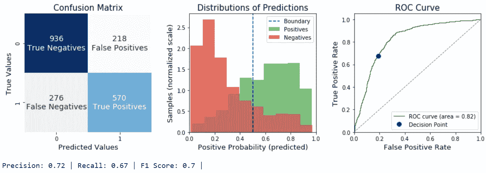
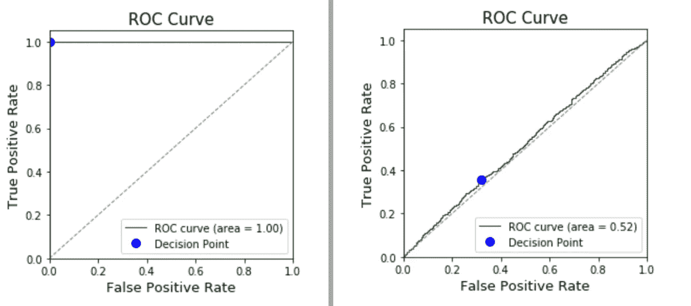

# 如何使用 scikit-learn 评估二元逻辑回归

> 原文：<https://towardsdatascience.com/how-to-interpret-a-binary-logistic-regressor-with-scikit-learn-6d56c5783b49?source=collection_archive---------14----------------------->

## 为这个 python 函数添加书签，它使评估您的二进制分类器变得容易。

# 功能概述

逻辑回归因其可解释性而成为一个有价值的分类器。这个代码片段提供了一个剪切和粘贴功能，当逻辑回归用于二元分类问题时，该功能显示了重要的指标。这里的一切都是由 scikit-learn 提供的，但是如果没有这个助手函数，手动调用和可视化会非常耗时和重复。

***【evalBinaryClassifier()***将拟合的模型、测试特征和测试标签作为输入。它返回 F1 分数，并打印密集输出，包括:

*   标有数量和文本标签的完整混淆矩阵(例如“真阳性”)
*   两类预测概率的分布
*   ROC 曲线，AUC，以及沿着混淆矩阵和分布所代表的曲线的决策点
*   精确度、召回率和 F1 分数

有关如何解释这些输出的说明，请跳到代码块后面的。

## 必需的进口:

## *例句用法:*

## 输出:

# 代码

# 解释:

## 左图:混淆矩阵

混淆矩阵将模型做出的预测描述为正确或错误。它将这些与真实的真相进行比较。一个完美的模型只有真正的正面和真正的负面。一个完全随机的模型将有相似数量的所有 4 个类别。

如果你有一个阶级不平衡的问题，通常你会看到很多负面的(真的和假的)和很少正面的，反之亦然。(关于这方面的一个很好的例子，请看我关于[预测颠覆](https://www.gregcondit.com/projects/disrupt)的项目。)

## 中心图:预测的分布

中间的图表是正面结果的预测概率分布。例如，如果您的模型 100%确定样本为阳性，则它将位于最右侧的箱中。两种不同的颜色表示真实的类，而不是预测的类。一个完美的模型将显示绿色和红色分布之间没有任何重叠。一个完全随机的模型将会看到它们彼此完全重叠。

**决策边界**决定模型的最终预测。在 scikit-learn 中，默认的**决策边界**是. 5；也就是说，高于 0.5 的预测为 1(正)，低于 0.5 的预测为 0(负)。这是理解你的模型和 ROC 曲线的一个重要细节。

## 右图:ROC 曲线

接收机工作特性曲线描述了*所有可能的* **决策界限**。绿色曲线表示可能性，以及不同决策点的真阳性率和假阳性率之间的权衡。这两个极端很容易理解:您的模型可以对所有样本延迟预测 1，并获得完美的真阳性率，但它也会有 1 的假阳性率。类似地，你可以通过懒惰地预测所有事情都是负面的来将你的假阳性率降低到零，但是你的真阳性率也将是零。你的模型的价值在于它增加真阳性率*比增加假阳性率*更快的能力。

一个完美的模型应该是 y 轴上的一条垂直线(100%真阳性，0%假阳性)。一个完全随机的模型将位于蓝色虚线上(找到更多的真阳性意味着找到相同数量的假阳性)。

Left: a perfect model; Right: a purely random model

蓝点代表当前确定混淆矩阵的 0.5 决策边界。

当一种错误类型比另一种更糟糕时，更改这一点是调整模型敏感度的有效方法。举个例子，医疗保健充满了这样的决定:错误地诊断癌症要比错误地诊断健康好得多。在这种情况下，我们需要一个非常低的决策边界，也就是说，只有在我们非常确定的情况下，才预测一个阴性结果(没有癌症)。

如果使用相同的模型选择不同的边界(例如:0.3 而不是 0.5)，蓝点将沿着绿色曲线向右上方移动。新的边界意味着我们将捕获更多的真阳性，也将捕获更多的假阳性。这也很容易想象为中间图表中的蓝线向左移动，直到它位于 0.3:边界右侧会有更多的“绿色”箱，但也会有更多的“红色”箱。

scikit-learn 没有调整决策边界的内置方法，但这可以通过对您的数据调用 ***predict_proba()*** 方法来轻松完成，然后根据您选择的边界手动编码一个决策。

*这对你理解你的模型有帮助吗？还能改进吗？请告诉我，我很乐意收到你的来信！*