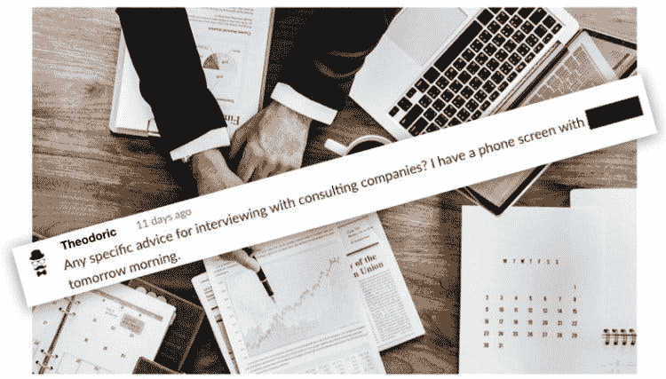
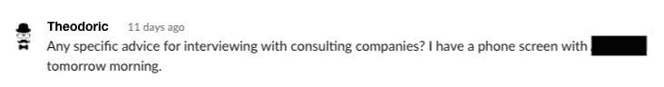
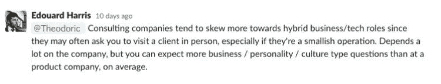
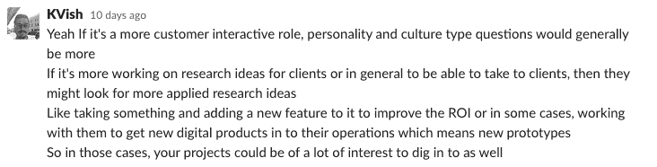
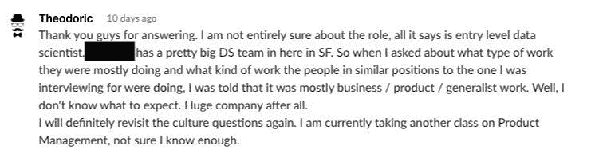
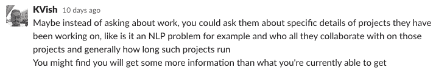
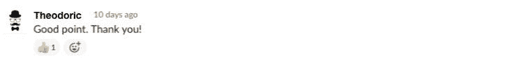
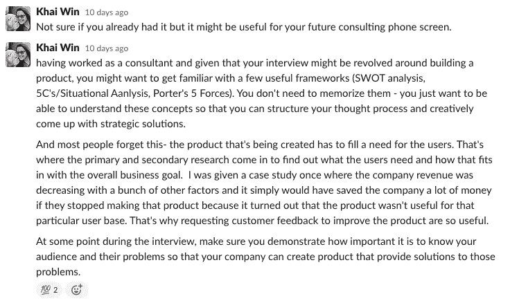
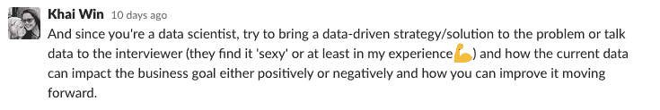
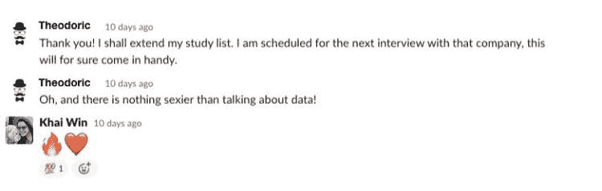

# 如何在咨询公司面试

> 原文：<https://towardsdatascience.com/how-to-interview-at-consulting-companies-d96c06c4725e?source=collection_archive---------28----------------------->

## 咨询公司寻找一种特殊的数据科学家。以下是你如何为他们的面试做准备。

*经过一番催促，我们最终决定公开专业数据科学家和他们的学员之间关于 SharpestMinds 内部松弛的一些对话。我们希望这将让更多的人从 SharpestMinds 的专业知识中受益，即使他们不能直接进入社区。*

一个公司需要解决的问题决定了他们问应聘者的面试问题。所以，如果你准备去一家公司面试，你会想确保你留出一些时间对这些问题进行研究，这样你就可以对这些问题做出有根据的猜测。

幸运的是，有很多公司都会遇到类似的问题，能够识别这些公司可以大大提高你为面试做好充分准备的机会。其中一类是咨询公司，这是上个月在[sharpes minds](http://sharpestminds.com)Slack 上通过一位匿名学员提出的话题，我们称她为狄奥多里克:

第一个答案是对预期结果的高度概括:

另一件要记住的重要事情是:应用研究和项目的重要性，正如夏普明德的校友(现在是 IQVIA 的数据科学家🚀) [Karthik Viswanathan](https://www.linkedin.com/in/kviswa/) 指出:

狄奥多里克补充了更多的背景知识(注意，他是通过询问面试他的公司获得这些信息的——这总是一个好的步骤！):

SharpestMinds 的导师 Ryan Kingery 也顺道来访，对咨询公司提出了警告。虽然我个人没有他那么强烈的感觉，但我肯定从很多其他人那里听到过这种情绪，所以如果你正在考虑咨询角色，这是值得考虑的事情:

Alum(现在是数据科学家) [Khain Win](https://www.linkedin.com/in/khai-resilient-mindset/) 也有一些关于咨询作为以用户为中心的活动的好建议…

…以及一些如何说面试官语言的好建议:

就这样结束了！

## 想要更多吗？

*我们每隔几周发布一份时事通讯，其中包含关于如何在数据科学领域找到工作的对话和提示。你可以在 https://sharpestminds.substack.com/*[查看一个例子](https://sharpestminds.substack.com/)

*可以在推特上关注 Jeremie(*[*)@ Jeremie charris*](https://twitter.com/jeremiecharris)*)或者 sharpes minds(*[*@ sharpes mindsai*](https://twitter.com/SharpestMindsAI)*)。*

*原载于 2019 年 12 月 11 日*[*https://blog.sharpestminds.com*](https://blog.sharpestminds.com/how-to-interview-at-consulting-companies/)*。*