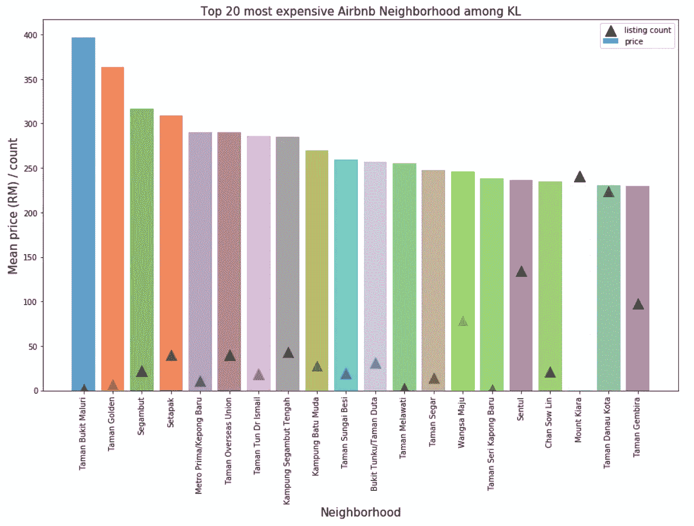
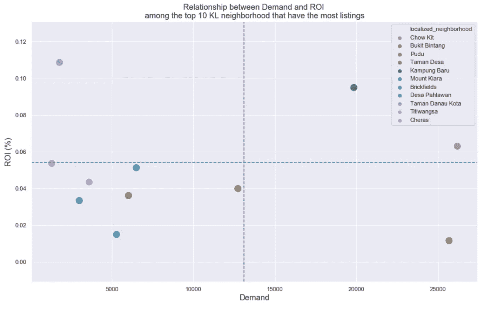
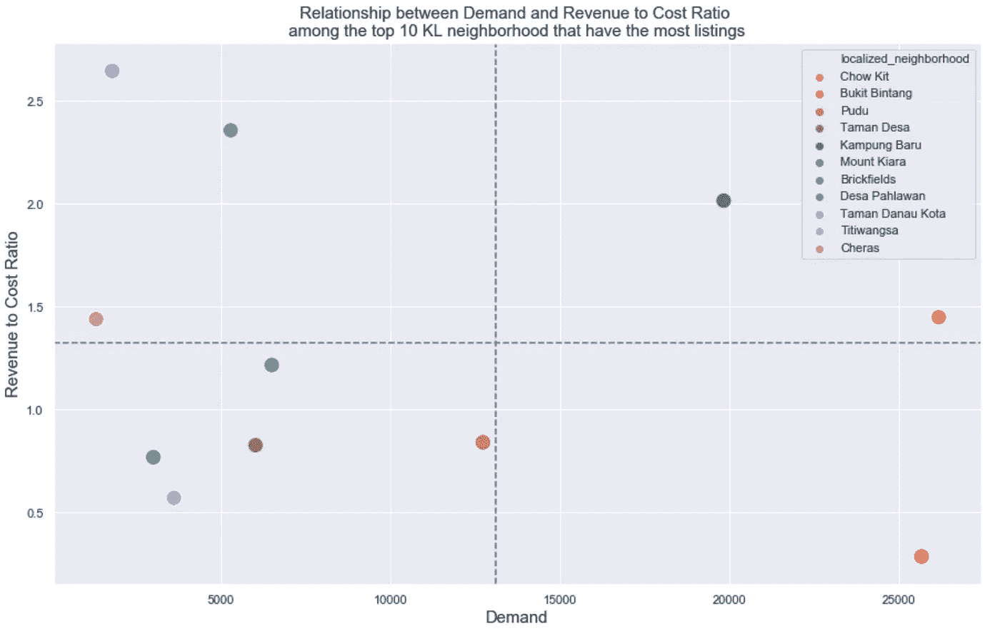

# 如何投资 Airbnb 房产

> 原文：<https://towardsdatascience.com/how-to-invest-in-the-best-airbnb-rental-property-kuala-lumpur-6bef8cb1477a?source=collection_archive---------16----------------------->

## 利用数据做出明智的决策

A irbnb 与 2019 年 8 月相比增长了 21%，总收入**4，308，726，681 美元**。更令人印象深刻的是，它已经发展到**1.5 亿用户**，目前在 **191 个国家**有 **6，370，563 个房源。到目前为止，这对 Airbnb 来说非常成功。**

在东南亚，马来西亚连续第二年成为 Airbnb 增长最快的国家。仅在 2018 年一年，马来西亚共有 **53，000 家上市公司**带来了约**亿**RM3 的直接经济影响。得知 Airbnb 在马来西亚的业务增长迅速，我一直有一个疑问。

> 在马来西亚首都吉隆坡，开办 Airbnb 业务的最佳地区是哪里？

在思考上述问题之前，我的脑海里马上会蹦出另一个问题。我在想什么？我还没有房子，为什么我会考虑这个问题？然而，我仍然决定谷歌是否有其他方法，这里是我发现的。

有两种方法可以让你开始经营 Airbnb。一种是出租自己的一处房产，另一种方式是出租别人的房产来开展 Airbnb 业务。换句话说，我不需要拥有一个物业开始！

如果你要我选择开始的方式，我会先选择第二个选项。因为它更灵活，与购买房产相比，我可以在相对较短的时间内租赁房产。另一个原因是，我可以体验一下在 Airbnb 做主持人的感觉，然后再为了开办 Airbnb 业务而购买房产。

在本文中，我将讨论如何设法获取数据以供以后分析。事不宜迟，我们开始吧！

# 数据收集之旅

在我开始爬 Airbnb 网站之前，我偶然发现了这个网站，它似乎改变了我做其他话题的想法。总之，Airbnb 网站实际上并不热衷于分享他们拥有的数据。阿姆斯特丹政府试图刮网站周刊似乎已经放弃刮这个网站。

尽管知道我将面临很多问题，我仍然决定尝试抓取网站。现在，我将分享一些我在浏览网站时遇到的问题。

我面临的第一个问题是**动态改变 Xpath 或 CSS 路径**。这意味着你不能只使用 Xpath 的一个例子，并且假设在所有列表的网页上使用这个 Xpath 会给你你想要的相同的信息。

此外，爬行器的稳定性也是另一个问题。如果你在清理 Airbnb，以下是我建议的一些方法。我发现的最有效的方法是将旋转 IP 和减慢爬虫速度结合起来。

在花了几个小时检查网络选项卡之后，我发现了一条路径，在这条路径上，您将能够**访问包含更整洁数据的 JSON** 。所以，我的第一个问题已经解决了！为了增加我的爬虫的稳定性，我**旋转 IPs 并且减慢我的爬虫**。最后，我能够以稳定得多的速度抓取数据。

# 数据清理之旅

收集完数据之后，我们来做一些数据清理。

首先，我获得了至少有一个评论的列表的最高价格。让我们称这个价格为价格 A。此外，我删除了所有高于价格 A 的列表——异常列表。换句话说，异常列表是价格高得离谱，但没有人发表评论的列表。

基于**局部邻域，**删除了重复的列表，只留下大约 5590 个列表。此外，前 10 大房源区域的房产估计价格来自 [edgeprop](https://www.edgeprop.my/) 、 [brickz](https://www.brickz.my/) 和 [propsocial](https://www.propsocial.my/) 。

# 数据探索

显示吉隆坡价格分布的一个好方法是绘制一个 choropleth 图。这张地图由吉隆坡的 11 个联邦选区分割而成。根据图，你可以看到马来西亚东北部的平均价格最高，而吉隆坡中部的价格相当有竞争力。

> 如果你是来吉隆坡度假的经济型旅行者，我猜你现在知道该住在哪个地方了！

现在，让我们来鸟瞰一下整个吉隆坡的房源分布。可以看到，Airbnb 的房源大部分都是积累在吉隆坡的市中心区域。这就是为什么城市地区的房源价格较低，因为供应量要高得多。

请随意浏览交互式图表，深入了解吉隆坡的特定区域。

# 数据分析

上图显示了前 20 个最贵的社区。三角形代表物品的数量，而横条代表物品的平均价格。

> 从这张图中你能得到什么启示？

Taman Bukit Maluri、Taman Golden 和 Segambut 的价格相对较高，上市量较低。原因之一可能是该地区没有足够的供应，因此价格较高。如果你正在考虑开办 Airbnb 业务，你可以在这个领域做一些研究，看看这个地方是否有需求，租房或买房的成本是否可以承受。

现在，是时候知道答案了。

> 吉隆坡最适合投资的地区是哪里？

让我们只考虑拥有最多房源的前 10 个街区。在我开始解释计算之前，让我解释一下我将要使用的一些术语。

如何计算住房市场的投资回报率(ROI)？

`ROI (%) = (monthly rental * 12) / property value`

因此，在我们的 Airbnb 案例中，我使用`occupancy rate * fee per night * 30`来计算月租金。此外，根据 AirDNA 的[报告，2018-2019 年吉隆坡的平均入住率为 66%。假设每月平均有 30 天。](http://airdna.co/)

因此，最终的公式看起来像这样。

`ROI (%) = (fee per night * 0.66 * 30 * 12)/ property value`

我寻找的另一个变量是需求。然而，如果我需要获得实际的预订数量，我需要构建一个更大规模的网络爬虫。因此，对于我的例子，**我使用评论数量作为需求**的代理。

最佳投资区域是甘榜巴鲁和周杰，它们位于右上方的象限。换句话说，这些街区有很高的投资回报率(%)和需求。这张图是给一个想投资房地产来开办 Airbnb 业务的投资者看的。

另一方面，对于一个买不起房子，但打算开办 Airbnb 业务的人来说，他或她需要考虑一个略有不同的衡量标准。他/她应该关注`airbnb expected monthly income/ monthly rental fee`，而不是关注 ROI (%)，T3 相当于`(fee per night * 0.66 * 30)/monthly rental fee`。在这里，我将其定义为**收入成本比。**

如果你不想拥有自己的房子来开始 Airbnb 业务，周杰和甘榜巴鲁将是你可以考虑的地方。

我收集的所有估计的租房费用和房价都是来自一些免费网站。因此，如果你想要一个更准确的数字，你需要订阅一个付费服务，例如， [brickz](https://www.brickz.my/) 。此外，上述所有数据都忽略了季节性影响，因为我只收集了 2019 年 11 月 29 日至 2019 年 12 月 2 日的数据。

# 最后的想法

非常感谢你一直读到最后。真的很感谢！

我想说的是，这个迷你项目真的消耗了我相当多的时间，所以如果你喜欢或喜欢这种内容，请在下面的评论中告诉我。

此外，收集 Airbnb 数据也非常耗时。不过，为了感谢大家今年的支持，我想免费送出去！

我收集的数据集包含了吉隆坡总共 71 个街区。如果您有兴趣获得数据集，以便您能够使用它，请随时查看此[链接](http://bit.ly/2YbCHqQ)！

这篇文章被刊登在《亚洲科技》上，欢迎点击这里查看！

下期帖子再见！

# 参考

1.  [https://www . alltherooms . com/analytics/Airbnb-IPO-going-public-incomes-business-model-statistics/](https://www.alltherooms.com/analytics/airbnb-ipo-going-public-revenues-business-model-statistics/)
2.  [https://www . the star . com . my/business/business-news/2019/07/02/Airbnb-generates-rm3bil-in-direct-economic-impact-in-Malaysia-last-year](https://www.thestar.com.my/business/business-news/2019/07/02/airbnb-generates-rm3bil-in-direct-economic-impact-in-malaysia-last-year)

# 关于作者

[Low 魏宏](https://www.linkedin.com/in/lowweihong/?source=post_page---------------------------)是 Shopee 的数据科学家。他的经验更多地涉及抓取网站，创建数据管道，以及实施机器学习模型来解决业务问题。

他提供爬行服务，可以为你提供你需要的准确和干净的数据。你可以访问[这个网站](https://www.thedataknight.com/)查看他的作品集，也可以联系他获取**抓取服务**。

你可以在 [LinkedIn](https://www.linkedin.com/in/lowweihong/?source=post_page---------------------------) 和 [Medium](https://medium.com/@lowweihong?source=post_page---------------------------) 上和他联系。

 [## ●伟鸿-中等

### 在媒体上阅读低纬鸿的作品。数据科学家|网络抓取服务:https://www.thedataknight.com/.每…

medium.com](https://medium.com/@lowweihong)